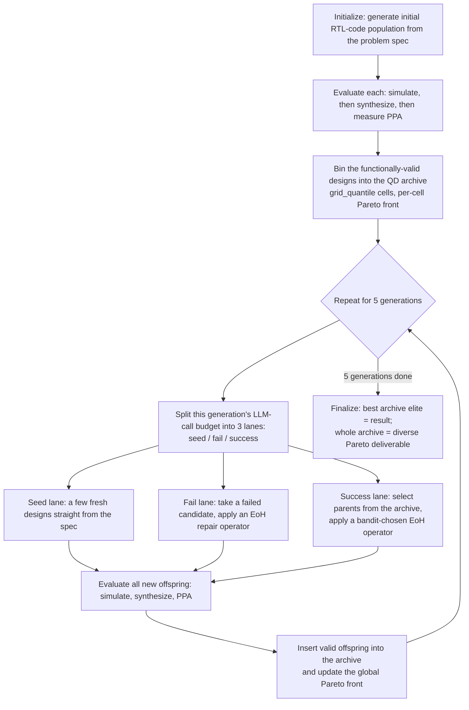
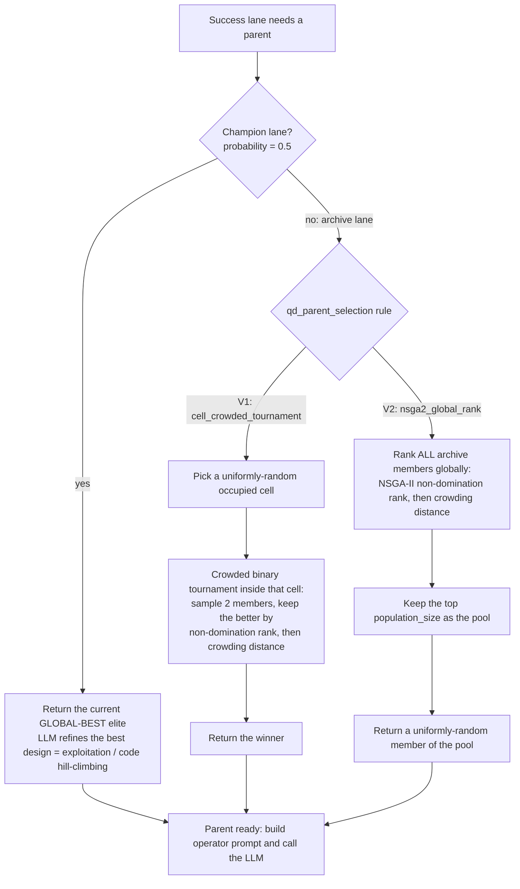
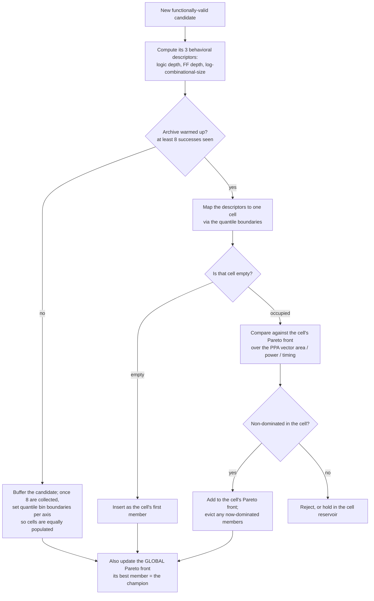

# Progress briefing — QD journal extension of REvolution (week of 2026-06-18)

**Audience:** colleagues / advisors. **Scope:** what was built and tested in the
journal extension of the conference REvolution system, why the first proposal
underperformed, how we iterated, and where we landed. **Evidence:** every number
traces to a copied report in [`exp_artifacts/`](exp_artifacts/README.md) and to a
run path in a journal worktree or the main `exp/`.

> **One-paragraph summary.** We proposed a "v2" quality-diversity (QD) redesign
> of REvolution — thought-only individuals, a single unified operator, a
> 3-axis behavioral archive with quantile binning and per-cell Pareto fronts. On
> the 13-problem hard subset it **underperformed the classic REvolution baseline
> meaningfully** (avg PPA improvement **+19% vs +34%**, Pareto hypervolume
> **0.063 vs 0.104**; rigorous 5-seed best-quality **−0.093**). Component-by-
> component ablations show the regression comes from **two pieces** — the
> thought-only representation (it raises functional pass-rate but *blocks the
> code-level hill-climbing that classic uses to optimize PPA*) and the single
> unified operator (it fails the functional-pass-rate gate). The archive itself
> is benign-to-helpful. We therefore kept the archive and **dropped the two
> harmful pieces**: the landing variant, **smooth-QD**, uses classic's code
> individuals and six operators plus the QD archive and principled NSGA-II
> selection, and reaches **statistical parity** with classic (best-quality
> **−0.016**, 95% CI [−0.045, +0.007]) at no extra budget — while delivering a
> diverse Pareto archive classic cannot. We also integrated and bug-fixed two
> harder benchmarks (RealBench, CVDP).

**Navigation:** §1 framework · §2 v2 underperforms · §3 why · §4 variants tried ·
§5 the landing variant · §6 landing results (+ CVDP/RealBench) · §7 where next +
narrative. Artifact index: [`exp_artifacts/README.md`](exp_artifacts/README.md).

---

## 1. The v2 journal framework (what was proposed)

The conference REvolution evolves RTL with an LLM: a population of **code**
individuals, **six hand-engineered EoH prompt operators** chosen by an adaptive
bandit, scored by a **scalarized** PPA objective. The journal "v2" proposal
re-cast this as quality-diversity (MAP-Elites) to answer two reviewer
criticisms — the scalar objective hides trade-offs, and there is no explicit
diversity. Each piece was built and validated on its own feature branch/worktree
(`.worktrees/journal-*`), then integrated.

| Component | v2 journal choice | Replaces (classic) | Worktree |
|---|---|---|---|
| Representation | **Thought-only** + k-code evaluation: evolve a natural-language design "thought", realize it to code k times for scoring | direct code individuals | `journal-thought-only-k-code` |
| Operator | **Single unified** thought-operator | six EoH operators + selection bandit | `journal-single-mutation-operator` |
| Descriptors | **3 behavioral axes**: logic depth, FF depth, log-combinational-size (`journal_logic_ff_width_3d`) | — (no archive) | `journal-bd-trio` |
| Archive binning | **Quantile** cell binning (`grid_quantile`) | — | `journal-quantile-binning` |
| Cell keep-rule | **Per-cell Pareto front** (NSGA-II non-domination + crowding within each cell) | scalar elite per design | `journal-pareto-front-archive` |
| Archive maintenance | **KS-triggered adaptive rebinning** (re-bin when the descriptor distribution drifts) | — | `journal-ks-adaptive-rebinning` |

The integrated configuration is the arm `grid_quantile_pareto_journal_bd_unified`
(archive stack + single unified thought-operator). All runs below use the same
budget-matched setting: **population 20 × 5 generations, 240 LLM calls/design,
`openai/gpt-oss-120b`**, on the **13-problem hard subset** (7 RTLLM + 6
VerilogEval-Spec-to-RTL).

---

## 2. The v2 proposal underperformed the classic baseline

**Two evidence tiers** (see [`exp_artifacts/README.md`](exp_artifacts/README.md)):
single-seed worktree ablations are *directional*; the 5-seed locked-subset runs
with paired cluster-bootstrap statistics are the *rigorous* confirmation. Both
agree.

### 2a. Integrated run — single seed (seed 42)

Artifact: [`exp_artifacts/01_integrated_v2_vs_classic/`](exp_artifacts/01_integrated_v2_vs_classic/)
· source `.worktrees/journal-ks-adaptive-rebinning/exp/journal_adaptive_rebinning_hard_subset/20260513_153507/`.
Every arm solves 13/13 problems (100% functional + synthesis any-pass) at equal
240 calls/design — so this is **not** "v2 is broken," it is "at equal budget and
solve-rate, v2 optimizes quality/PPA less well."

| Arm (13-prob ALL) | Func pass@1 | Avg score Δ vs ref | Avg PPA Δ | Pareto mean HV | HV wins /13 | Multi-obj winner |
|---|---|---|---|---|---|---|
| **classic REvolution** | 48.5% | **+27.61%** | **+34.47%** | **0.1038** | **10** | **✅ classic** |
| v2 journal (rebin off) | 48.6% | +15.55% | +19.13% | 0.0625 | 3 | — |
| v2 journal + KS rebin | 46.3% | +18.14% | +21.30% | 0.0622 | 0 | — |

**Read:** v2 leaves **~12 points of score-delta and ~15 points of PPA-delta** on
the table and loses the multi-objective crown 10 HV-wins to 3. (NB: this
integrated arm leaves `representation_kind` at the default **code_individual** —
the most aggressive *thought-only* piece is added in the 5-seed run below, and it
lags further.) KS adaptive rebinning recovers a little but does not close the
gap; on this subset its trigger fired checks but executed zero rebins.

### 2b. Rigorous confirmation — 5 seeds, paired statistics

Artifact: [`exp_artifacts/09_locked_5seed_ablation/`](exp_artifacts/09_locked_5seed_ablation/)
· source `exp/ablation_matrix/stats/final_5seed_F1_qt_vs_classic/`. Arm
`qd_target` = thought-only + single unified operator + the v2 archive, 5 seeds
(1001–1005), penalized paired cluster-bootstrap.

| Metric | qd_target − classic | 95% CI | sign-test p |
|---|---|---|---|
| **best-quality** (normalized PPA of best valid candidate) | **−0.093** | [−0.149, −0.036] | <0.001 |

The CI lies entirely below zero (and below the −0.03 equivalence margin): the
full thought-only v2 is **significantly worse** than classic on quality, pooled
across five seeds. Functional any-pass is saturated for both.

---

## 3. Why it regresses — mechanism and component analysis

We isolated each journal component against classic on the same subset
(single-seed; artifacts 02–06). The result is sharp: **most components are
neutral, one is even positive, and the regression localizes to two pieces.**

| Component (vs classic) | Func pass@1 | Avg score Δ | Avg PPA Δ | Pareto HV (wins) | Net verdict | Artifact |
|---|---|---|---|---|---|---|
| Quantile binning | 50.6 vs 46.3 | **+25.8 vs +23.6** | **+33.1 vs +30.1** | 0.107 vs 0.100 (8 vs 5) | **journal wins** | [04](exp_artifacts/04_component_quantile_binning/) |
| BD trio (descriptors) | 50.8 vs 50.9 | +22.6 vs +26.5 | +28.6 vs +33.0 | 0.087 vs 0.112 (3 vs 10) | classic wins (HV) | [06](exp_artifacts/06_component_bd_trio/) |
| Per-cell Pareto cells | **53.7** vs 49.1 | +20.9 vs +21.8 | +26.4 vs +27.5 | 0.087 vs 0.097 (2 vs 6) | mixed: best pass@1, worst quality | [05](exp_artifacts/05_component_pareto_front_cells/) |
| **Thought-only representation** | **67.9** vs 49.7 | +19.0 vs +28.8 | **+21.9 vs +37.0** | 0.059 vs 0.121 (2 vs 8) | **trades PPA for pass-rate** | [02](exp_artifacts/02_component_thought_only/) |
| **Single unified operator** | 46.0 vs 47.1 | +17.4 vs +19.5 | +20.8 vs +24.1 | 0.062 vs 0.078 (2 vs 5) | **weakest; fails func gate** | [03](exp_artifacts/03_component_single_operator/) |

### 3a. Thought-only blocks code-level hill-climbing (the central mechanism)

This is the most important finding and matches the intuition. The thought-only
arm reaches **higher functional pass-rate** (67.9% vs 49.7%) — natural-language
thoughts produce functionally-correct RTL readily — but a **lower PPA
improvement** (+21.9% vs +37.0%). The reason: classic search optimizes PPA by
**iteratively tuning the same code** — small, local edits to a working design
(rephrase a loop, re-time a register, share an adder) that hill-climb area/power/
timing. Thought-only evolves *descriptions*; each new candidate is re-realized
from a thought, so the search cannot lock onto a specific code artifact and
grind it downhill. You get **diverse, correct, but un-optimized** designs.
Classic's advantage is precisely the code-level exploitation thought-only gives
up. (Artifact [02](exp_artifacts/02_component_thought_only/); the thought-only
arm also costs +30 calls/design and ~2.2× runtime.)

### 3b. The single unified operator removes useful exploration

Collapsing the six EoH operators into one **fails the functional-pass-rate
validation gate** (mean Δ −0.186 vs the −0.10 threshold; artifact
[03](exp_artifacts/03_component_single_operator/single_operator_validation.md))
and is the weakest of {classic, six-op, single-op} on every aggregate. Notably
the **six-operator** arm is ~on par with classic *within QD* — so it is the
*unification*, not the operators-in-an-archive, that costs. The hand-engineered
operator diversity earns its keep on this substrate.

### 3c. The archive itself is fine

Quantile binning is individually **positive**; descriptors and Pareto cells are
roughly neutral on quality (Pareto cells even maximize functional pass-rate).
The diversity machinery is not what hurts — so we keep it.

**Conclusion:** the integrated v2 stacks the two harmful pieces (thought-only +
single operator) on top of a benign archive, and the regressions compound.

---

## 4. Iterations and variants we tried to salvage v2

| Variant | Idea | Result | Artifact / source |
|---|---|---|---|
| **Rent's-exponent descriptors** | Replace the log-combinational-size axis with a Rent's-rule / theory-grounded descriptor (20-axis `theory_grounded_full_20d`, axis = `rent_exponent`) — a more principled BD | **Did not pan out**: func pass@1 **36.6 vs 54.6**, HV wins **1 vs 9**; small score/PPA edges are an artifact of averaging over fewer scorable designs (sparse archives on hard problems) | [07](exp_artifacts/07_variant_rent_exponent_bd/) · `.worktrees/qd-theory-grounded-descriptors/exp/hard_iteration_qd_theory_vs_baseline_20260326_160434/` |
| Other BD profiles (bake-off) | Screen structural / size-control / large-struct descriptor profiles for one that beats classic | No profile wins the multi-objective crown; the frozen `journal_logic_ff_width_3d` trio was chosen on collapse-resistance, not a quality win | `.worktrees/qd-theory-grounded-descriptors/exp/hard_iteration_qd_theory_compact_vs_baselines_*`; main `exp/fast_iter/bakeoff_verdict/` |
| KS adaptive rebinning | Re-bin the archive when the descriptor distribution drifts, to fight cell collapse | Modest score/PPA recovery over rebin-off (+18.1 vs +15.6) but does not reach classic; trigger rarely executes on this subset | [01](exp_artifacts/01_integrated_v2_vs_classic/) (rebin_on arm) |
| Champion-lane / parent-selection repairs ("Fix A/B/B′") | Re-introduce code-level exploitation into QD via a champion lane and seeding | Halved the deficit on the fast subset but **did not transfer** to the hard subset | main `exp/fast_iter/fixb_hard_subset/`, `fixbprime_hybrid/` |

### 4.1 Salvage-attempt results (data)

The attempts split into two metric families, so two tables. **Descriptor /
archive variants** carry full backend-comparison aggregates (same columns as §3);
the **direct QD-vs-classic repair attempts** were screened with the paired
penalized best-quality statistic on small single-seed subsets.

**(a) Descriptor & archive-maintenance variants** — 13-problem hard subset, seed
42, 240 calls/design; each compared to the classic baseline *from its own run*.

| Variant (vs its run's classic) | Func pass@1 (var / classic) | Avg score Δ (var / classic) | Avg PPA Δ (var / classic) | Pareto HV wins (var / classic) | Verdict |
|---|---|---|---|---|---|
| Rent's-exponent BD (`cvt_theory_grounded`) | 36.6% / 54.6% | +24.0% / +21.5% | +30.3% / +26.9% | 1 / 9 | **lost** — pass@1 −18pp, HV 1 vs 9; the score/PPA "edge" is an artifact of averaging over fewer scorable designs |
| KS adaptive rebinning (`rebin_on`, cf. §2a) | 46.3% / 48.5% | +18.1% / +27.6% | +21.3% / +34.5% | 0 / 10 | **lost** — recovers a little over rebin-off but stays far below classic |
| Structural BD bake-off (4 profiles) | 31.7–41.4% / 54.6% | +24.4–31.1% / +21.5% | +30.0–40.1% / +26.9% | ≤1 each / 9 | **no profile wins** the multi-objective crown; higher score/PPA deltas again sit on fewer functionally-valid designs |

*(Rent BD + bake-off: source `.worktrees/qd-theory-grounded-descriptors/exp/hard_iteration_qd_theory_vs_baseline_20260326_160434/`, artifact [07](exp_artifacts/07_variant_rent_exponent_bd/). KS rebinning: artifact [01](exp_artifacts/01_integrated_v2_vs_classic/).)*

**(b) Direct QD-vs-classic repair attempts** — paired penalized best-quality Δ vs
classic, single seed. "fast" = 6-problem instrument subset, "hard" = 13-problem
subset. All negative; none reaches the −0.03 parity margin.

| Repair attempt | What it added | Subset (n, seeds) | best-quality Δ | 95% CI | Verdict (finding) |
|---|---|---|---|---|---|
| Fix A — champion-lane elitism alone | a quality "champion" parent lane | fast (6, 1) | −0.167 | [−0.317, −0.041] | fails (F11) |
| Fix B — code-seeded archive | seed the archive with code individuals | fast (6, 1) | −0.087 | [−0.237, −0.002] | halves the fast deficit, anchors on leaps (F10) |
| Fix B — on the hard subset | (as above, harder problems) | hard (13, 1) | −0.116 | [−0.210, −0.037] | **does not transfer to hard** (F15) |
| Fix B+A — combined | champion lane + code-seeding | fast (6, 1) | −0.128 | [−0.238, −0.023] | champion lane *hurts*; Fix B alone is the ceiling (F13) |
| Fix B′ — hybrid | hybrid variant | fast (12, 1) | −0.141 | [−0.290, −0.014] | worse than Fix B (F14) |

*(Source: `exp/fast_iter/{fixa_champion_lane,fixb_code_seeded,fixb_hard_subset,fixba_combined,fixbprime_hybrid}/stats/statistical_tests.md`.)*

**Read of 4.1:** descriptor/archive tweaks (table a) don't rescue quality —
consistent with §3, the deficit is in *representation + operator*, not the
archive — and direct selection-side repairs (table b) top out **below parity on
the hard subset**. Note that two of the ideas that *partly* helped here —
seeding/refining from strong code individuals (Fix B) and a champion lane —
survive into the landing variant, but only once the thought-only + single-operator
substrate is dropped.

The throughline: tweaking the **descriptor** or the **archive maintenance** does
not rescue quality, because the deficit is in **representation + operator**, not
in the archive. That pointed directly at the landing variant.

---

## 5. The landing variant — "smooth-QD"

The fix is to integrate QD **softly**: keep everything that made classic good at
code-level optimization, and add the diversity archive *around* it rather than
*replacing* the search substrate.

**Smooth-QD = classic's substrate + the QD archive + principled selection.**

| Axis | Classic | Original v2 (qd_target) | **Smooth-QD V2 (landing)** |
|---|---|---|---|
| Representation | code individuals | thought-only | **code individuals** ✅ (back to classic) |
| Operators | six EoH + bandit | single unified | **six EoH** ✅ (back to classic) |
| Archive | none | grid_quantile + Pareto cells + 3 BD | **grid_quantile + Pareto cells + 3 BD** (kept from v2) |
| Parent selection | population | per-cell | **global NSGA-II non-domination rank** + crowding (new) |
| Offspring mixing | — | archive only | **champion lane 0.5** (half offspring from a quality "champion" lane, half from archive diversity) |
| Objective | scalar PPA | multi-objective | **multi-objective** (no scalar weighting) |

Two sub-versions were run to show the selection rule matters:

- **V1** = code + six EoH + champion-lane 0.5 + **cell-crowded tournament**
  selection. Closes much of the gap but is still **significantly worse**
  (best-quality −0.034, CI [−0.066, −0.009], p=0.05).
- **V2** = V1 with **global NSGA-II non-domination-rank** selection (with
  crowding tie-break) instead of the per-cell tournament. This is the landing
  configuration.

**How it differs from each predecessor, in one line each:**
- *vs classic*: same code + operators, but adds an explicit behavioral archive,
  champion-lane mixing, and a multi-objective (no scalar-weight) NSGA-II
  selection — so you get a **diverse Pareto archive** instead of one scalar
  elite, at no quality cost.
- *vs original v2*: drops the two harmful pieces (thought-only → code;
  single operator → six EoH) while keeping the archive and going from per-cell
  to principled global NSGA-II selection.

Artifacts + 5-seed stats: [`exp_artifacts/08_landing_smooth_qd/`](exp_artifacts/08_landing_smooth_qd/)
· source `exp/fast_iter/smooth_qd_code_individual/` (V1) and
`exp/fast_iter/smooth_qd_nsga2/` (V2).

---

## 6. Landing results — smooth-QD reaches parity

### 6a. Quality / PPA / diversity (seed 1001 representative, 13-prob hard subset)

| Arm (ALL 13) | Func pass@1 | Synth pass@1 | Avg score Δ | Avg PPA Δ (A/P/T) | Pareto mean HV | HV wins |
|---|---|---|---|---|---|---|
| classic | 54.5% | 53.6% | +26.19% | +33.43% (+19.4/+48.8/+9.8) | 0.1050 | 8 |
| **smooth-QD V2** | 50.6% | 49.6% | **+25.10%** | **+32.24%** (+16.0/+53.3/−1.7) | **0.1015** | 5 |
| smooth-QD V1 | 51.3% | 49.1% | +22.87% | +29.15% | 0.0895 | 4 |

The V2 gaps to classic are **~1 point** of score-delta and PPA-delta and
**0.0035** of hypervolume — versus the integrated-v2 gaps of ~12 and ~15 points
(§2a). The shrinking-gap progression **v2 → V1 → V2** is the headline of the
landing story.

### 6b. Rigorous 5-seed verdict (penalized paired cluster-bootstrap)

| Config | best-quality Δ vs classic | 95% CI | verdict |
|---|---|---|---|
| Original v2 (qd_target) | −0.093 | [−0.149, −0.036] | significantly worse |
| smooth-QD V1 | −0.034 | [−0.066, −0.009] | significantly worse (smaller) |
| **smooth-QD V2** | **−0.016** | **[−0.045, +0.007]** | **parity** (CI within ±0.03; p=0.17, NS) |

V2's confidence interval is entirely above the −0.03 equivalence margin: by our
pre-registered rule this is a **no-significant-cost** result. It is *not* a
quality win — it is parity plus the diversity/Pareto deliverable and the removal
of two biasing degrees of freedom (scalar weight + operator-selection bandit).

### 6c. Newer benchmarks — RealBench + CVDP (recently integrated + bug-fixed)

Authoritative isolated-grade verdicts (one candidate per process group; these
supersede the in-run counts, which under-report under eval contention).
Artifacts: [`exp_artifacts/10_cvdp_realbench/`](exp_artifacts/10_cvdp_realbench/).

| Benchmark | classic | QD (V2) | Read |
|---|---|---|---|
| CVDP easy (10 tasks) | 9/10 | 9/10 | QD **ties** where the model is capable; only `perfect_squares` fails both |
| CVDP medium (10 tasks) | 7/10 | 7/10 | identical task-by-task — QD adds nothing in the capable-but-hard regime |
| RealBench e203 (7 modules) | 4/112 valid | 3/112 (V2), 2/112 (qd) | capability **ceiling**: 5 of 7 modules get 0 valid candidates from *any* arm |

A methodology note worth flagging to colleagues: CVDP initially looked like a
0/10 hard wall; we found this was an **interface-wiring confound** (the buggy
module's port/parameter interface was dropped from the prompt). After the fix the
model solves most tasks — a benchmark we would otherwise have published as a
false null. (RealBench's large modules are a genuine base-model capability
ceiling: the best failing candidate still misses 21–100% of test vectors.)

---

## 7. Where we go from here + the narrative

### 7a. The core narrative (advancement over the conference version)

The conference REvolution drew five criticisms: (1) a scalar PPA objective hides
trade-offs; (2) operators were hand-picked; (3) the selection bandit was never
ablated; (4) benchmarks were small single modules; (5) no explicit diversity. The
journal advancement answers all five **as a rigorous characterization of *when*
quality-diverse, thought-level structure helps LLM RTL search** — not as a raw
leaderboard win:

- **Smooth-QD removes two biasing degrees of freedom** — the scalar weighting
  (now a multi-objective Pareto archive) and the hand-tuned operator-selection
  bandit (the operator ablation we now supply: a single operator equals the
  six-operator suite *within QD*, §3b) — at **no significant quality cost** and
  with a **diverse Pareto archive** as a new deliverable.
- We **characterize the failure of the aggressive version** mechanistically
  (thought-only blocks code-level hill-climbing) — a transferable insight, not
  just a negative result.
- We **scaled to harder benchmarks** (RealBench real-CPU modules, CVDP cocotb)
  and **caught + fixed an evaluation confound** that turned an apparent
  capability ceiling into a working benchmark — itself a methodological
  contribution.

The honest one-liner: *"Integrated smoothly, quality-diversity matches classic
search while being more principled, weight-free, and diverse; integrated
aggressively (thought-only), it loses, for a reason we can name."*

### 7b. How to make it more persuasive (better numbers)

In rough order of leverage:

1. **Run the held-out gate.** The QD-vs-classic deltas are on a *tuning* subset;
   the pre-registered 20-problem held-out set was scoped out. Running it converts
   "parity on the tuning set" into "parity on held-out data" — the single
   cheapest credibility win.
2. **Find the regime where QD actually *wins*, not just ties.** Our regime
   analysis shows QD already *helps* on specific problem types (e.g. don't-care
   specs where diversity finds PPA classic misses — Prob135). A focused
   sub-benchmark of such problems could turn a tie into a headline win. This is
   the highest-upside experiment.
3. **Stronger / RTL-specialized base model.** The binding constraint on hard
   designs is base-model spec-comprehension, not the search. A stronger model
   would (a) lift RealBench off the capability floor and (b) test whether QD
   helps *once valid stepping-stones exist* — the conditions under which
   diversity should finally pay.
4. **Hierarchical / decompositional generation** for large modules (generate and
   verify sub-modules, compose) — directly attacks the RealBench ceiling and is a
   genuine method extension rather than a bigger model.
5. **Lean on the Pareto-front deliverable in the framing.** Even at parity
   quality, classic returns *one* design and smooth-QD returns a *trade-off
   frontier* of behaviorally-diverse valid designs. For a CAD audience that is a
   concrete advancement; we should quantify archive coverage / frontier spread as
   a first-class result, not a footnote.
6. **Tighten CVDP/RealBench** with more seeds and a per-task pass-rate
   comparison (beyond any-pass) to sharpen "QD ties in the capable regime."

### 7c. Methodology gaps to close for the draft

- Promote the **operator ablation** (single = six within QD) to a headline
  result — it is clean and directly answers criticism (2)/(3).
- Report **archive/diversity metrics** (coverage, frontier spread, descriptor
  occupancy) as primary, not secondary — they are where smooth-QD strictly beats
  classic.
- Keep the **measurement disclosures** (eval-contention under-report, the CVDP
  interface fix) visible — they are credibility, not liability.

---

## Addendum A — The smooth-QD algorithm (V1 & V2), step by step

This addendum documents exactly what smooth-QD does each generation, so the
mechanism in §5–§6 is reproducible. Implementation: `src/revolution/qd/engine.py`
(`evolve_one_generation`, `_sample_success_parents`, `_nsga2_global_pool`,
`_insert_successes`) and `src/revolution/qd/archive.py` (`GridQuantileArchive`).
**V1 and V2 are identical except for one knob** — the archive-lane parent
selection rule (`qd_parent_selection`).

### A.0 Configuration at a glance

| Knob | Value | Role |
|---|---|---|
| `representation_kind` | `code_individual` | evolve real RTL code (so code-level hill-climbing works) |
| `qd_operator_kind` | `eoh_strategies` | the six hand-engineered EoH operators, chosen per request by the adaptive bandit |
| `qd_archive_type` | `grid_quantile` | behavioral archive; cell boundaries set by **quantiles** of the observed descriptor distribution (≈64 cells, 3 axes) |
| `qd_descriptor_profile` | `journal_logic_ff_width_3d` | the 3 axes: logic depth, FF depth, log-combinational-size |
| `qd_cell_mode` | `pareto_front` | each cell keeps a **Pareto front** over the PPA objective vector, not one scalar elite |
| `qd_objectives` | `ppa` | multi-objective (area / power / timing) — **no scalar weighting** |
| `qd_champion_lane_fraction` | `0.5` | half of archive-lane parents are the global-best elite (exploitation) |
| `qd_two_parent_probability` | `0.5` | half of success offspring are 2-parent (crossover) |
| `qd_grid_quantile_warmup_successes` | `8` | successes collected before quantile bin boundaries are fixed |
| `qd_parent_selection` | **V1 `cell_crowded_tournament` / V2 `nsga2_global_rank`** | **the only V1→V2 difference** |
| `population_size` / `num_generations` | `20` / `5` | budget-matched to classic (240 LLM calls/design) |

### A.1 The generation loop (verbal)

1. **Initialize.** Generate an initial population of RTL *code* directly from the
   problem spec (the classic REvolution initializer). Evaluate each candidate:
   functional simulation → synthesis → PPA proxies (Yosys/OpenROAD). The
   functionally-valid designs ("successes") are binned into the archive; the
   first 8 form the warmup that fixes the quantile bin boundaries.
2. **For each of 5 generations**, split the generation's LLM-call budget into
   three lanes:
   - **Seed lane** — a few fresh designs straight from the spec (restart
     diversity; larger early, tapering later).
   - **Fail lane** — pick a previously-failed candidate and apply an EoH repair
     operator (recover validity).
   - **Success lane** — the core evolutionary step (steps 3–5 below).
3. **Select parents** for each success-lane offspring (see A.2). Decide 1 vs 2
   parents by `qd_two_parent_probability` (0.5); 2-parent requests become
   crossover.
4. **Apply an operator.** The adaptive bandit picks one EoH operator (targeted
   mutation or crossover) for the request. The prompt carries the parent code
   **plus archive-diversity context** — e.g. a target under-filled behavioral
   cell to steer toward — then the LLM generates the offspring code.
5. **Evaluate** all offspring (sim → synth → PPA) and **insert** the valid ones
   into the archive (see A.3), updating the global Pareto front.
6. **Finalize.** Return the best archive elite as the run's design; the whole
   archive is also a deliverable — a set of behaviorally-diverse, Pareto-optimal
   valid designs (the trade-off frontier classic does not produce).

### A.2 Parent selection — where V1 and V2 differ

Every success-lane parent comes from one of two lanes:

- **Champion lane** (both V1 and V2; probability `qd_champion_lane_fraction` =
  0.5): the parent **is the current global-best elite**. The LLM is asked to
  refine the single best design so far. This is the **code-level hill-climbing /
  exploitation** that classic REvolution relies on, re-introduced into QD — and
  it is why smooth-QD recovers the PPA optimization the thought-only v2 lost.
- **Archive lane** (the other 0.5): draw from the diversity archive. This is the
  only place V1 and V2 differ:
  - **V1 — `cell_crowded_tournament`**: pick a **uniformly-random occupied
    cell**, then run a **crowded binary tournament** inside it (sample two
    members, keep the one with the better non-domination rank, breaking ties by
    larger crowding distance). Every behavioral cell gets equal selection
    pressure regardless of its quality.
  - **V2 — `nsga2_global_rank`**: rank **all** archive members **globally** by
    NSGA-II non-domination rank, then crowding distance; keep the top
    `population_size` as the pool; draw uniformly from it. Selection is biased
    toward globally rank-1 (best trade-off) designs, while crowding keeps the
    pool diverse.

**Why V2 closes the gap.** V1 spends as much of the archive lane evolving from
weak cells as from strong ones, diluting exploitation. V2's global
non-domination ranking concentrates the archive lane on the best stepping-stones
*without* collapsing diversity (crowding preserves spread) — so the search
exploits good designs harder. That single change moves the 5-seed best-quality
delta from **−0.034 (significantly worse, V1)** to **−0.016 (parity, V2)**.

### A.3 Archive insertion — quantile binning + per-cell Pareto fronts

When a valid offspring is inserted:

1. **Descriptors.** Compute the 3 behavioral descriptors (logic depth, FF depth,
   log-combinational-size) from the synthesized netlist.
2. **Warmup / binning.** Until 8 successes have been seen the archive buffers
   candidates; at 8 it fixes **per-axis quantile boundaries** so that cells are
   roughly equally populated. (Quantile binning adapts the grid to the *actual*
   descriptor distribution, avoiding the empty/overfull cells a fixed grid
   suffers — this is the one journal component that individually helped, §3c.)
3. **Cell assignment.** Map the descriptors through the quantile boundaries to a
   single cell.
4. **Per-cell Pareto keep-rule.** Each cell holds a **Pareto front** over the PPA
   objective vector (area / power / timing). A new candidate joins the cell's
   front if it is non-dominated there; any members it now dominates are evicted.
   (Contrast classic / scalar-elite QD, which keeps just one design per cell by a
   weighted score — the Pareto cells are how the scalar-weight bias is removed.)
5. **Global Pareto front.** A global non-dominated front is maintained across all
   cells; its best member is the **champion** used by the champion lane (A.2).

### A.4 Summary — what changed, lane by lane

| Lane / piece | Classic | Original v2 | Smooth-QD V1 | Smooth-QD V2 |
|---|---|---|---|---|
| Individuals | code | thought-only | **code** | **code** |
| Operators | 6 EoH + bandit | single unified | **6 EoH + bandit** | **6 EoH + bandit** |
| Exploitation | population elitism | (archive only) | champion lane 0.5 | champion lane 0.5 |
| Exploration / diversity | none | per-cell archive | per-cell crowded tournament | **global NSGA-II rank** |
| Archive | none | quantile + Pareto cells | quantile + Pareto cells | quantile + Pareto cells |
| Objective | scalar PPA | multi-objective | multi-objective | multi-objective |
| 5-seed best-quality Δ vs classic | — | −0.093 | −0.034 | **−0.016 (parity)** |

The progression is the story in one table: re-introduce code + the six operators
(V1 closes most of the gap), then fix selection with global NSGA-II (V2 reaches
parity), keeping the quantile + Pareto archive throughout for the diversity
deliverable.

---

*Sourcing:* all tables trace to [`exp_artifacts/`](exp_artifacts/README.md);
single-seed worktree runs are directional, the 5-seed locked runs (08, 09) are
the rigorous confirmations. Deeper topic-indexed findings are in
[`../../../13_findings_dashboard.md`](../../../13_findings_dashboard.md); the full
program record is in
[`../journal_revamp_consolidated_record.md`](../journal_revamp_consolidated_record.md).
