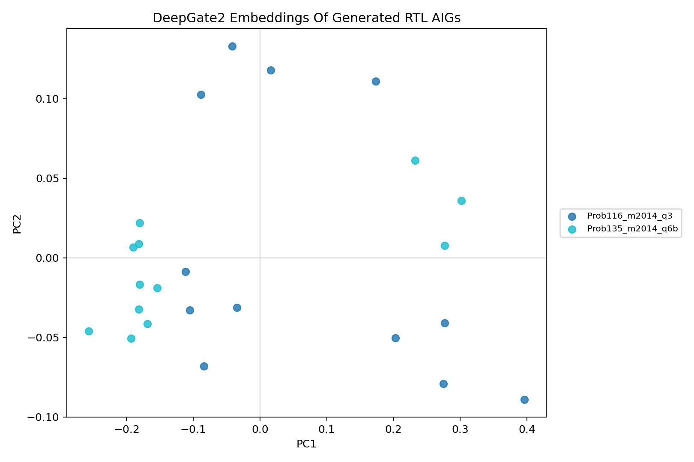

# DeepGate Generated Bridge Report

## Answer

The DeepGate lane is not ready for the final RTLLM comparison, but it should
not be discarded. This probe fixed the most severe old symptom: the previous
generated-candidate run produced only three embeddings with mean pairwise
cosine near `0.9999`. The new official DeepGate2 bridge produced `24`
generated-candidate embeddings with mean pairwise cosine `0.9318` and minimum
cosine `0.8124`.

That is enough to say the pretrained model can produce nontrivial signals on
some generated RTL-derived AIGs. It is not enough to call DeepGate spend-ready,
because only `2/8` screening problems embedded under the current policy.

## Method

The probe used the installed `python-deepgate` package and its official
pretrained model path:

- source: `exp/diversity_check/encoder_sources/python-deepgate`;
- environment: `exp/diversity_check/encoder_envs/deepgate3_probe`;
- model artifact:
  `exp/diversity_check/encoder_sources/python-deepgate/deepgate/pretrained/model.pth`;
- model hash recorded in
  `../20260625_pretrained_encoder_bridge_validation/tables/model_artifact_inventory.csv`.

The generated candidate corpus came from the completed eight-design live
screen:

`exp/useful_bd_push/prelim_encoder_config_screen_20260625_134902_UTC/live`

For each backend/problem pair the script sampled up to three valid-PPA
candidate directories, exported raw `code.sv` through Yosys as latch-free
ASCII AIG when possible, skipped AIGs above `400` variables, then pooled the
DeepGate2 structural and functional node embeddings by mean.

## Results

| Status | Count | Meaning |
| --- | ---: | --- |
| `embedded` | 24 | Exported, bounded, latch-free, and embedded. |
| `skipped_too_large` | 12 | Exported but exceeded the bounded parser policy. |
| `export_failed` | 60 | Yosys could not produce an acceptable AIG. |

The embedded rows cover all four backends, with six embeddings per backend:

- `classic_revolution_8x5`;
- `code_thought_sr_front_slot_8x5`;
- `masterrtl_structural_mix_8x5`;
- `qwen_canonical_rtl_pca3_8x5`.

The embedded rows only cover:

- `Prob116_m2014_q3`;
- `Prob135_m2014_q6b`.

The main export failure observed in sequential designs is unsupported DFF cells
in the direct AIG export path. The bounded-size skip is dominated by
`Prob045_alu`, which exports as roughly `2.5k-2.9k` variables and is too large
for the current DeepGate parser policy.

## Figure

The PCA view is presentation-readable and shows that the generated embeddings
are not all collapsed to one point. The limitation is equally visible: the plot
only contains two problems, so it cannot support a broad RTLLM claim.

## Decision

DeepGate is now a partially validated pretrained encoder bridge:

- pretrained model load: pass;
- upstream example smoke: pass;
- generated-candidate noncollapse: partial pass;
- generated-candidate coverage: fail for live promotion.

Do not spend full RTLLM budget on DeepGate yet. The next valid attempt should
pre-register one of these bridge fixes:

1. Extract combinational cones around sequential boundaries, then embed cone
   summaries instead of requiring a full latch-free design AIG.
2. Add a faster parser/graph conversion path for larger AIGs before accepting
   `Prob045_alu`-scale designs.
3. Compare pooled DeepGate embeddings against simple AIG statistics on the
   same generated rows to confirm the pretrained model adds signal beyond size.

The follow-up transition-abstraction probe fixed the parser issue through
canonical renumbering and constant-literal repair, then embedded `60` rows
across `5/8` screen problems. That is a stronger bridge, but it still needs
large-design coverage or cone extraction before live spending.

Until one of those passes on at least most of the eight screening problems,
DeepGate remains a bridge-required lane rather than a final RTLLM arm.
