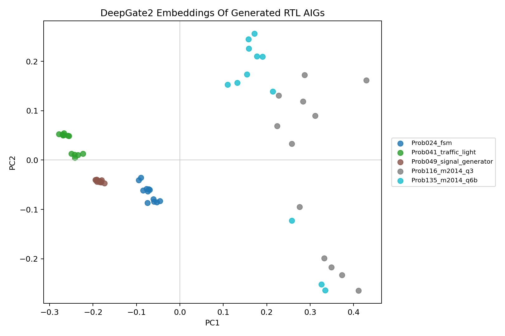

# DeepGate Transition Bridge Report

## Answer

The transition abstraction improves AIG exportability for sequential generated
RTL and now produces a usable bounded DeepGate embedding corpus. It is still
not ready for a full live QD arm because it covers only `5/8` screening
problems under a practical cap and its nearest-neighbor structure is strongly
same-problem.

## Method

For latch-bearing AIGs, the transform rewrites:

- original primary inputs plus latch state literals as new primary inputs;
- original primary outputs plus latch next-state literals as new outputs;
- latch count to zero;
- existing AND definitions canonically renumbered after the new inputs.

This represents one-cycle transition logic. It is an honest hardware-native
descriptor candidate because it exposes the combinational logic around state
instead of silently dropping flip-flops.

The first transition attempt left original latch variable numbers in place and
let constant literals reach DeepGate's parser. That was the actual parser
blocker. The corrected bridge:

- densely renumbers state inputs and AND variables;
- maps constant literals to a surrogate primary input, preserving inversion;
- keeps the transform explicit through `--state-policy transition`.

## Header Smoke

| Problem | Original AAG | Transition AAG | Read |
| --- | --- | --- | --- |
| `Prob015_multi_pipe_8bit` | `aag 1255 19 69 17 1167` | `aag 1255 88 0 86 1167` | Parses at higher cap, but slow. |
| `Prob024_fsm` | `aag 79 3 9 1 67` | `aag 79 12 0 10 67` | Bounded candidate. |
| `Prob041_traffic_light` | `aag 542 3 73 11 466` | `aag 542 76 0 84 466` | Bounded candidate. |
| `Prob049_signal_generator` | `aag 163 2 13 5 148` | `aag 163 15 0 18 148` | Bounded candidate. |
| `Prob153_gshare` | `aag 10479 27 645 8 9807` | `aag 10479 672 0 653 9807` | Too large. |

## Run Outcome

The corrected transition run used:

```bash
--max-aig-vars 700 --max-per-backend-problem 3 --state-policy transition
```

| Metric | Value |
| --- | ---: |
| Generated valid-PPA candidates sampled | 96 |
| AIG exports | 96 |
| Embedded bounded transition AIGs | 60 |
| Embedded problems | 5 |
| Embedded backends | 4 |
| Pairwise cosine mean | 0.9213 |
| Pairwise cosine min | 0.7024 |
| Same-problem nearest ratio | 0.8333 |
| Same-backend nearest ratio | 0.2333 |

The embedded problems are:

- `Prob024_fsm`;
- `Prob041_traffic_light`;
- `Prob049_signal_generator`;
- `Prob116_m2014_q3`;
- `Prob135_m2014_q6b`.

The skipped problems are:

- `Prob015_multi_pipe_8bit`;
- `Prob045_alu`;
- `Prob153_gshare`.

`Prob015_multi_pipe_8bit` is not impossible: one canonical transition AIG
parsed in `39.76s` with `1916` nodes and `2772` edges. That is too slow for
the current in-loop descriptor path but useful evidence for a cached or
offline cone-extraction bridge.

## Figure



The projection is readable and shows five problem clusters. The figure also
shows the main limitation: the descriptor still clusters mostly by problem, so
it is not yet a promoted live QD arm.

## Decision

Do not promote transition DeepGate to a full RTLLM live QD arm yet. The next
valid DeepGate bridge should be one of:

- cone-level extraction around state and output signals;
- a cached/offline descriptor table for bounded transition AIGs before live
  integration;
- a tiny live smoke on only transition-covered problems;
- a compact transition summary that compares DeepGate embeddings against
  simple AIG statistics before live spending.
