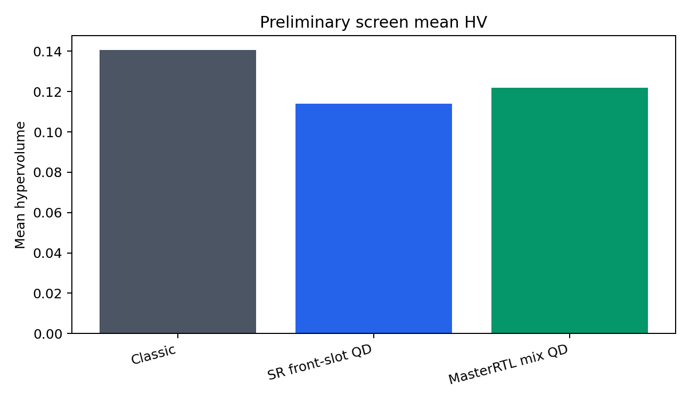
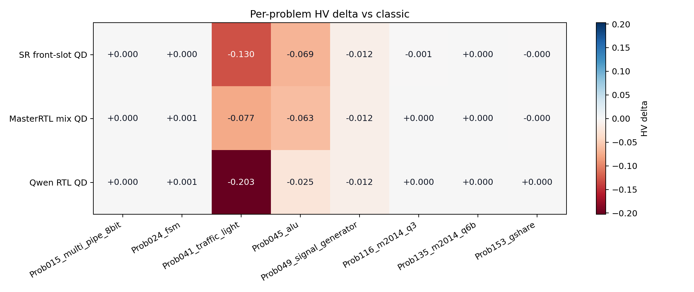

# Live Screening Results

## Verdict

Do not promote any screened QD arm to the full RTLLM run yet.
Classic REvolution remains the headline winner on mean HV, Pareto
point count, reference-beating count, and per-problem HV wins.

The strongest QD arm in this screen is `masterrtl_structural_mix_8x5`,
but it is still below classic on the headline Pareto metrics. Qwen
canonical RTL preserved 8/8 problem coverage and won `Prob153_gshare`,
but its aggregate HV and front breadth are weaker than classic.

Note: the full final-analysis bundle lists Qwen as the generic score-style
`overall` recommendation, but the pre-registered promotion gate for this
milestone is the Pareto/HV comparison. That gate selects
`classic_revolution_8x5` as `pareto_overall`.

## Run Roots

- live root: `/workspace/exp/useful_bd_push/prelim_encoder_config_screen_20260625_134902_UTC/live`
- final analysis: `/workspace/exp/useful_bd_push/prelim_encoder_config_screen_20260625_134902_UTC/live/final_analysis_with_qwen`

## Aggregate Pareto Metrics

| Backend | Mean HV | Pareto Points | Ref-Beating | HV Wins |
| --- | ---: | ---: | ---: | ---: |
| `classic_revolution_8x5` | 0.1406 | 3.25 | 8.00 | 6 |
| `code_thought_sr_front_slot_8x5` | 0.1141 | 1.88 | 4.12 | 0 |
| `masterrtl_structural_mix_8x5` | 0.1218 | 2.00 | 5.50 | 1 |
| `qwen_canonical_rtl_pca3_8x5` | 0.1108 | 1.62 | 4.38 | 1 |

## QD Delta Summary

| QD Backend | Mean HV Delta | HV Wins vs Classic | Mean Pareto Delta |
| --- | ---: | ---: | ---: |
| `code_thought_sr_front_slot_8x5` | -0.0266 | 1/8 | -1.38 |
| `masterrtl_structural_mix_8x5` | -0.0189 | 1/8 | -1.25 |
| `qwen_canonical_rtl_pca3_8x5` | -0.0298 | 2/8 | -1.62 |

## Qwen Descriptor Health

All eight Qwen screen problems emitted descriptor-health files.
No Qwen PCA axis was marked collapsed in the live archive health
reports, so the negative result is not caused by a trivial
all-zero or single-value descriptor failure.

| Problem | Observations | Archive Entries | Occupied Cells | Collapsed Axes |
| --- | ---: | ---: | ---: | --- |
| `Prob015_multi_pipe_8bit` | 7 | 7 | 7 | `none` |
| `Prob024_fsm` | 27 | 21 | 17 | `none` |
| `Prob041_traffic_light` | 25 | 23 | 16 | `none` |
| `Prob045_alu` | 15 | 14 | 10 | `none` |
| `Prob049_signal_generator` | 40 | 15 | 15 | `none` |
| `Prob116_m2014_q3` | 29 | 17 | 14 | `none` |
| `Prob135_m2014_q6b` | 41 | 10 | 10 | `none` |
| `Prob153_gshare` | 8 | 8 | 8 | `none` |

## Encoder Status

Qwen3 canonical RTL is now a real live-screened pretrained encoder
arm. It is not strong enough to promote as-is. DeepGate3, AURORA,
and T11/T36 remain bridge-required because their current evidence is
replay-only, near-collapsed, or failed in a prior live conversion.

## Follow-Up MasterRTL Front-Slot Probe

After this four-arm screen, `masterrtl_structural_front_slot_8x5` tested the
same MasterRTL structural descriptor with explicit `front_slot_lane_nsga2`
parent selection. The arm completed the same frozen eight-design `8x5` screen
and is packaged at `../20260625_masterrtl_front_slot_probe/`.

| Backend | Mean HV | Pareto Points | Ref-Beating | HV Wins |
| --- | ---: | ---: | ---: | ---: |
| `classic_revolution_8x5` | 0.1406 | 3.25 | 8.00 | 6 |
| `masterrtl_structural_front_slot_8x5` | 0.1227 | 1.75 | 6.62 | 1 |
| `masterrtl_structural_mix_8x5` | 0.1218 | 2.00 | 5.50 | 1 |

Decision: the front-slot follow-up is a diagnostic improvement over plain
MasterRTL structural mix, not a promotion candidate. It still loses classic on
mean HV and front breadth.

## Follow-Up T11 Top-4 Front-Slot Probe

`t11_runtime_top4_front_slot_8x5` tested raw T11 runtime graph axes with the
same conservative `front_slot_lane_nsga2` parent lane. This intentionally avoids
repeating exact T58's PCA4 descriptor geometry while still giving the strongest
replay graph lane a live frozen-screen check.

| Backend | Mean HV | Pareto Points | Ref-Beating | HV Wins |
| --- | ---: | ---: | ---: | ---: |
| `classic_revolution_8x5` | 0.1406 | 3.25 | 8.00 | 6 |
| `masterrtl_structural_front_slot_8x5` | 0.1227 | 1.75 | 6.62 | 1 |
| `t11_runtime_top4_front_slot_8x5` | 0.1208 | 1.88 | 5.38 | 0 |

Decision: diagnostic, not promoted. The graph lane still loses classic on
headline HV/front metrics and no longer looks like the best screened QD arm.
