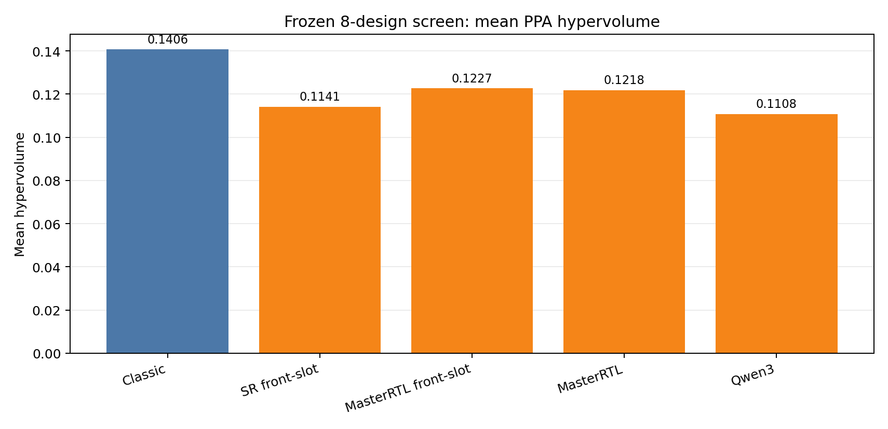
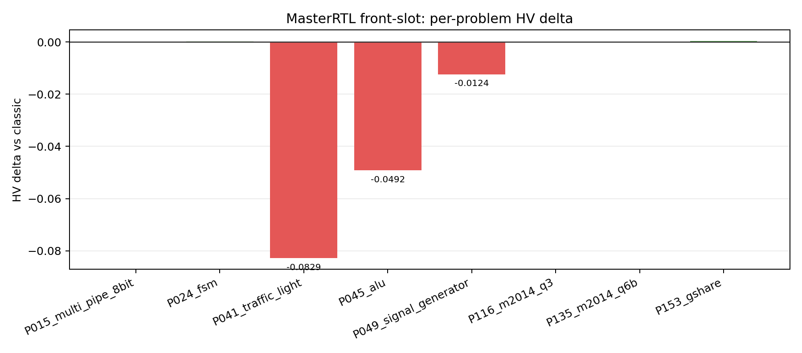

# MasterRTL Front-Slot Probe Report

## Question

Can the closest screened RTL-native descriptor, MasterRTL structural mix, become
more competitive if it also samples non-elite local front-slot parents?

This tests a mechanism change, not just another descriptor-only retry. The
plain `masterrtl_structural_mix_8x5` arm already had the best QD mean HV in the
previous screen, but still lost classic. This follow-up asks whether explicit
front-slot parent traffic helps turn that archive into better PPA-front
material.

## Method

The arm keeps the frozen preliminary screen:

- subset: eight reference-complete designs in
  `tables/prelim_screen_subset.yaml`;
- budget: `population_size=8`, `num_generations=5`;
- seed: `1001`;
- model: `openai/gpt-oss-120b`;
- token budgets: `max_tokens=128000`, `diff_max_tokens=128000`;
- workers: `total_worker_slots=32`, `max_active_problems=8`,
  `max_workers_per_problem=4`;
- descriptor profile: `source_aligned_masterrtl_structural_mix_3d`;
- archive: `grid_quantile`, `elite_pareto_slot`, `qd_max_elites_per_cell=2`;
- parent selection: `front_slot_lane_nsga2`;
- front-slot lane fraction: `0.10`;
- two-parent fusion: disabled.

## Result

The run completed all `8/8` problems in `1520.65` seconds and produced `182`
candidate PPA reports. Both focused validators passed:

- `scripts/validate_pareto_front_run.py`
- `scripts/validate_single_thought_operator_run.py`

Headline aggregate:

| Backend | Mean HV | Mean Pareto Points | Mean Ref-Beating | HV Wins |
| --- | ---: | ---: | ---: | ---: |
| `classic_revolution_8x5` | `0.1406` | `3.25` | `8.00` | `6` |
| `masterrtl_structural_front_slot_8x5` | `0.1227` | `1.75` | `6.62` | `1` |
| `masterrtl_structural_mix_8x5` | `0.1218` | `2.00` | `5.50` | `1` |
| `code_thought_sr_front_slot_8x5` | `0.1141` | `1.88` | `4.12` | `0` |
| `qwen_canonical_rtl_pca3_8x5` | `0.1108` | `1.62` | `4.38` | `0` |

Per-problem HV deltas versus classic:

| Problem | HV Delta | Pareto Point Delta | Ref-Beating Delta |
| --- | ---: | ---: | ---: |
| `Prob015_multi_pipe_8bit` | `+0.0000` | `-6` | `0` |
| `Prob024_fsm` | `+0.0002` | `0` | `0` |
| `Prob041_traffic_light` | `-0.0829` | `0` | `+5` |
| `Prob045_alu` | `-0.0492` | `-3` | `-10` |
| `Prob049_signal_generator` | `-0.0124` | `-1` | `-3` |
| `Prob116_m2014_q3` | `+0.0000` | `0` | `-1` |
| `Prob135_m2014_q6b` | `+0.0000` | `0` | `-1` |
| `Prob153_gshare` | `+0.0005` | `-2` | `-1` |

## Interpretation

The front-slot lane gave a narrow positive signal relative to plain MasterRTL
structural mix:

- mean HV improved from `0.1218` to `0.1227`;
- mean reference-beating candidates improved from `5.50` to `6.62`;
- `Prob153_gshare` best-quality/archive behavior improved enough to create a
  small HV gain.

It did not solve the promotion problem:

- classic still wins mean HV by `0.0180`;
- classic still has much broader fronts: `3.25` mean Pareto points versus
  `1.75`;
- the largest losses are on `Prob041_traffic_light` and `Prob045_alu`;
- the method wins only one problem on HV.

## Decision

Do not promote `masterrtl_structural_front_slot_8x5` to the final full RTLLM
comparison as-is.

The result is useful because it says the source-aligned MasterRTL lane can be
combined with archive parent traffic without collapsing coverage, and it edges
out the plain MasterRTL screen arm on mean HV. The effect is too small and too
front-narrow to justify full RTLLM spending.

Recommended next step: stop small parent-lane tweaks on this exact descriptor.
If continuing the RTL-native lane, change the descriptor or archive objective
more substantially, for example by adding a front-yield protected secondary
archive or a task-specific learned/tree-leaf descriptor that avoids the
front-breadth loss.

## Reporting Caveat

`scripts/report_final_analysis_bundle.py` was interrupted during
source-aligned design-space feature recovery. The traceback showed the stall in
MasterRTL metric recovery for design-space plots. The Pareto analysis,
evolutionary reports, and PPA distribution reports were already written and are
the source for this report.
