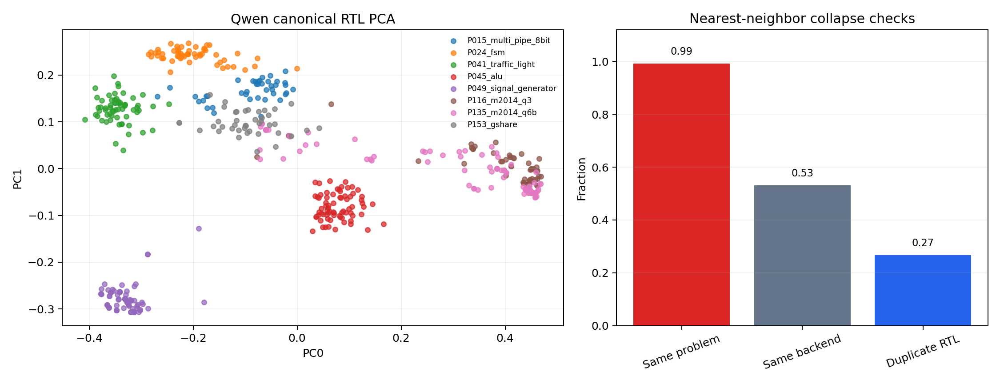

# Qwen Live-Screen Candidate Probe

## Verdict

Qwen3 canonical RTL is model-valid and nonconstant on this generated-candidate corpus,
but nearest-neighbor structure is still highly same-problem. This supports a small
live-hook screen, not a full RTLLM spend.

## Summary

- candidate rows: `540`
- unique canonical RTL hashes: `424`
- embedding shape: `[540, 1024]`
- off-diagonal cosine mean: `0.791654`
- nearest same-problem fraction: `0.992593`
- nearest same-backend fraction: `0.531481`
- nearest duplicate-canonical fraction: `0.266667`
- embedding output root: `exp/useful_bd_push/qwen_live_screen_probe_20260625_164500_UTC`

## Decision

Implement a live Qwen hook only with descriptor-health reporting. The first screen
must check same-problem clustering and duplicate-canonical collapse before any
promotion decision.

## Live-Hook Smoke

The live runtime hook now exists and reads
`qwen_descriptor_profile.yaml`.

Two bounded smokes were run:

- `Prob045_alu`, `1x0`: launch passed but no candidate reached valid PPA, so
  archive insertion was not exercised.
- `Prob135_m2014_q6b`, `2x0`: one candidate reached valid PPA, one archive
  member was written, and `archive_cells.csv` recorded descriptor values
  `[0.432236536166232, -0.014105572094552859, 0.08188936911901099]`.

The bridge is therefore runnable. The matched `8x5` screen completed after
this smoke and preserved `8/8` problem coverage, but Qwen-QD did not beat
classic: mean HV was `0.1108` versus classic `0.1406`, and mean Pareto points
were `1.62` versus classic `3.25`.

Decision: keep Qwen canonical RTL as a validated pretrained-encoder lane, but
do not promote this exact `qwen_canonical_rtl_pca3` configuration to the final
full-RTLLM comparison.
