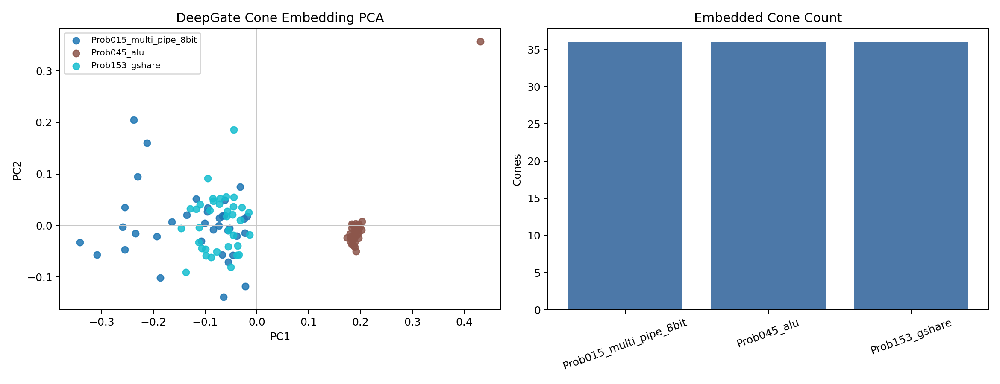

# T90 DeepGate Cone Bridge Results

## Answer

Bounded output-cone extraction fixes the main DeepGate transition-bridge
coverage blocker offline.

The previous full-transition bridge embedded `60` rows across `5/8`
preliminary screen problems and skipped the three large designs. T90 extracts
smallest nontrivial output cones from those skipped transition AIGs and embeds
them with the same official `python-deepgate` pretrained model. It produces
`108` cone embeddings: `36` each for `Prob015_multi_pipe_8bit`,
`Prob045_alu`, and `Prob153_gshare`.

Combined with the previous full-transition rows, DeepGate now has offline
coverage for all `8/8` preliminary screen problems.

## Metrics

| Metric | Value |
| --- | ---: |
| Skipped large transition rows considered | `36` |
| Cone embeddings | `108` |
| Cone problems | `3` |
| Full-transition problems | `5` |
| Combined covered problems | `8` |
| Max selected cone ANDs | `245` |
| Max cone embedding time | `0.0710s` |
| Pairwise cosine mean | `0.9422` |
| Pairwise cosine min | `0.5581` |
| Same-problem nearest ratio | `0.0000` |

The `same_problem_nearest_ratio` is not a promotion signal here. The selected
cones are intentionally small local structures, so nearest neighbors often
cross problem boundaries. That is acceptable for a bridge-coverage gate, but it
means a useful descriptor must aggregate multiple cone embeddings per
candidate instead of treating one cone as the full design descriptor.

## Figure

The figure is useful for preliminary planning: it shows equal cone coverage for
the three previously skipped problems and a nonblank embedding projection.

## Decision

T90 passes as an offline bridge fix and should supersede the statement that
DeepGate only covers `5/8` problems. It does not promote DeepGate to final
RTLLM spend by itself.

Next valid DeepGate steps:

1. build a cached candidate-level descriptor table by pooling full-transition
   embeddings where available and cone embeddings where needed;
2. define explicit aggregation such as mean/std/max over cones plus a cone
   count/coverage axis;
3. run a no-LLM archive replay to check whether pooled DeepGate cells avoid
   collapse and correlate with PPA-front material;
4. only then run a bounded live smoke if replay passes.

The live arm should still be labeled experimental until it has comparable HV
data against classic on the frozen screen.
