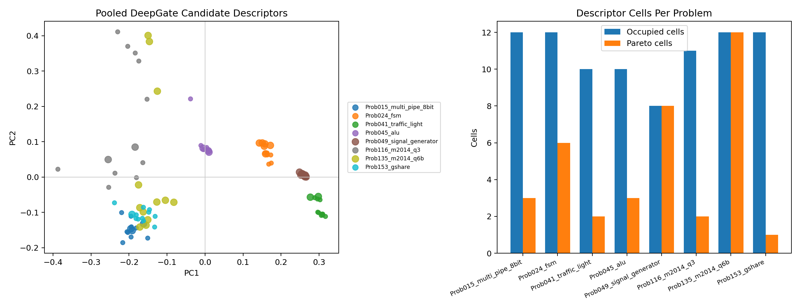

# T91 DeepGate Pooled Descriptor Replay Results

## Answer

Pooled full-transition plus cone-level DeepGate descriptors are coherent enough
to justify designing a bounded live smoke, but they still do not provide live
QD/HV evidence.

The replay covers all `96` sampled candidates across all `8/8` preliminary
screen problems:

- `60` candidates use full-transition DeepGate embeddings;
- `36` candidates use pooled cone embeddings from T90;
- every problem has more than one occupied descriptor cell;
- every problem has at least one area-power Pareto cell.

## Metrics

| Metric | Value |
| --- | ---: |
| Candidate descriptors | `96` |
| Problems | `8` |
| Full-transition candidates | `60` |
| Cone-pooled candidates | `36` |
| Mean occupied cells/problem | `10.875` |
| Mean area-power Pareto cells/problem | `4.625` |
| Mean area-power Pareto members/problem | `5.125` |
| Same-problem nearest ratio | `0.0000` |
| Same-backend nearest ratio | `0.0000` |

The nearest-neighbor ratios should be read carefully. `0.0000` means the
pooled descriptors are not simply grouping by problem or backend identity in
this 96-candidate table. It does not prove that the descriptor improves PPA
search.

## Problem Summary

| Problem | Candidates | Source | Occupied cells | Pareto members | Pareto cells |
| --- | ---: | --- | ---: | ---: | ---: |
| `Prob015_multi_pipe_8bit` | `12` | cone | `12` | `3` | `3` |
| `Prob024_fsm` | `12` | full | `12` | `6` | `6` |
| `Prob041_traffic_light` | `12` | full | `10` | `2` | `2` |
| `Prob045_alu` | `12` | cone | `10` | `3` | `3` |
| `Prob049_signal_generator` | `12` | full | `8` | `12` | `8` |
| `Prob116_m2014_q3` | `12` | full | `11` | `2` | `2` |
| `Prob135_m2014_q6b` | `12` | full | `12` | `12` | `12` |
| `Prob153_gshare` | `12` | cone | `12` | `1` | `1` |

## Figure

The figure shows the pooled candidate-level descriptor projection and the
problem-level occupied-cell versus Pareto-cell counts.

## Decision

T91 passes as an offline descriptor-table replay. DeepGate should remain the
current synthesized-netlist pretrained encoder representative and can advance
to a bounded live smoke design.

It should not be promoted to the final RTLLM comparison yet. Required next
steps:

1. define a runtime or cached descriptor path that pools full-transition and
   cone embeddings per candidate;
2. run a small matched live smoke against classic on a covered subset;
3. only consider the frozen eight-design screen if the smoke preserves
   classic-covered designs and produces nontrivial PPA-front material.
