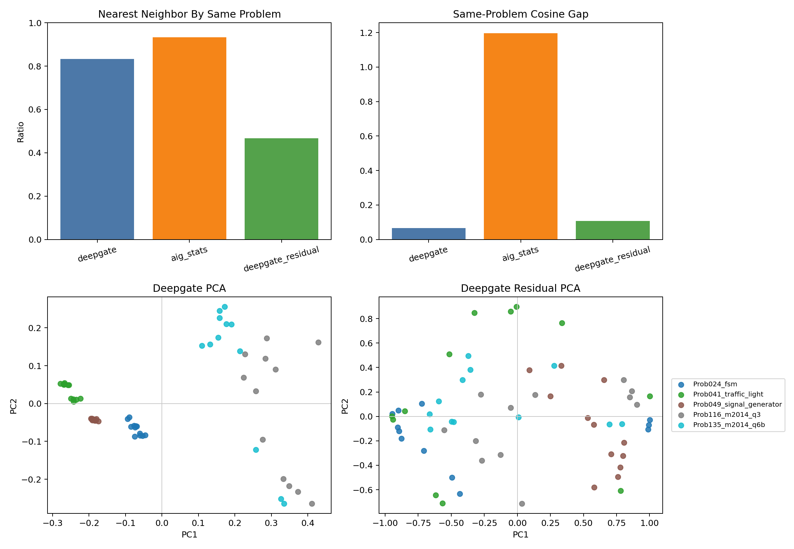

# T89 DeepGate Signal Vs AIG Stats Results

## Answer

The official DeepGate transition embeddings contain signal beyond simple AIG
statistics, but the lane is still not ready for live RTLLM spend.

This gate compared the pooled official DeepGate vectors with standardized AIG
size/count statistics on the same `60` embedded generated candidates. AIG
statistics were actually more problem-dominated than DeepGate: their nearest
neighbor came from the same problem `93.33%` of the time, compared with
`83.33%` for DeepGate. After linearly residualizing DeepGate vectors against
the AIG statistics, same-problem nearest neighbors fell to `46.67%`, while the
residual vectors remained nonconstant.

That is enough to keep DeepGate as a real pretrained-netlist encoder lane. It
is not enough to promote a live full-suite QD arm, because the current bridge
still embeds only `5/8` preliminary screen problems and raw embeddings still
cluster strongly by problem.

## Metrics

| Representation | Same-problem nearest | Same-backend nearest | Same-problem cosine mean | Different-problem cosine mean |
| --- | ---: | ---: | ---: | ---: |
| DeepGate | `0.8333` | `0.2333` | `0.9748` | `0.9090` |
| AIG stats | `0.9333` | `0.2333` | `0.9970` | `-0.1998` |
| DeepGate residual | `0.4667` | `0.2333` | `0.0781` | `-0.0294` |

Interpretation:

- `AIG stats` mostly encode problem-scale and graph-size identity.
- `DeepGate` is also problem-clustered, but less purely size-driven than AIG
  stats.
- `DeepGate residual` shows nonconstant residual structure after removing AIG
  statistics, so the official model is not merely duplicating size/count
  descriptors.

## Coverage

| Problem | Embedded rows | Backends | Mean AIG vars | Mean AIG ANDs |
| --- | ---: | ---: | ---: | ---: |
| `Prob024_fsm` | `12` | `4` | `69.00` | `58.00` |
| `Prob041_traffic_light` | `12` | `4` | `363.25` | `335.08` |
| `Prob049_signal_generator` | `12` | `4` | `164.00` | `148.00` |
| `Prob116_m2014_q3` | `12` | `4` | `8.92` | `4.92` |
| `Prob135_m2014_q6b` | `12` | `4` | `11.42` | `7.42` |

The missing screen problems remain the main blocker:

- `Prob015_multi_pipe_8bit`;
- `Prob045_alu`;
- `Prob153_gshare`.

## Figure

The figure is presentation-usable. The upper panels show that AIG statistics
are a stronger problem-identity proxy than DeepGate, while the lower panels
show that residualized DeepGate vectors keep nontrivial structure.

## Decision

Do not promote a full RTLLM DeepGate arm yet.

Keep DeepGate as the current synthesized-netlist pretrained encoder
representative, but require one of these before live spend:

1. cone-level transition extraction that covers at least most of the frozen
   eight-design screen;
2. a bounded live smoke only on the five currently covered designs;
3. a cached descriptor-table prototype that proves DeepGate descriptor cells
   can be filled and replayed without in-loop parser latency.

If a bounded smoke is run, it must be labeled diagnostic-only unless the
covered subset and missing-design caveat are carried into every headline table.
