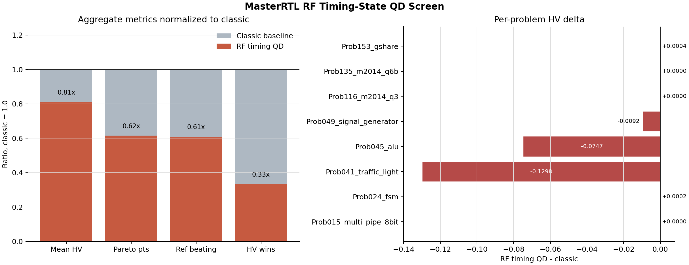

# MasterRTL RF Timing-State Screen

Status: completed, screened negative, not promoted.

This package records the frozen eight-design `8x5` screen for
`source_aligned_rf_timing_state_3d`, the T82 live descriptor profile that uses
MasterRTL's pretrained RF timing model-state features.

## Decision

Do not promote this exact RF timing-state QD profile to the final full-RTLLM
comparison. The implementation is real, all eight comparisons are
headline-paired, and both methods produce valid PPA candidates on every design.
The QD arm still loses classic on the registered front metrics.

| Metric | Classic | RF timing QD | Delta |
| --- | ---: | ---: | ---: |
| Mean HV | `0.1406` | `0.1140` | `-0.0266` |
| Mean Pareto points | `3.25` | `2.00` | `-1.25` |
| Mean reference-beating candidates | `8.00` | `4.88` | `-3.12` |
| HV wins | `6` | `2` | `-4` |



## What Ran

The live screen used the same frozen eight-design subset as the previous
encoder/configuration screen:

- `Prob015_multi_pipe_8bit`
- `Prob024_fsm`
- `Prob041_traffic_light`
- `Prob045_alu`
- `Prob049_signal_generator`
- `Prob116_m2014_q3`
- `Prob135_m2014_q6b`
- `Prob153_gshare`

The run completed all eight problems in `1441.49` seconds.

Run root:

```text
exp/useful_bd_push/prelim_rf_timing_state_screen_20260626_0442_UTC/live
```

QD arm:

```text
masterrtl_rf_timing_state_8x5/seed_1001/openai_gpt-oss-120b
```

Matched classic baseline:

```text
exp/useful_bd_push/prelim_encoder_config_screen_20260625_134902_UTC/live/classic_revolution_8x5/seed_1001/openai_gpt-oss-120b
```

## Evidence

| Artifact | Purpose |
| --- | --- |
| `commands/run_rf_timing_state_screen.md` | Exact screen, validator, and analysis commands. |
| `logs/validation_log.md` | Validation outcomes and visual inspection notes. |
| `analysis/pareto_analysis/report.md` | Generated Pareto/HV comparison report. |
| `analysis/pareto_analysis/backend_problem_metrics.csv` | Per-problem HV, Pareto, and reference-beating metrics. |
| `analysis/pareto_analysis/aggregate_backend_metrics.csv` | Aggregate comparison metrics. |
| `tables/comparison_completeness.csv` | Valid-PPA and reference-completeness table. |
| `tables/descriptor_health_summary.csv` | Per-problem descriptor-health summary. |
| `tables/screen_decision_metrics.csv` | Compact promotion-decision table. |
| `figures/rf_timing_state_screen_summary.png` | Presentation-safe summary figure. |

The generated per-problem front PNGs under `analysis/pareto_analysis/problems/`
are useful diagnostics, but visual inspection found clipped titles/legends in
some of them. Use the package summary figure for presentation material unless
the problem-level fronts are re-rendered with slide-ready layout.

## Interpretation

The pretrained RF timing-state lane is credible as a runtime descriptor source:
it loads the validated T81/T82 model-state path, emits archive artifacts, and
passes the registered validators. It does not yet produce a strong behavior
descriptor for QD under the `8x5` screen.

Descriptor health explains part of the weakness. Several problems collapse the
`source_aligned_rf_timing_path_count` axis, and some also collapse
`source_aligned_rf_timing_leaf_rows`. The archive still runs, but effective
descriptor dimensionality is often lower than the nominal 3D profile.

The next RF timing follow-up should be materially different before it spends
more vLLM budget. Reasonable options are:

- combine RF timing model-state bins with the best auxiliary archive/high
  exploit mechanism instead of using RF timing as the whole descriptor;
- replace the collapsed path-count axis with a timing-margin or leaf-hash
  diversity signal from the same validated model path;
- use RF timing state only as a secondary archive tag while preserving the
  stronger MasterRTL structural or delayed-activation pressure schedule.

Do not run the full RTLLM comparison with this exact profile.
