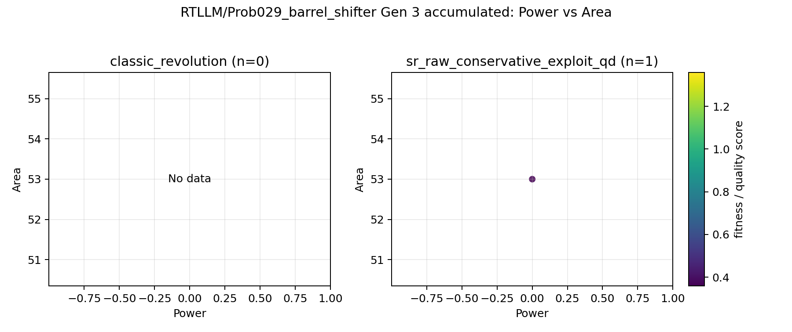
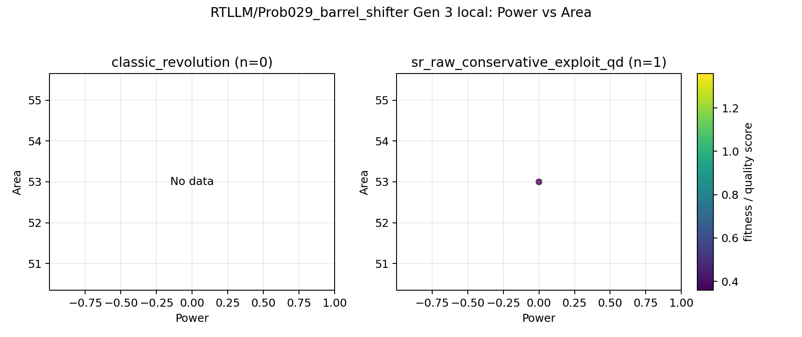

# RTLLM / Prob029_barrel_shifter

- circuit_type: `combinational`
- successful_candidates: `1`
- backends: `classic_revolution, sr_raw_conservative_exploit_qd`

## Backend counts

- `classic_revolution`: `0` successes, `generation plots enabled`
- `sr_raw_conservative_exploit_qd`: `1` successes, `generation plots enabled`

## Contents

- [Quick Reference](#quick-reference)
- [PPA Chronology](#ppa-chronology)
- [All-backend feature space](#all-backend-feature-space)
- [Notes](#notes)

## Quick Reference

### Gen 3 accumulated PPA

- `Power vs Area`: 

### Gen 3 accumulated features

- feature basis: `recommended report feature subset`
- features: `none`

- `PCA`: `too_few_successes`

## PPA Chronology

### Gen 3 local PPA

- `Power vs Area`: 

### Gen 3 accumulated PPA

- `Power vs Area`: 

## All-backend feature space

### Gen 3 local features

- feature basis: `recommended report feature subset`
- features: `none`

- `PCA`: `too_few_successes`

### Gen 3 accumulated features

- feature basis: `recommended report feature subset`
- features: `none`

- `PCA`: `too_few_successes`

## Notes

- Skipped pairwise feature plots for classic_revolution vs sr_raw_conservative_exploit_qd because one side had no successful candidates.
- No QD backends were eligible for pairwise feature plots in this problem.
