# RTLLM / Prob047_instr_reg

- circuit_type: `sequential`
- successful_candidates: `62`
- backends: `classic_revolution, sr_raw_conservative_exploit_qd`

## Backend counts

- `classic_revolution`: `34` successes, `generation plots enabled`
- `sr_raw_conservative_exploit_qd`: `28` successes, `generation plots enabled`

## Contents

- [Quick Reference](#quick-reference)
- [PPA Chronology](#ppa-chronology)
- [All-backend feature space](#all-backend-feature-space)
- [classic_revolution vs sr_raw_conservative_exploit_qd](#classic_revolution-vs-sr_raw_conservative_exploit_qd)
- [Notes](#notes)

## Quick Reference

### Gen 3 accumulated PPA

- `Power vs Area`: 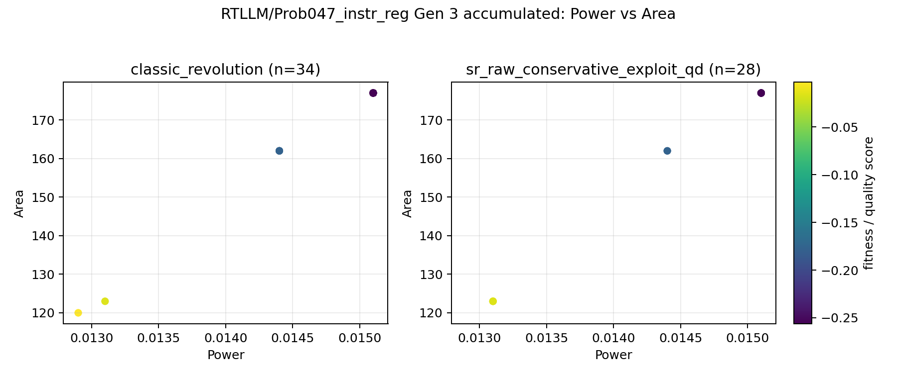
- `Power vs Performance`: 
- `Area vs Performance`: 

### Gen 3 accumulated features

- feature basis: `recommended report feature subset`
- features: `none`

- `PCA`: `too_few_varying_features`

### Gen 3 accumulated features

- feature basis: `archived QD axes`
- features: `sr_pca_0, sr_pca_1, sr_pca_2`

- `PCA`: 

## PPA Chronology

### Gen 0 local PPA

- `Power vs Area`: 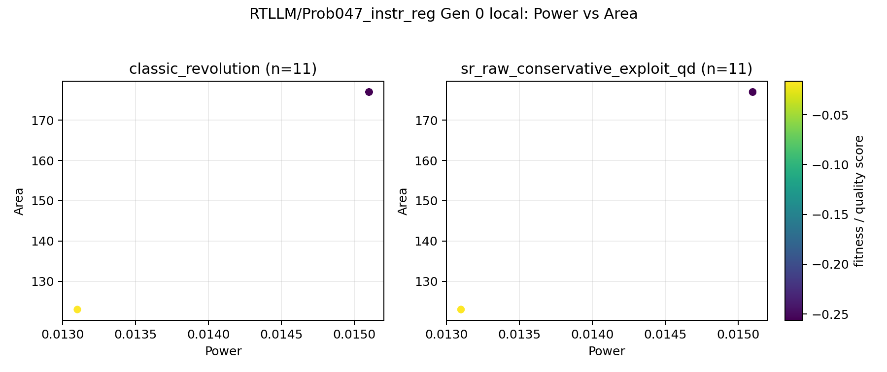
- `Power vs Performance`: 
- `Area vs Performance`: 

### Gen 0 accumulated PPA

- `Power vs Area`: 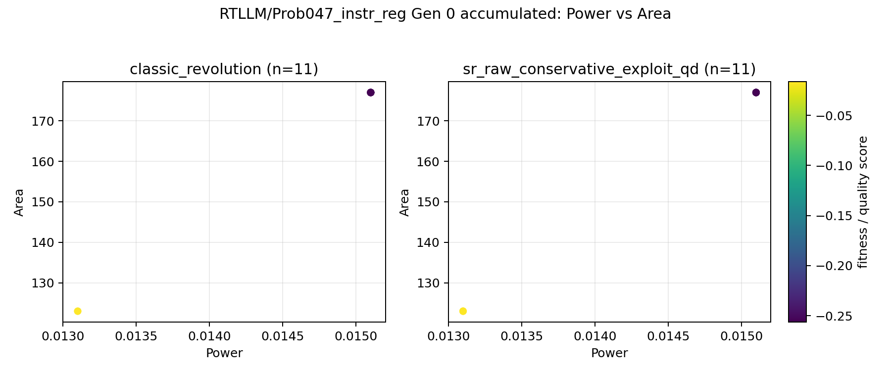
- `Power vs Performance`: 
- `Area vs Performance`: 

### Gen 1 local PPA

- `Power vs Area`: 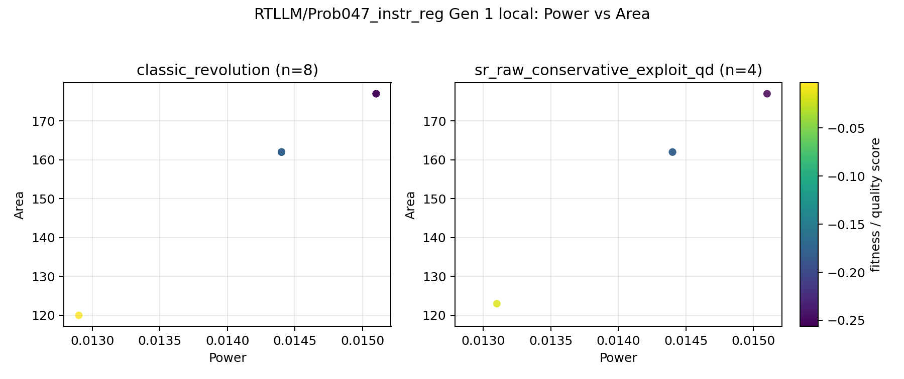
- `Power vs Performance`: 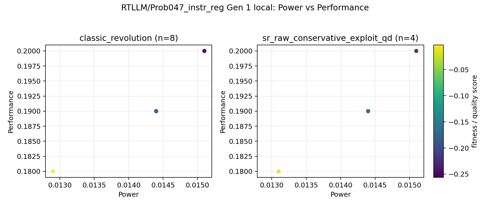
- `Area vs Performance`: 

### Gen 1 accumulated PPA

- `Power vs Area`: 
- `Power vs Performance`: 
- `Area vs Performance`: 

### Gen 2 local PPA

- `Power vs Area`: 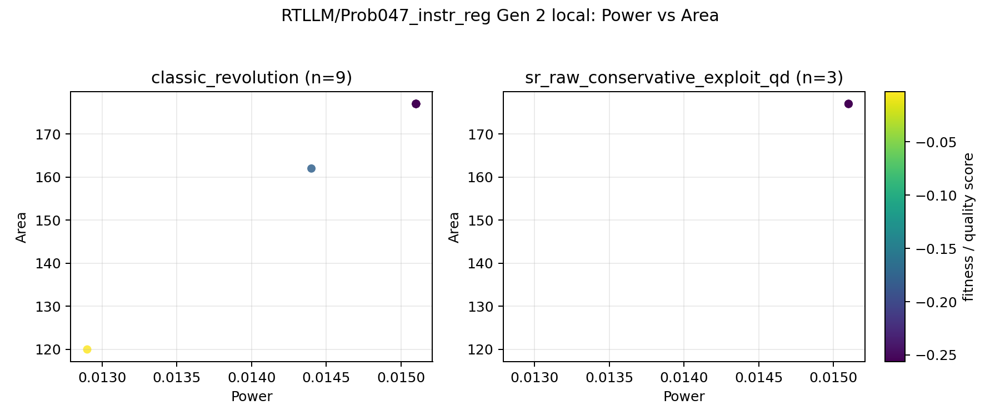
- `Power vs Performance`: 
- `Area vs Performance`: 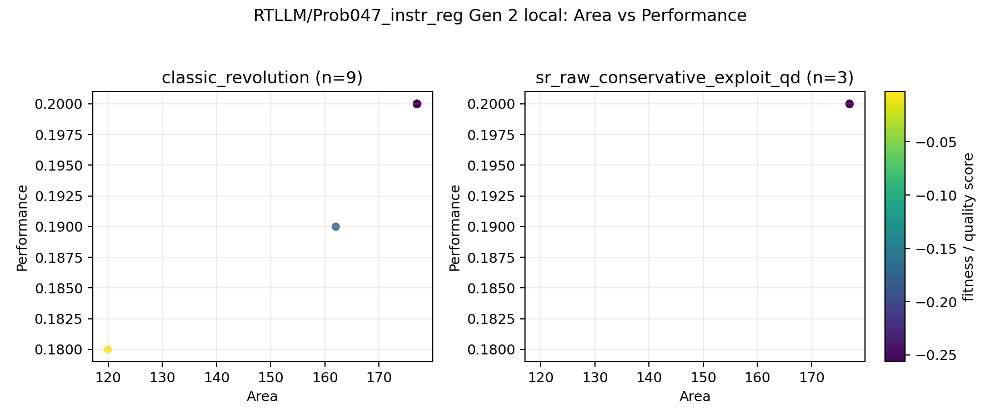

### Gen 2 accumulated PPA

- `Power vs Area`: 
- `Power vs Performance`: 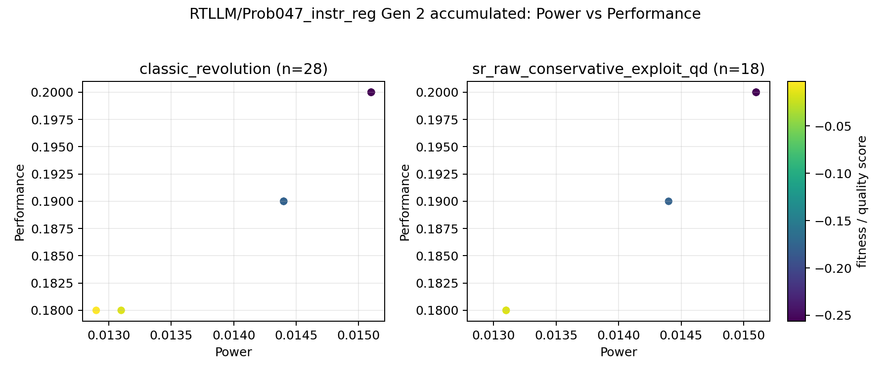
- `Area vs Performance`: 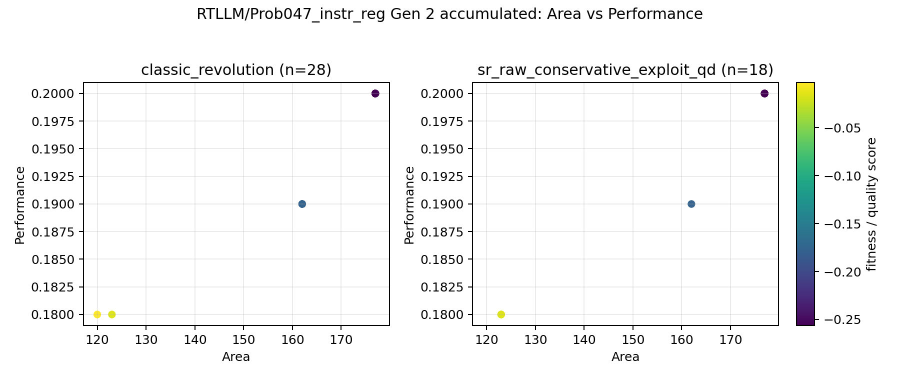

### Gen 3 local PPA

- `Power vs Area`: 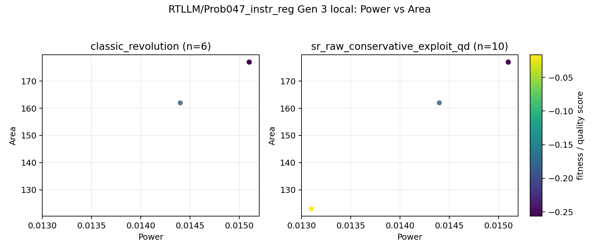
- `Power vs Performance`: 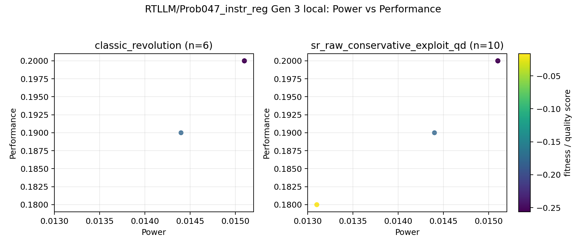
- `Area vs Performance`: 

### Gen 3 accumulated PPA

- `Power vs Area`: 
- `Power vs Performance`: 
- `Area vs Performance`: 

## All-backend feature space

### Gen 0 local features

- feature basis: `recommended report feature subset`
- features: `none`

- `PCA`: `too_few_varying_features`

### Gen 0 accumulated features

- feature basis: `recommended report feature subset`
- features: `none`

- `PCA`: `too_few_varying_features`

### Gen 1 local features

- feature basis: `recommended report feature subset`
- features: `none`

- `PCA`: `too_few_varying_features`

### Gen 1 accumulated features

- feature basis: `recommended report feature subset`
- features: `none`

- `PCA`: `too_few_varying_features`

### Gen 2 local features

- feature basis: `recommended report feature subset`
- features: `none`

- `PCA`: `too_few_varying_features`

### Gen 2 accumulated features

- feature basis: `recommended report feature subset`
- features: `none`

- `PCA`: `too_few_varying_features`

### Gen 3 local features

- feature basis: `recommended report feature subset`
- features: `none`

- `PCA`: `too_few_varying_features`

### Gen 3 accumulated features

- feature basis: `recommended report feature subset`
- features: `none`

- `PCA`: `too_few_varying_features`

## classic_revolution vs sr_raw_conservative_exploit_qd

- feature basis: `archived QD axes`
- features: `sr_pca_0, sr_pca_1, sr_pca_2`

### Gen 0 local features

- feature basis: `archived QD axes`
- features: `sr_pca_0, sr_pca_1, sr_pca_2`

- `PCA`: 

### Gen 0 accumulated features

- feature basis: `archived QD axes`
- features: `sr_pca_0, sr_pca_1, sr_pca_2`

- `PCA`: 

### Gen 1 local features

- feature basis: `archived QD axes`
- features: `sr_pca_0, sr_pca_1, sr_pca_2`

- `PCA`: 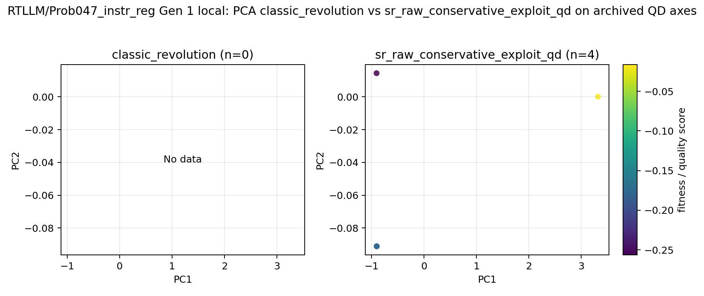

### Gen 1 accumulated features

- feature basis: `archived QD axes`
- features: `sr_pca_0, sr_pca_1, sr_pca_2`

- `PCA`: 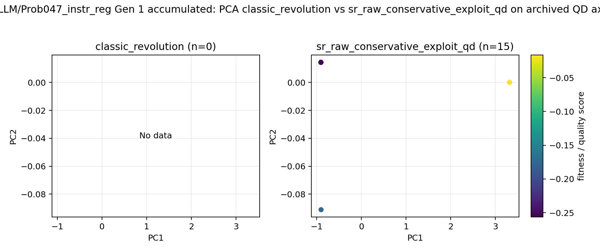

### Gen 2 local features

- feature basis: `archived QD axes`
- features: `sr_pca_0, sr_pca_1, sr_pca_2`

- `PCA`: 

### Gen 2 accumulated features

- feature basis: `archived QD axes`
- features: `sr_pca_0, sr_pca_1, sr_pca_2`

- `PCA`: 

### Gen 3 local features

- feature basis: `archived QD axes`
- features: `sr_pca_0, sr_pca_1, sr_pca_2`

- `PCA`: 

### Gen 3 accumulated features

- feature basis: `archived QD axes`
- features: `sr_pca_0, sr_pca_1, sr_pca_2`

- `PCA`: 

## Notes

- classic_revolution vs sr_raw_conservative_exploit_qd: unknown descriptor profile 'sr_pca_3d', falling back to archived axes or global selected features.
- classic_revolution vs sr_raw_conservative_exploit_qd: descriptor features are cached only for the QD backend; plotting cached QD descriptor rows without offline classic graph recovery.
