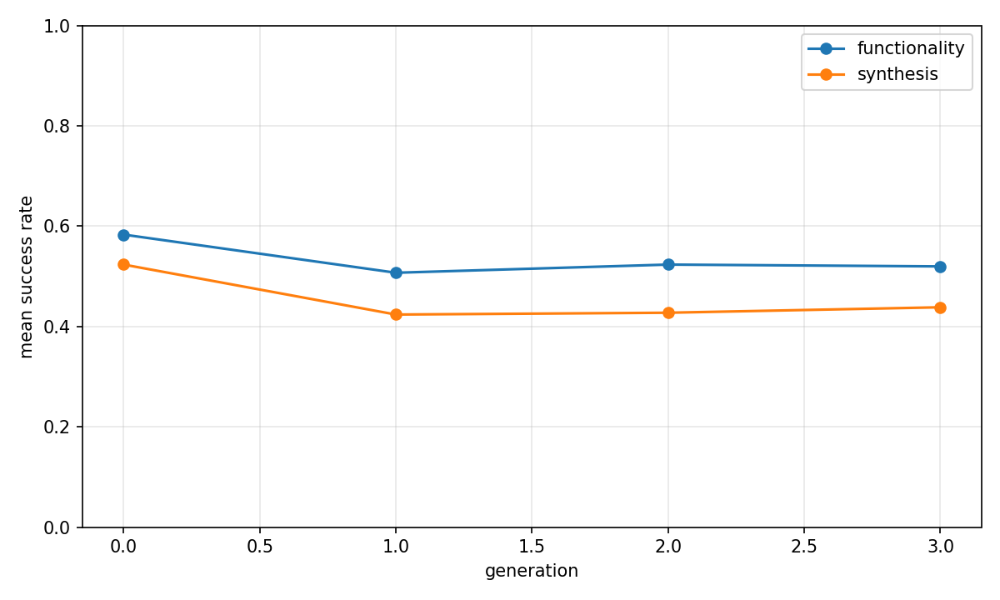
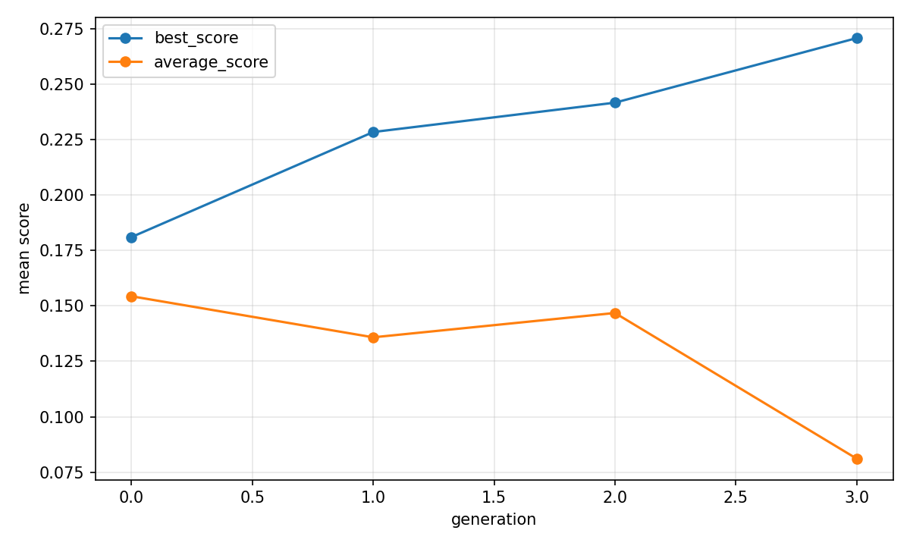

# Evolutionary report: classic_revolution

## Run summary

- backend: `classic_revolution`
- problem_count: `46`
- qd_archive_present: `False`
- mean_functionality_rate: `68.2%`
- mean_synthesis_rate: `67.3%`
- mean_best_score: `0.2857`
- mean_runtime_seconds: `1633.0680`
- total_llm_api_calls: `4417`

## Plot files

- generation rates: 
- generation scores: 
- QD archive trends: n/a

## Per-problem summary

| Benchmark | Problem | Func | Synth | Best score | Runtime (s) | Final coverage | Final QD score |
| --- | --- | ---: | ---: | ---: | ---: | ---: | ---: |
| RTLLM | Prob002_adder_16bit | 100.0% | 100.0% | 0.3999 | 1675.7070 | n/a | n/a |
| RTLLM | Prob007_comparator_3bit | 97.9% | 97.9% | 0.3501 | 1189.6133 | n/a | n/a |
| RTLLM | Prob005_adder_bcd | 95.8% | 95.8% | 0.3970 | 1551.8527 | n/a | n/a |
| RTLLM | Prob021_counter_12 | 95.8% | 95.8% | 0.3306 | 1224.3349 | n/a | n/a |
| RTLLM | Prob050_square_wave | 93.8% | 93.8% | 0.2779 | 1341.7381 | n/a | n/a |
| RTLLM | Prob003_adder_32bit | 91.7% | 91.7% | 0.5579 | 2034.8334 | n/a | n/a |
| RTLLM | Prob008_comparator_4bit | 91.7% | 91.7% | 0.4527 | 1494.1140 | n/a | n/a |
| RTLLM | Prob019_sub_64bit | 87.5% | 87.5% | 0.4823 | 1574.8584 | n/a | n/a |
| RTLLM | Prob001_accu | 87.5% | 87.5% | 0.0758 | 1587.5640 | n/a | n/a |
| RTLLM | Prob020_JC_counter | 87.5% | 87.5% | -0.0000 | 1468.3329 | n/a | n/a |
| RTLLM | Prob043_RAM | 85.4% | 85.4% | 0.4445 | 1517.7765 | n/a | n/a |
| RTLLM | Prob012_multi_8bit | 77.1% | 77.1% | 0.4608 | 1393.8588 | n/a | n/a |
| RTLLM | Prob009_div_16bit | 75.0% | 75.0% | 0.5591 | 1728.6749 | n/a | n/a |
| RTLLM | Prob023_up_down_counter | 75.0% | 75.0% | 0.2158 | 1304.9516 | n/a | n/a |
| RTLLM | Prob047_instr_reg | 75.0% | 70.8% | -0.0028 | 1434.9474 | n/a | n/a |
| RTLLM | Prob027_LIFObuffer | 70.8% | 70.8% | 0.2295 | 1632.1160 | n/a | n/a |
| RTLLM | Prob030_right_shifter | 89.6% | 68.8% | -0.0000 | 1114.0488 | n/a | n/a |
| RTLLM | Prob045_alu | 64.6% | 64.6% | 0.4170 | 1954.1424 | n/a | n/a |
| RTLLM | Prob044_ROM | 62.5% | 62.5% | 0.3294 | 1197.8297 | n/a | n/a |
| RTLLM | Prob036_edge_detect | 66.7% | 60.4% | 0.0389 | 1403.7901 | n/a | n/a |
| RTLLM | Prob004_adder_8bit | 60.4% | 60.4% | 0.3815 | 1597.3202 | n/a | n/a |
| RTLLM | Prob049_signal_generator | 58.3% | 58.3% | 0.2638 | 1466.8701 | n/a | n/a |
| RTLLM | Prob031_freq_div | 62.5% | 50.0% | 0.2091 | 1790.3239 | n/a | n/a |
| RTLLM | Prob035_calendar | 93.8% | 45.8% | 0.0234 | 1548.0830 | n/a | n/a |
| RTLLM | Prob041_traffic_light | 47.9% | 45.8% | 0.4246 | 2042.1173 | n/a | n/a |
| RTLLM | Prob048_pe | 45.8% | 45.8% | 0.0150 | 1258.2551 | n/a | n/a |
| RTLLM | Prob011_multi_16bit | 43.8% | 43.8% | 0.3167 | 1953.3081 | n/a | n/a |
| RTLLM | Prob037_parallel2serial | 37.5% | 35.4% | 0.2283 | 1838.1676 | n/a | n/a |
| RTLLM | Prob015_multi_pipe_8bit | 31.2% | 29.2% | 0.0682 | 2206.4856 | n/a | n/a |
| RTLLM | Prob024_fsm | 29.2% | 25.0% | 0.6316 | 1647.8199 | n/a | n/a |
| RTLLM | Prob025_sequence_detector | 6.2% | 6.2% | 0.2768 | 1568.5074 | n/a | n/a |
| RTLLM | Prob017_fixed_point_substractor | 93.8% | n/a | n/a | 1586.8595 | n/a | n/a |
| RTLLM | Prob016_fixed_point_adder | 85.4% | n/a | n/a | 1605.7435 | n/a | n/a |
| RTLLM | Prob014_multi_pipe_4bit | 66.7% | n/a | n/a | 1810.1599 | n/a | n/a |
| RTLLM | Prob042_width_8to16 | 18.8% | n/a | n/a | 2048.7739 | n/a | n/a |
| RTLLM | Prob046_clkgenerator | 2.1% | n/a | n/a | 1490.6533 | n/a | n/a |
| RTLLM | Prob010_radix2_div | n/a | n/a | n/a | 2408.1932 | n/a | n/a |
| RTLLM | Prob022_ring_counter | n/a | n/a | n/a | 1089.8660 | n/a | n/a |
| RTLLM | Prob026_asyn_fifo | n/a | n/a | n/a | 2051.3240 | n/a | n/a |
| RTLLM | Prob028_LFSR | n/a | n/a | n/a | 1103.1195 | n/a | n/a |
| RTLLM | Prob029_barrel_shifter | n/a | n/a | n/a | 1516.4809 | n/a | n/a |
| RTLLM | Prob032_freq_divbyeven | n/a | n/a | n/a | 1648.0032 | n/a | n/a |
| RTLLM | Prob033_freq_divbyfrac | n/a | n/a | n/a | 1967.3927 | n/a | n/a |
| RTLLM | Prob034_freq_divbyodd | n/a | n/a | n/a | 1880.9049 | n/a | n/a |
| RTLLM | Prob038_pulse_detect | n/a | n/a | n/a | 1557.7468 | n/a | n/a |
| RTLLM | Prob039_serial2parallel | n/a | n/a | n/a | 2613.5640 | n/a | n/a |

## Generation aggregates

| Gen | Problems | Func | Synth | Best score | Avg score | Diff success | Coverage | QD score |
| ---: | ---: | ---: | ---: | ---: | ---: | ---: | ---: | ---: |
| 0 | 46 | 58.3% | 52.4% | 0.1811 | 0.1543 | n/a | n/a | n/a |
| 1 | 46 | 50.7% | 42.4% | 0.2285 | 0.1358 | n/a | n/a | n/a |
| 2 | 46 | 52.4% | 42.8% | 0.2417 | 0.1468 | n/a | n/a | n/a |
| 3 | 46 | 52.0% | 43.8% | 0.2708 | 0.0811 | n/a | n/a | n/a |

## Aggregated status counts by generation

| Gen | failed_syntax | failed_functionality | failed_diff | failed_synthesis_functionality | success |
| ---: | ---: | ---: | ---: | ---: | ---: |
| 0 | 112 | 117 | 0 | 33 | 289 |
| 1 | 95 | 176 | 0 | 45 | 234 |
| 2 | 103 | 160 | 0 | 53 | 236 |
| 3 | 106 | 159 | 0 | 45 | 242 |

## Aggregated strategy counts by generation

| Gen | Top strategies |
| ---: | --- |
| 0 | initial=552 |
| 1 | M-R=113, M-I=113, M-S=105, M-E=103, C-F=61 |
| 2 | M-E=121, M-I=116, M-S=112, M-R=95, C-F=67 |
| 3 | M-E=125, M-I=120, M-R=109, M-S=99, C-F=66 |
