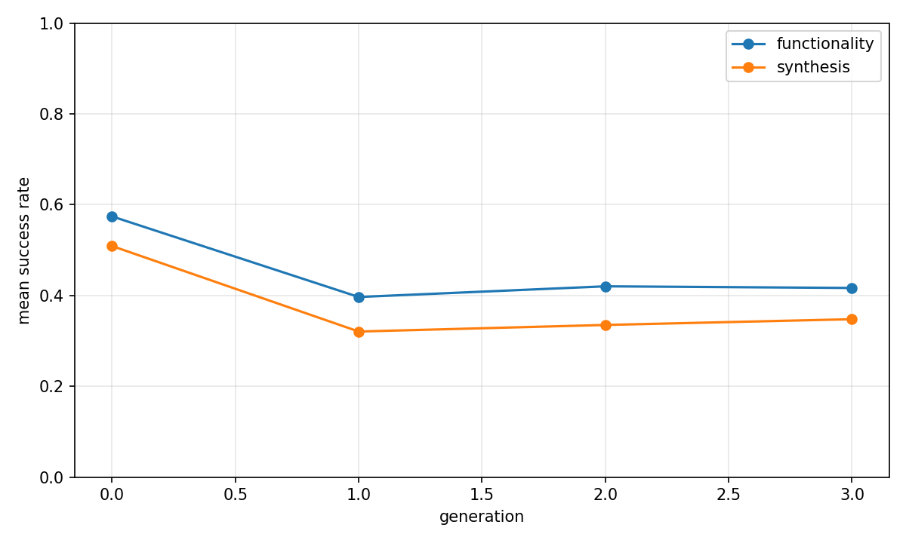
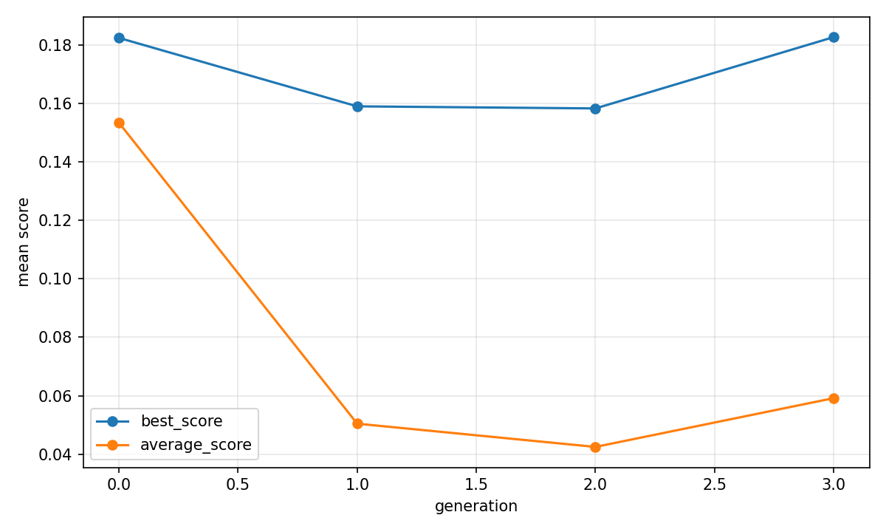
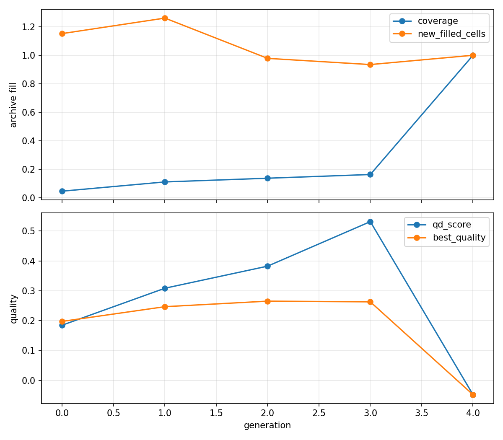

# Evolutionary report: sr_raw_conservative_exploit_qd

## Run summary

- backend: `sr_raw_conservative_exploit_qd`
- problem_count: `46`
- qd_archive_present: `True`
- mean_functionality_rate: `64.4%`
- mean_synthesis_rate: `51.2%`
- mean_best_score: `0.2524`
- mean_runtime_seconds: `1749.4369`
- total_llm_api_calls: `4416`

## Plot files

- generation rates: 
- generation scores: 
- QD archive trends: 

## Per-problem summary

| Benchmark | Problem | Func | Synth | Best score | Runtime (s) | Final coverage | Final QD score |
| --- | --- | ---: | ---: | ---: | ---: | ---: | ---: |
| RTLLM | Prob002_adder_16bit | 100.0% | 100.0% | 0.3999 | 1960.1224 | 18.5% | 1.4970 |
| RTLLM | Prob019_sub_64bit | 95.8% | 95.8% | 0.4823 | 1948.0578 | 25.9% | 2.4208 |
| RTLLM | Prob008_comparator_4bit | 95.8% | 95.8% | 0.4527 | 1595.6339 | 18.8% | 4.6424 |
| RTLLM | Prob005_adder_bcd | 93.8% | 93.8% | 0.3970 | 1776.8246 | 19.4% | 2.4937 |
| RTLLM | Prob050_square_wave | 91.7% | 91.7% | 0.1721 | 1420.3986 | 20.3% | 0.1270 |
| RTLLM | Prob027_LIFObuffer | 89.6% | 85.4% | 0.1825 | 1955.9409 | 15.6% | 0.8934 |
| RTLLM | Prob021_counter_12 | 100.0% | 81.2% | 0.3306 | 1246.5385 | 62.5% | 0.0794 |
| RTLLM | Prob020_JC_counter | 100.0% | 66.7% | -0.0000 | 1363.0154 | 37.5% | -0.7113 |
| RTLLM | Prob001_accu | 83.3% | 66.7% | 0.1153 | 1900.3369 | 29.6% | -1.7644 |
| RTLLM | Prob030_right_shifter | 100.0% | 62.5% | -0.0000 | 1273.2610 | 25.0% | -0.0847 |
| RTLLM | Prob007_comparator_3bit | 95.8% | 62.5% | 0.3298 | 1159.7650 | 50.0% | 1.1011 |
| RTLLM | Prob003_adder_32bit | 91.7% | 62.5% | 0.5579 | 1946.8316 | 25.0% | 1.0206 |
| RTLLM | Prob011_multi_16bit | 62.5% | 62.5% | 0.3053 | 2176.0221 | 22.9% | 0.6965 |
| RTLLM | Prob023_up_down_counter | 77.1% | 60.4% | -0.0483 | 1322.3998 | 100.0% | -0.0483 |
| RTLLM | Prob036_edge_detect | 70.8% | 60.4% | -0.0000 | 1524.6130 | 50.0% | -1.8288 |
| RTLLM | Prob012_multi_8bit | 85.4% | 58.3% | 0.4608 | 1454.2377 | 37.5% | 1.1056 |
| RTLLM | Prob047_instr_reg | 77.1% | 58.3% | -0.0164 | 1726.0388 | 11.1% | -0.4504 |
| RTLLM | Prob004_adder_8bit | 58.3% | 56.2% | 0.3815 | 1676.4028 | 10.9% | 1.3819 |
| RTLLM | Prob049_signal_generator | 68.8% | 47.9% | 0.2348 | 1721.1912 | 37.5% | 0.4976 |
| RTLLM | Prob035_calendar | 81.2% | 45.8% | 0.0234 | 1892.4605 | 50.0% | 0.0504 |
| RTLLM | Prob048_pe | 43.8% | 43.8% | 0.0026 | 1509.5680 | 11.1% | -1.0279 |
| RTLLM | Prob009_div_16bit | 45.8% | 39.6% | 0.5589 | 2020.3280 | 7.8% | 2.6437 |
| RTLLM | Prob043_RAM | 62.5% | 37.5% | 0.4261 | 1612.8614 | 37.5% | 1.0532 |
| RTLLM | Prob031_freq_div | 81.2% | 33.3% | 0.1540 | 1921.6766 | 37.5% | 0.2434 |
| RTLLM | Prob044_ROM | 68.8% | 29.2% | 0.3294 | 1466.3403 | 25.0% | 0.5165 |
| RTLLM | Prob045_alu | 37.5% | 27.1% | 0.4077 | 2272.6828 | 18.8% | 4.6037 |
| RTLLM | Prob041_traffic_light | 41.7% | 22.9% | 0.3627 | 2244.7693 | 14.1% | 1.1803 |
| RTLLM | Prob015_multi_pipe_8bit | 45.8% | 20.8% | 0.0607 | 2302.4664 | 14.1% | -0.6957 |
| RTLLM | Prob024_fsm | 43.8% | 20.8% | 0.5002 | 1927.3994 | 10.9% | 2.8782 |
| RTLLM | Prob037_parallel2serial | 20.8% | 20.8% | 0.0089 | 2064.3969 | 7.4% | -0.1148 |
| RTLLM | Prob025_sequence_detector | 20.8% | 14.6% | n/a | 1652.7979 | 0.0% | 0.0000 |
| RTLLM | Prob010_radix2_div | 25.0% | 8.3% | n/a | 2331.8764 | 0.0% | 0.0000 |
| RTLLM | Prob039_serial2parallel | 4.2% | 4.2% | n/a | 2744.4793 | 0.0% | 0.0000 |
| RTLLM | Prob029_barrel_shifter | 2.1% | 2.1% | n/a | 1350.4615 | 0.0% | 0.0000 |
| RTLLM | Prob017_fixed_point_substractor | 95.8% | n/a | n/a | 1541.6853 | 0.0% | 0.0000 |
| RTLLM | Prob016_fixed_point_adder | 75.0% | n/a | n/a | 1524.6081 | 0.0% | 0.0000 |
| RTLLM | Prob014_multi_pipe_4bit | 58.3% | n/a | n/a | 1647.4905 | 0.0% | 0.0000 |
| RTLLM | Prob042_width_8to16 | 12.5% | n/a | n/a | 2020.5338 | 0.0% | 0.0000 |
| RTLLM | Prob046_clkgenerator | 8.3% | n/a | n/a | 1390.6761 | 0.0% | 0.0000 |
| RTLLM | Prob022_ring_counter | n/a | n/a | n/a | 1161.4454 | 0.0% | 0.0000 |
| RTLLM | Prob026_asyn_fifo | n/a | n/a | n/a | 1997.0642 | 0.0% | 0.0000 |
| RTLLM | Prob028_LFSR | n/a | n/a | n/a | 1289.6891 | 0.0% | 0.0000 |
| RTLLM | Prob032_freq_divbyeven | n/a | n/a | n/a | 1657.3649 | 0.0% | 0.0000 |
| RTLLM | Prob033_freq_divbyfrac | n/a | n/a | n/a | 2279.2279 | 0.0% | 0.0000 |
| RTLLM | Prob034_freq_divbyodd | n/a | n/a | n/a | 1753.3328 | 0.0% | 0.0000 |
| RTLLM | Prob038_pulse_detect | n/a | n/a | n/a | 1748.7843 | 0.0% | 0.0000 |

## Generation aggregates

| Gen | Problems | Func | Synth | Best score | Avg score | Diff success | Coverage | QD score |
| ---: | ---: | ---: | ---: | ---: | ---: | ---: | ---: | ---: |
| 0 | 46 | 57.4% | 50.9% | 0.1826 | 0.1535 | n/a | 4.7% | 0.1846 |
| 1 | 46 | 39.7% | 32.1% | 0.1591 | 0.0504 | 57.2% | 11.1% | 0.3084 |
| 2 | 46 | 42.0% | 33.5% | 0.1584 | 0.0425 | 60.2% | 13.7% | 0.3823 |
| 3 | 46 | 41.7% | 34.8% | 0.1828 | 0.0592 | 55.4% | 16.4% | 0.5315 |
| 4 | 0 | n/a | n/a | n/a | n/a | n/a | 100.0% | -0.0483 |

## Aggregated status counts by generation

| Gen | failed_syntax | failed_functionality | failed_diff | failed_synthesis_functionality | success |
| ---: | ---: | ---: | ---: | ---: | ---: |
| 0 | 114 | 121 | 0 | 35 | 281 |
| 1 | 97 | 163 | 72 | 41 | 177 |
| 2 | 101 | 157 | 61 | 45 | 185 |
| 3 | 95 | 152 | 75 | 35 | 192 |

## Aggregated strategy counts by generation

| Gen | Top strategies |
| ---: | --- |
| 0 | initial=552 |
| 1 | M-E=160, M-F=147, M-R=58, M-S=57, M-I=53 |
| 2 | M-E=182, M-F=136, M-I=60, M-R=57, M-T=45 |
| 3 | M-E=176, M-F=132, M-R=60, M-I=56, M-S=50 |
