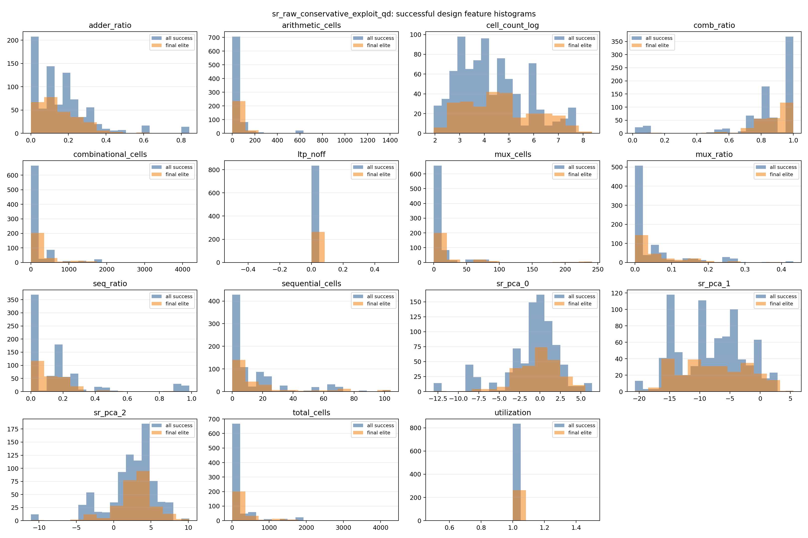
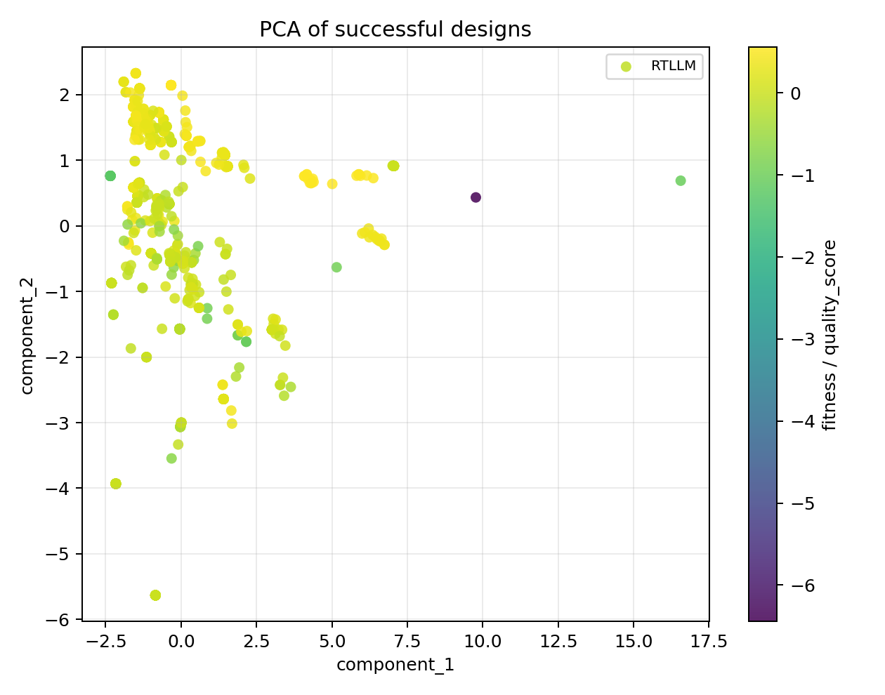

# QD Feature-Space Analysis

## Backend aggregate comparison

| Backend | Functionality | Synthesis | Solved | Best score | Runtime (s) | QD coverage | QD score |
| --- | ---: | ---: | ---: | ---: | ---: | ---: | ---: |
| classic_revolution | 53.4% | 45.3% | 31 | 0.2857 | 1633.1 | N/A | N/A |
| sr_raw_conservative_exploit_qd | 54.6% | 37.8% | 34 | 0.2524 | 1749.4 | 18.5% | 0.5304 |

## QD backend feature-space summary

### sr_raw_conservative_exploit_qd

- successful_candidates: `835`
- final_elites: `263`
- collapsed_features: `ltp_noff, utilization`
- near_collapsed_features: `ltp_noff, utilization`
- histogram: 
- PCA: 
- t-SNE: tsne_skipped

## Regression summary

### quality_score

- sample_count: `835`
- ridge_alpha: `100.0000`
- ridge_r2: `0.2871`
- top_coefficients:
  - `total_cells`: `-0.2301`
  - `combinational_cells`: `-0.2217`
  - `sequential_cells`: `-0.2050`
  - `sr_pca_0`: `-0.1973`
  - `mux_cells`: `0.1812`
  - `cell_count_log`: `0.1610`
  - `comb_ratio`: `0.1332`
  - `seq_ratio`: `-0.1332`
  - `arithmetic_cells`: `0.1024`
  - `sr_pca_1`: `0.1021`

### g_P

- sample_count: `835`
- ridge_alpha: `100.0000`
- ridge_r2: `0.5518`
- top_coefficients:
  - `sequential_cells`: `-0.2963`
  - `sr_pca_2`: `-0.2111`
  - `comb_ratio`: `0.2017`
  - `seq_ratio`: `-0.2017`
  - `arithmetic_cells`: `-0.2014`
  - `mux_cells`: `0.1366`
  - `adder_ratio`: `0.1303`
  - `mux_ratio`: `-0.0947`
  - `sr_pca_0`: `-0.0558`
  - `combinational_cells`: `0.0392`

### g_A

- sample_count: `835`
- ridge_alpha: `100.0000`
- ridge_r2: `0.1467`
- top_coefficients:
  - `arithmetic_cells`: `0.3703`
  - `combinational_cells`: `-0.3279`
  - `total_cells`: `-0.3271`
  - `mux_cells`: `0.2168`
  - `adder_ratio`: `0.0897`
  - `cell_count_log`: `0.0798`
  - `sequential_cells`: `-0.0520`
  - `mux_ratio`: `-0.0470`
  - `sr_pca_1`: `0.0320`
  - `comb_ratio`: `-0.0134`

### g_T

- sample_count: `835`
- ridge_alpha: `100.0000`
- ridge_r2: `0.0832`
- top_coefficients:
  - `cell_count_log`: `-0.1649`
  - `sr_pca_0`: `0.1474`
  - `sr_pca_1`: `-0.1452`
  - `arithmetic_cells`: `0.0823`
  - `mux_cells`: `0.0798`
  - `adder_ratio`: `0.0526`
  - `mux_ratio`: `-0.0453`
  - `seq_ratio`: `0.0263`
  - `comb_ratio`: `-0.0263`
  - `sequential_cells`: `0.0214`

## Recommended large profile

- selected_non_target_features: `seq_ratio, sequential_cells, comb_ratio, adder_ratio, mux_ratio, mux_cells, sr_pca_2`
- sequential_axes: `seq_ratio, sequential_cells, comb_ratio, adder_ratio, mux_ratio, mux_cells, sr_pca_2, g_P, g_A, g_T`
- combinational_axes: `seq_ratio, sequential_cells, comb_ratio, adder_ratio, mux_ratio, mux_cells, sr_pca_2, g_P, g_A`

## Warnings

- Generation log missing or unusable; using final_population_ppa_details only for classic_revolution/RTLLM/Prob010_radix2_div.
- Generation log missing or unusable; using final_population_ppa_details only for classic_revolution/RTLLM/Prob014_multi_pipe_4bit.
- Generation log missing or unusable; using final_population_ppa_details only for classic_revolution/RTLLM/Prob016_fixed_point_adder.
- Generation log missing or unusable; using final_population_ppa_details only for classic_revolution/RTLLM/Prob017_fixed_point_substractor.
- Generation log missing or unusable; using final_population_ppa_details only for classic_revolution/RTLLM/Prob022_ring_counter.
- Generation log missing or unusable; using final_population_ppa_details only for classic_revolution/RTLLM/Prob026_asyn_fifo.
- Generation log missing or unusable; using final_population_ppa_details only for classic_revolution/RTLLM/Prob028_LFSR.
- Generation log missing or unusable; using final_population_ppa_details only for classic_revolution/RTLLM/Prob029_barrel_shifter.
- Generation log missing or unusable; using final_population_ppa_details only for classic_revolution/RTLLM/Prob032_freq_divbyeven.
- Generation log missing or unusable; using final_population_ppa_details only for classic_revolution/RTLLM/Prob033_freq_divbyfrac.
- Generation log missing or unusable; using final_population_ppa_details only for classic_revolution/RTLLM/Prob034_freq_divbyodd.
- Generation log missing or unusable; using final_population_ppa_details only for classic_revolution/RTLLM/Prob038_pulse_detect.
- Generation log missing or unusable; using final_population_ppa_details only for classic_revolution/RTLLM/Prob039_serial2parallel.
- Generation log missing or unusable; using final_population_ppa_details only for classic_revolution/RTLLM/Prob042_width_8to16.
- Generation log missing or unusable; using final_population_ppa_details only for classic_revolution/RTLLM/Prob046_clkgenerator.
- Generation log missing or unusable; using final_population_ppa_details only for sr_raw_conservative_exploit_qd/RTLLM/Prob014_multi_pipe_4bit.
- Generation log missing or unusable; using final_population_ppa_details only for sr_raw_conservative_exploit_qd/RTLLM/Prob016_fixed_point_adder.
- Generation log missing or unusable; using final_population_ppa_details only for sr_raw_conservative_exploit_qd/RTLLM/Prob017_fixed_point_substractor.
- Generation log missing or unusable; using final_population_ppa_details only for sr_raw_conservative_exploit_qd/RTLLM/Prob022_ring_counter.
- Generation log missing or unusable; using final_population_ppa_details only for sr_raw_conservative_exploit_qd/RTLLM/Prob026_asyn_fifo.
- Generation log missing or unusable; using final_population_ppa_details only for sr_raw_conservative_exploit_qd/RTLLM/Prob028_LFSR.
- Generation log missing or unusable; using final_population_ppa_details only for sr_raw_conservative_exploit_qd/RTLLM/Prob032_freq_divbyeven.
- Generation log missing or unusable; using final_population_ppa_details only for sr_raw_conservative_exploit_qd/RTLLM/Prob033_freq_divbyfrac.
- Generation log missing or unusable; using final_population_ppa_details only for sr_raw_conservative_exploit_qd/RTLLM/Prob034_freq_divbyodd.
- Generation log missing or unusable; using final_population_ppa_details only for sr_raw_conservative_exploit_qd/RTLLM/Prob038_pulse_detect.
- Generation log missing or unusable; using final_population_ppa_details only for sr_raw_conservative_exploit_qd/RTLLM/Prob042_width_8to16.
- Generation log missing or unusable; using final_population_ppa_details only for sr_raw_conservative_exploit_qd/RTLLM/Prob046_clkgenerator.
