# Does Diversity Matter For RTL PPA Evolution?

Status: one-seed full RTLLM milestone landed on 2026-06-22 UTC.

Primary package:
`presentations/20260623_report/full_rtllm/`

Merged run root:
`exp/useful_bd_push/rtllm_milestone_full_20260622_142254_UTC/merged_ref_default_fix_v0`

## Executive Answer

Question 1: Does diversity matter?

Not proven yet by this milestone. The full RTLLM run gives a useful diagnostic
front-count signal, not a clean `useful_qd` proof: exact T26 preserves every
classic-covered design and produces more total PPA-front points (`69` versus
`61`) at the same one-seed, 12x3 budget. It also improves aggregate mean PPA
hypervolume by `0.010562` (+11.18%) and aggregate mean HV-AUC by `0.012397`
(+15.31%), but those aggregate wins depend on `Prob040_synchronizer`.

The current claim status is therefore `diagnostic`. Per-problem HV has `4` QD
wins, `15` QD losses, and `31` ties, so paired HV evidence is net-negative.
`Prob040_synchronizer` is also one of the repaired missing-reference problems;
without it, mean HV delta is `-0.009465` and mean HV-AUC delta is `-0.007588`.
QD also has lower valid-PPA yield (`879` versus `1056`), fewer unique PPA
points (`318` versus `352`), and a worse all-RTLLM mean `best_score`
(`-0.798824` versus `0.260455`). The defensible conclusion is that the T26
line deserves a controlled follow-up, not that QD has already beaten classic.

Question 2: Which diversity matters?

The current evidence supports the T26 implementation-response archive bundle,
not a descriptor-only causal claim. The useful pattern appears to be
implementation-response diversity coupled to quality-safe archive pressure. The
best current pattern is not "more novelty" by itself. It is a
synthesis-response raw descriptor/archive bundle that keeps champion-style hill
climbing active while using QD/MAP-Elites to preserve alternative
implementation responses. Lexical, identifier, random, overly sparse graph, and
unguarded local-Pareto diversity have repeatedly failed or produced yield loss
without enough PPA evidence.

## Definitions

This section gives the short reading definitions. The fuller audience glossary
is in `glossary.md`.

Behavior descriptor, or BD: a numeric summary used to place an RTL candidate
into a QD archive. A valid BD for this study cannot use final PPA, fitness,
hypervolume, Pareto rank, reference PPA, or test pass rate as an in-loop input.

QD/MAP-Elites: an optimization strategy that retains strong candidates across
multiple behavior regions instead of keeping only one globally best candidate.
Candidates are mapped into archive cells by their BD.

PPA: power, performance, and area. Area and power are always active in this
package. Effective clock period is active when the reference timing data is
available.

Valid functional PPA candidate: a generated candidate that reaches the
synthesis/PPA stage and contributes PPA metrics used by the Pareto analysis.
This is stricter than syntax pass and functionality pass alone.

Classic-covered problem: an RTLLM problem where the classic REvolution arm has
at least one valid functional PPA candidate under the same budget.

PPA-first retention gate: for this milestone, QD passes the hard gate if every
classic-covered problem also has at least one valid QD PPA candidate. Larger
functionality or valid-PPA rate drops are reported as yield warnings rather
than automatic blockers.

Yield warning: a functionality or valid-PPA count drop of at least 50% when the
classic denominator is at least 10. Smaller denominators are labeled small-n
because the rate is too sensitive to noise.

PPA hypervolume, or HV: the hypervolume of nondominated normalized improvement
points. Improvement is `(reference - candidate) / abs(reference)` for area,
power, and effective clock period when timing reference data exists, otherwise
area and power. Negative improvements are clipped to zero before hypervolume is
computed.

HV-AUC: the area under the PPA-HV-over-generations curve. It rewards earlier
discovery of useful front points, not only final population quality.

Best score: the run's scalar quality score for the best candidate. It is not
the primary QD metric, but it is a required sanity metric because a method can
show front-count or HV movement while still losing scalar PPA quality.

PPA-front point: a nondominated valid PPA candidate in the normalized
improvement space for one problem and method.

Unique PPA point: a deduplicated normalized PPA-improvement point. This catches
duplicate collapse even when many candidates are valid.

One-seed paired engineering evidence: a same-seed, same-budget comparison
across many problems. It can justify continuing or tuning a method, but it does
not prove seed-stable statistical significance.

## Retrospective Diversity Analysis

Before the full RTLLM T26 run, we ran a broad retrospective pass across prior
branches and copied worktree artifacts to test whether PPA clusters or PPA
distributions were already explained by simple diversity metrics. The largest
source was the ASP-DAC 2026 release archive under
`exp/diversity_check/aspdac2026_submission_source/`, especially the
`deepseek_clean_results`, `gpt-4.1-mini_clean_results`,
`llama3_clean_results`, and `llama3_baseline_clean_results` run roots. The
self-contained retrospective bundle is:

`docs/journal_features/revamp_history/20260621_000217_KST_rtl_diversity_check/20260621_150407_UTC_compiled_results_bundle/`

The presentation-local digest is in `retrospective/`. It includes source
tables, regenerated summary figures, a regeneration script, and visual
inspection notes.

### Retrospective Scope

| Source | Candidate rows | Valid PPA artifacts | Why it matters |
| --- | ---: | ---: | --- |
| ASP-DAC release | 170057 | 90058 | Largest retrospective source; includes RTLLM and VerilogEval-Spec-to-RTL runs from DeepSeek, GPT-4.1-mini, and Llama-family roots. |
| Auto-BD controls | 23400 | 10343 | Prior paired QD/control evidence for random, Yosys-stat, ST-NOD, synthesis-response, and VQ descriptors. |
| RTLLM gen-20 | 10413 | 2335 | Older broad RTLLM REvolution corpus with generation history and motif vectors. |

The table uses the retrospective `candidate_count` convention from
`corpus_coverage.csv`. The ASP-DAC source also records `170131` code
artifacts; that is an artifact-count convention difference, not a different
experiment.

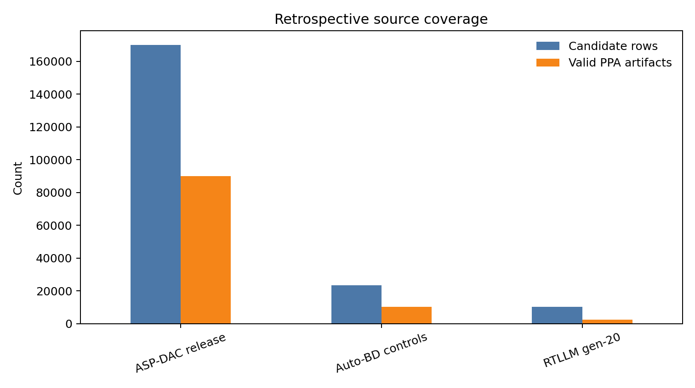

### What The Retrospective Asked

The retrospective was not a live QD run. It asked whether existing RTL/netlist
style regions, lexical distances, motif descriptors, Qwen embeddings,
DeepGate-style graph embeddings, or AURORA-style learned bottlenecks could
explain or reconstruct useful PPA-front structure after candidates had already
been generated.

Retrospective terms:

| Term | Definition |
| --- | --- |
| Oracle replay | A post-hoc retention policy that chooses from an already generated candidate pool to test whether a diversity rule would have retained useful points. |
| Common audit | A fixed post-hoc descriptor and metric surface used to compare candidates without changing the original generation process. |
| Motif/style/lexical oracle | A replay policy that prioritizes structural motif spread, RTL style-cluster spread, or lexical distance after candidates already exist. |
| DeepGate3/AIG | A graph-encoder path over And-Inverter Graph representations of synthesized logic. |
| AURORA-style linear AE | An unsupervised bottleneck over implementation-side features with PPA fields excluded from the encoder inputs. |

| Gate | Result | Main evidence | Interpretation |
| --- | --- | --- | --- |
| D1 early diversity predicts final PPA | FAIL | Early lexical distance vs final HV had `rho=0.300`, but only as uncontrolled single-run problem-level evidence. | Weak post-hoc signal, not a controlled predictor. |
| D2 clusters explain PPA front | FAIL | `48.8%` of valid-PPA groups had multi-cluster fronts; shuffled labels reached `56.0%`. | Style clusters were not better than label randomization for front explanation. |
| D3 diversity replay beats fitness | FAIL | Best diversity replay improved HV by `1.35%` over best-fitness retention. | Too small for the old strong utility threshold and not enough to promote a method. |
| D4 live intervention | NOT RUN | No prospective intervention was launched in the retrospective goal. | Retrospective evidence alone could not justify an active claim. |
| D5 descriptors beat controls | FAIL | 20260618 Auto-BD controls did not show robust PPA uplift over classic/manual baselines. | More descriptor capacity did not fix yield/PPA robustness. |
| D6 interpretable regions | PASS | Style regions such as arithmetic, control, mux, wire, and sequential RTL were stable enough to describe. | Diversity is measurable and interpretable, but only as illumination. |

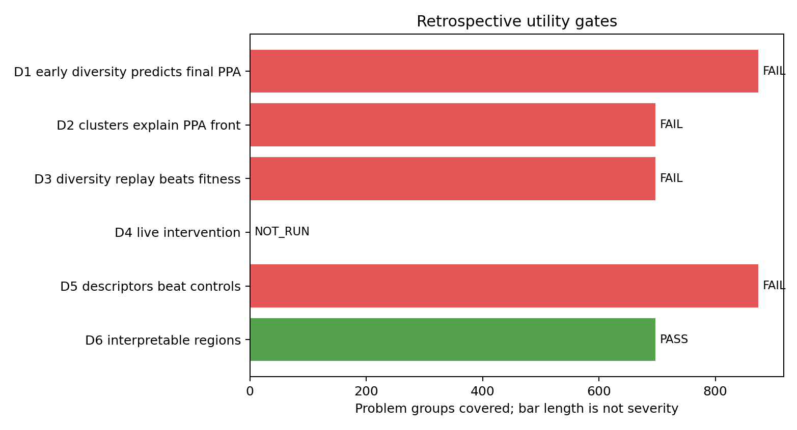

### PPA Cluster And Replay Findings

The clearest failure mode is visible in the replay table: style diversity can
retain more style regions, but the HV improvement over best-fitness retention
is tiny.

| Replay policy | Mean HV | Mean style clusters | Takeaway |
| --- | ---: | ---: | --- |
| Motif diversity oracle | 0.042866 | 1.472 | Best replay HV, but only `1.35%` over best-fitness oracle. |
| Style diversity oracle | 0.042432 | 2.677 | Much broader style coverage without meaningful HV gain. |
| Lexical diversity oracle | 0.042303 | 2.545 | Similar HV to best fitness despite more lexical spread. |
| Best-fitness oracle | 0.042294 | 1.462 | Hard to beat retrospectively because fitness already preserves useful points. |
| Random mean | 0.030529 | 1.717 | Random retention is clearly worse, so the replay is not vacuous. |

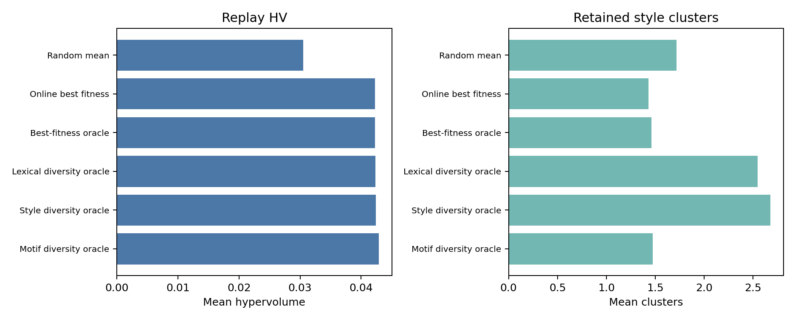

The case-study plot below shows why the old cluster story was useful but
insufficient. It is a two-dimensional area-power projection of a PPA front
computed in the active PPA space, so timing can make some projected front
points look dominated in 2D. The plot applies tiny deterministic marker
offsets only to separate overlapping style markers. In an RTLLM example,
multiple implementation styles appear on the projected front, but no single
style cleanly explains the front. That supports an illumination claim, not a
causal descriptor claim.

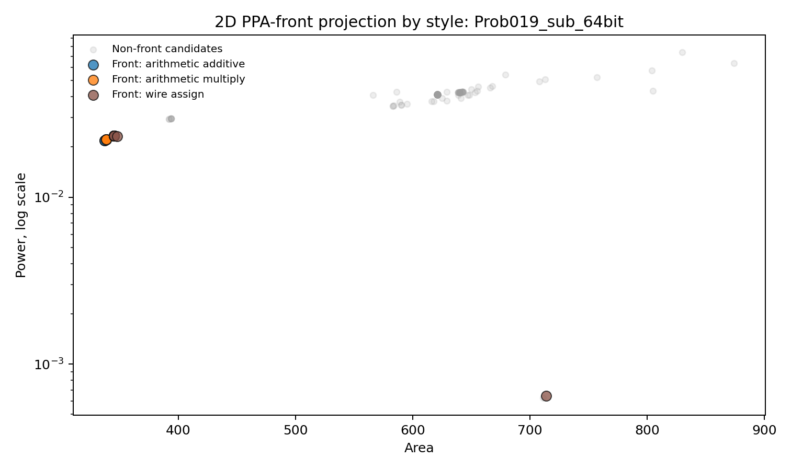

The early-diversity scatter tells the same story at problem level: the
association exists, but it is weak and noisy.

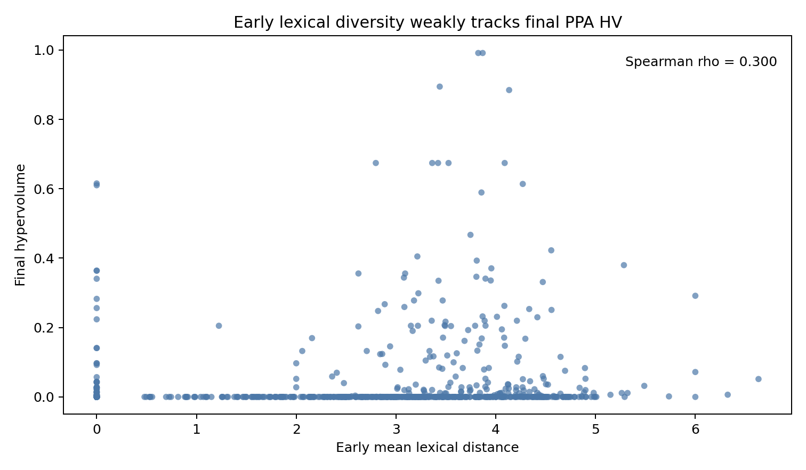

### Encoder And Learned-BD Retrospective

The restart also escalated beyond simple lexical/style clusters.

| Encoder family | Evidence | Retrospective decision |
| --- | --- | --- |
| Qwen3 embedding | Common-audit replay ranked `768` candidates, covering `682` valid-PPA rows across `114` valid-PPA replay groups. Identifier-normalized Qwen gained `3.35%` HV versus lexical farthest; raw Qwen lost `1.25%`. Fitness-top retention was similarly positive, so the result is not embedding-specific. | Diagnostic only; useful for later preprocessing studies, but not a promotion gate pass. |
| DeepGate3/AIG | AIG export and tokenizer probes ran, but the bounded tokenizer path produced only `3` nontrivial embeddings with cosine mean near `0.999971`. | No-proceed in that form; sequential/latch handling and collapse remained blockers. |
| AURORA-style linear AE | AE2/AE3 and richer AE8/AE16 bottlenecks excluded PPA fields and used problem splits, but held-out HV/Pareto gains were near-zero, mixed, or negative. | Diagnostic only; no finetuning or in-loop learned BD claim justified. |

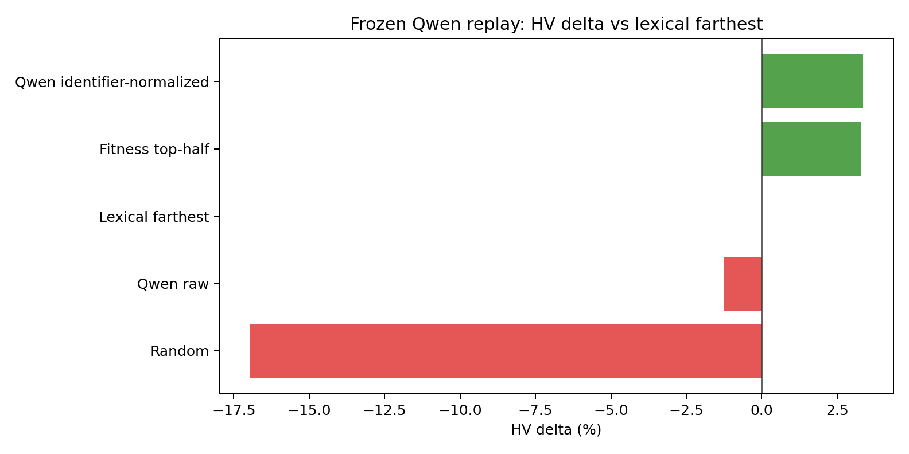

### Retrospective Conclusion For The Current Claim

The retrospective answer to Question 1 was negative: generic implementation
diversity was measurable, but did not by itself explain or improve PPA quality
under the old post-hoc gates. That is why the current presentation should not
claim that arbitrary diversity matters.

The retrospective answer to Question 2 was also restrictive: lexical/style
clusters, raw random descriptors, generic learned bottlenecks, and collapsed
graph embeddings were not enough. The current positive T26 result is therefore
better framed as a prospective matched-budget test of a specific
implementation-response archive bundle with quality pressure. The retrospective
evidence is the reason this report avoids descriptor-only causality and
family-breadth overclaims.

## Full RTLLM Protocol

The comparison used all 50 RTLLM problems from
`bench/RTLLM/*_prompt.txt`, seed `1001`, population `12`, generations `3`, and
`openai/gpt-oss-120b` on the local vLLM endpoint with 128k token budgets.

Classic arm:
`classic_revolution` with `eoh_strategies`.

QD arm:
exact T26, `sr_raw_conservative_exploit_qd`, with grid-quantile
synthesis-response raw (SR raw) descriptors, Pareto-front archive cells,
`qd_fill_target_fraction=0.25`, `qd_improve_backfill_fraction=0.20`,
`qd_champion_lane_fraction=0.80`, NSGA-II global-rank parent selection, and
two-parent fusion disabled.

Exact T26 was selected before seeing full RTLLM results. The screen favored it
because it was the only screened QD arm with positive mean HV and it improved
HV-AUC, despite visible yield warnings on the development screen. The full
run therefore evaluates the selected T26 bundle; it does not isolate whether
the descriptor, archive policy, or champion-biased exploitation is the sole
cause of the gain.

## Result Summary

| Cohort | Metric | Classic | Exact T26 QD | Delta |
| --- | ---: | ---: | ---: | ---: |
| All RTLLM | Mean HV | 0.094435 | 0.104997 | +0.010562 |
| All RTLLM | Mean HV-AUC | 0.080956 | 0.093353 | +0.012397 |
| All RTLLM | Mean best score | 0.260455 | -0.798824 | -1.059279 |
| All RTLLM | Valid PPA | 1056 | 879 | -177 |
| All RTLLM | PPA-front points | 61 | 69 | +8 |
| All RTLLM | Unique PPA points | 352 | 318 | -34 |
| Prob040-excluded | Mean HV | 0.096362 | 0.086897 | -0.009465 |
| Prob040-excluded | Mean HV-AUC | 0.082608 | 0.075020 | -0.007588 |
| Prob040-excluded | Mean best score | 0.268348 | 0.252416 | -0.015932 |
| Screen-excluded | Mean HV | 0.088690 | 0.103015 | +0.014325 |
| Screen-excluded | Mean HV-AUC | 0.075581 | 0.093051 | +0.017470 |
| Screen-excluded | Valid PPA | 989 | 845 | -144 |
| Screen-excluded | PPA-front points | 52 | 62 | +10 |
| Screen+Prob040-excluded | Mean HV | 0.090618 | 0.083691 | -0.006927 |
| Screen+Prob040-excluded | Mean HV-AUC | 0.077224 | 0.073516 | -0.003708 |
| Screen+Prob040-excluded | Valid PPA | 941 | 813 | -128 |
| Screen+Prob040-excluded | PPA-front points | 52 | 61 | +9 |

`Screen-excluded` removes the development screen, but it still includes
defaulted-reference `Prob040_synchronizer`. The
`Screen+Prob040-excluded` rows are the safer non-defaulted caveat view: QD
keeps a front-point lead there, but the HV and HV-AUC deltas become negative.

Budget parity:

- generated candidates: classic `2400`, exact T26 QD `2400`;
- LLM API calls: classic `4801`, exact T26 QD `4800`;
- mean LLM API calls per problem: classic `96.02`, exact T26 QD `96.00`;
- total runtime seconds from per-problem summaries: classic `83328.147096`,
  exact T26 QD `84516.206077`.

The exact table is in `full_rtllm/tables/full_budget_parity.csv`.

Retention gate:

- hard retention failures: `0`;
- yield warnings: `4`;
- small-n labels: `6`;
- `Prob006_adder_pipe_64bit` has no valid PPA in either arm, so it is not a
  classic-covered loss.

Yield warnings are concentrated on `Prob041_traffic_light`, `Prob043_RAM`,
`Prob044_ROM`, and `Prob045_alu`. These warnings matter, but they no longer
invalidate the method under the relaxed PPA-first policy because exact T26 keeps
at least one valid PPA sample on every classic-covered problem.

Primary full-run figures:

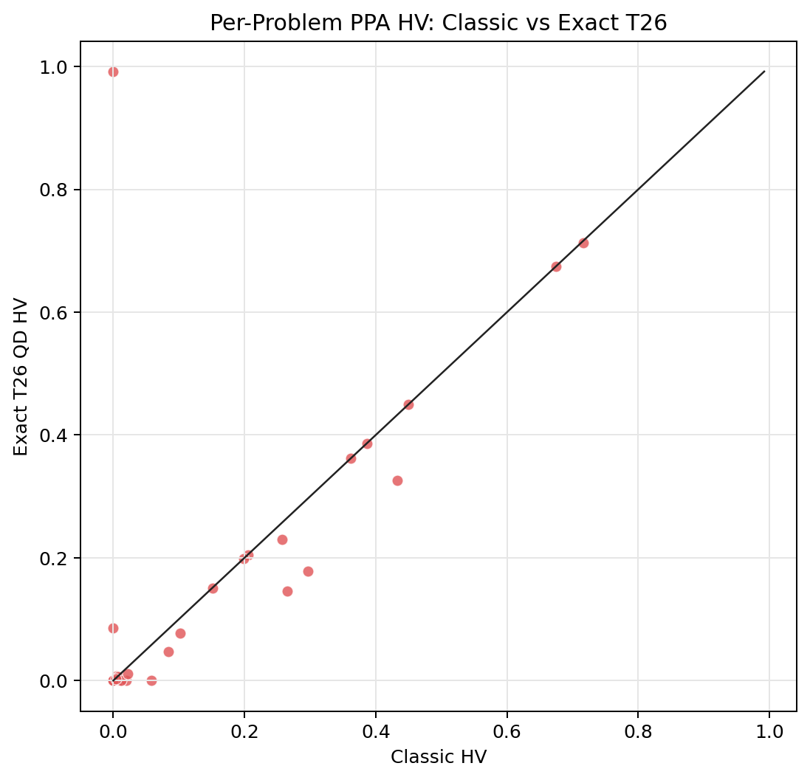

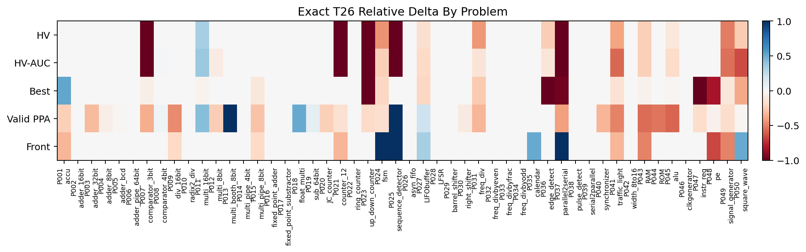

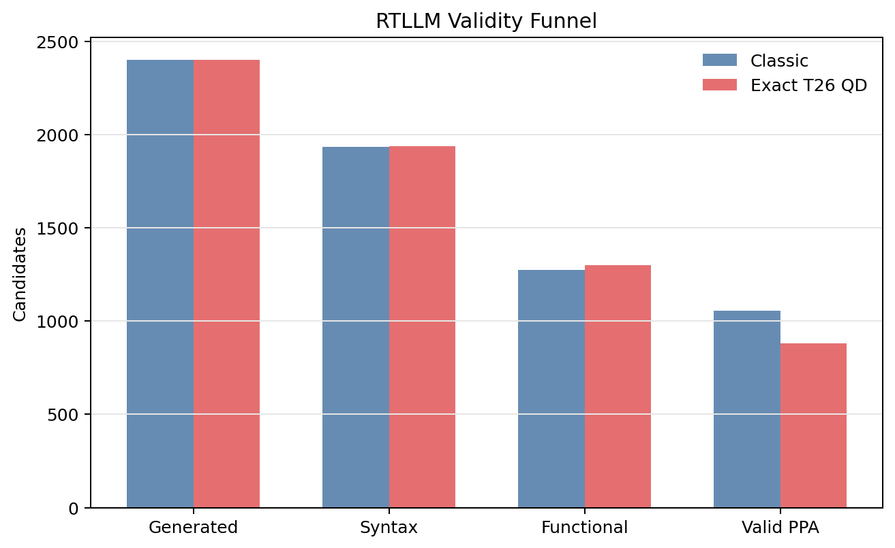

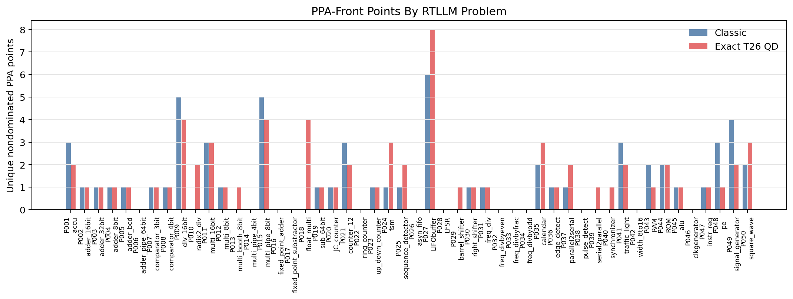

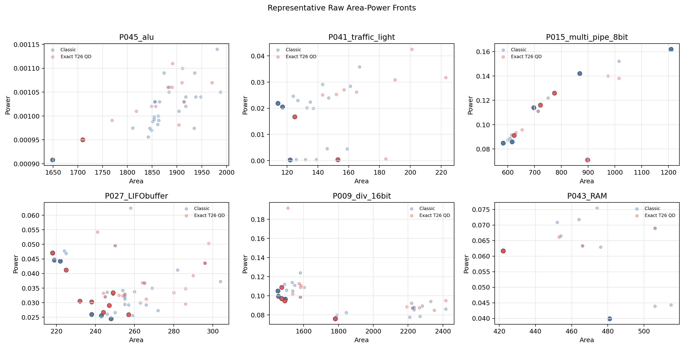

## Evidence Interpretation

The result argues for a narrower position: T26-style QD is still worth a
controlled follow-up, but this package is not a clean positive QD proof. Exact
T26 can add PPA-front points without losing design-level coverage, yet it loses
paired HV on more problems than it wins and it loses the scalar best-score
metric.

The aggregate HV/HV-AUC win is outlier-sensitive. `Prob040_synchronizer`
contributes the largest positive HV delta, is one of the repaired
missing-reference problems, and uses a defaulted reference rather than a
benchmark-provided PPA reference. That makes it unsuitable as the sole carrier
of an affirmative QD claim. The negative screen subset, lower raw valid-PPA
yield, fewer audited PPA-point rows, worse all-RTLLM best score, and
outlier-sensitive HV mean show that the method still needs tuning.
The full-suite family audit resolves part of the earlier T28-screen caveat:
using a synthesized standard-cell count signature as a family proxy, exact T26
has more active-front family-proxy hits and front netlists (`69` versus `61`),
plus fewer family-proxy duplicates (`7` versus `11`). It still has fewer
summed family proxies (`311` versus `341`) and fewer reference-beating family
proxies (`129` versus `179`), so this package supports a front-material proxy
observation, not broad implementation-family dominance.
Because the front family ratio is `1.0` in both arms, the `69` versus `61`
front-family and front-netlist counts are not independent evidence beyond the
front-point count. Their value is to reject a duplicate-collapse explanation,
not to create a separate corroborating win.
The most useful next variants should preserve the PPA-front gains while
reducing yield loss and avoiding reliance on a single large-problem win.

The most promising technical direction remains T26/T26.1-style conservative
exploit pressure: keep the QD archive, but bias sampling toward archive
champions and near-front candidates so the method can hill-climb without
collapsing into average-fitness-only REvolution.

## Provenance And Repair Notes

The original exact T26 full run produced 47 usable problem summaries. Three
problems, `Prob013_multi_booth_8bit`, `Prob018_float_multi`, and
`Prob040_synchronizer`, exposed missing-reference PPA handling in RTLLM. The
code was fixed to use the documented high default reference when a benchmark
PPA file is absent, then those three problems were rerun in
`sr_raw_conservative_exploit_qd_ref_default_fix`.

The committed package uses a merged symlink root so the 47 original QD problem
directories remain unchanged and only the three repaired problem directories
come from the repair run. This keeps the result auditable while allowing the
full 50-problem package to be generated.

## Artifact Index

- `full_rtllm/README.md`: generated package summary.
- `full_rtllm/tables/full_problem_metrics.csv`: one row per method/problem.
- `full_rtllm/tables/full_aggregate_metrics.csv`: all, screen, and
  screen-excluded aggregate metrics.
- `full_rtllm/tables/full_comparison_deltas.csv`: paired QD-minus-classic
  deltas.
- `full_rtllm/tables/full_validity_gates.csv`: retention, warning, and small-n
  labels.
- `full_rtllm/tables/full_budget_parity.csv`: runtime, LLM-call, token, and
  generated-candidate parity.
- `full_rtllm/data/full_ppa_candidates.csv`: raw candidate-level PPA data for
  regenerating the direct PPA-front figures.
- `full_rtllm/figures/`: generated PNG figures.
- `full_rtllm/figures/visual_inspection_notes.md`: manual visual inspection
  notes for the generated figures.
- `full_rtllm/visualizations/qd_ppa_viewer/`: full Phase 03.1 linked
  archive/PPA viewer with `37` valid-PPA RTLLM datasets, `manifest.json`,
  `validation.json`, Playwright screenshots, and `screenshot.png`.
- `full_rtllm/visualizations/direct_ppa_pareto/`: static raw area-power
  PPA-front supplement for reader-facing inspection.
- `full_rtllm/family_audit/`: full-suite canonical RTL/netlist/family-proxy
  duplicate audit with candidate rows, per-problem metrics, aggregate deltas,
  and figures.

The Phase 03.1 viewer covers the `37` RTLLM problems with candidate-level
valid PPA data. The other `13` RTLLM problems remain in the 50-problem
aggregate tables but are omitted from the viewer because there is no PPA point
to draw. Classic samples were projected into the T26 archive using the frozen
SR raw PCA artifact from the 20260618 Auto-BD run, with `352/352` classic rows
projected and `0` failures. Strict validator status: `passed`.

The family audit uses the same canonical RTL/netlist/family-proxy definitions
as the T28 audit: normalized RTL hash, normalized synthesized netlist hash,
and a synthesized standard-cell count signature. The family signature is the
`CELL_TYPE:COUNT` terms sorted by cell type and joined with `|`; the
family-proxy hash is SHA-256 of that signature. It shows that exact T26 QD
improves active-front proxy material: `69` front family-proxy hits and `69`
front netlists versus classic's `61` and `61`. It also keeps the
quality/yield caveat visible: exact T26 has fewer audited deduplicated
PPA-point rows (`318` versus `352`) and fewer reference-beating family-proxy
hits (`129` versus `179`).

## Journal Contract Alignment

The accepted `docs/journal_features/journal_narrative.md` contract controls
final TCAD claims. This package does not satisfy that final contract: it is
one seed, does not label the frozen 13-problem tuning plus 20-problem held-out
RTLLM split, does not run the penalized cluster-bootstrap/sign-test gates, and
includes repaired/default-reference problems that cannot carry a held-out
reference-normalized headline.

The detailed mapping is in `journal_contract_alignment.md`. The short rule is:
use this package as diagnostic evidence for method triage and presentation
discussion, not as Branch A/B/C final evidence.

## Conclusion

The full one-seed RTLLM milestone answers the two core questions with bounded
diagnostic evidence. It does not prove that diversity already improves RTL PPA
over classic REvolution. It does show that the best remaining diversity path is
not generic novelty; it is the T26 implementation-response archive bundle with
quality pressure.

For the presentation, the defensible message is:
exact T26 preserves every classic-covered problem and adds front points under
matched generated-candidate and LLM-call budgets, but it does not yet pass the
paired-PPA or scalar-quality burden for a positive QD claim. The honest caveat
is that the aggregate HV gain is one-seed, outlier-sensitive, and negative
without `Prob040_synchronizer`, with visible raw-yield loss, fewer audited
PPA-point rows, fewer total family-proxy hits, fewer reference-beating
family-proxy hits, and worse all-RTLLM best score. The next milestone should be
multi-seed replication plus T26.1-style variants that target yield recovery,
non-defaulted-reference evidence, and less outlier-dependent front improvement.
