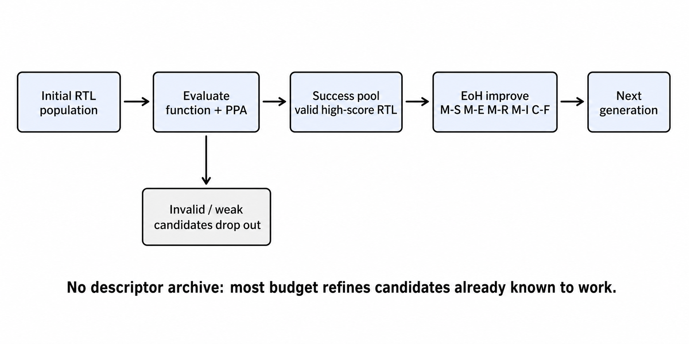
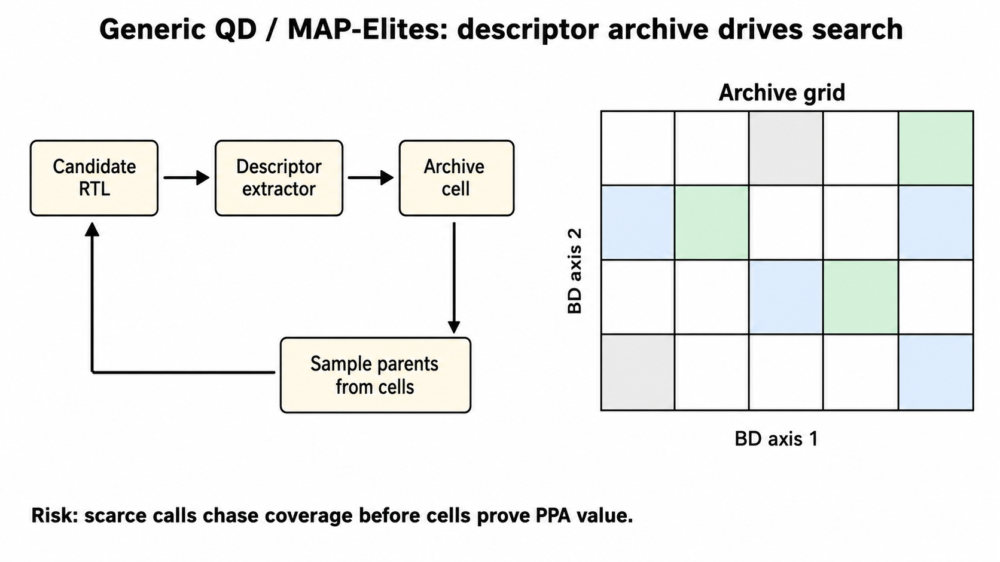
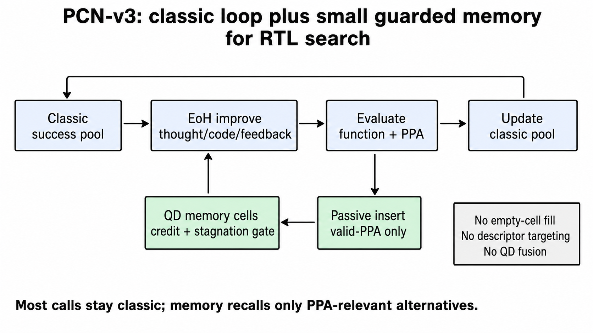

# Appendix: Method Mechanics

This appendix is intentionally more detailed than the main deck. It is meant
to support technical questions about exactly what each method was testing.

## Methodology Flow Diagrams

These imagegen-generated flow diagrams are visual aids only. The exact method
rules are in the text sections below.

### Classic REvolution Loop



Classic REvolution concentrates budget on valid successful candidates and uses
EoH operators to iteratively improve or fuse them.

### Generic QD / MAP-Elites Archive



Generic QD/MAP-Elites places candidates into descriptor cells and can spend
scarce budget on archive coverage before cells have proven PPA-front value.

### PCN-v3 Guarded Memory



PCN-v3 keeps the classic REvolution loop dominant and uses descriptor memory
as a small guarded sidecar for selected valid/PPA-relevant alternatives.

## Acronym And Term Glossary

This section defines the shorthand used in the presentation.

- **REvolution**: the baseline LLM-driven evolutionary RTL optimizer. It keeps
  candidate thoughts, Verilog code, feedback, evaluation status, PPA metrics,
  and operator metadata. In the conference-style baseline, parent selection is
  mostly driven by scalar quality/fitness.
- **EoH operators**: the evolution-of-heuristics style operator stack used by
  classic REvolution. In this codebase the success operators are `M-S`
  simplify, `M-E` explore, `M-R` refactor, `M-I` improve, and `C-F`
  crossover-fusion. Failure-side repair also has `M-F`.
- **thought/code/feedback individual**: the candidate representation where a
  solution is not just Verilog text. It carries the model's design rationale,
  the emitted code, and evaluator feedback into the next mutation prompt.
- **single_thought_operator**: an experimental simplified operator that bypasses
  the EoH operator stack and asks for a single unified improvement. The
  20260629 QD suite used this path for many QD arms, which later became a major
  confound.
- **QD**: quality diversity. A search family that tries to keep high-quality
  candidates across different behavior-descriptor regions, not only the single
  best scalar-fitness candidate.
- **MAP-Elites**: a common QD algorithm. It discretizes a behavior descriptor
  space into cells and keeps an elite candidate per cell or a few elites per
  cell.
- **BD**: behavior descriptor. A vector that determines where a candidate goes
  in the archive. In these experiments the descriptor must not use final PPA,
  reference PPA, pass rate, hypervolume, Pareto rank, or problem identity.
- **Archive cell / memory cell**: one bucket in descriptor space. The generic QD
  arms use these cells as the main archive. PCN uses them as an auxiliary memory
  beside the classic success pool.
- **Memory**: not neural memory and not a language-model context cache. Here it
  means a descriptor-indexed archive of evaluated valid-PPA candidates, plus
  small statistics that decide whether a cell is worth sampling later.
- **PCN-v3**: project shorthand for the Pareto-competitive novelty/memory
  variant implemented as `pcn_classic_preserving_memory`. The important idea is
  not the name; it is the policy: keep classic REvolution dominant, passively
  remember PPA-competitive alternative families, and spend only a small guarded
  lane on memory refinement.
- **RF**: random forest. In the MasterRTL/RF lane this refers to the saved
  random-forest timing model state loaded from MasterRTL artifacts, not a new
  neural encoder.
- **Leaf ID**: a random-forest tree leaf reached by a candidate's timing-path
  feature vector. A candidate can touch many paths and many trees, so the
  descriptor summarizes how many unique leaf regions or leaf rows the candidate
  reaches. This is a learned model-state descriptor, not the scalar timing
  prediction itself.
- **Canonical RTL**: normalized RTL text used before Qwen embedding. The repo
  hook strips comments, role-normalizes identifiers such as inputs/outputs/wires
  into stable placeholder names, compacts whitespace, and emits a stable text
  form. This reduces sensitivity to arbitrary variable names and formatting.
- **PCA / PC3 / PCA3**: principal-component projection. The high-dimensional
  embedding is projected into a frozen low-dimensional coordinate system, often
  the first three principal-component axes.
- **MasterRTL-style SOG**: a source/operator graph built from Verilog through
  the MasterRTL parsing path. The local extractor uses this to count graph
  keys, graph edges, operators, DFF bits, mux operators, XOR operators, and
  branching/control structure.
- **RTLTimer-style features**: timing-structure proxies extracted from an RTL
  synthesis/timing-oriented path, such as wire density, DFF density, assign
  counts, and DFF references. In this deck, these are RTL-native descriptor
  signals, not final post-route timing.
- **DeepGate-style pooled descriptor**: a netlist/graph descriptor produced by
  the isolated DeepGate bridge and then projected into frozen principal
  components. It should not be overclaimed as a full DeepGate3 reproduction
  unless a separate checkpoint/schema validation proves that.
- **AURORA-style compact descriptor**: an automatic/learned-descriptor
  representative using compact implementation-structure axes. In this package
  it is not a pretrained AURORA checkpoint claim.

## Common Evaluation Contract

All compared RTLLM runs use:

- benchmark family: RTLLM;
- population size: `8`;
- generations: `5`;
- model: `openai/gpt-oss-120b`;
- evaluation: `strict_ablation`;
- repair: disabled;
- headline subset: 46 RTLLM designs with valid reference `ppa.txt`;
- missing candidate PPA: counted as invalid for that method.

The main PPA metrics are:

- final HV over nondominated normalized PPA improvements;
- HV-AUC over generations;
- valid-PPA coverage;
- Pareto/front point count;
- reference-beating candidate count.

## Descriptor Feature Glossary

The appendix uses several descriptor axes repeatedly.

### Qwen Canonical RTL PCA Axes

The Qwen descriptor uses candidate source text, but it first canonicalizes the
text:

1. Remove line and block comments.
2. Discover declared port and net roles.
3. Replace user identifiers with role-stable placeholders, for example input
   names become stable input placeholders and wires become stable wire
   placeholders.
4. Normalize whitespace and statement boundaries.
5. Embed the canonical text with `Qwen/Qwen3-Embedding-0.6B`.
6. Subtract the frozen projection mean and multiply by frozen PCA components.

The archive receives `qwen_pc0`, `qwen_pc1`, and `qwen_pc2`. These axes are
text/code embedding directions, not PPA objectives.

### MasterRTL / RTLTimer / RF Timing State Axes

The source-aligned evaluator builds hardware-native metrics in three groups.

MasterRTL-style structural metrics:

- `source_aligned_masterrtl_graph_keys`: number of graph keys in the parsed
  source/operator graph.
- `source_aligned_masterrtl_graph_edges`: graph-edge count.
- `source_aligned_masterrtl_branching`: `graph_edges / graph_keys`; a proxy for
  dependency/control branching density.
- `source_aligned_masterrtl_seq_fraction`: DFF bits divided by DFF bits plus
  operator count.
- `source_aligned_masterrtl_mux_fraction`: mux/conditional operators divided
  by total operator count.
- `source_aligned_masterrtl_xor_fraction`: XOR operators divided by total
  operator count.

RTLTimer-style structure metrics:

- `source_aligned_rtltimer_wire_density`: wire declarations divided by
  line-count in the cleaned RTLTimer/Yosys output.
- `source_aligned_rtltimer_dff_density`: DFF references divided by line-count.
- `source_aligned_rtltimer_assigns`, `source_aligned_rtltimer_wires`, and
  `source_aligned_rtltimer_dff_refs`: raw count features used for diagnostics
  or derived densities.

RF timing-state metrics:

- `source_aligned_rf_timing_path_count`: number of timing-path feature rows
  extracted from the MasterRTL timing preprocessing path.
- `source_aligned_rf_timing_leaf_rows`: number of unique random-forest leaf
  row patterns reached by those paths.
- `source_aligned_rf_timing_leaf_ids`: number of unique individual tree leaves
  reached across paths and trees.
- `source_aligned_rf_timing_prediction_mean`: mean timing prediction produced
  by the RF model. The PCN/QD descriptor uses leaf/model-state information, not
  this scalar prediction as an optimization objective.

### Implementation-Level Structural Features

The AURORA-style compact arm uses implementation-structure axes from the repo's
descriptor profile, especially:

- `comb_ratio`: fraction of implementation cells classified as combinational.
- `adder_ratio`: fraction of implementation cells classified as adders.
- `cell_count_log`: log-scaled total cell count.

These are compact structural descriptors intended to separate implementation
families. They are not a pretrained AURORA model output in this package.

### Archive And Cell Retention Terms

- **Scalar elite**: one best candidate per cell by scalar quality.
- **Pareto slot / front slot**: a local nondominated or near-front candidate
  kept because it represents a tradeoff, even if it is not the scalar champion.
- **Cell credit**: a score that increases when a cell produces valid-PPA or
  front-relevant offspring. PCN uses credit to avoid spending budget on cells
  that are merely descriptor-novel.
- **Stagnation trigger**: PCN waits until the main search has enough evidence,
  enough valid-PPA material, and limited recent front/best-score improvement
  before using the memory-refine lane.

## Classic REvolution

Classic REvolution is the baseline optimizer.

Step by step:

1. Generate an initial population of RTL candidates.
2. Evaluate each candidate for functionality and PPA.
3. Keep successful candidates in a success pool.
4. Select parents from that success pool.
5. Apply EoH-style mutation/improvement operators.
6. Preserve the thought/code/feedback individual formulation.
7. Evaluate offspring.
8. Update the success pool with strong valid candidates.
9. Repeat for the fixed generation budget.

The success-pool operators are:

- `M-S`: simplify a successful parent while preserving behavior.
- `M-E`: explore a substantially different implementation idea from a
  successful parent.
- `M-R`: refactor a successful parent while preserving its intent.
- `M-I`: improve a successful parent for correctness and/or PPA.
- `C-F`: fuse two successful parents. This is the operator later isolated by
  the C-F ablation.

The baseline has no behavior-descriptor archive. It does not ask "which
descriptor cell is underfilled?" It asks which existing valid candidates should
be mutated or fused next.

Why it is strong:

- It optimizes the actual scalar reward/PPA signal immediately.
- It spends little budget filling descriptor cells.
- It naturally concentrates on valid-producing regions.
- Its EoH operators are stronger than the later experimental
  `single_thought_operator` path.

Limitation:

- The success pool is primarily scalar-quality driven.
- It does not intentionally preserve alternative PPA tradeoff families unless
  those alternatives also score well.

## Generic QD/MAP-Elites Template

Generic QD adds a behavior descriptor and archive.

Step by step:

1. Generate and evaluate a candidate.
2. Extract a descriptor from RTL, netlist, graph, embedding, or structural
   features.
3. Map the descriptor to an archive cell.
4. Retain one or more elites in the cell.
5. Use archive cells as parent sources.
6. Rank quality by PPA objectives.
7. Report final search quality by PPA fronts, not archive occupancy alone.

In this project, the generic QD recipe usually has three distinct components:

1. **Descriptor extractor**: computes axes such as Qwen PCs, DeepGate PCs,
   MasterRTL structural fractions, or RF leaf-state counts.
2. **Archive policy**: bins candidates into grid cells and keeps one or more
   elites per cell.
3. **Parent scheduler**: decides how often live LLM calls come from the archive
   instead of the classic success/fail pools.

The core scientific question is whether the descriptor cells correspond to
useful RTL implementation families. A cell that is novel but invalid-heavy, or
novel but far from the PPA front, is not useful for this task.

Core problem observed here:

- Descriptor diversity does not guarantee valid RTL.
- Archive sampling can displace classic hill climbing.
- Under a small evaluation budget, archive fill costs are expensive.
Therefore, archive occupancy and QD score are diagnostic metrics only. The
headline question is still final PPA-front quality: HV, HV-AUC, valid-PPA
coverage, Pareto/front points, and reference-beating candidates.

## 20260629 QD Arms

The 20260629 suite tested a broad set of descriptors and archive schedules.
The run is important because it was the first broad full RTLLM comparison, but
it is also confounded because the QD arms used `single_thought_operator`.

### Qwen3 Canonical RTL PCA3

Purpose:

- Test pretrained text/code embeddings as behavior descriptors.

Mechanics:

1. Canonicalize candidate RTL.
2. Embed RTL text with Qwen3.
3. Project the embedding to a frozen PCA3 descriptor.
4. Place candidates into QD cells using those axes.
5. Use PPA for quality ranking, not descriptor construction.

More concretely:

- The live code calls `canonical_qwen_rtl()`, which strips comments,
  role-normalizes identifiers, normalizes whitespace, and produces stable RTL
  text.
- The embedding model is identified by the frozen projection artifact; the
  observed artifact uses `Qwen/Qwen3-Embedding-0.6B`.
- The descriptor profile uses the first three projected axes:
  `qwen_pc0`, `qwen_pc1`, and `qwen_pc2`.
- Each axis is binned into the archive grid. These coordinates decide only the
  cell placement.
- Candidate quality inside cells is still judged by PPA-derived objectives.

Why "canonical" matters:

- If two candidates differ only by local signal names or formatting, a raw text
  embedding might treat them as different.
- Canonicalization tries to make the embedding focus more on RTL structure and
  less on superficial identifier choices.

What it does not mean:

- It does not prove semantic equivalence.
- It does not canonicalize through synthesis.
- It does not use final PPA or reference PPA.

Result:

- 43.1% mean-HV retention in 20260629.
- Improved to 89.5% in the corrected 20260630 EoH run, but still trailed
  classic.

### MasterRTL RF Leaf-ID Structural

Purpose:

- Test RTL-native, source-aligned model-state descriptors.

Mechanics:

1. Extract MasterRTL/RTLTimer-inspired structural signals.
2. Use RF timing leaf IDs and structural axes such as branching and wire
   density.
3. Use those axes to define archive cells.
4. Retain PPA-quality elites inside cells.

Detailed extraction path:

1. Use Yosys to normalize candidate RTL into a form accepted by the
   MasterRTL-style `vlg2ir` analyzer.
2. Run the MasterRTL analyzer to create source/operator graph pickle artifacts.
3. Count structural properties of that graph:
   - graph nodes/keys;
   - graph edges;
   - active operators;
   - DFF bits;
   - mux/conditional operators;
   - XOR operators.
4. Run the RTLTimer-style Yosys path and count cleaned Verilog structure:
   - lines;
   - assigns;
   - wires;
   - DFF references.
5. When RF timing is enabled, load `rfr_model.pkl` and run MasterRTL timing
   preprocessing to create path feature rows.
6. Pass those timing-path rows through the random forest and record leaf-state
   summaries:
   - `unique_leaf_rows`;
   - `unique_leaf_ids`;
   - path count;
   - no-path flag;
   - mean timing prediction for diagnostics.

The primary PCN/QD axes are:

```text
source_aligned_rf_timing_leaf_ids
source_aligned_masterrtl_branching
source_aligned_rtltimer_wire_density
```

Axis meanings:

- `source_aligned_rf_timing_leaf_ids`: how many distinct RF timing-model leaf
  regions the candidate's timing paths touch. This can separate different
  timing-risk families without using the final timing prediction as the
  objective.
- `source_aligned_masterrtl_branching`: graph-edge density in the MasterRTL
  source/operator graph. It roughly tracks dependency/control branching.
- `source_aligned_rtltimer_wire_density`: wire declarations per cleaned output
  line. It roughly tracks signal/interconnect density.

Important wording:

- This should be described as source-aligned and model-state based.
- Do not overclaim full upstream MasterRTL predictor reproduction unless a
  separate validation package verifies that exact path.
- The saved RF model is used for leaf/model-state extraction, but these
  experiments do not claim that MasterRTL's area/power/timing predictor heads
  are reproduced end-to-end.

### DeepGate Pooled PC3

Purpose:

- Test synthesized-netlist graph structure as a descriptor.

Mechanics:

1. Convert generated RTL through the netlist/graph descriptor path.
2. Extract DeepGate-style pooled graph features.
3. Project features to the frozen PC3 descriptor.
4. Use archive cells and PPA elite ranking.

Detailed extraction path:

1. The evaluator writes or locates candidate RTL and top-module information.
2. The isolated DeepGate bridge converts the RTL/netlist representation into
   the graph form expected by the descriptor hook.
3. The bridge computes a pooled graph embedding or graph summary vector.
4. A frozen projection artifact maps that vector to principal-component axes:
   `deepgate_pool_pc0`, `deepgate_pool_pc1`, and `deepgate_pool_pc2`.
5. Those axes define archive placement. PPA remains the quality signal.

Why this descriptor is interesting:

- It sees synthesis/netlist graph structure rather than only RTL source text.
- It can distinguish logic-graph shape, local cones, and pooled graph regions
  that text embeddings may blur.

What it does not claim:

- It is not presented here as full DeepGate3 checkpoint reproduction.
- It should be described as a frozen DeepGate-style runtime descriptor unless
  a separate validation table proves exact upstream model parity.

Result:

- Weak in 20260629 under the single-thought operator.
- Better under corrected EoH in 20260630, but still below classic.

### RF+DeepGate Hybrid

Purpose:

- Combine source-aligned RF state with graph descriptor information.

Mechanics:

1. Extract MasterRTL/RF-like state.
2. Extract DeepGate-style graph projection.
3. Combine them into a hybrid descriptor.
4. Use the standard QD archive policy.

The tested hybrid descriptor uses:

- `source_aligned_rf_timing_leaf_ids`;
- `source_aligned_masterrtl_branching`;
- `deepgate_pool_pc0`.

This intentionally mixes two kinds of information:

- source-aligned timing/control state from MasterRTL/RF;
- synthesized graph-structure information from DeepGate.

The motivation was that a pure text embedding may miss hardware-relevant
timing/control families, while a pure graph descriptor may miss source-level
implementation strategy. The hybrid was the best 20260629 QD arm, but it still
lost to classic.

Result:

- Best QD arm in 20260629, but still only 73.4% HV retention.

### AURORA Raw Implementation Compact

Purpose:

- Represent learned/compact implementation descriptors without relying on one
  specific pretrained graph checkpoint.

Mechanics:

1. Extract implementation-level structural features.
2. Compact them into a descriptor profile.
3. Use QD archive cells and PPA elite ranking.

In this package, "implementation-level structural features" means compact
features from the synthesized/evaluated implementation summary, not raw RTL
tokens. The compact profile uses:

- `comb_ratio`: combinational cell fraction;
- `adder_ratio`: adder-cell fraction;
- `cell_count_log`: log-scaled total cell count.

The intent is to place candidates by coarse implementation family:

- mostly combinational versus sequential-heavy;
- arithmetic-heavy versus control-heavy;
- small versus large implementations.

The limitation is that these features are shallow. They may describe size and
cell mix without capturing whether the RTL uses a genuinely useful alternative
architecture.

Result:

- Diagnostic, not competitive with classic.

### MasterRTL Delayed Archive Activation

Purpose:

- Test interpretable RTL-native archive activation.

Mechanics:

1. Start with the same EoH/code-individual generation contract as classic.
2. During early generations, let successful RTL accumulate before relying on
   descriptor cells.
3. Extract the MasterRTL-style structural mix:
   - `source_aligned_masterrtl_seq_fraction`;
   - `source_aligned_masterrtl_mux_fraction`;
   - `source_aligned_masterrtl_xor_fraction`.
4. Place valid/evaluated candidates into grid-quantile archive cells using
   those three axes.
5. Keep PPA-ranked elites in each descriptor cell with the
   `elite_pareto_slot` policy.
6. Use high champion pressure so the archive does not fully replace the main
   exploitation path.

Axis meanings:

- `seq_fraction`: how much the candidate looks state/register dominated.
- `mux_fraction`: how much conditional/mux structure appears in the parsed
  RTL operator graph.
- `xor_fraction`: how much XOR-style logic appears in the parsed operator mix.

Why this was included:

- It is the most reviewer-legible hardware-native QD arm.
- The descriptor is interpretable from RTL structure, unlike opaque text
  embeddings.
- It tests whether source/operator graph diversity is enough when the
  generation operator is corrected back to EoH.

What it does not do:

- It does not load the full MasterRTL area/power/timing predictor heads as the
  behavior descriptor.
- It does not use final synthesis PPA or reference PPA as descriptor input.
- It is still a standard archive arm, not PCN memory; archive cells can still
  affect parent choice more directly than PCN allows.

Result:

- Better methodology story than pure embeddings, but still below classic.

### FG-QDM RF Leaf-ID Front Credit

Purpose:

- Test front-guarded memory before the later PCN-v3 correction.

Mechanics:

1. Use the RF/MasterRTL/RTLTimer descriptor axes:
   - `source_aligned_rf_timing_leaf_ids`;
   - `source_aligned_masterrtl_branching`;
   - `source_aligned_rtltimer_wire_density`.
2. Maintain a primary success pool and an auxiliary descriptor memory.
3. Insert valid-PPA candidates into memory cells.
4. Assign credit to cells when candidates are near-front, locally useful, or
   globally nondominated.
5. Allocate generation calls approximately as:
   - 85% classic-like lane;
   - 10% memory refinement;
   - 5% front rescue;
   - 0% probe.
6. Disable QD two-parent fusion.
7. Avoid empty-cell fill pressure by setting fill/backfill fractions to zero.

Why it was a useful failure:

- It already moved away from naive MAP-Elites replacement.
- It introduced the idea of descriptor-indexed memory with front credit.
- It showed that "front-guarded" is not enough if the generation operator is
  still weakened.

Critical confound:

- The 20260629 FG-QDM wrapper used `single_thought_operator`.
- That means the run tested front-guarded memory plus a weaker generation
  operator, not classic-preserving memory.
- PCN-v3 inherits the auxiliary-memory idea but restores the EoH operator
  contract and integrates the memory lane into the classic-preserving path.

Result:

- Not competitive in 20260629.
- The later PCN-v3 version changes the operator and scheduling assumptions.

## 20260630 Corrected Arms

The corrected 20260630 run restored EoH operators:

```text
--qd_operator_kind eoh_strategies
```

The operator audit shows `single_thought_count=0` for completed methods.

### Qwen3 EoH

Same descriptor idea as 20260629, but now with the corrected operator stack.

Step by step:

1. Keep the Qwen canonical RTL PCA3 descriptor unchanged.
2. Restore `--qd_operator_kind eoh_strategies`.
3. Keep `representation_kind=code_individual`.
4. Use the same reference-complete RTLLM headline subset.
5. Compare against classic under the same 8x5 budget.

What changed relative to 20260629:

- The descriptor did not become magically better.
- The generation operator stopped using the simplified
  `single_thought_operator`.
- The result therefore isolates a major operator confound: Qwen cells are much
  less damaging when the search still uses the stronger EoH thought/code/
  feedback machinery.

Result:

- Mean-HV retention increased from 43.1% to 89.5%.
- This supports the claim that the earlier Qwen failure was partly operator
  driven.
- It still does not beat classic.

### DeepGate High-Exploit EoH

Uses the DeepGate-style descriptor with EoH operators and higher exploitation
pressure.

Step by step:

1. Convert the candidate representation through the isolated DeepGate-style
   descriptor path.
2. Project the pooled graph descriptor into the frozen PC3 axes.
3. Use those axes for grid archive placement.
4. Keep the corrected EoH generation operator.
5. Use high exploitation pressure so the global/champion lane remains strong.

The purpose is not only "try DeepGate again." The specific test is whether a
synthesized-netlist graph descriptor becomes competitive once the operator
stack no longer suppresses the quality of generated candidates.

Result:

- 93.5% mean-HV retention.
- Stronger than 20260629 DeepGate, but still not headline-positive.

### MasterRTL Archive Activation EoH

Uses the source-aligned MasterRTL structural mix with corrected EoH operators.

Step by step:

1. Run the MasterRTL-style structural extractor.
2. Use `seq_fraction`, `mux_fraction`, and `xor_fraction` as archive axes.
3. Delay archive activation so early generations can collect valid candidates.
4. Keep EoH/code-individual generation.
5. Retain cell elites by PPA quality.

The key distinction from PCN-v3 is scheduling. This arm still evaluates a
standard QD/archive strategy with delayed activation. PCN-v3 instead treats
the descriptor archive as a small auxiliary memory and keeps the classic
success pool dominant.

Result:

- 91.6% mean-HV retention.
- Full coverage match with classic on 33/46 covered designs.
- Still below classic mean HV.

### PCN-v3 RF Stagnation Memory

Purpose:

- Test QD as a small guarded memory on top of classic REvolution.

Terminology:

- **PCN-v3** in this deck means the `pcn_classic_preserving_memory` scheduler
  with RF/MasterRTL/RTLTimer descriptor axes.
- **Memory** means an auxiliary descriptor archive of valid-PPA candidates.
  It is not the main success pool and it is not a model-context memory.
- **RF leaf-ID memory** means cells are partly keyed by the random forest leaf
  regions reached by the candidate's extracted timing-path feature rows.

Step by step:

1. Keep a classic primary success pool.
2. Run EoH thought/code/feedback operators for most generation calls.
3. Passively insert valid-PPA candidates into descriptor memory.
4. Use RF/MasterRTL/RTLTimer-style source-aligned descriptor state.
5. Wait until at least `8` valid-PPA candidates have been seen.
6. Wait for the stagnation trigger:
   - best quality stalls;
   - global front size stalls; or
   - current front size remains below the target of `2`.
7. Once the gate opens, allocate about 90% of calls to the classic lane and
   about 10% to memory refinement.
8. With population size 8, that usually means 7 classic calls and 1 memory
   call in active generations.
9. Sample memory parents only from cells with enough cell credit.
10. Build memory-refine prompts using the EoH path, not descriptor-targeted
    prompts.
11. Evaluate offspring normally.
12. Credit the parent memory cell when offspring are valid-PPA or front useful.

Descriptor axes:

```text
source_aligned_rf_timing_leaf_ids
source_aligned_masterrtl_branching
source_aligned_rtltimer_wire_density
```

Why this is different from generic QD/MAP-Elites:

- PCN does not spend budget trying to fill empty descriptor cells.
- PCN does not replace the primary success pool with the archive.
- PCN does not ask the model to move toward descriptor coordinates.
- PCN does not use QD/archive two-parent fusion in this configuration.
- PCN uses descriptor cells only to remember and occasionally recall
  PPA-competitive implementation families.

Why it might work better:

- It preserves the part of classic REvolution that already works: greedy EoH
  hill climbing from valid candidates.
- It adds a narrow mechanism for retaining alternative RTL families that a
  scalar success pool could otherwise evict.
- It activates only after there is enough valid-PPA evidence and signs of
  stagnation.

Result:

- Mean-HV retention: 103.4%.
- Mean HV: `0.1031` versus classic `0.0997`.
- Win/loss/tie versus classic: `9/9/28`.
- Memory-refine generated `86` candidates, `62` valid-PPA, `9` local-front
  additions, and `5` global-front additions.

Interpretation:

- The PCN lane was active and produced useful material.
- The effect size is small and one-seed only.
- This result promotes PCN to multi-seed testing; it does not prove final
  superiority.

## 20260701 C-F Ablation Arms

The 20260701 smoke package checks whether the PCN signal was confounded by
removing C-F.

### `classic_revolution_8x5`

- Original baseline.
- Uses `M-S`, `M-E`, `M-R`, `M-I`, and `C-F`.
- Smoke C-F count: 20.

### `classic_no_cf_8x5`

- Same classic setup except C-F is disabled.
- Tests whether removing C-F alone helps.
- Smoke C-F count: 0.

### `pcn_v3_no_cf_memory_8x5`

- PCN memory with the no-C-F operator set.
- Reproduces the current PCN behavior explicitly.
- Smoke C-F count: 0.

### `pcn_v3_cf_restored_memory_8x5`

- PCN memory with C-F restored in the classic-like lane.
- Keeps QD/archive fusion disabled.
- Tests the cleanest PCN-vs-classic hypothesis.
- Smoke C-F count: 18.

Smoke read:

- Operator audit passes.
- PCN-C-F-restored is strongest on three smoke designs.
- The sample is too small for statistical claims.

## Implementation Cross-Check

This section records the code and wrapper facts behind the main claims.

### Operator Sets

The source defines two success-operator sets:

- `classic`: `M-S`, `M-E`, `M-R`, `M-I`, `C-F`;
- `one_parent`: `M-S`, `M-E`, `M-R`, `M-I`.

Code reference:

- `src/revolution/algorithm.py` defines `CLASSIC_SUCCESS_STRATEGIES`,
  `ONE_PARENT_SUCCESS_STRATEGIES`, and `_eoh_success_strategies()`.
- `scripts/run_backend.py` exposes `--eoh_success_operator_set` with choices
  `classic` and `one_parent`.

The 20260701 smoke tests also exercise this behavior:

- `tests/revolution/test_algorithm.py` checks that `one_parent` excludes C-F.
- `tests/revolution/test_qd_engine.py` checks that PCN memory requests use the
  requested EoH success-operator set and never fall back to
  `single_thought_operator`.

### 20260629 QD Wrapper Facts

The representative FG-QDM wrapper from the 20260629 suite used:

```text
--search_mode revolution_qd
--qd_scheduler_mode front_guarded_memory
--qd_parent_selection front_guarded_memory
--qd_memory_classic_fraction 0.85
--qd_memory_refine_fraction 0.10
--qd_memory_rescue_fraction 0.05
--qd_two_parent_probability 0.00
--qd_operator_kind single_thought_operator
--representation_kind code_individual
--repair_kind none
```

This supports the main-deck claim that the 20260629 negative result is real as
a run outcome, but confounded as a pure QD-vs-classic comparison.

### 20260630 PCN Wrapper Facts

The corrected PCN-v3 full-suite wrapper used:

```text
--search_mode revolution_qd
--classic_operator_kind eoh_strategies
--qd_scheduler_mode pcn_classic_preserving_memory
--qd_parent_selection pcn_classic_preserving_memory
--qd_memory_classic_fraction 0.90
--qd_memory_refine_fraction 0.10
--qd_memory_rescue_fraction 0.00
--qd_memory_probe_fraction 0.00
--qd_memory_min_valid_ppa 8
--qd_memory_trigger stagnation
--qd_memory_target_front_size 2
--qd_two_parent_probability 0.00
--qd_operator_kind eoh_strategies
--representation_kind code_individual
--repair_kind none
```

The engine enforces that `pcn_classic_preserving_memory` requires
`eoh_strategies`, `code_individual`, matching parent/scheduler modes, disabled
QD two-parent fusion, and memory-lane budget at or below 15%.

Important caveat:

- The 20260630 PCN wrapper did not yet expose `--eoh_success_operator_set`.
- Because QD two-parent fusion was disabled, the observed 20260630 PCN run
  behaved as a one-parent EoH + PCN memory variant.
- That is why the 20260701 C-F ablation is required before crediting the full
  gain to QD memory alone.

### 20260701 C-F Ablation Wrapper Facts

The four smoke arms isolate the confound:

```text
classic_revolution_8x5:
  --search_mode revolution
  --classic_operator_kind eoh_strategies
  --eoh_success_operator_set classic

classic_no_cf_8x5:
  --search_mode revolution
  --classic_operator_kind eoh_strategies
  --eoh_success_operator_set one_parent

pcn_v3_no_cf_memory_8x5:
  --search_mode revolution_qd
  --classic_operator_kind eoh_strategies
  --eoh_success_operator_set one_parent
  --qd_scheduler_mode pcn_classic_preserving_memory
  --qd_parent_selection pcn_classic_preserving_memory
  --qd_two_parent_probability 0.00
  --qd_operator_kind eoh_strategies

pcn_v3_cf_restored_memory_8x5:
  --search_mode revolution_qd
  --classic_operator_kind eoh_strategies
  --eoh_success_operator_set classic
  --qd_scheduler_mode pcn_classic_preserving_memory
  --qd_parent_selection pcn_classic_preserving_memory
  --qd_two_parent_probability 0.00
  --qd_operator_kind eoh_strategies
```

This means C-F restoration affects the classic-like EoH success lane while
QD/archive two-parent fusion stays disabled.

### PCN Memory Scheduling In Code

The PCN scheduler keeps memory small:

- if no memory cell is sampleable, all calls remain classic;
- once sampleable memory exists, `memory_refine` is rounded from the configured
  fraction;
- PCN forces at least one memory-refine call only after the gate opens;
- with population size 8 and 10% memory fraction, this becomes `7` classic
  calls and `1` memory-refine call in active generations.

The memory prompt does not ask the model to chase descriptor coordinates. It
says the parent is a retained alternative implementation family and asks for
PPA improvement while preserving functionality and interface.

## Caveats To State In Q&A

- 20260630 PCN is one seed.
- 20260701 is smoke only in this deck.
- The 20260701 full multi-seed run is not included in headline slides.
- Reference-missing RTLLM designs are excluded from headline normalized
  comparisons.
- Missing candidate PPA is counted as invalid.
- Pretrained encoder descriptor use must be described conservatively unless
  exact upstream model/weight reproduction is separately verified.
- Positive PCN claims must be made against matched operator controls, not only
  against original classic.
