# What Kind Of Diversity Helps RTL PPA Evolution?

## Slide 1 - Title

**Question:** Can diversity improve RTL PPA evolution, and which diversity
actually matters?

**Body**

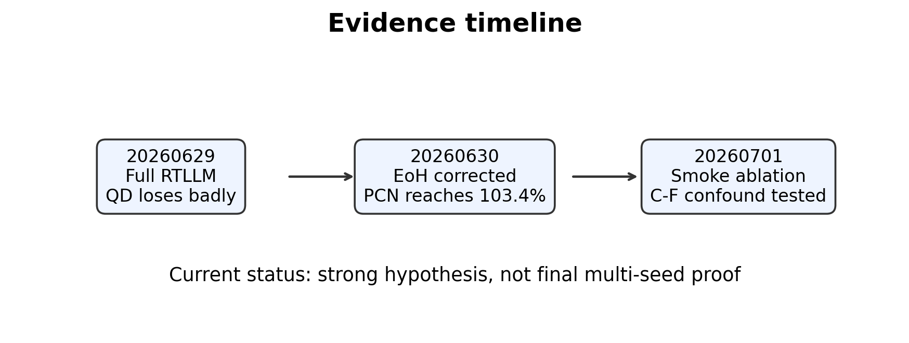

---

## Slide 2 - Bottom Line

- Generic QD/MAP-Elites did not transfer cleanly to RTL PPA search.
- Classic REvolution is a strong small-budget hill climber.
- The live hypothesis is PCN: keep classic exploitation, add guarded memory.

**Body**

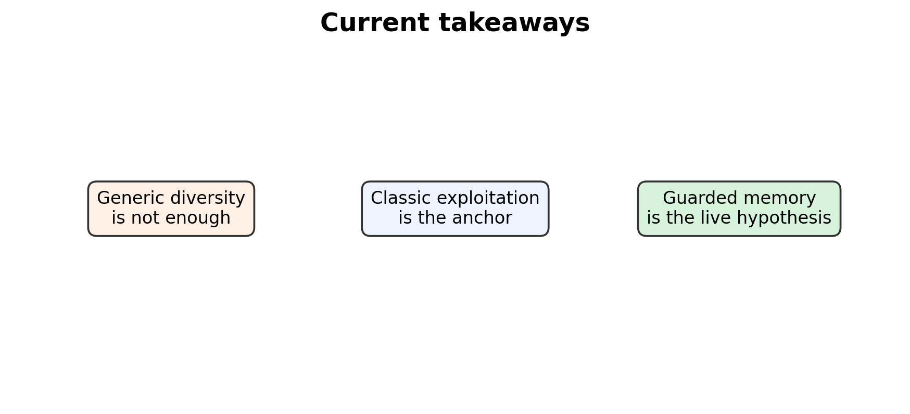

---

## Slide 3 - Evidence Boundary

- 20260629: full RTLLM, broad QD failure.
- 20260630: corrected EoH full RTLLM, PCN one-seed positive signal.
- 20260701: smoke-level C-F confound audit only.

**Body**

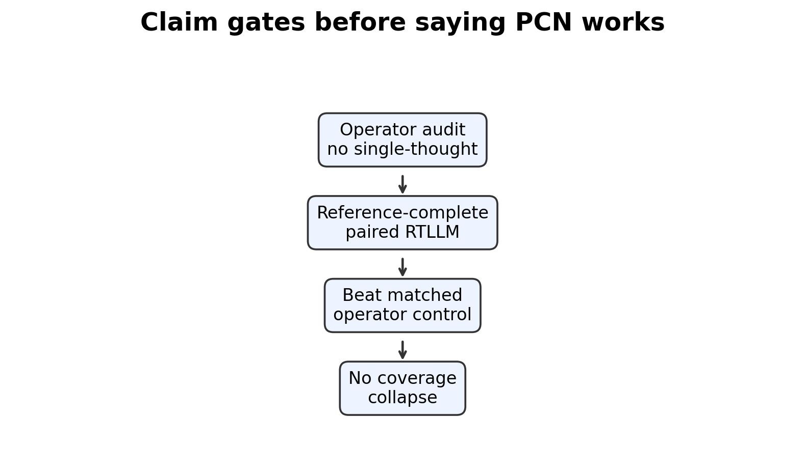

---

## Slide 4 - Classic REvolution Baseline

- Classic uses a success pool and EoH-style operators.
- It repeatedly improves candidates that already passed evaluation.
- This direct hill-climbing pressure is a major baseline strength.

**Body**

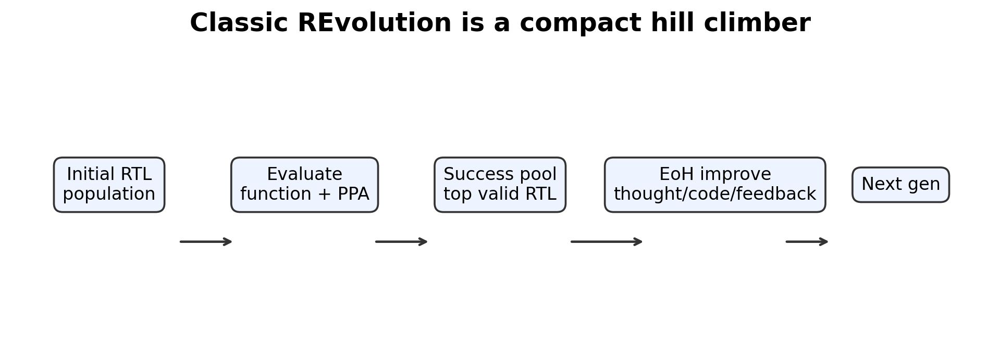

---

## Slide 5 - Why Scalar Fitness Looked Limiting

- The conference baseline relies on a scalar fitness score.
- Weighted averages can prefer one PPA direction.
- Pareto/HV metrics expose tradeoffs across power, performance, and area.

**Body**

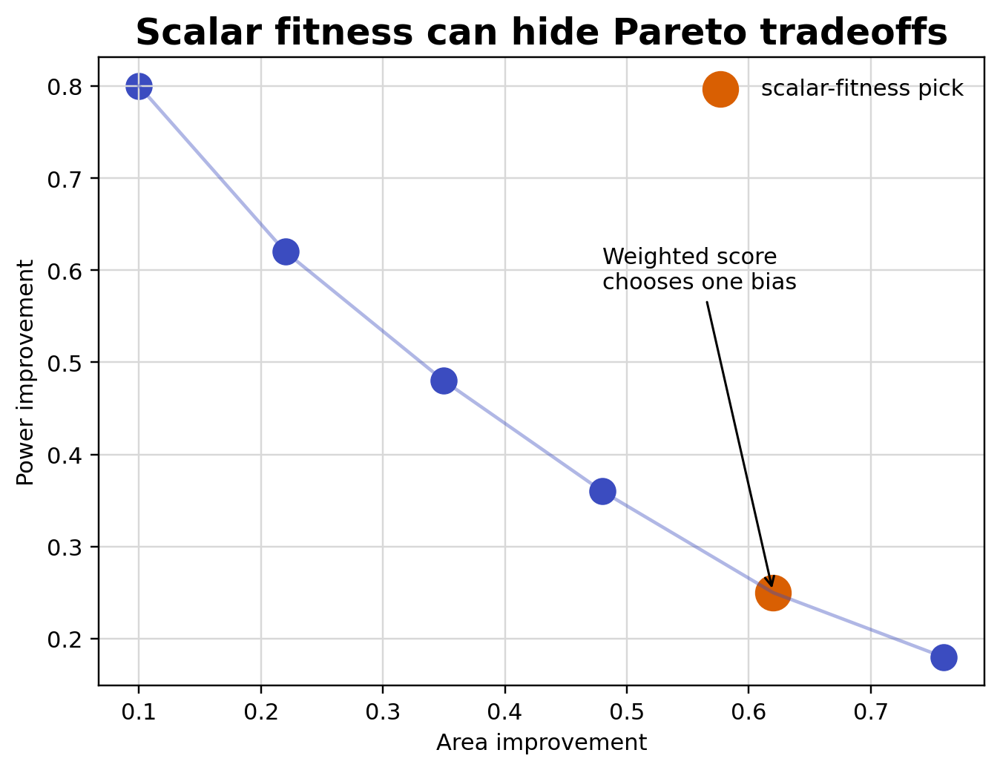

---

## Slide 6 - Metrics Used Here

- **HV:** final hypervolume of the nondominated PPA front.
- **HV-AUC:** hypervolume accumulated across generations.
- **Coverage:** designs with at least one valid-PPA candidate.

**Body**

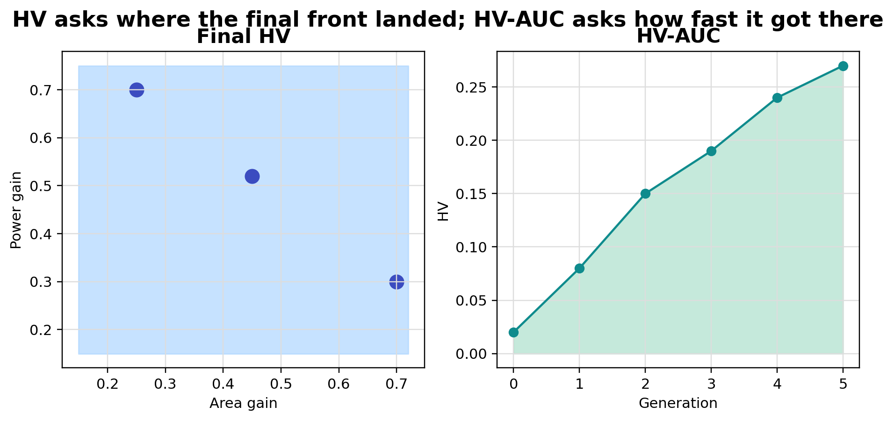

---

## Slide 7 - Why QD Was Worth Trying

- MAP-Elites preserves strong candidates across behavior descriptor cells.
- In other domains, this can avoid premature collapse to one strategy.
- RTL question: can descriptor cells preserve useful implementation families?

**Body**

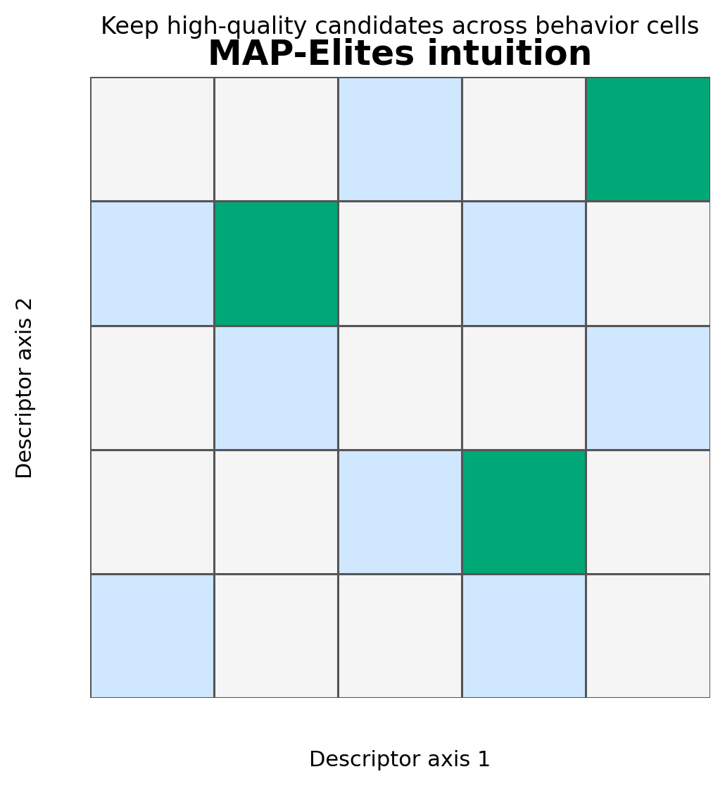

---

## Slide 8 - 20260629 Full RTLLM Attempt

- Tested Qwen3, MasterRTL/RF, DeepGate, RF+DeepGate, AURORA, and FG-QDM.
- Full RTLLM used the 46 reference-complete designs for headline metrics.
- It was a broad, fair screening run, but not yet operator-corrected.

**Body**

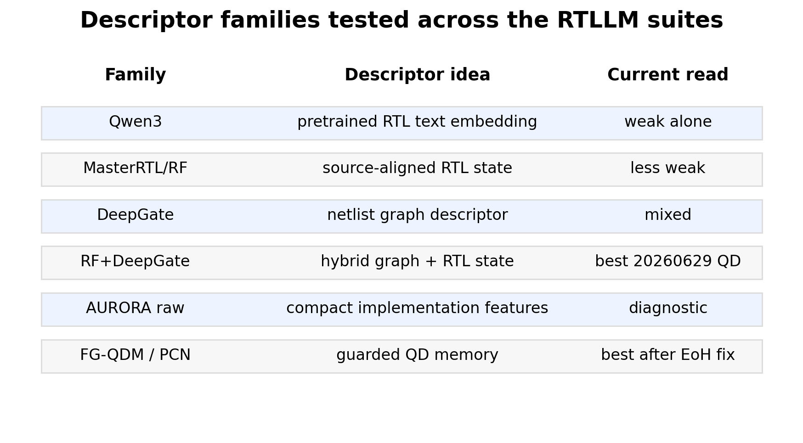

---

## Slide 9 - 20260629 Result: Broad Negative

- Classic mean HV: `0.1002`.
- Best QD mean HV: `0.0735` from RF+DeepGate.
- Best QD retained only `73.4%` of classic mean HV.

**Body**

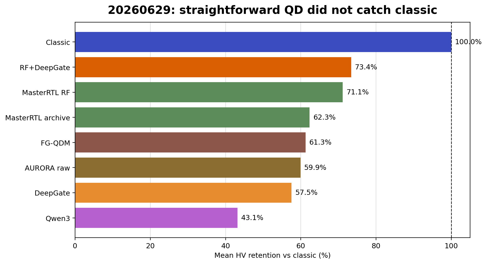

---

## Slide 10 - Coverage Loss Was Material

- Classic covered `33/46` reference-complete designs.
- Best QD arms covered only `27-31/46`.
- Losing valid-PPA samples directly hurts the PPA front.

**Body**

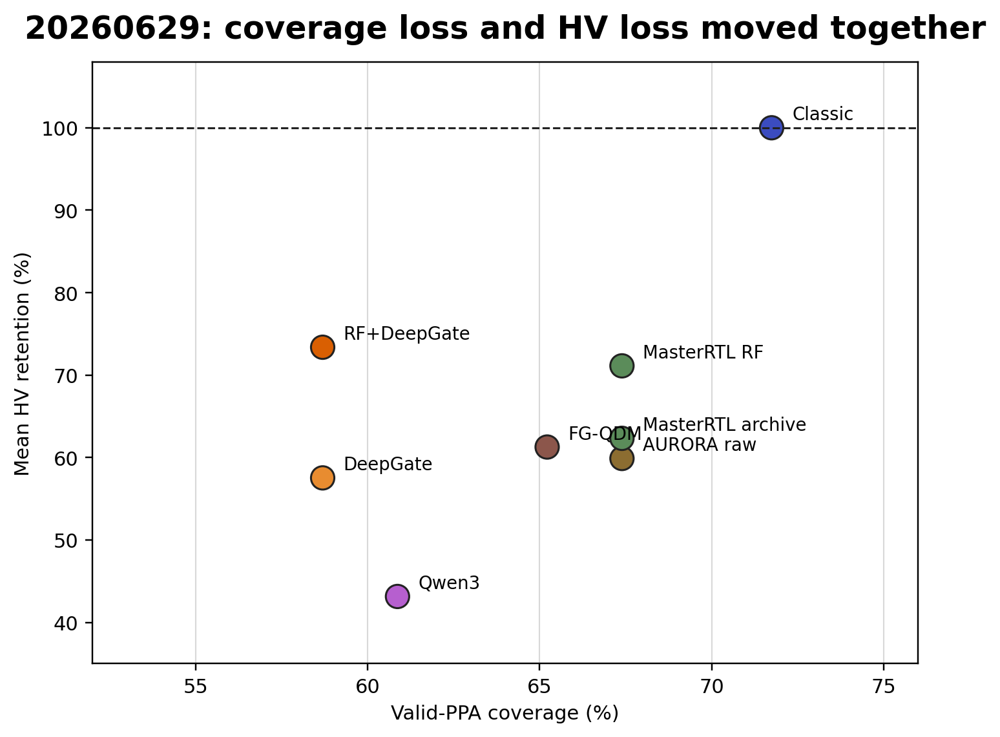

---

## Slide 11 - The Failure Had Structure

- Pure Qwen3 and pure DeepGate were weakest.
- Hybrid RF+DeepGate and MasterRTL RF were stronger, but still negative.
- Hardware/source-aligned descriptor ideas remain plausible.

**Body**

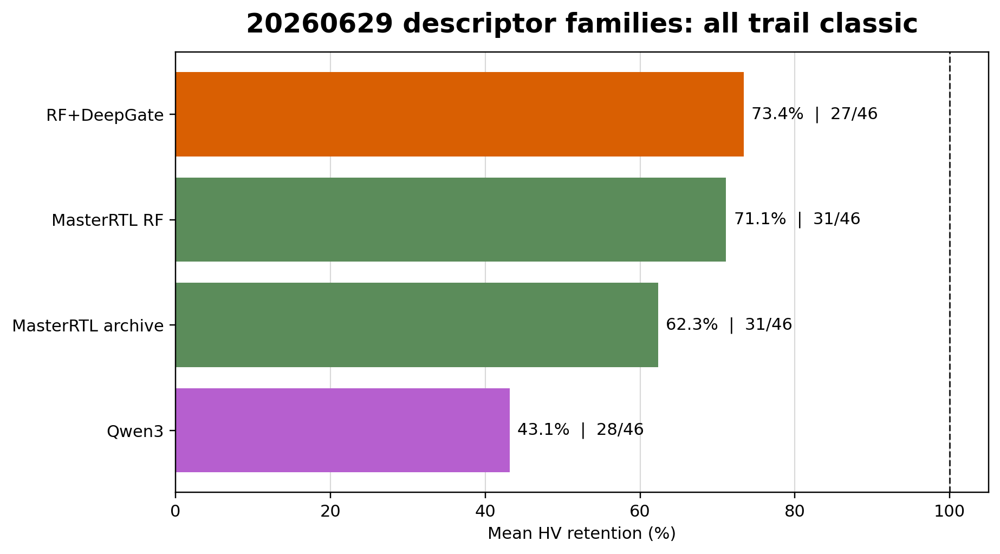

---

## Slide 12 - Key Confound: Operator Mismatch

- Classic used the EoH thought/code/feedback operator stack.
- Many QD arms used `single_thought_operator`.
- This made 20260629 partly an operator comparison, not just QD versus classic.

**Body**

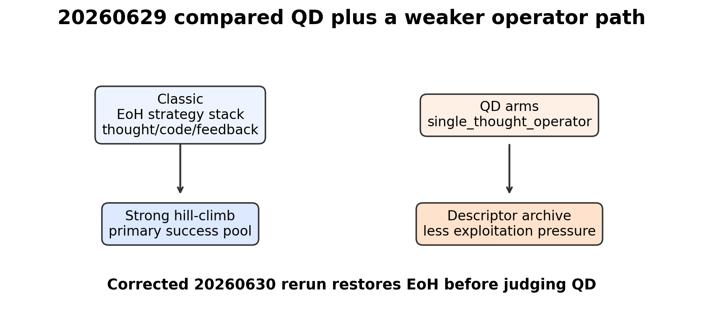

---

## Slide 13 - Second Failure Mode

- Archive sampling can replace too much hill climbing.
- Descriptor novelty is not the same as valid or high-quality RTL.
- QD must not consume the budget needed to find and refine valid candidates.

**Body**

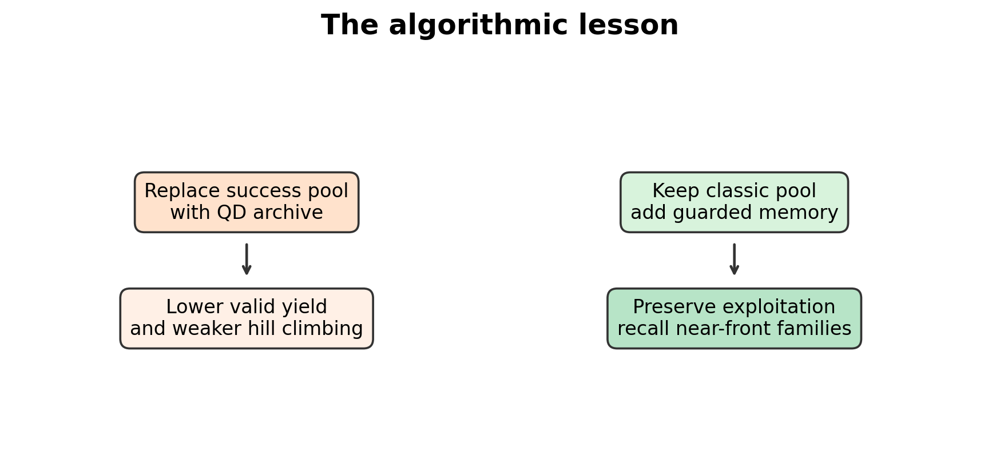

---

## Slide 14 - Revised Hypothesis

- Do not replace classic REvolution.
- Add QD as a small memory that recalls PPA-competitive families.
- Reintroduce memory parents only when they have evidence of usefulness.

**Body**

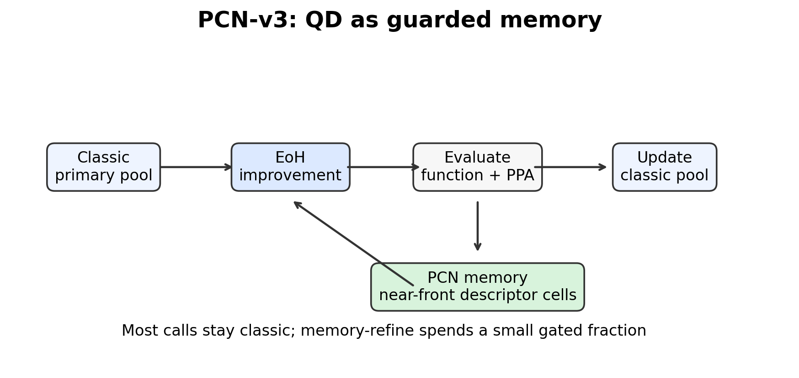

---

## Slide 15 - Corrected 20260630 Rerun

- Restored EoH operators and code-individual representation.
- Operator audit passed: `single_thought_count = 0` for completed arms.
- Now the comparison is closer to QD mechanisms versus classic.

**Body**

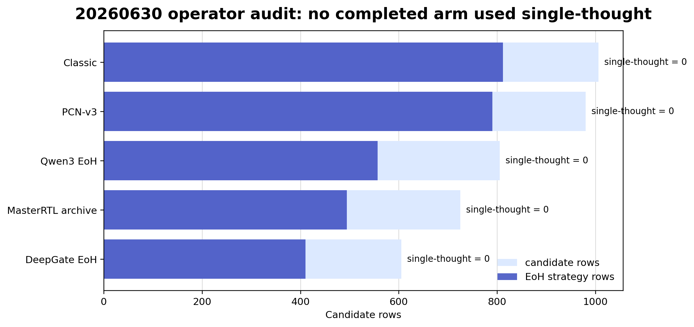

---

## Slide 16 - 20260630 Full RTLLM Result

- PCN-v3 mean HV: `0.1031`.
- Classic mean HV: `0.0997`.
- PCN-v3 retained `103.4%` of classic mean HV in this one-seed run.

**Body**

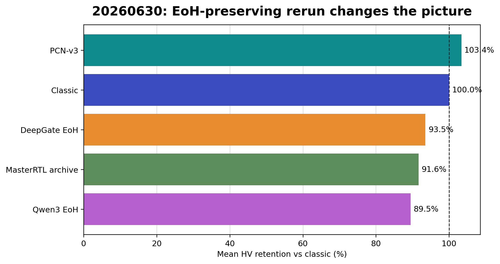

---

## Slide 17 - What PCN-v3 Actually Does

- Primary parent source remains the classic success pool.
- Every valid-PPA candidate can be passively inserted into memory.
- Memory-refine is a small gated lane, not the main optimizer.
- The 20260630 run was also no-C-F; slide 22 explains the ablation.

**Body**

---

## Slide 18 - PCN Memory Was Active

- Memory-refine candidates generated: `86`.
- Valid-PPA memory-refine candidates: `62`.
- Local/global front additions: `9` and `5`.

**Body**

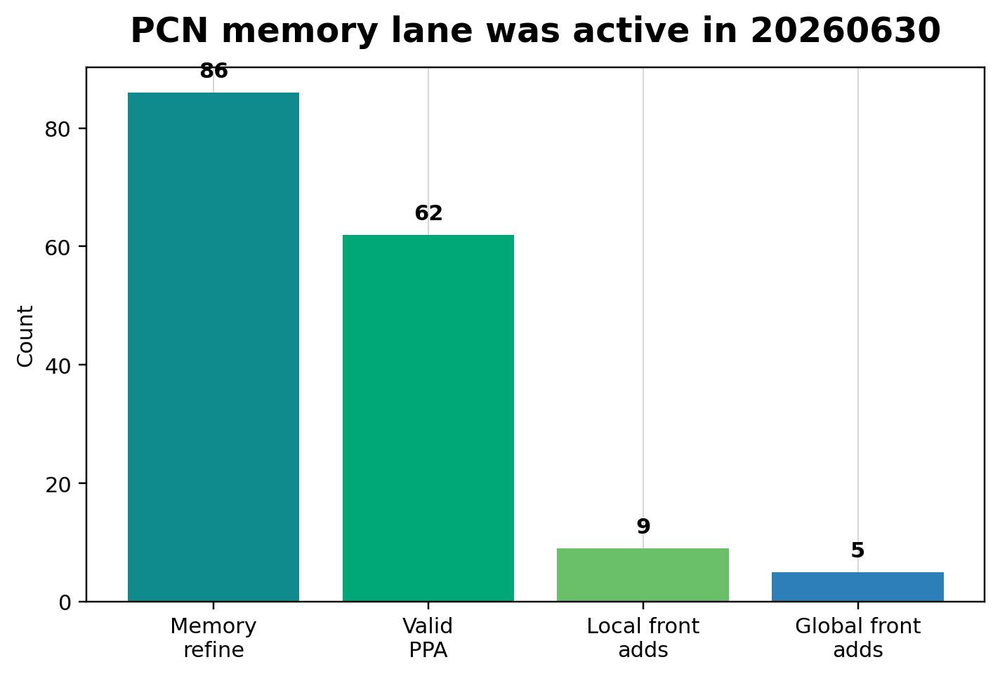

---

## Slide 19 - The Signal Is Real But Small

- PCN-v3 final HV wins/losses/ties versus classic: `9/9/28`.
- Mean-HV gain is positive but only one seed.
- This is promotion evidence, not final proof.

**Body**

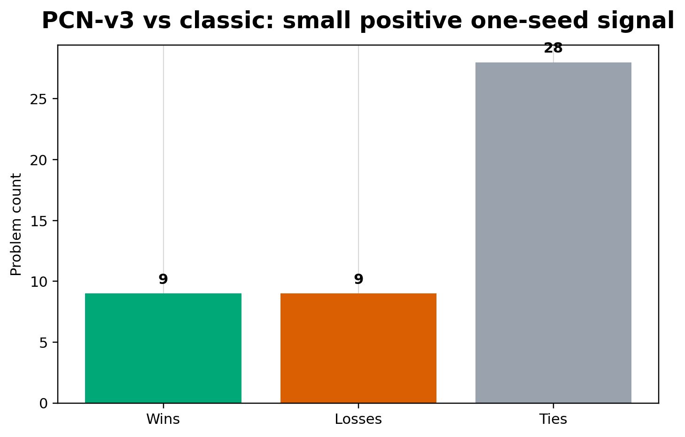

---

## Slide 20 - Qwen3 After Correction

- Qwen3 went from `43.1%` retention in 20260629 to `89.5%` in 20260630.
- Correcting operators helped substantially.
- It still does not beat classic.

**Body**

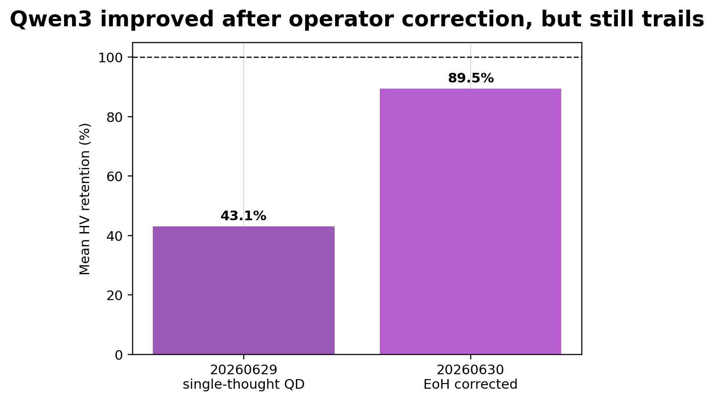

---

## Slide 21 - Encoder And RTL-Native Read

- DeepGate EoH retained `93.5%` of classic mean HV.
- MasterRTL archive retained `91.6%`.
- These are useful diagnostic lanes, not headline winners.

**Body**

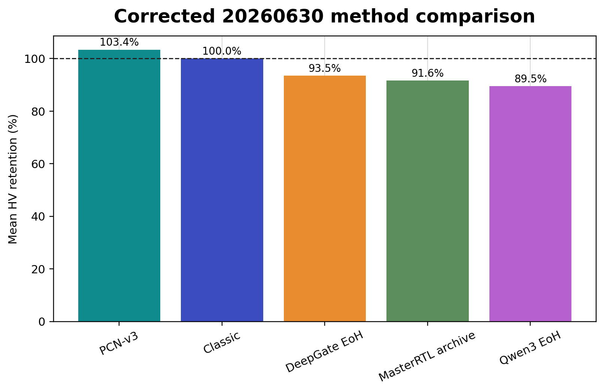

---

## Slide 22 - Remaining Confound: C-F

- PCN-v3 disabled QD/archive fusion with two-parent probability `0.00`.
- That also removed classic `C-F` in the PCN success branch.
- Need matched controls: classic, classic-no-C-F, PCN-no-C-F, PCN-C-F-restored.

**Body**

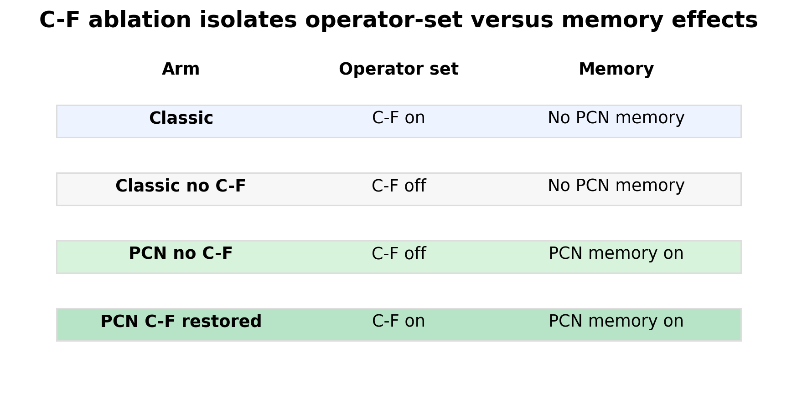

---

## Slide 23 - 20260701 Smoke Operator Audit

- Classic and PCN-C-F-restored produced C-F.
- No-C-F controls produced zero C-F.
- All four smoke arms had zero single-thought candidates.

**Body**

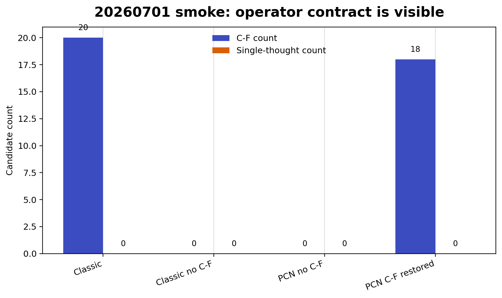

---

## Slide 24 - 20260701 Smoke Metrics

- Classic-no-C-F improves slightly over classic on smoke.
- PCN-no-C-F improves slightly over classic-no-C-F.
- PCN-C-F-restored is strongest on n=3, but this is not final evidence.

**Body**

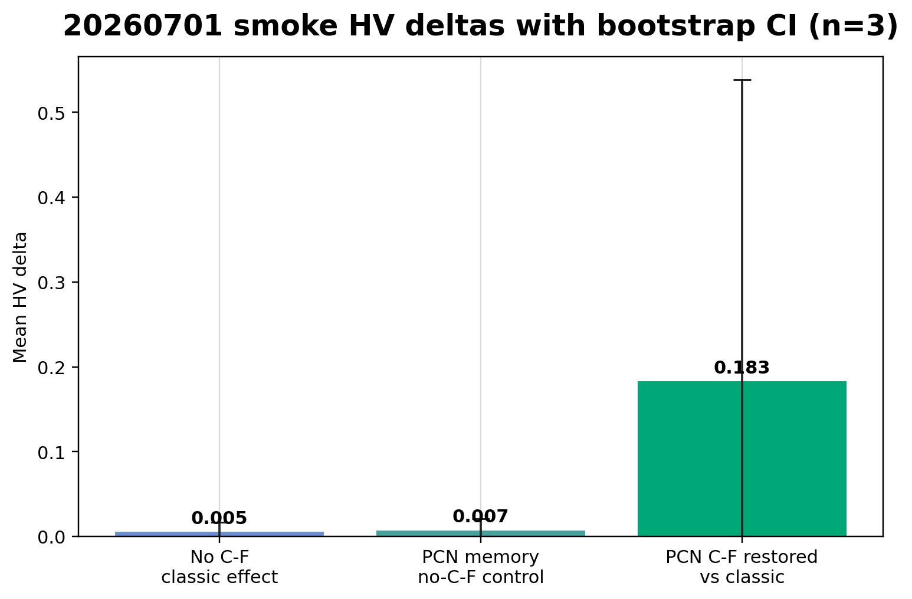

---

## Slide 25 - What We Can Say Now

- Naive QD/MAP-Elites was not competitive in 20260629.
- Restoring EoH operators removes most of the apparent QD collapse.
- PCN-v3 is the best current direction, but needs multi-seed confirmation.

**Body**

---

## Slide 26 - Better Algorithm Shape

- Preserve classic EoH hill climbing.
- Store only valid-PPA, near-front, or high-quality alternatives.
- Use memory as guarded recall, not descriptor novelty reward.

**Body**

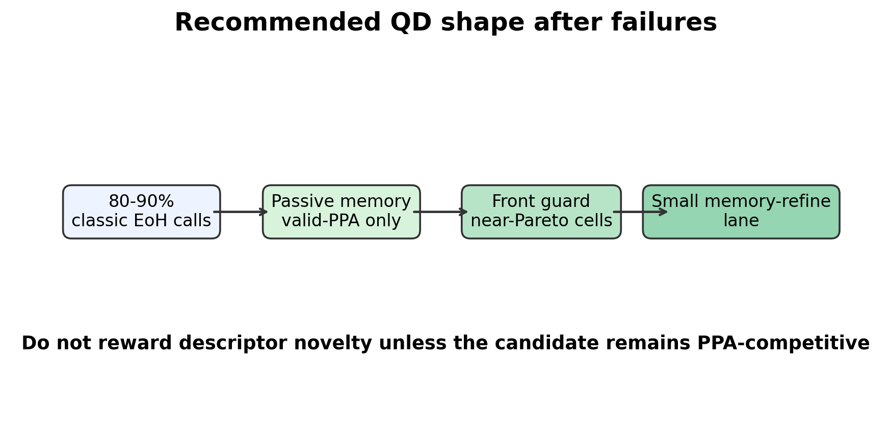

---

## Slide 27 - Next Experiment Ladder

- Finish five-seed RTLLM C-F ablation.
- Credit PCN only against matched operator controls.
- Run elite-cell and VerilogEval follow-ups only if the core gate passes.

**Body**

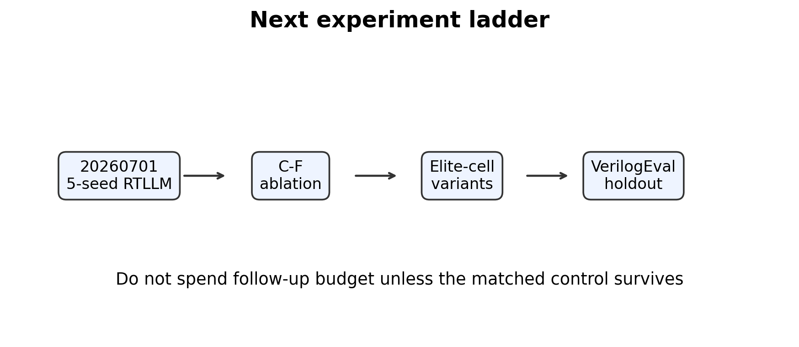

---

## Slide 28 - Discussion Prompts

- Is the PCN gain a memory mechanism, an operator simplification, or both?
- Which descriptor families are worth making more faithful?
- What budget shape is fair for QD when each RTL evaluation is expensive?

**Body**

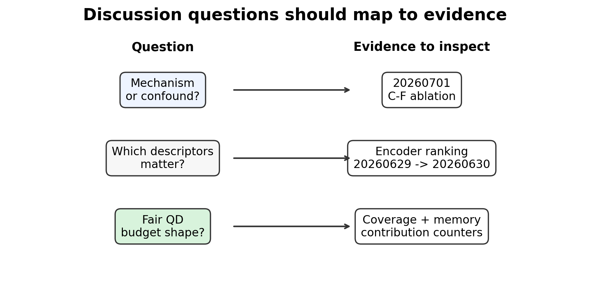

---

## Appendix Pointer

Detailed method mechanics and caveats are in:

- [`appendix_methods.md`](appendix_methods.md)
- [`evidence_map.md`](evidence_map.md)
- [`reviews/adversarial_checklist.md`](reviews/adversarial_checklist.md)
- [`reviews/adversarial_qa_review.md`](reviews/adversarial_qa_review.md)
- [`reviews/methodology_code_audit.md`](reviews/methodology_code_audit.md)
