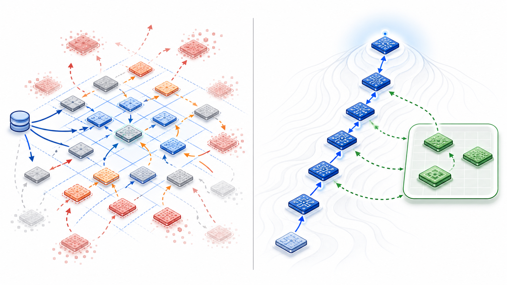
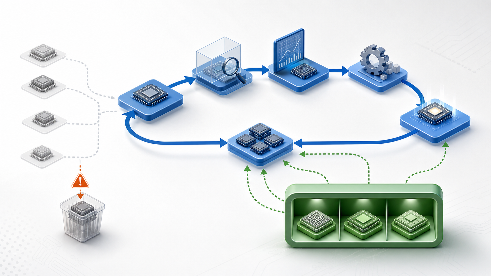
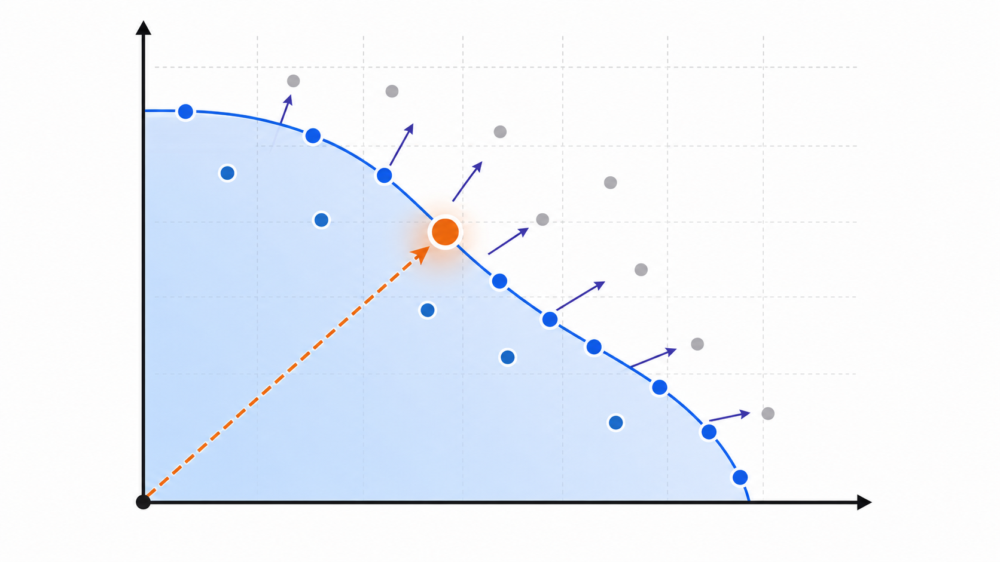
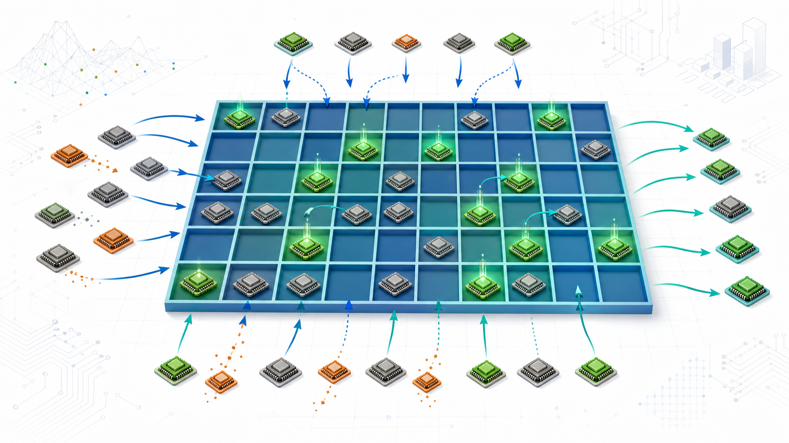

# Optional Imagegen Concept Slides

These slides are optional replacements or inserts. They use generated raster
concept art and should be paired with the precise manual diagrams or appendix
when answering detailed methodology questions.

---

## Optional Slide A - Why Replacement Hurt

Straight archive replacement scatters budget across descriptor space. PCN keeps
the main hill-climbing path intact and uses memory as a small sidecar.

**Body**

Caption source:
[`figures/imagegen_trials/captions/replacement_vs_memory.md`](figures/imagegen_trials/captions/replacement_vs_memory.md)

---

## Optional Slide B - PCN As Guarded Memory

The strongest visual use case for imagegen: a main classic improvement loop
with a small memory shelf that returns selected alternatives.

**Body**

Caption source:
[`figures/imagegen_trials/captions/pcn_architecture.md`](figures/imagegen_trials/captions/pcn_architecture.md)

---

## Optional Slide C - Scalar Versus Pareto Intuition

A scalar weighted score picks one emphasized tradeoff point. HV rewards a
broader nondominated region.

**Body**

Caption source:
[`figures/imagegen_trials/captions/scalar_vs_pareto.md`](figures/imagegen_trials/captions/scalar_vs_pareto.md)

---

## Optional Slide D - Classic REvolution Loop

Classic REvolution is a focused hill-climber: valid candidates enter the
success pool, then EoH operators iteratively improve or fuse them.

**Body**

Caption source:
[`figures/imagegen_trials/captions/classic_revolution_methodology.md`](figures/imagegen_trials/captions/classic_revolution_methodology.md)

---

## Optional Slide E - Generic QD Archive Pressure

Generic MAP-Elites emphasizes descriptor-cell coverage. That can be expensive
when valid RTL and PPA evaluations are scarce.

**Body**

Caption source:
[`figures/imagegen_trials/captions/generic_qd_map_elites_methodology.md`](figures/imagegen_trials/captions/generic_qd_map_elites_methodology.md)

---

## Optional Slide F - PCN-v3 As Memory Sidecar

PCN-v3 keeps the classic loop dominant and recalls only selected,
PPA-relevant alternatives from guarded descriptor memory.

**Body**

Caption source:
[`figures/imagegen_trials/captions/pcn_v3_methodology.md`](figures/imagegen_trials/captions/pcn_v3_methodology.md)
