# Technique Lineage Ledger

This is the skim-first process map for the useful-BD push. It complements
`technique_lanes.md`: this file tracks category, lineage, current result, and
branch decision in one place; `technique_lanes.md` keeps the detailed rationale,
lane notes, decision ledger, and Mermaid graphs.

## Reading Order

1. Use the lane table below to understand which family a technique belongs to.
2. Use the lineage graph to see how ideas evolved.
3. Use the result ledger to decide whether a lane should advance, branch,
   hybridize, or park.
4. Open the numbered `techniques/T##_.../` package for methodology, raw tables,
   figures, and detailed conclusions.

## Lane Categories

| Lane | Category | Role In Search | Current Direction |
| --- | --- | --- | --- |
| `L0` | Common evaluation and controls | Prevent false positives by comparing against classic, manual BD, and random BD. | Keep random/manual controls in every claim table. |
| `L1` | Transparent CAD descriptors | Use reviewer-readable features such as Yosys stats, motifs, pathlets, and ST-NOD. | Reuse selected features in guarded hybrids; stop pure concatenation. |
| `L2` | Synthesis-response automatic BDs | Derive BDs from non-PPA synthesis response vectors and AutoQD-style projections. | Continue as the strongest automatic-BD source, but add quality/yield guards. |
| `L3` | Codebook and discrete archives | Stabilize descriptor cells with VQ/codebook structure. | Park direct pressure; reopen as side archive or local-Pareto partition. |
| `L4` | Learned encoders | Test Qwen3, DeepGate, graph, sequence, AURORA, and multimodal circuit embeddings. | Qwen, DeepGate, RF/DeepGate, and AURORA/raw implementation features all have bounded live evidence through T99; none is promoted. |
| `L5` | Archive coupling and parent pressure | Preserve diversity while restoring hill-climbing pressure. | FG-QDM through T100 is the current auxiliary-memory test; T100 is best smoke but still loses matched classic. |
| `L6` | Lineage and emitter schedules | Bias exploration with repair dynamics, parent history, and adaptive emitters. | Short fail-pool feedback was insufficient; escalate only with measured source-level repair or role-separated emitters. |
| `L7` | RTL-native descriptors | Use RTL operator graphs and timing-risk/path morphology as behavior axes. | T83 remains the closest RF model-state single-seed clue, but T88 replication blocks promotion. |
| `L8` | Budget and benchmark shape | Test whether the evaluation structure is too wide/shallow or too saturated for QD to show value. | T79 completed the tested `12x3`/`8x5`/`6x7` matrix; exact T75 loses classic at all three shapes. |

## Lineage Graph

```mermaid
flowchart LR
  prior[20260618/20260621 negative diversity evidence]

  subgraph controls[L0 controls]
    T22[T22 random descriptor]
    manual[T24 manual BD arm]
    classic[classic Revolution]
  end

  subgraph transparent[L1 transparent CAD]
    T01[T01 Yosys stats]
    T02[T02 motif/pathlet]
    T03[T03 ST-NOD]
    T21[T21 ST-NOD + motif]
  end

  subgraph sr[L2 synthesis response]
    T20[T20 SR raw PCA]
    T04[T04 SR-RFF PCA]
    T19[T19 SR ReLU PCA]
  end

  subgraph codebook[L3 codebook]
    T05[T05 VQ codebook]
  end

  subgraph learned[L4 learned encoders]
    T06[T06 Qwen diagnostic]
    T33[T33 Qwen3 preprocessing ladder]
    T07[T07 graph surrogate]
    T13[T13 AURORA feature replay]
    T14[T14 DE-HNN hypergraph replay]
    T11[T11 contrastive replay]
    T35[T35 T11 Pareto coupling]
    T36[T36 bounded front lane]
    T37[T37 slot-count ablation]
    T38[T38 elite Pareto slot live]
    T39[T39 sparse-yield warmup]
    enc[T08-T14/T16 encoder scaffolds]
  end

  subgraph archive[L5 archive coupling]
    T17[T17 passive local Pareto]
    T23[T23 SR validation matrix]
    T24[T24 live six-arm matrix]
    T25[T25 guarded SR raw]
    T26[T26 conservative exploit SR raw]
    T27[T27 live QD audit]
    T28[T28 canonical family audit]
    T29[T29 front recovery diagnostic]
    T30[T30 T26 holdout audit]
    T31[T31 repair yield front emitter]
    T32[T32 front-preserving emitter]
    T40[T40 sparse-warmup controls]
    T41[T41 adaptive sparse-yield gate]
    T42[T42 initial sparse-yield gate]
    T43[T43 staged sparse-yield gate]
    T44[T44 T11 runtime graph bridge]
    T45[T45 T11 top-4 graph bridge]
    T46[T46 T11 PCA4 graph projection]
    T47[T47 T26 contract probe]
    T48[T48 gated near-front fusion]
    T49[T49 thought-k role-separated repair]
    T50[T50 candidate/front control]
    T51[T51 code-thought front slot]
    T54[T54 front-slot lane]
    T58[T58 T51 + T11 PCA4]
    T59[T59 T51 feedback front slot]
    T85[T85 front-guarded memory]
    T86[T86 random-memory control]
  end

  subgraph emitters[L6 lineage/emitter]
    T12[T12 lineage repair]
    T18[T18 adaptive emitter CVT]
  end

  subgraph rtlnative[L7 RTL-native descriptors]
    T15[T15 Yosys-SOG proxy]
    T60[T60 RTLTimer timing risk]
    T61[T61 problem-local timing risk]
    T62[T62 fused RTL-native]
    T63[T63 fused RTL-native live]
    T64[T64 operator timing live]
    T65[T65 secondary cells]
    T66[T66 guarded RTL parents]
    T67[T67 seeded thought RTL]
    T68[T68 source verification]
    T69[T69 open-Yosys preprocessing]
    T70[T70 generated RTL smoke]
    T71[T71 feature map]
    T72[T72 source-aligned cell QD]
    T73[T73 shape-density quantile QD]
    T74[T74 gated shape-density pairing]
    T75[T75 shape-density front pressure]
    T76[T76 MasterRTL pretrained gate]
    T77[T77 Area leaf variation gate]
    T80[T80 structural mix gate]
    T81[T81 RF timing state gate]
    T82[T82 RF timing runtime hook]
    T83[T83 RF leaf-ID delayed]
    T84[T84 RF leaf-ID front slot]
  end

  subgraph budgetshape[L8 budget and benchmark shape]
    T78[T78 budget-depth audit]
    T79[T79 budget-shape protocol]
    BAbl[Budget-shape ablation]
    DSet[Discriminative design set]
  end

  prior --> T01
  prior --> T06
  prior --> T22
  T01 --> T02
  T01 --> T03
  T02 --> T21
  T03 --> T21
  T03 --> T20
  T20 --> T04
  T20 --> T19
  T05 --> T17
  T04 --> T17
  T19 --> T17
  T17 --> T23
  T23 --> T24
  classic --> T24
  T22 --> T24
  manual --> T24
  T24 --> T25
  T25 --> T26
  T26 --> T27
  T27 --> T28
  T28 --> T29
  T29 --> T30
  T30 --> T31
  T31 --> T32
  T06 --> T33
  T33 --> T34
  T34 --> T07
  T07 --> T13
  T13 --> T14
  T14 --> T11
  T11 --> T35
  T35 --> T36
  T36 --> T37
  T37 --> T38
  T38 --> T39
  T39 --> T40
  T40 --> T41
  T41 --> T42
  T42 --> T43
  T43 --> T44
  T44 --> T45
  T45 --> T46
  T26 --> T47
  T30 --> T47
  T47 --> T48
  T48 --> T49
  T49 --> T50
  T50 --> T51
  T39 --> T51
  T51 --> T54
  T51 --> T52
  T46 --> T58
  T51 --> T58
  T57 --> T58
  T51 --> T59
  T54 --> T59
  T58 --> T59
  enc --> T15
  T15 --> T60
  T51 --> T60
  T60 --> T61
  T15 --> T62
  T61 --> T62
  T62 --> T63
  T63 --> T64
  T64 --> T65
  T65 --> T66
  T66 --> T67
  T67 --> T68
  T68 --> T69
  T69 --> T70
  T70 --> T71
  T71 --> T72
  T72 --> T73
  T73 --> T74
  T74 --> T75
  T75 --> T76
  T76 --> T77
  T77 --> T80
  T76 --> T81
  T81 --> T82
  T82 --> T83
  T83 --> T84
  T84 --> T85
  T85 --> T86
  T75 --> T78
  T77 --> T78
  T78 --> T79
  T79 --> BAbl
  DSet --> BAbl
  T39 --> enc
  T17 --> T12
  T17 --> T18
  T24 --> T18
```

## Result Ledger

| IDs | Lane | What It Tested | Current Result | Decision | Branch / Next Step |
| --- | --- | --- | --- | --- | --- |
| T01-T03 | `L1` | Simple structure, motif/pathlet occupancy, and ST-NOD synthesis trajectories. | Useful lower bounds; T03 is a near miss, but direct transparent descriptors are not enough. | `hybridize` | Reuse selected transparent features inside guarded archives. |
| T04/T19/T20 | `L2` | SR-RFF, SR ReLU, and raw synthesis-response PCA descriptors. | Strongest automatic-BD evidence, but quality/yield regressions remain. | `ablate` then `advance` guarded variants | Use the T26-family correction as mechanism context; require reference-complete proof before promotion. |
| T05 | `L3` | Direct VQ/codebook archive pressure. | Too costly in best quality and valid-PPA yield. | `park` | Reopen only as side archive or local-Pareto partition. |
| T06 | `L4` | Qwen-style whole-RTL projections. | Contains signal but clusters around nuisance axes. | `ablate` | T33 completed the preprocessing-ladder follow-up. |
| T33 | `L4` | Qwen3 normalized RTL/netlist preprocessing ladder. | `T0 diagnostic`: RTL views modestly beat lexical HV, but netlist collapse fixes do not improve HV or direct PPA-front hits. | `ablate` | Only continue with a projection/head hybrid that penalizes problem/corpus collapse. |
| T34 | `L4` | Label-free PCA residuals over T33 Qwen views. | `T0 diagnostic`: preserves RTL HV signal but does not align collapse reduction with PPA-front/HV utility. | `retire` | Move to graph encoders or a genuinely different Qwen training objective. |
| T07 | `L4` | DeepGate-family route with a standard-cell graph WL/stat surrogate after full checkpoint blockers. | `T1 near_classic_replay_lead`: graph WL/combo barely beats lexical HV and improves unique PPA points, but front hits remain below lexical. | `advance` stronger graph encoder | Use the direct raw PPA-front figure as the gate before any live budget. |
| T13 | `L4` | AURORA-style implementation feature replay with PCA, RFF-PCA, and incremental PCA bottlenecks. | Mixed: raw implementation features beat lexical HV by +1.06%, while compressed bottlenecks lose HV and front hits remain below lexical. | `hybridize` | Reuse raw features in feature selection, local-Pareto coupling, or contrastive graph training. |
| T14 | `L4` | DE-HNN-style directed hypergraph replay, plus a T13 implementation-feature hybrid. | Mixed: hypergraph-only descriptors lose HV; the hybrid beats lexical HV by +1.01% and raises unique PPA to 187, but front hits remain below lexical. | `hybridize` | Keep the hybrid signal, but use feature selection or contrastive training to target front-hit retention. |
| T11 | `L4` | MGVGA-style structural contrastive feature selection over T13/T07/T14 views. | `T1 near_classic_replay_lead`: top-64/weighted descriptors beat lexical HV by +1.82%, but direct front hits remain below lexical. | `hybridize` | Use T11 as the feature-selection baseline for local-Pareto coupling or collapse-penalized contrastive training. |
| T35 | `L4/L5` | T11 structural contrastive descriptor with descriptor-cell local Pareto retention and a front-seeded upper bound. | Mixed diagnostic: cell-local Pareto retention improves direct front hits from lexical's 122 to 126 but loses 8.97% HV; front-seeded reaches +4.39% HV and 132 front hits but uses global PPA-front membership. | `ablate` | Keep T11's farthest/HV selector and add only a small bounded front lane before any live budget. |
| T36 | `L4/L5` | T11 structural contrastive descriptor with one bounded descriptor-cell local-front slot. | `T2 replay_candidate`: HV reaches 3.851344 (+4.04% versus lexical) and direct front hits reach 126, beating lexical, T11, and fitness-top on the claimed replay metrics. | `advance` | T37 completed the slot-count ablation; next is one-slot live validation before any final useful-BD claim. |
| T37 | `L4/L5` | Explicit zero/one/two/three slot ablation for the T36 bounded local-front lane. | `T2 replay_candidate`: one slot keeps the T36 win; two or more slots lose HV and should not advance. | `advance` one-slot live validation | Run same-budget live validation of exactly one bounded local-front slot with direct raw PPA-front plots as the primary visual gate. |
| T38 | `L5` | Live archive mode for the T37 one-slot boundary: scalar champion plus one local Pareto slot per cell. | `T0 diagnostic`: ALU and traffic-light retain front/archive material, but multi-pipe has 7 valid PPA and 3 front points with zero active archive members under warmup 8. | `ablate` warmup | T39 is pre-registered as the sparse-yield warmup follow-up. |
| T39 | `L5` | Sparse-yield warmup ablation of T38: keep the one-slot rule and lower grid-quantile warmup from 8 to 4. | `T0 positive_ablation`: fixes multi-pipe active archive coverage and improves front material, but T40 blocks broad promotion. | `ablate` controls | T40 completed the matched control matrix. |
| T40 | `L0/L5` | Matched sparse-warmup controls for the frozen T39 candidate. | `T0 mixed_control`: T39 wins multi-pipe best score and two pooled raw-front hits, but classic owns ALU and traffic-light pooled fronts and best scores. | `ablate` adaptive gating | Test per-design sparse-yield activation instead of uniform one-slot pressure. |
| T41 | `L5` | Adaptive sparse-yield gate: keep warmup 8 but allow generation-1 fallback to 4 valid PPA successes when the archive is still empty. | `T0 mixed_diagnostic`: traffic-light gets 7 pooled hits and best score `0.473631`, but ALU loses to classic and multi-pipe loses the T39 signal. | `ablate` earlier trigger | T42 completed the generation-0 trigger check. |
| T42 | `L5` | Initial sparse-yield gate: keep T41 settings but trigger fallback at generation 0 after initial population. | `T0 mixed_diagnostic`: direct PPA front adds one ALU pooled hit and one multi-pipe pooled hit, but loses T41 traffic-light and misses T39 multi-pipe best score. | `ablate` staged gate | T43 completed the staged sparse-yield follow-up. |
| T43 | `L5` | Staged sparse-yield gate: keep T42 settings but lower champion pressure only after adaptive sparse initialization. | `T0 mixed_diagnostic`: all archives used strict warmup, the staged branch never activated, and direct PPA fronts show zero pooled hits. | `ablate` trigger lane | Use a bounded sparse-trigger screen or branch exact T11 runtime projection. |
| T44 | `L4/L5` | Live-safe top-8 subset of T11 structural graph features on the T39 one-slot sparse-warmup substrate. | Completed `T0 mixed_diagnostic`: traffic-light and multi-pipe win HV and add pooled raw-front signal, but aggregate HV/reference-beating count fall and ALU/traffic-light valid-PPA yield drops exceed the gate. | `ablate` dimensionality | T45 completed the compact top-4 follow-up. |
| T45 | `L4/L5` | Compact top-4 T11 runtime graph profile on the same T39/T44 one-slot sparse-warmup substrate. | Completed `T0 mixed_diagnostic`: preserves all classic-covered designs and avoids the 50% yield warning, but loses classic on mean HV, Pareto points, valid-PPA count, and best score. | `retire` ranked-axis bridge | T46 is the frozen non-PPA projection follow-up. |
| T46 | `L4/L5` | Frozen PCA4 projection over T44's top-8 graph feature family on the T45 live settings. | Completed `T0 mixed_diagnostic`: preserves coverage, wins ALU HV, and contributes one ALU pooled-front hit, but classic wins mean HV, reference-beating count, valid-PPA samples, and traffic-light quality. | `retire` direct graph-axis primary lane | Use graph features as secondary archive/reporting coordinates or trained-encoder inputs; return primary live budget to T26-family SR/archive-coupling variants or role-separated emitters. |
| T47 | `L5/L6` | Contract-aligned hard/tuning gate for exact T26 after the full RTLLM result was narrowed to diagnostic. | Completed `T0 diagnostic`: positive mean best-score delta, but negative mean HV/HV-AUC, lower valid-PPA count, and lower aggregate front points. | `retire` exact T26 held-out escalation | Do not launch exact T26 held-out; use T48 to test guarded near-front fusion first. |
| T48 | `L5/L6` | T26.1 low-probability two-parent fusion gated by near-front rank and descriptor compatibility. | Completed `T0 diagnostic after review`: no classic-covered valid-PPA losses and some improvement over exact T26, but classic still wins mean HV, HV-AUC, valid-PPA count, and aggregate front points. | `retire` direct T26.1 fusion escalation | Specify a role-separated champion, local-rank-1, and bounded-repair emitter before held-out spend. |
| T49 | `L5/L6` | Thought-only role separation with champion archive pressure, non-champion NSGA-II near-front pressure, and bounded sample-local repair. | Completed `T0 mixed_diagnostic`: preserves covered valid-PPA coverage and improves best score, but loses mean HV, valid-PPA count, and front coverage. | `ablate` repair-only role separation | Specify a front-preserving follow-up before seed `1002` or held-out spend. |
| T50 | `L5/L6` | Candidate-matched thought-only front retention: restore the 12-candidate evaluated-code budget, disable repair, and widen per-cell Pareto retention. | Partial `T0 diagnostic`: best-score gain, but HV, HV-AUC, valid-PPA, unique PPA, and front material lose. | `retire` candidate/front control | Do not run seed `1002`; specify a new front/yield-preserving emitter. |
| T51 | `L5/L6` | Code-thought front-slot QD: restore code individuals, keep the single-thought operator, use one local front slot, and lower sparse-yield warmup to 4. | Completed `T0 positive_ablation_not_promoted`: valid-PPA, HV-AUC, and best-score recovery versus T50/classic, but classic still wins HV and front breadth. | `ablate` front-preserving follow-up | Keep the code-individual yield recovery; add a stronger front-preserving mechanism before seed `1002` or held-out spend. |
| T52 | `L5/L6` | Code-thought full-Pareto QD: keep T51's code representation and operator, but widen each archive cell from one front slot to full local Pareto retention. | Completed `T0 diagnostic_retired_full_pareto`: front points improve versus T51 by +3, but HV-AUC drops by 34.7%, best score drops by 17.5%, and Prob098 gets a yield warning. | `retire` simple full-Pareto widening | Keep T51's one-slot/yield behavior; any follow-up needs a bounded front-pressure trigger without in-loop classic or final-front labels. |
| T53 | `L5/L6` | Sparse-front trigger: keep T51's one-slot archive and lower champion pressure only when local front slots are sparse. | Completed `T0 diagnostic_not_promoted`: trigger fires, but classic still wins HV, HV-AUC, valid-PPA count, unique PPA breadth, and front points. | `retire` scalar champion-lane trigger | T54 tested a fixed front-slot lane; do not keep nudging champion pressure. |
| T54 | `L5/L6` | Fixed 10 percent front-slot parent lane for non-elite `elite_pareto_slot` members while preserving T51 champion pressure. | Completed `T0 diagnostic_not_promoted`: preserves covered designs and improves best score, but loses HV, HV-AUC, valid-PPA, unique PPA, reference-beating count, and front points. | `retire` immediate parent-lane lineage | Next method must change front-slot creation, exact T11 runtime projection, or learned/auxiliary archive structure. |
| T55 | `L5/L6` | Coarse SR2 front-slot QD: keep T54 fixed but use `--qd_descriptor_axes sr_pca_0 sr_pca_1` as grid-quantile archive axes. | Completed `T0 positive_mechanism_ablation_not_promoted`: slot hits improve over T54, but classic and T51 still block promotion on HV/HV-AUC/yield/front evidence. | `ablate` positive mechanism only | Do not spend seed `1002` on exact T55; change mechanism before the next live arm. |
| T56 | `L5/L6` | Coarse SR2 T51-control QD: keep T51 parent selection and operator fixed but use T55's two-axis archive geometry. | Completed `T0 diagnostic_retire_coarse_sr2_geometry`: coverage is preserved, but classic and T51 win the primary HV/HV-AUC/yield/front evidence. | `retire` coarse SR2 primary path | Switch mechanism to exact T11 runtime projection, learned auxiliary archive lanes, or a front-yield protected emitter. |
| T57 | `L5/L6` | T51 adaptive-rebin QD: keep T51 fixed and enable KS-triggered grid-quantile rebinning. | Completed `T0 diagnostic_no_rebin_signal`: 26 checks, 0 rebins, one classic-covered valid-PPA loss, and worse HV/HV-AUC than classic and T51. | `retire` exact adaptive-rebin path | Do not run seed `1002`; switch to exact T11 runtime projection, learned auxiliary archive lanes, or a front-yield protected emitter. |
| T58 | `L4/L5/L6` | T51 T11-PCA4 front-slot QD: keep T51's code-thought emitter and use T46's frozen T11 PCA4 graph projection as the archive coordinates. | Completed `T0 diagnostic_no_promotion`: valid-PPA and best-score gains, but classic/T51 still win HV, HV-AUC, and front breadth. | `retire` primary graph-coordinate archive | Do not run exact seed `1002`; move graph features to secondary/reporting lanes or a trained encoder objective, and make the next live method front-yield protected. |
| T59 | `L5/L6` | T51 feedback front-slot QD: keep T51's direct-code SR-PCA path, use T54's front-slot lane, and add short fail-pool feedback without extra repair calls. | Completed `T0 diagnostic_no_promotion`: best score improves, but classic wins HV, HV-AUC, valid PPA, front points, unique PPA points, and reference-beating count; Prob153 has a yield warning. | `retire` exact feedback front-slot path | Do not spend seed `1002` on exact T59; change front-slot creation, add measured source-level repair, or move features into a secondary archive lane. |
| T08 | `L4/L7` | DeepSeq-style sequential proxy over measured state/pipeline and source-aligned RTL-native evidence. | `T0 retrospective_sequential_proxy_not_promoted`: T63/T67/T72/T73/T75 show yield, occupancy, and near-classic source-aligned clues, but no true DeepSeq pretrained reproduction or primary PPA-front win. | `retire` exact proxy axes | Reopen only with validated DeepSeq weights, trained state-aware encoder objective, or source-level front-rescue contribution. |
| T09 | `L4` | NetTAG-style text-graph proxy over measured Qwen text/netlist, T11 graph, T58 live graph-coordinate, and T96 RF/DeepGate hybrid evidence. | `T0 retrospective_text_graph_proxy_not_promoted`: replay text/graph signals are real, but live graph-coordinate and hybrid archive evidence remains negative versus classic. | `retire` exact proxy axes | Reopen only with true text-graph training, secondary archive use, or front-rescue contribution evidence. |
| T10 | `L4` | CircuitFusion-style multimodal proxy over measured Qwen text/netlist, official DeepGate, RF/DeepGate hybrid, and AURORA/raw implementation-feature evidence. | `T0 retrospective_multimodal_proxy_not_promoted`: cheap multimodal fusion evidence remains below classic and is not a true CircuitFusion reproduction. | `retire` exact proxy fusion | Reopen only with a real functional-sketch modality, trained cross-modal objective, or secondary memory/reporting role. |
| T16 | `L4` | DeepCell-style multiview proxy over measured hypergraph, official DeepGate AIG/cone, RF/DeepGate hybrid, and implementation-view evidence. | `T0 retrospective_multiview_proxy_not_promoted`: cheap multiview proxy evidence remains below classic and is not a true DeepCell reproduction. | `retire` exact proxy fusion | Reopen only with paired post-mapping/AIG extraction, masked multiview training, or secondary memory/reporting role. |
| T15/T60/T61/T62/T63/T64 | `L7` | Yosys-SOG/MasterRTL and RTLTimer timing-risk/path-morphology descriptors. | T64 completed as `T0 diagnostic_yield_archive_ablation_not_promoted`: it improves valid-PPA yield and archive occupancy, but loses classic on HV, HV-AUC, front points, unique PPA, and reference-beating count. | `retire` exact primary geometry | Superseded by the T65 secondary-cell audit below. |
| T65 | `L7` | Source-level RTLTimer secondary cells around T51/T63/T64 unique-PPA candidates. | T65 completed as `T0 diagnostic_secondary_cell_not_promoted`: every method/profile loses Classic on problem-paired mean front-cell delta; T63 `control_pipeline` is closest at `-0.076923`. | `retire` pure secondary overlay | Redesign generator/archive coupling before another live RTL-native spend. |
| T66 | `L7` | T63 state/pipeline RTL-native cells used for front-slot parent pressure and low-rate near-front descriptor-compatible fusion. | Completed `T0 diagnostic_yield_positive_front_negative_not_promoted`: valid-PPA and best-score diagnostics improve, but classic wins HV, HV-AUC, and front points. Two-parent fusion did not trigger. | `retire` exact guarded-parent settings | Redesign RTL-native coupling before another live spend; do not run exact seed `1002`. |
| T67 | `L7/L6` | RTL-native state/pipeline cells plus seeded thought-code realization that refines successful parent RTL for most samples. | Completed `T0 diagnostic_yield_positive_front_negative_blocked`: valid-PPA yield improves, but front breadth and `Prob153_gshare` coverage block promotion. | `park` exact method | Reuse seeded realization only with front-preserving repair or source selection. |
| T68 | `L7` | Upstream MasterRTL/RTL-Timer source-verification gate. | Completed `T0 verification_gate`: shipped examples are partly verified, but fresh conversion needs Verific or a source-aligned preprocessing adaptation. | `gate` upstream-equivalence claims | Do not claim true MasterRTL/RTL-Timer descriptors until the extractor path runs on our candidate RTL. |
| T69 | `L7` | Open-source Yosys adaptation for MasterRTL and RTL-Timer TinyRocket SOG/BOG preprocessing. | Completed `T0 preprocessing_unblocker`: open-clean MasterRTL graph counts stay within about 1.1% of shipped TinyRocket, and RTL-Timer SOG BOG preserves the shipped DFF-reference count. | `advance` candidate extractor smoke | Run this source-aligned path on a small generated-RTL sample and report extractor success/failure before any live QD spend. |
| T70 | `L7` | Source-aligned MasterRTL and RTL-Timer extraction on generated T67 RTL candidates. | Completed `T0 extractor_smoke_unblocker`: `19/19` candidates pass both extractors, with nonempty MasterRTL graph edges and RTL-Timer DFF-reference outputs. | `advance` descriptor feature table | Define archive cells from source-aligned operator/control/timing-risk features before any larger live RTL-native spend. |
| T71 | `L7` | Source-aligned RTL-native feature map over the T70 generated-candidate extractor outputs. | Completed `T0 descriptor_design_unblocker`: `19` candidates occupy `9/16` PPA-free cells using MasterRTL graph-edge operator scale and RTL-Timer DFF state/timing class. | `advance` live cell-coupled method | Pre-register a live method that uses T71 cells for parent selection, local-front retention, secondary archive pressure, or source-level repair. |
| T72 | `L7` | Source-aligned RTL-cell QD using T71 cells inside T66-style front-slot parent pressure. | Completed `T1 near_classic_not_promoted`: fixed live screen preserves `13/13` covered designs and trails classic mean HV by about `0.65%`, but classic wins front breadth. | `ablate` descriptor geometry | Do not promote exact T72; use it as source-aligned execution evidence and compare T73 against it. |
| T73 | `L7` | Source-aligned shape-density `grid_quantile` cells using MasterRTL branching, RTL-Timer wire density, and RTL-Timer DFF density. | Completed `T0 positive_diagnostic_not_promoted`: matched comparison preserves `13/13` covered problems and improves valid-PPA samples (`294` versus `257`), but classic wins mean HV (`0.0926007600` versus `0.0890223082`) and Pareto points (`2.31` versus `1.46`). | `hybridize` yield/occupancy signal | Do not promote exact T73; design T74 with stronger front-slot/archive-coupling pressure. |
| T74 | `L7/L5` | T73 shape-density cells with `near_front_descriptor` gating for the existing low-rate single-thought two-parent prompt requests. | Completed `T0 diagnostic_regression_not_promoted`: preserves 13/13 headline comparisons, but classic wins mean HV (`0.0926007600` versus `0.0851926237`), HV wins (`8` versus `1`), Pareto points (`2.31` versus `1.62`), and valid-PPA count (`257` versus `237`). | `retire` exact T74 | Do not spend another seed on low-rate pair gating; change front creation directly. |
| T75 | `L7/L5` | T73 shape-density cells with explicit `qd_front_slot_lane_fraction=0.30` and one-parent-only single-thought prompts. | Completed `T0 positive_diagnostic_not_promoted`: preserves `13/13`, improves valid-PPA samples versus classic (`274` versus `257`), and beats T73/T74 mean HV, but classic still wins mean HV and Pareto breadth. | `retire` exact pressure tweak | Do not keep nudging front-slot fraction; move to budget-shape ablation or verified MasterRTL tree embeddings. |
| T76 | `L7` | MasterRTL pretrained model-artifact gate after T75: hash and load saved tree models, assert feature lengths, and inventory RTL-Timer. | `T0 verification_gate_partial`: MasterRTL XGBoost heads and RF model load, but XGBoost TinyRocket outputs are all-zero and RTL-Timer has no confirmed checkpoint. | `advance` only to candidate-variation gate | Run generated-candidate leaf/margin variation before any live pretrained-model BD. |
| T77 | `L7` | Generated-candidate variation gate for the source-faithful MasterRTL Area feature path and pretrained Area head. | `T0_variation_gate_negative`: `17/19` Area feature rows are unique, but predictions, leaf rows, and leaf IDs all collapse to one value. | `retire` Area-head leaves | Do not use direct pretrained Area leaves as a live BD; reproduce timing/power flows, retrain, or move to budget shape. |
| T80 | `L7` | Raw MasterRTL structural-mix descriptor gate after the Area-head collapse. | `T0_descriptor_gate_positive_not_live`: generated candidates have noncollapsed structural rows and `8/16` cell occupancy. | `advance` only through a live hook | Use as a structural axis, but not as proof of pretrained model usefulness. |
| T81 | `L7` | MasterRTL RF timing model-state gate using upstream timing-DAG/path features and the saved RF model. | `T0_model_state_gate_positive_not_live`: `13/19` candidates evaluate, `166` timing paths are captured, and RF leaves are noncollapsed (`53` leaf rows, `414` leaf IDs). | `advance` runtime-hook design | Define fixed BD coordinates from RF timing state plus a structural axis, with explicit no-clock handling before any live spend. |
| T82 | `L7` | Runtime descriptor hook for MasterRTL RF timing model-state metrics. | `T0_screened_negative_not_promoted`: evaluator and live smoke pass, but the frozen `8x5` screen loses classic on mean HV (`0.1140` versus `0.1406`) and Pareto points (`2.00` versus `3.25`). | `retire` exact RF timing-state profile | Only revisit RF timing through a materially different coupling, such as RF timing as a secondary tag or a noncollapsed replacement for path-count. |
| T83 | `L7/L8` | RF leaf-ID structural delayed QD: use RF timing leaf-ID breadth as a secondary coordinate beside MasterRTL branching and RTLTimer wire density, with delayed archive activation. | `T0_near_classic_diagnostic_not_promoted`: all-design mean HV is close (`0.1369` versus classic `0.1406`), but Pareto points and reference-beating counts lose, RTLLM-only HV is negative, and the near-tie depends on `Prob135_m2014_q6b`. | `hybridize` only as a model-state clue | Do not promote exact T83. Use RF leaf-ID breadth only inside a stronger front-preserving mechanism or switch lanes. |
| T84 | `L7/L8` | RF leaf-ID front-slot delayed QD: keep T83 axes and delayed archive activation, but sample bounded local front-slot parents through `front_slot_lane_nsga2`. | `T0_diagnostic_regression_not_promoted`: front-slot sampling loses T83's near-classic mean HV and does not recover front material. | `retire` exact front-slot coupling | Keep T83 as the RF model-state representative; do not continue exact T84. |
| T85 | `L5` | FG-QDM: front-guarded QD memory with a separate classic-style primary pool and passive archive memory over `sr_pca_3d`. | `T0_smoke_negative_not_promoted`: warmup-4 fixes coverage, but classic wins smoke mean HV `0.1903` to `0.1375`; `Prob015` ties at zero HV. | `ablate` descriptor control | Run T86 random-memory control before any verified-descriptor swap. |
| T86 | `L0/L5` | Random-memory FG-QDM control, then possible verified-descriptor swap only if memory earns budget. | `T0_control_negative_not_promoted`: random memory slightly beats SR memory on smoke mean HV (`0.1382` versus `0.1375`) and mean Pareto points (`2.67` versus `2.00`), while classic remains stronger (`0.1903`). | `retire` exact SR-memory FG-QDM | Do not swap in another FG-QDM descriptor until the memory-credit complexity finding is addressed or the descriptor is materially stronger. |
| T87 | `L5/L7` | Source-aligned shape-density FG-QDM memory control. | `T0_smoke_negative_not_promoted`: mean HV `0.1264` trails SR memory, random memory, and classic; memory lanes produce zero valid-PPA children. | `retire` exact RTL-native FG-QDM geometry | Do not spend on another FG-QDM descriptor swap without stronger memory-lane credit evidence. |
| T88 | `L7/L8` | Seed-robustness gate for T83 RF leaf-ID structural delayed QD. | `T0_replication_negative_not_promoted`: three-seed mean HV `0.1260` versus classic `0.1442`, with zero seed-level HV wins. | `retire` exact T83 promotion path | Keep T83 only as a category representative and model-state clue. |
| T89-T93 | `L4` | Official DeepGate bridge from signal-vs-AIG residual checks through cone pooling, runtime descriptor registration, and bounded live smoke. | Diagnostic bridge evidence: DeepGate descriptors become nonconstant, cover all frozen screen problems after pooling, and insert one live archive member, but matched HV remains missing until T94. | `advance` to matched screen | Use only official-model descriptors; do not call surrogate graphs pretrained DeepGate. |
| T94/T95 | `L4/L5` | Matched official DeepGate runtime screens, then delayed high-exploit coupling. | T94 mean HV `0.1040` and T95 mean HV `0.1153` both trail classic `0.1406`; T95 is the best pure DeepGate representative. | `retire` exact DeepGate primary axis | Keep T95 as category representative, not a full-RTLLM candidate. |
| T96 | `L4/L7` | RF timing leaf IDs plus official DeepGate pooled netlist coordinate under delayed high-exploit coupling. | `T0_screened_negative_hybrid_representative`: improves over pure T95 DeepGate (`0.1199` vs `0.1153`) but regresses versus sibling T83 (`0.1369`) and loses front breadth. | `retire` exact RF/DeepGate hybrid | Keep as hybrid representative only. |
| T97/T98 | `L0/L5` | Stricter front-credit FG-QDM SR memory and same-threshold random-memory control. | T97 improves FG-QDM smoke mean HV to `0.1534` and beats T98 random `0.1048`, but classic remains `0.1903`; memory-refine still adds no global-front material. | `superseded` by T100 | Keep as FG-QDM mechanism evidence and random-control baseline. |
| T99 | `L4` | AURORA-style raw implementation-feature delayed QD. | `T0_screened_negative_category_representative`: mean HV `0.1201` versus classic `0.1406`; stronger than Qwen and pure DeepGate but still front-negative. | `retire` exact raw-impl axis | Keep as AURORA/raw implementation representative only. |
| T100 | `L5/L7` | Front-credit FG-QDM using T83's RF leaf-ID structural descriptor axes. | `T0_best_fgqdm_smoke_not_promoted`: best FG-QDM smoke mean HV `0.1566` and front-rescue adds `2` global-front candidates, but classic still wins at `0.1903` and memory-refine adds none. | `hold` as category representative | Do not launch frozen/full RTLLM without a stronger memory-lane front-add mechanism. |
| T78 | `L8` | Retrospective budget-depth maturation audit over existing T75 `12 x 3` archive histories. | `T0_budget_hypothesis_support_not_live_ablation`: `9/13` archives keep filling or replacing cells in generation `2` or later, but no equal-budget shape comparison has run. | `advance` live budget ablation | Freeze a reference-complete medium-validity subset, then compare classic and the selected QD arm under `12 x 3`, `8 x 5`, and `6 x 7`. |
| T79 | `L8` | Pre-registered equal-budget shape ablation protocol over the T75 QD arm and classic comparator. | `T0_budget_shape_negative`: exact T75 loses matched classic mean HV at `12x3`, `8x5`, and `6x7`. | `retire` exact T75 budget-shape explanation | Only revisit budget shape with a materially different method or the still-unrun `4x11`/`16x2` shapes. |
| T17/T23 | `L5` | Passive local-Pareto retention and SR validation matrix. | Shows front-material value but not a decisive live win. | `advance` | Use as the archive mechanism lineage for T24/T25. |
| T24 | `L0/L2/L5` | Six-arm live matrix: classic, manual BD, random, SR-RFF, SR ReLU, SR raw. | All QD arms preserve covered designs, but every QD arm loses too much multi-pipe best quality. | `ablate` | Treat as failure evidence for guarded parent-pressure variants. |
| T25 | `L2/L5` | Guarded SR raw: lower fill target, lower improve backfill, lower two-parent fusion. | Completed `T0 diagnostic`; preserves covered designs but worsens multi-pipe best quality versus SR raw and fails traffic-light valid-PPA gate. | `ablate` | Use as negative evidence for T26 emitter/parent-source design. |
| T26 | `L2/L5/L6` | Conservative fill plus champion-exploit SR raw: restore T24 fill pressure, remove crossover, bias archive parents to the best candidate. | Completed live result; local best-score signals exist, but the broad RTLLM reference-complete comparison is negative versus classic. | `diagnostic` mechanism clue | Do not use early all-50/defaulted-reference aggregates as a positive QD claim. |
| T27 | `L5/L6` | Live QD audit over T24, T25, and T26 results. | Downgraded after the reference-complete correction: the early aggregate HV/HV-AUC support is fragile and not claim-safe. | `downgrade` | Use T27 only as mechanism context for later T26-family variants. |
| T28 | `L5/L6` | Canonical RTL/netlist/family audit plus direct PPA-front figures and scoped HTML viewer. | Valid candidates are not duplicate collapse, but front-family coverage is still weak: T26 has 9 front families versus classic's 19 and SR raw's 16. | `advance` | Run T26 holdout or an SR raw front-recovery variant before promotion. |
| T29 | `L5/L6` | SR raw front-recovery parent-source variant. | Completed `T0 diagnostic`; mean HV, HV-AUC, valid PPA, front points, and multi-pipe final-PPA coverage regress versus T26. Direct PPA-front plots show only two multi-pipe front points. | `retire` direct variant | Do not continue blind schedule interpolation; run T26 holdout or specify T31 repair/yield/front-preserving emitter. |
| T30 | `L5/L6` | Classic versus exact T26 conservative-exploit SR raw on the frozen VerilogEval holdout screen. | Completed `T1 near_classic` holdout support with warning: T26 preserves all three holdout designs and improves mean best score by 9.91%, but drops valid PPA samples from 103 to 68, has a P098 yield warning, and does not broaden front/netlist evidence. | `advance` | Specify T31 repair/yield/front-preserving emitter using T26/T29/T30 direct PPA-front figures as controls. |
| T31 | `L5/L6` | Same-budget failure-feedback repair emitter over the T26 SR raw archive substrate. | Completed `T0 diagnostic`: preserves 3/3 final-best coverage, but valid PPA falls to 56, P098 remains weak at 14, P135 HV/quality disappear, and unique PPA points fall to 6. | `retire` direct variant | Do not retry direct fail-feedback repair; use T30/T31 as controls. |
| T32 | `L5/L6` | Same-budget front-preserving emitter over the T26/T30 SR raw archive substrate. | Completed `T0 diagnostic`: P098 valid PPA improves to 19 and unique PPA points improve to 9, but mean final-best remains 0.201770, HV/HV-AUC remain zero, and the raw PPA plot does not recover T26's P135 point. | `retire` direct variant | Stop simple champion/two-parent tuning; next same-family method needs explicit role-separated champion, local-rank-1, and bounded-repair lanes. |
| T12/T18 | `L6` | Lineage repair and adaptive emitter scheduling. | T12 retires direct fail-feedback and short feedback using T31/T49/T51/T59 evidence. T18 is retired by T57/T32 evidence. | `hybridize` only with a materially different mechanism | Convert the yield/front gap into source-level repair or front-rescue emitters with explicit valid-PPA and front-add counters. |

## Branching Rule

Stay on `feat/journal-useful-bd-exp-20260622` for docs, lightweight replay,
packaging, and bounded live variants that share the current dependency stack.
Create a lane branch when the next step needs one of these:

- a long-running live vLLM run that should be reviewed independently;
- an isolated uv environment or source checkout for Qwen/DeepGate/AURORA-style
  encoders;
- a method-specific implementation that may be parked without blocking the
  main useful-BD branch.

Candidate branch names:

| Lane | Branch Name | Return Condition |
| --- | --- | --- |
| `L4` Qwen ladder | `feat/journal-useful-bd-exp-20260622-qwen-ladder` | A projection/head hybrid improves PPA-front or HV metrics without restoring problem/corpus collapse. |
| `L4` external encoders | `feat/journal-useful-bd-exp-20260622-encoder-env` | DeepGate/AURORA-style encoder produces reproducible features and passes the classic-covered-design gate. |
| `L6` emitter schedule | `feat/journal-useful-bd-exp-20260622-emitter-guard` | Role-separated emitter schedule improves P098 yield or front material versus T30/T31/T32 without losing T26 best-quality recovery. |
| `L7` RTL-native descriptors | `feat/journal-useful-bd-exp-20260622-rtl-native-bd` | A redesigned RTL-native coupling improves live front metrics on a reference-complete paired subset. |
| `L8` budget-shape ablation | `feat/journal-useful-bd-exp-20260622-budget-shape` | Equal-candidate shapes show whether deeper budgets help QD more than classic without subset or reference-PPA loopholes. |

## Update Rule

Whenever a technique package gets new evidence, update this ledger in the same
commit as the method report:

- set the current result in the result ledger;
- add or revise one lineage edge if the method changes the search direction;
- record whether the next step stays on the current branch or moves to a lane
  branch;
- keep `techniques/technique_registry.csv` as the chronological source of
  truth for package IDs and paths.
