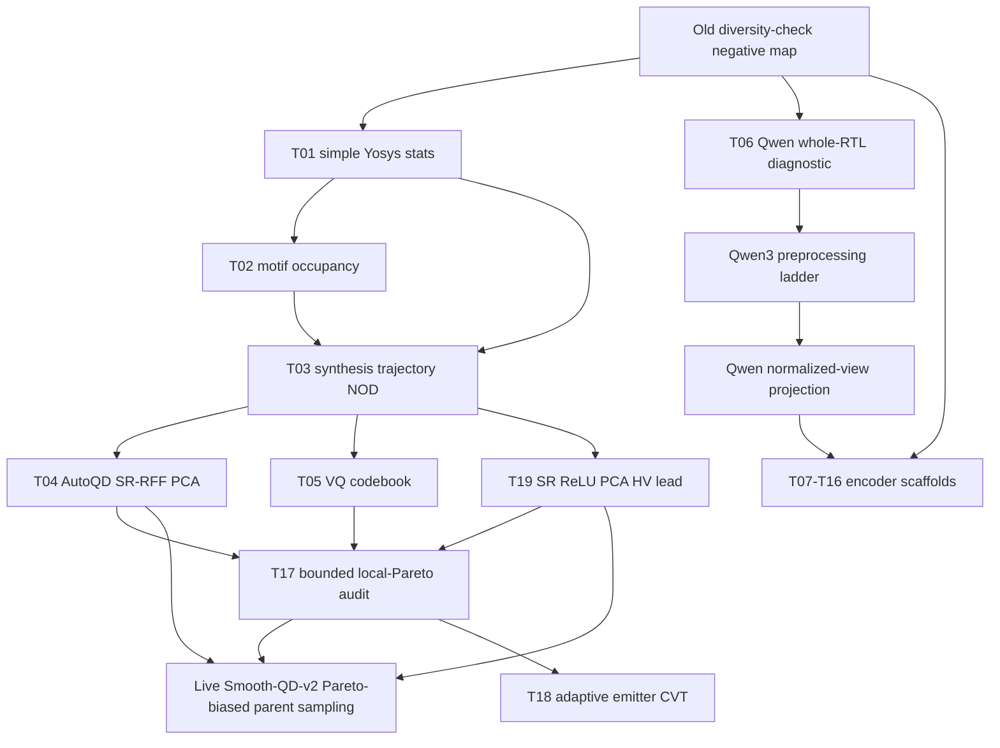

# Technique Lanes

This file tracks the search process by research lane rather than by
chronological technique ID. Use it with `techniques/technique_registry.csv`:
the registry says what exists, while this file explains why each method was
tried, what it taught us, and where the next iteration should go.

## Lane Summary

| Lane | Purpose | Current Evidence | Next Action |
| --- | --- | --- | --- |
| `L0` common evaluation | Keep every result on one passive archive and validity surface. | Central seed-1001 report and T01-T06/T17/T19 packages exist. | Build the final cross-method comparison once at least 10 packages have real results. |
| `L1` transparent CAD descriptors | Test cheap, reviewer-readable structure: Yosys stats, motifs, pathlets, ST-NOD. | T01/T02 are `T0`; T03 is a near-miss `T0`. | Hybridize ST-NOD with richer pathlet/reconvergence axes instead of pure motif occupancy. |
| `L2` synthesis-response automatic BDs | Use AutoQD-like transformations over non-PPA synthesis-response vectors. | T04 SR-RFF PCA is the first `T1 near_classic` lead; T19 SR ReLU has the strongest HV/AUC lead but remains `T0`. | Validate RFF/ReLU/raw PCA and ST-NOD+RFF variants under the same passive archive. |
| `L3` codebook/discrete archives | Test VQ/codebook cells over stable hardware vectors. | T05 direct VQ is `T0`, with one small per-problem HV win. | Reuse codebooks only as side archives or local-Pareto cells, not as direct parent pressure. |
| `L4` learned encoders | Try Qwen, DeepGate, DeepSeq, NetTAG, CircuitFusion, MGVGA, DE-HNN, DeepCell, AURORA. | T06 Qwen is `T0`; identifier-normalized Qwen has HV signal but nuisance clustering. | Run Qwen3 preprocessing ladder and normalized-view projection before raw embedding is retired. |
| `L5` archive coupling | Preserve hill-climbing pressure without collapsing to scalar weighted-sum fitness. | T17 passive MOME audit is `T0`; strong front-diversity signal, tiny HV delta. | Run a bounded Smooth-QD-v2-style live variant on SR-RFF or SR-ReLU with local Pareto fronts. |
| `L6` lineage and emitters | Use parent-child repair, invalid-to-valid transitions, and fixed emitter mixtures. | T12/T18 are scaffolded. | Use T17/T04 evidence to define exploit/explore/repair parent scheduling before live sampling. |

## Current Lineage

## Lane Notes

### `L1` Transparent CAD Descriptors

T01 and T02 are useful controls, not promotion candidates. They make the lower
bound clear: simple structural descriptors can preserve some coverage but lose
too much PPA quality or common-audit QD score. T03 is more important because
ST-NOD remains close on HV while losing common-audit QD score. That makes T03 a
source for hybrids, not a retired family.

Current follow-up: combine ST-NOD with pathlet/reconvergence features or with
the T17 local-Pareto retention rule.

### `L2` Synthesis-Response Automatic BDs

This is the strongest lane. T04 SR-RFF PCA is `T1 near_classic`: it remains
within a small quality tolerance, improves HV AUC and common-audit QD score, and
increases PPA-front unique netlists. It still loses some final HV and audit
occupancy, so it is not a finished positive claim.

T19 SR ReLU PCA is a different kind of lead. It improves final mean HV by
16.82% and HV AUC by 65.24% versus classic on the seed-1001 replay, with two
per-problem HV wins and no validity collapse. It stays `T0 diagnostic` because
final best fitness falls by 5.04%, PPA-front unique netlists fall by 8.33%, and
common-audit occupied cells fall by 16.67%.

Current follow-up: run a same-budget validation matrix for SR-RFF PCA, SR ReLU
PCA, SR raw PCA, and ST-NOD+RFF. The T17 audit suggests the RFF/ReLU family may
benefit from local Pareto fronts because many useful tradeoff candidates are
discarded by scalar-cell retention.

### `L3` Codebook/Discrete Archives

T05 shows direct VQ parent pressure is too expensive in PPA quality and
valid-PPA yield. The codebook idea should not be abandoned entirely, but it
should move from "the descriptor" to "a side archive" or "a cell partition with
local Pareto fronts."

Current follow-up: test VQ only with MOME-style retention or as an auxiliary
archive paired with SR-RFF/SR-ReLU exploitation.

### `L4` Learned Encoders

T06 shows Qwen3 embeddings contain signal but are contaminated by problem,
identifier, and corpus axes. Raw whole-file embeddings should not be promoted.
The useful question is preprocessing and projection: canonical RTL,
Yosys-normalized netlist text, structural summaries, pooled chunks, and
non-PPA contrastive or structural-bucket heads.

Current follow-up: run the Qwen3 preprocessing ladder before training a head.
If collapse diagnostics improve, escalate to Qwen projection or multimodal
fusion with graph descriptors.

### `L5` Archive Coupling

T17 addresses the user's concern that classic wins partly because it keeps
sampling higher-quality parents and hill-climbs. The passive local-Pareto audit
keeps nondominated candidates inside each descriptor cell rather than one scalar
elite. It recovers more PPA-front netlists and Pareto points, especially for
SR-RFF PCA, but its own HV delta is too small for promotion.

Current follow-up: run a live Smooth-QD-v2-style variant with non-PPA descriptor
cell assignment and evaluated-PPA parent sampling only after archive insertion:
50 percent local Pareto crowded tournament, 30 percent underfilled-cell
exploration, and 20 percent global nondominated-front sampling.

### `L6` Lineage And Emitters

T12 and T18 should not be generic new descriptors. They should use evidence from
T03/T04/T17 to bias mutation sources: repair-prone ancestors, underfilled cells,
and local Pareto fronts. This lane is for improving search dynamics while
leaving descriptor construction PPA-free.

Current follow-up: define adaptive emitter CVT as a versioned live-run method
after the T17 live variant is specified.

## Branching Guidance

Continue on `feat/journal-useful-bd-exp-20260622` for lightweight replay
packages, docs, and scripts. Create a new branch only when a lane needs a
long-running live vLLM run, incompatible dependency stack, or source checkout
that would make the current branch hard to review. Suggested branch suffixes:

- `feat/journal-useful-bd-exp-20260622-pareto-live`
- `feat/journal-useful-bd-exp-20260622-qwen-ladder`
- `feat/journal-useful-bd-exp-20260622-encoder-env`

Any branch split must keep the same revamp root, append to this file, and point
back to the source technique packages.
