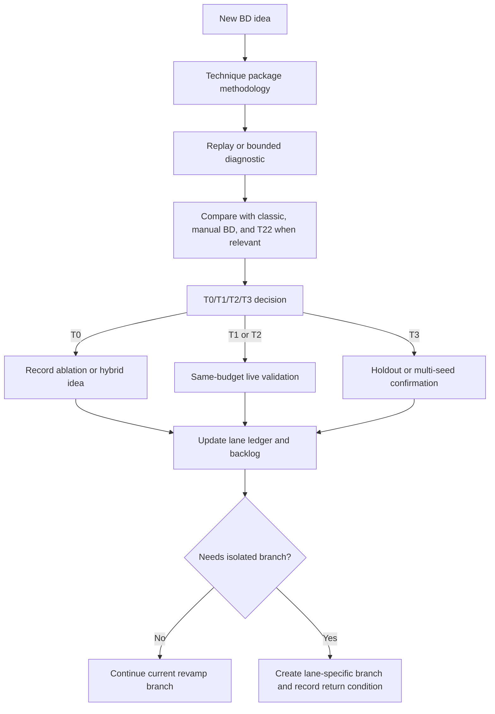

# Technique Lanes

This file tracks the search process by research lane rather than by
chronological technique ID. Use it with `techniques/technique_registry.csv`:
the registry says what exists, while this file explains why each method was
tried, what it taught us, and where the next iteration should go.

## How To Use This File

Read the lane summary first, then jump to the lane note for the active method.
Every technique package should be traceable in three directions:

- backward to the evidence or failed method that motivated it;
- sideways to required controls and ablations;
- forward to the next run, branch, or parking decision.

The chronological `Txx` index remains the source of truth for artifact paths.
This file is the source of truth for research lineage and process decisions.
When a technique changes direction, update the decision ledger in the same
commit as the technique package or run-result report.

## Maintenance Rule

Update this file whenever a technique package changes the search direction.
Each update should identify the lane, the evidence source, the decision tag,
and the next artifact or branch. Use these tags consistently:

| Tag | Meaning |
| --- | --- |
| `advance` | Run a live validation, holdout validation, or stronger ablation. |
| `ablate` | Keep the idea, but isolate which component caused the signal. |
| `hybridize` | Reuse the useful part inside another lane. |
| `park` | Keep the package as evidence, but do not spend live budget yet. |
| `control` | Keep as a required comparator or sanity check. |
| `retire` | Stop this direct variant unless new evidence changes the premise. |

## Lane Taxonomy

| Lane | Core Question | Typical Techniques | Promotion Signal | Recycle Or Stop Signal |
| --- | --- | --- | --- | --- |
| `L0` common evaluation | Are we comparing methods on a fair QD surface? | Common passive archives, random BD, validation gates. | Comparator exposes a real baseline or prevents overclaiming. | Metric can be gamed or does not separate classic/manual/random. |
| `L1` transparent CAD descriptors | Can simple hardware structure describe useful exploration axes? | Yosys stats, motif/pathlet counts, ST-NOD trajectories. | Near-classic PPA with better archive coverage or interpretable fronts. | Pure concatenation broadens cells while losing quality. |
| `L2` synthesis-response automatic BDs | Can non-PPA implementation response produce useful automatic BDs? | Raw/RFF/ReLU synthesis-response PCA, AutoQD-style transforms. | Beats classic and random on HV/AUC, front material, or audit QD without yield collapse. | Projection keeps diversity but loses best-PPA pressure. |
| `L3` codebook/discrete archives | Can vector quantization or discrete cells stabilize exploration? | VQ/codebook cells over synthesis-response or graph features. | Codebook improves local front recovery when paired with Pareto retention. | Direct codebook parent pressure loses quality or valid yield. |
| `L4` learned encoders | Can pretrained or trained circuit encoders reveal stronger BDs? | Qwen3, DeepGate, DeepSeq, NetTAG, CircuitFusion, AURORA. | Encoder separates behavioral/structural axes after normalization and beats non-learned controls. | Embeddings cluster by identifiers, problem identity, or corpus artifacts. T58 shows frozen T11 PCA4 can preserve yield under T51 but still fails as a primary front-broadening archive. |
| `L5` archive coupling | Can archive mechanics preserve diversity while retaining hill-climbing pressure? | Local Pareto cells, NSGA-II parent selection, Smooth-QD-style champion lanes. | Same-budget live run improves front/hypervolume metrics while preserving classic-covered designs. | Archive keeps many candidates but does not improve live optimization. |
| `L6` lineage and emitters | Can we bias search by repair dynamics and operator history? | Parent-child repair features, emitter mixtures, adaptive CVT. | Better valid-yield recovery or underexplored-cell improvement without reward leakage. | Lineage axes duplicate scalar fitness or become post-hoc reward proxies. |
| `L7` RTL-native descriptors | Can RTL operator/timing structure define useful implementation families? | MasterRTL/Yosys-SOG, RTLTimer timing-risk/path morphology, seeded RTL realization. | Archive cells preserve distinct RTL control/dataflow, pipeline, and timing-risk families while PPA improves. | Descriptor becomes a direct PPA predictor, leaks reference labels, or fails on common RTL constructs. |

## Lane Summary

| Lane | Purpose | Current Evidence | Next Action |
| --- | --- | --- | --- |
| `L0` common evaluation | Keep every result on one passive archive and validity surface. | Central seed-1001 report, T22 replay control, and T24 live random control now exist. | Keep random BD in every validation table before any positive claim. |
| `L1` transparent CAD descriptors | Test cheap, reviewer-readable structure: Yosys stats, motifs, pathlets, ST-NOD. | T01/T02 are `T0`; T03 is a near-miss `T0`; T21 expands coverage but loses quality. | Stop pure concatenation; use feature selection, CVT, or local-Pareto retention. |
| `L2` synthesis-response automatic BDs | Use AutoQD-like transformations over non-PPA synthesis-response vectors. | T04/T19/T20 replay leads survive as live diagnostics but not as promoted methods. | Add a quality/yield guard before larger SR-family runs. |
| `L3` codebook/discrete archives | Test VQ/codebook cells over stable hardware vectors. | T05 direct VQ is `T0`, with one small per-problem HV win. | Reuse codebooks only as side archives or local-Pareto cells, not as direct parent pressure. |
| `L4` learned encoders | Try Qwen, DeepGate, DeepSeq, NetTAG, CircuitFusion, MGVGA, DE-HNN, DeepCell, AURORA. | T58 preserves coverage and improves yield/best score with frozen T11 PCA4 under T51, but still loses HV, HV-AUC, and front breadth. | Stop primary graph-coordinate live archive tests unless the next method uses graph features as a secondary lane or trains a new encoder objective. |
| `L5` archive coupling | Preserve hill-climbing pressure without collapsing to scalar weighted-sum fitness. | T59 confirms short fail-pool feedback does not fix T51's front-breadth blocker. | Change front-slot creation directly or move features into a secondary archive lane before seed `1002`. |
| `L6` lineage and emitters | Use parent-child repair, invalid-to-valid transitions, and fixed emitter mixtures. | Direct code individuals fixed T50's budget/yield issue, but T59 shows short fail-pool feedback is insufficient. | Escalate only with measured source-level direct-code repair or a cleaner role-separated emitter. |
| `L7` RTL-native descriptors | Use pre-synthesis RTL structure and timing-risk morphology as behavior axes. | T72 runs the source-aligned T71 cells live and lands near classic on mean HV; T73 is pre-registered as the less-collapsed quantile-cell successor. | Run T73 only after storage and vLLM preflight, then compare against classic/T51/T66/T67/T72 on reference-complete PPA-front metrics. |

## Lane Scorecard

| Lane | Best Current Lead | Status | Main Blocker | Branch Strategy |
| --- | --- | --- | --- | --- |
| `L0` | T22 replay and T24 live random descriptor controls | Required comparator. | Random can look strong on AUC/front material, so claims need metric-specific controls. | Keep in this branch and every validation table. |
| `L1` | T03 ST-NOD near-miss | Hybrid source. | Direct transparent descriptors lose audit-QD or best quality. | Continue only as selected features inside T17/T24-style archives. |
| `L2` | T04 SR-RFF PCA, T19 SR ReLU PCA, and T20 SR raw PCA | Live diagnostic lane. | Descriptor signal survives execution but not multi-pipe best quality. | Revise descriptor/archive coupling with quality/yield guarding. |
| `L3` | T05 VQ codebook side archive | Parked. | Direct VQ pressure is too costly. | Reopen only as a side archive after local-Pareto live evidence. |
| `L4` | T11 contrastive feature selection, T35 replay coupling, T36 bounded front lane, T37 slot ablation, T38/T39/T40/T41/T42/T43 live hooks, T44 top-8 runtime bridge, T45 top-4 runtime bridge, T46 PCA4 projection, and T58 T51/T11-PCA4 cross-lane test | T58 is measured `T0 diagnostic_no_promotion`: it preserves coverage and improves yield/best score, but loses classic/T51 on HV, HV-AUC, and front breadth. | Retire frozen T11 PCA4 as a primary archive geometry. | Reopen only as a secondary/reporting lane or with a trained encoder objective that targets front creation without PPA leakage. |
| `L5` | T17/T23/T24/T25/T26/T27/T28/T29/T30/T31/T32/T35/T36/T37/T38/T39/T40/T41/T42/T43/T47-T59 local-Pareto lineage | T59 improves best score but loses classic on HV, HV-AUC, front breadth, unique PPA, and reference-beating count. | Retire exact T59; change front-slot creation or use secondary archive features. | A candidate must improve front material without hidden duplicate loss or default-reference headline dependence. |
| `L6` | T12/T18 scaffolded emitter ideas, T26 parent-source policy, T31 failure-feedback emitter, T32 front-preserving emitter, T49-T59 hard/tuning emitters | T51 remains the yield-recovery base; T59's short fail-pool feedback does not recover front breadth. | Escalate to source-level direct-code repair only with explicit yield/front counters. | Better front material than T51 without losing T51's yield and best-score recovery. |
| `L7` | T15 Yosys-SOG, T60/T61 RTLTimer timing-risk, T62 fused descriptors, T63 live screen, T64 operator/timing ablation, T65 secondary-cell audit, T66 coupled parent method, T67 seeded thought-code method, T68 upstream verification, T69 open-Yosys preprocessing, T70 generated RTL smoke, T71 source-aligned feature map, T72 source-aligned cell QD, and T73 shape-density QD | T72 is measured `T1 near_classic_not_promoted`; T73 is pre-registered from a collapse audit, not a live result. | Exact T72 cells are interpretable but too collapsed; T73 must prove the quantile-cell fix translates into front material. | Run T73 as the next bounded RTL-native screen before another source-aligned axis tweak. |

## Current Lineage

```mermaid
flowchart LR
  A[Older diversity-check negative map]

  subgraph L0[L0 common evaluation]
    Q[T22 random descriptor control]
    V[Common passive archive and gates]
  end

  subgraph L1[L1 transparent CAD descriptors]
    B[T01 simple Yosys stats]
    C[T02 motif occupancy]
    D[T03 synthesis trajectory NOD]
    P[T21 ST-NOD plus motif hybrid]
  end

  subgraph L2[L2 synthesis-response automatic BDs]
    O[T20 SR raw PCA ablation]
    E[T04 AutoQD SR-RFF PCA]
    N[T19 SR ReLU PCA]
  end

  subgraph L3[L3 codebook archives]
    F[T05 VQ codebook]
  end

  subgraph L4[L4 learned encoders]
    I[T06 Qwen diagnostic]
    J[T33 Qwen3 preprocessing ladder]
    K[Encoder projection or fine-tuning]
    AD[T07 graph surrogate replay]
    AE[T13 AURORA feature replay]
    AF[T14 hypergraph hybrid replay]
    AG[T11 contrastive replay]
    AH[T35 T11 Pareto coupling]
    AI[T36 bounded front lane]
    AJ[T37 slot count ablation]
    AK[T38 elite Pareto slot live]
    AL[T39 sparse-yield warmup]
    L[T08-T12 and T16 graph and multimodal scaffolds]
  end

  subgraph L5[L5 archive coupling]
    G[T17 passive local-Pareto audit]
    R[T23 SR Pareto validation matrix]
    H[Smooth-QD-style Pareto-biased parent sampling]
    S[T24 SR Pareto live validation]
    T[T25 guarded SR raw Pareto QD]
    U[T26 conservative exploit SR raw]
    X[T27 live QD audit]
    Y[T28 canonical family audit]
    Z[T29 front recovery diagnostic]
    AA[T30 T26 holdout audit]
    AB[T31 repair yield front emitter]
    AC[T32 front-preserving emitter]
    AM[T40 sparse-warmup controls]
    AN[T41 adaptive sparse-yield gate]
    AO[T42 initial sparse-yield gate]
    AP[T43 staged sparse-yield gate]
    AQ[T44 T11 runtime graph bridge]
    AR[T45 T11 top-4 graph bridge]
    AS[T46 T11 PCA4 graph projection]
    AT[T47 T26 contract probe]
    AU[T48 gated near-front fusion]
    AV[T49 thought-k role-separated repair]
    AW[T50 candidate/front control]
    AX[T51 code-thought front slot]
    AY[T52 code-thought full Pareto]
    AZ[T53 sparse-front trigger]
    BA[T54 front-slot lane]
    BB[T55 coarse SR2 front-slot]
    BC[T56 coarse SR2 T51-control]
  end

  subgraph L6[L6 lineage and emitters]
    M[T18 adaptive emitter CVT]
    W[T12 lineage repair descriptors]
  end

  subgraph L7[L7 RTL-native descriptors]
    BD[T15 Yosys-SOG proxy]
    BE[T60 RTLTimer timing risk]
    BF[T61 problem-local timing risk]
    BG[T62 fused RTL-native proxy]
    BH[T63 fused RTL-native live screen]
    BI[T64 operator timing live screen]
    BJ[T65 secondary cells]
    BK[T66 RTL-native guarded parents]
    BL[T67 seeded thought RTL]
    BM[T68 source verification]
    BN[T69 open-Yosys preprocessing]
    BO[T70 generated RTL smoke]
    BP[T71 feature map]
    BQ[T72 source-aligned cell QD]
    BR[T73 shape-density quantile QD]
  end

  A --> Q
  A --> B
  A --> I
  B --> C
  B --> D
  C --> P
  D --> P
  D --> O
  D --> F
  O --> E
  O --> N
  E --> G
  N --> G
  F --> G
  G --> R
  R --> H
  E --> H
  N --> H
  H --> S
  S --> T
  T --> U
  U --> X
  X --> Y
  Y --> Z
  Z --> AA
  AA --> AB
  AB --> AC
  I --> J
  J --> K
  K --> AD
  AD --> AE
  AE --> AF
  AF --> AG
  AG --> AH
  AH --> AI
  AI --> AJ
  AJ --> AK
  AK --> AL
  AL --> AM
  AM --> AN
  AN --> AO
  AO --> AP
  AP --> AQ
  AQ --> AR
  AR --> AS
  U --> AT
  AA --> AT
  AT --> AU
  AU --> AV
  AV --> AW
  AW --> AX
  AX --> AY
  AY --> AZ
  AZ --> BA
  BA --> BB
  BB --> BC
  AL --> AX
  AL --> L
  L --> BD
  BD --> BE
  AX --> BE
  BE --> BF
  BD --> BG
  BF --> BG
  BG --> BH
  BH --> BI
  BI --> BJ
  BJ --> BK
  BK --> BL
  BL --> BM
  BM --> BN
  BN --> BO
  BO --> BP
  BP --> BQ
  BQ --> BR
  G --> M
  G --> W
```

## Iteration Flow

## Decision Ledger

| Date | Lane | Evidence | Tag | Decision | Next Artifact |
| --- | --- | --- | --- | --- | --- |
| 2026-06-21 | `L0` common evaluation | T22 random descriptor control | `control` | Random archive partitioning is a nontrivial comparator, so positive claims must beat it on the claimed metric. | Keep T22 in every validation table and central report. |
| 2026-06-21 | `L1` transparent CAD descriptors | T01/T02/T03/T21 replay packages | `hybridize` | Transparent features are useful for interpretation and ablations, but direct cells lose too much quality or passive-QD score. | Feed selected ST-NOD/motif features into local-Pareto or feature-selection variants. |
| 2026-06-21 | `L2` synthesis-response automatic BDs | T04 SR-RFF PCA | `advance` | Strongest near-classic automatic-BD lead; improves common-audit QD and front material while staying close on HV/best. | Bounded live SR-RFF local-Pareto validation. |
| 2026-06-21 | `L2` synthesis-response automatic BDs | T19 SR ReLU PCA | `advance` | Strongest final-HV and HV-AUC source, but it needs quality-safe parent pressure. | Live or passive ablation paired with local-Pareto retention and T22 comparator. |
| 2026-06-21 | `L2` synthesis-response automatic BDs | T20 raw PCA | `ablate` | Raw synthesis-response PCA preserves validity and front material, but loses too much best quality. | Use as the no-RFF/no-ReLU ablation in SR-family reports. |
| 2026-06-21 | `L3` codebook/discrete archives | T05 VQ codebook | `park` | Direct codebook pressure loses quality and yield; the codebook may still help as a side archive. | Revisit only after local-Pareto retention is live. |
| 2026-06-21 | `L4` learned encoders | T06 Qwen diagnostic | `ablate` | Raw whole-RTL embeddings are not enough; preprocessing and projection remain open. | Qwen3 canonical-RTL/netlist preprocessing ladder on an isolated env branch if needed. |
| 2026-06-22 | `L4` learned encoders | T33 method card | `advance` | T33 pre-registers the Qwen3 preprocessing ladder with raw, commentless, role-normalized, canonical RTL, canonical Yosys-netlist, and summary-plus-netlist views before any projection-head training. | Completed by the T33 replay row below. |
| 2026-06-22 | `L4` learned encoders | T33 replay and direct PPA front | `ablate` | Canonical RTL and identifier-role RTL modestly beat lexical HV, but the netlist views that reduce problem/corpus collapse lose on HV and do not improve direct front hits. | Try a bounded projection/head hybrid with explicit anti-collapse pressure, or move to graph encoders. |
| 2026-06-22 | `L4` learned encoders | T34 method card | `advance` | T34 tests a label-free PCA-residual projection over T33 Qwen views to remove dominant embedding axes without PPA, problem, or corpus labels. | Run replay and direct raw PPA-front diagnostics against T33 controls. |
| 2026-06-22 | `L4` learned encoders | T34 PCA-residual replay | `retire` | T34 preserves T33's canonical/identifier RTL HV signal but high-HV residuals still have high same-problem collapse; lower-collapse netlist residuals remain below lexical HV. | Stop label-free whole-design Qwen projection variants; move to graph encoders or a genuinely different training objective. |
| 2026-06-22 | `L4` learned encoders | T07 graph-surrogate replay and direct raw PPA fronts | `advance` | Standard-cell graph WL/combo features give a tiny HV lead over lexical (+0.07%) and improve unique PPA points, while reducing Qwen-style same-problem collapse. The front-hit count remains below lexical, so this is a replay lead rather than a useful-BD claim. | Try a true DeepGate/AIG dependency path or contrastive graph encoder; keep `deepgate_multi_problem_ppa_pareto_fronts.png` as the required visual gate. |
| 2026-06-22 | `L4` learned encoders | T13 AURORA-style implementation replay | `hybridize` | Raw implementation features improve HV by +1.06% versus lexical and improve unique PPA points, but PCA/RFF/incremental bottlenecks lose HV and raw features still miss lexical front hits. | Reuse the raw feature vector in feature selection or local-Pareto coupling; do not continue plain unsupervised compression. |
| 2026-06-22 | `L4` learned encoders | T14 DE-HNN-style hypergraph replay | `hybridize` | Hypergraph-only descriptors lose HV, but the hypergraph+implementation hybrid keeps a +1.01% HV lead and improves unique PPA to 187; front hits remain below lexical. | Use feature selection or contrastive training to keep the HV/unique-PPA signal while explicitly retaining front hits. |
| 2026-06-22 | `L4` learned encoders | T11 MGVGA-style structural contrastive replay | `hybridize` | Top-64/weighted contrastive descriptors improve HV by +1.82% over lexical and recover one front hit versus T14, but still trail lexical front hits 120 versus 122. | Use T11 as the feature-selection baseline; add local-Pareto coupling or collapse-penalized contrastive training before live budget. |
| 2026-06-22 | `L4/L5` learned encoders and archive coupling | T35 T11 Pareto-coupling replay | `ablate` | Cell-local Pareto retention improves direct front hits to 126 versus lexical's 122 but loses 8.97% HV; front-seeded retention reaches 132 front hits and +4.39% HV but is only an upper-bound diagnostic because it uses global PPA-front membership. | Preserve T11's farthest/HV selector and add only a small bounded front lane before any live budget. |
| 2026-06-22 | `L4/L5` learned encoders and archive coupling | T36 T11 bounded-front replay | `advance` | One bounded local-front slot improves HV to 3.851344 (+4.04% versus lexical) and direct front hits to 126, beating lexical, T11, and fitness-top on the claimed replay metrics. The quota arms collapse to the same one-slot lane. | T37 completed the slot-count ablation; next is one-slot live validation before any final useful-BD claim. |
| 2026-06-22 | `L4/L5` learned encoders and archive coupling | T37 explicit slot-count replay | `advance` | Slot zero reproduces T11, one slot reproduces the T36 win, and two or more local-front slots lose too much HV. The one-slot setting is the useful replay boundary. | Run same-budget live validation of exactly one bounded local-front slot with direct raw PPA-front figures as the first visual gate. |
| 2026-06-22 | `L5` archive coupling | T38 elite Pareto slot live arm | `ablate` | The runtime retains ALU and traffic-light archive/front material, but multi-pipe has 7 valid PPA and 3 front points with zero active archive members because warmup needs 8 successes. | Create a T39 sparse-yield warmup/fallback variant before broad controls. |
| 2026-06-22 | `L5` archive coupling | T39 sparse-yield warmup live arm | `advance` | T39 fixes T38's multi-pipe archive gap: 11 valid PPA, 8 local-front points, 6 global-front points, and 10 active archive members, while ALU best quality drops versus T38. | T40 completed the required controls and blocks broad promotion. |
| 2026-06-22 | `L0/L5` common evaluation and archive coupling | T40 sparse-warmup control matrix | `ablate` | T40 validates the control matrix and direct raw PPA-front gate. T39 wins multi-pipe best score and two pooled-front hits, but classic owns ALU and traffic-light pooled fronts and best scores. | Specify adaptive/per-design sparse-yield gating before another live one-slot variant. |
| 2026-06-22 | `L5` archive coupling | T41 adaptive sparse-yield gate | `ablate` | T41 passes validation and wins traffic-light with 7 pooled hits and best score `0.473631`, but loses ALU to classic and loses the T39 multi-pipe signal. | T42 completed the generation-0 trigger check and blocks simple global-trigger escalation. |
| 2026-06-22 | `L5` archive coupling | T42 initial sparse-yield gate | `ablate` | T42 passes validation and its direct raw PPA front adds one ALU pooled hit and one multi-pipe pooled hit, but it loses T41 traffic-light and misses T39 multi-pipe best score. | T43 completed the staged sparse-yield follow-up. |
| 2026-06-22 | `L5` archive coupling | T43 staged sparse-yield gate | `ablate` | T43 preserves all classic-covered designs and validates, but all archives complete strict warmup, the staged `0.60` lane never activates, and direct raw PPA fronts show zero pooled hits. | Stop blind champion-pressure tuning; use a bounded sparse-trigger screen or branch exact T11 runtime projection. |
| 2026-06-22 | `L4/L5` learned encoders and archive coupling | T44 T11 runtime graph bridge smoke | `advance` | T44 adds live-safe top-8 graph features from T11's replay manifest to the runtime descriptor registry and confirms the profile runs through `run_backend.py`; the smoke produced no valid PPA and is not a tier result. | Run the full three-problem T44 screen before richer fitted T11 projection or more parent-pressure tuning. |
| 2026-06-22 | `L4/L5` learned encoders and archive coupling | T44 T11 runtime graph bridge live result | `ablate` | T44 preserves all classic-covered designs and wins HV on traffic-light plus multi-pipe, but aggregate HV/reference-beating count fall and ALU/traffic-light valid-PPA yield drops exceed the 50% gate. | Pre-register a lower-dimensional T11 runtime profile, such as top-3/top-4 axes or a frozen non-PPA projection, with the same Phase 03.1 viewer gates. |
| 2026-06-22 | `L4/L5` learned encoders and archive coupling | T45 compact T11 runtime graph method card | `advance` | T45 reduces T44's top-8 profile to the first four pre-registered graph axes while keeping the archive substrate, model, subset, seed, budget, operator, and visualization gates fixed. | Superseded by the live-result row below. |
| 2026-06-22 | `L4/L5` learned encoders and archive coupling | T45 compact T11 runtime graph live result | `retire` direct ranked-axis bridge | T45 preserves all classic-covered designs and avoids the 50% yield-warning threshold, but classic wins mean HV `0.2043` versus `0.1775`, value-level HV outcomes are two classic wins plus one zero-HV tie, mean Pareto points are `3.67` versus `3.33`, valid-PPA samples are `61` versus `41`, and classic wins every best-score comparison. | Do not run direct top-16/top-64 ranked axes next; switch to a frozen non-PPA projection or make graph axes a secondary lane. |
| 2026-06-22 | `L4/L5` learned encoders and archive coupling | T46 frozen T11 PCA graph method card | `advance` projection ablation | T46 projects T44's top-8 graph features through a frozen non-PPA four-component PCA fit from T14 graph-feature rows, keeping T45's live settings and visualization gates fixed. | Superseded by the live-result row below. |
| 2026-06-22 | `L4/L5` learned encoders and archive coupling | T46 frozen T11 PCA graph live result | `retire` direct graph-axis primary lane | T46 preserves all three classic-covered designs, avoids the 50 percent valid-PPA warning, wins ALU HV (`0.2046` versus `0.1962`), and contributes one ALU pooled raw-front hit. Classic still wins mean HV (`0.1588` versus `0.1155`), HV wins (`2` versus `1`), reference-beating count, valid-PPA samples, and traffic-light quality. | Do not run another direct graph-axis dimensionality tweak next; move graph features to a secondary archive/reporting role or trained-encoder input. |
| 2026-06-22 | `L5/L6` archive coupling and emitters | T47 T26 contract probe hard/tuning result | `retire` exact T26 held-out escalation | Exact T26 keeps positive mean best-score delta (`+0.024728`) and no classic-covered valid-PPA losses, but loses mean HV (`-0.015483`), mean HV-AUC (`-0.018435`), valid-PPA samples (`428` versus `538`), and aggregate PPA-front points (`53` versus `61`). | Do not launch exact T26 held-out from T47; implement the T48 near-front descriptor-compatible fusion gate first. |
| 2026-06-22 | `L5/L6` archive coupling and emitters | T48 gated near-front fusion implementation | `advance` live run | T48 keeps T26's SR raw descriptor, local Pareto archive, champion lane, and hard/tuning surface, but reintroduces only low-probability two-parent fusion when both parents are near-front and descriptor-compatible. The opt-in gate, counters, fallback path, CLI plumbing, and focused tests are implemented. | Run the T48 QD arm on the T47 hard/tuning comparator surface and package HV/HV-AUC, validity, parent-gate counters, and direct PPA-front figures. |
| 2026-06-23 | `L5/L6` archive coupling and emitters | T48 gated near-front fusion hard/tuning result | `retire` direct T26.1 fusion escalation | T48 has zero classic-covered valid-PPA losses and improves over T47 in some yield/gating behavior, but still loses mean HV (`-0.010183`), mean HV-AUC (`-0.015628`), valid PPA (`452` versus `538`), and aggregate front points (`51` versus `61`) versus classic, with three yield warnings. | Specify a role-separated champion, local-rank-1, and bounded-repair emitter before any held-out spend. |
| 2026-06-23 | `L5/L6` archive coupling and emitters | T49 thought-k role-separated repair method card | `advance` bounded live screen | T49 moves the T48 follow-up from code-individual two-parent fusion to thought-only role separation: champion archive parents, non-champion NSGA-II near-front parents, and bounded sample-local repair with no broad fail-feedback prompt injection. | Run seed `1001` on the T47/T48 hard/tuning comparator surface; package repair counters and direct raw-PPA fronts before deciding on seed `1002`. |
| 2026-06-23 | `L5/L6` archive coupling and emitters | T49 thought-k role-separated repair hard/tuning result | `ablate` repair-only role separation | T49 preserves all classic-covered valid-PPA designs and improves mean best score by `+0.067203`, but loses mean HV, valid-PPA count, aggregate front points, unique PPA points, and reference-beating candidates. | Do not promote T49 or launch held-out spend from it; specify a front-preserving repair/emitter follow-up first. |
| 2026-06-23 | `L5/L6` archive coupling and emitters | T50 candidate-matched thought front method card | `advance` candidate/front control | T50 keeps T49's thought-only role separation but restores `population_size=12`, disables repair, and widens the per-cell Pareto cap to `8` so front retention is tested under a visible matched evaluated-code budget. | Run seed `1001`, package against T47 classic roots, and compare directly to T47/T48/T49 before any seed `1002` or held-out spend. |
| 2026-06-23 | `L5/L6` archive coupling and emitters | T50 candidate-matched thought front partial result | `retire` candidate/front control | T50 improves mean best score by `+0.063433` on the 12 completed problems, but loses mean HV, HV-AUC, valid-PPA count, front points, unique PPA points, and reference-beating candidates; `Prob153_gshare` did not finish. | Do not run T50 seed `1002`; specify a new front/yield-preserving emitter before held-out spend. |
| 2026-06-23 | `L5/L6` archive coupling and emitters | T51 code-thought front-slot method card | `advance` bounded live screen | T51 changes the mechanism instead of rerunning T50: it restores direct code individuals, keeps the single-thought operator, uses one local front slot per cell, and lowers sparse-yield warmup to `4`. | Run seed `1001` on the T47 hard/tuning surface, then package against T47-T50 before seed `1002` or held-out spend. |
| 2026-06-23 | `L5/L6` archive coupling and emitters | T51 code-thought front-slot hard/tuning result | `ablate` front-preserving follow-up | T51 restores the candidate budget, increases valid-PPA count to `266` versus classic's `257`, improves HV-AUC, and improves best score, but loses mean HV and front points. | Do not use T51 as the RTLLM headline method. Keep code-individual yield recovery and add a stronger front-preserving mechanism. |
| 2026-06-23 | `L5/L6` archive coupling and emitters | T54 front-slot lane hard/tuning result | `retire` immediate parent-lane lineage | T54 preserved classic-covered designs and improved mean best score, but lost mean HV (`0.075892` versus `0.092601`), HV-AUC (`0.062753` versus `0.082020`), valid-PPA count (`253` versus `257`), and front points (`21` versus `30`). The front-slot lane had only `4` hits from `12` requests. | Stop small parent-lane tweaks; next change should create better front slots, return to exact T11 runtime projection, or use a learned/auxiliary archive lane. |
| 2026-06-23 | `L5/L6` archive coupling and emitters | T55 coarse SR2 front-slot method card | `advance` bounded live screen | T55 keeps T54 fixed except the archive axes: it uses `--qd_descriptor_axes sr_pca_0 sr_pca_1` so grid-quantile cells are coarser and local front slots can form more often. | Commit the pre-run package, prove emitted `descriptor_axes` is two-axis before live spend, run seed `1001`, and compare slot hits, front breadth, HV, HV-AUC, and validity against classic plus T51 through T54. |
| 2026-06-23 | `L5/L6` archive coupling and emitters | T55 coarse SR2 front-slot result | `ablate` positive mechanism only | T55 improves T54 slot hits (`9` versus `4`), front points (`23` versus `21`), and yield warnings (`0` versus `2`), but still loses classic on HV, HV-AUC, valid PPA, front breadth, unique PPA, and reference-beating candidates. | Do not spend seed `1002` on exact T55. Either isolate coarse geometry with a T51-control ablation or switch mechanisms to exact T11 runtime projection / learned auxiliary archive lanes. |
| 2026-06-23 | `L5/L6` archive coupling and emitters | T56 coarse SR2 T51-control method card | `advance` geometry isolation control | T56 keeps T51 fixed except the archive axes: it uses `--qd_descriptor_axes sr_pca_0 sr_pca_1` while retaining `nsga2_global_rank` parent selection and no fixed front-slot parent lane. | Run seed `1001` before any further coarse-geometry variants; compare directly against classic, T51, and T55. |
| 2026-06-23 | `L5/L6` archive coupling and emitters | T56 coarse SR2 T51-control result | `retire` coarse SR2 primary path | T56 preserves classic-covered coverage but loses classic on HV, HV-AUC, valid PPA, front points, unique PPA, and reference-beating candidates; it also loses T51 on every primary metric except one extra front point. | Switch mechanism to exact T11 runtime projection, learned auxiliary archive lanes, or a front-yield protected emitter before any seed `1002`. |
| 2026-06-23 | `L5/L6` archive coupling and emitters | T57 T51 adaptive-rebin method card | `advance` archive-mechanics ablation | T57 keeps T51's descriptor, operator, parent policy, one-slot archive, warmup, and yield path fixed, then enables KS-triggered grid-quantile rebinning. | Run seed `1001`; require rebin check evidence and compare against classic, T51 off-mode, and T56 before any seed `1002`. |
| 2026-06-23 | `L5/L6` archive coupling and emitters | T57 T51 adaptive-rebin result | `retire` exact adaptive-rebin path | T57 emits 26 checks but 0 rebins, has one classic-covered valid-PPA loss, loses classic on HV/HV-AUC/front/unique/reference-beating metrics, and loses T51 on HV/HV-AUC/best/valid-PPA/reference-beating metrics. | Do not spend seed `1002`; leave T51 archive-boundary tweaks and test exact T11 runtime projection, learned auxiliary archive lanes, or a front-yield protected emitter. |
| 2026-06-23 | `L4/L5/L6` learned projection and archive coupling | T58 T51 T11-PCA4 front-slot method card | `advance` cross-lane live screen | T58 keeps T51's code-thought front-slot emitter and swaps only the archive coordinates to T46's frozen T11 PCA4 graph projection. This tests whether graph projection failed because of the older T39/T45 substrate, without another graph-axis dimensionality tweak. | Superseded by the result row below. |
| 2026-06-23 | `L4/L5/L6` learned projection and archive coupling | T58 T51 T11-PCA4 front-slot result | `retire` primary graph-coordinate archive | T58 preserves classic-covered valid-PPA designs and improves valid PPA (`266` versus `257`) plus best score (`+0.021823`), but loses classic on HV (`-0.016348`), HV-AUC (`-0.015787`), front points (`-8`), unique PPA points (`-16`), and reference-beating candidates (`-12`). It also loses T51 on HV, HV-AUC, best score, unique PPA, and reference-beating count. | Do not spend seed `1002` on exact T58. Move graph features to secondary/reporting lanes or a trained encoder objective; next live method should be a front-yield protected emitter. |
| 2026-06-23 | `L5/L6` archive coupling and emitters | T59 T51 feedback front-slot method card | `advance` same-budget live screen | T59 keeps T51's direct-code SR-PCA path and T54's front-slot lane, then adds short fail-pool feedback with `qd_operator_fail_feedback_chars=600`. It is not bounded local repair and does not add extra candidate evaluations. | Preflight vLLM and run seed `1001` on the frozen 13-problem hard/tuning surface before any feedback-length tuning or source-level direct-code repair work. |
| 2026-06-23 | `L5/L6` archive coupling and emitters | T59 T51 feedback front-slot result | `retire` exact feedback front-slot path | T59 completes all 13 problems and passes single-thought/Pareto validators, but loses classic on HV (`-0.005882`), HV-AUC (`-0.002960`), valid PPA (`-16`), front points (`-10`), unique PPA (`-27`), and reference-beating candidates (`-13`) despite best score `+0.059826`. Prob153 triggers a yield warning. | Do not spend seed `1002` on exact T59; change front-slot creation, add measured source-level repair, or use secondary archive features. |
| 2026-06-23 | `L7` RTL-native descriptors | T15/T60/T61 proxy sequence | `hybridize` structural and timing proxies | T15 proves flattened Yosys-SOG lowering works on all 670 full-RTLLM valid-PPA candidates. T61 turns the timing-risk front-cell proxy positive, but both standalone proxies lose occupied-cell breadth. | Fuse SOG structure with timing-risk morphology before any live archive spend. |
| 2026-06-23 | `L7` RTL-native descriptors | T62 fused RTL-native proxy result | `advance` guarded live screen only | T62 improves mean front-cell delta to `+0.161290` for `operator_timing` and `state_pipeline`, but all fused profiles still lose occupied-cell breadth. The package includes reference-complete completeness data and does not use PPA as descriptor input. | Use T62 as live-screen motivation only; a live lane must be reference-complete, PPA-free, duplicate-aware, and include direct PPA-front figures. |
| 2026-06-23 | `L7` RTL-native descriptors | T63 fused RTL-native live screen | `ablate` or `secondary_archive` | T63 completes seed `1001`, preserves classic valid-PPA coverage (`257` versus `257`), and improves T51 front-material signals, but classic wins mean HV (`0.092601` versus `0.089551`), HV-AUC (`0.082020` versus `0.074125`), and front points (`30` versus `25`). | Do not spend seed `1002` on exact `state_pipeline`; try `operator_timing` or use RTL-native axes as secondary/reporting archive evidence. |
| 2026-06-23 | `L7` RTL-native descriptors | T64 fused operator/timing method card | `advance` narrow ablation | T64 keeps T63's generator, subset, seed, archive mechanics, token budgets, and validators fixed, changing only the descriptor profile to `fused_rtl_operator_timing_2d`. | Run seed `1001`; compare against classic, T51, and T63 before any seed `1002` or secondary-archive redesign. |
| 2026-06-23 | `L7` RTL-native descriptors | T64 fused operator/timing result | `retire` exact primary geometry | T64 improves valid-PPA yield (`283` versus classic `257`) and active archive members (`88` versus T63 `69`), but loses classic on mean HV (`0.092601` versus `0.084572`), HV-AUC (`0.082020` versus `0.072750`), front points (`30` versus `23`), unique PPA (`87` versus `74`), and reference-beating candidates (`46` versus `38`). | Do not spend seed `1002` on exact T64. Reuse MasterRTL/RTLTimer-style descriptors as secondary/reporting cells or redesign the generator/archive coupling. |
| 2026-06-23 | `L7` RTL-native descriptors | T65 RTL-native secondary-cell audit | `retire` pure secondary overlay | T65 scores T51/T63/T64 unique-PPA candidates with source-level RTLTimer secondary cells. Every method/profile loses Classic on problem-paired mean front-cell delta; the closest is T63 `control_pipeline` at `-0.076923`. | Do not run a live method that only adds reporting cells. The next RTL-native method must use descriptors to affect parent choice, repair selection, or another measured coupling point without PPA leakage. |
| 2026-06-23 | `L7` RTL-native descriptors | T66 RTL-native front-guarded parent method card | `advance` coupled live screen | T66 keeps T63's `fused_rtl_state_pipeline_2d` descriptor and uses it for `front_slot_lane_nsga2` parent pressure plus low-rate `near_front_descriptor` gated fusion. | Run seed `1001` on the hard/tuning surface only after descriptor probe and vLLM preflight; compare against classic, T51, T63, and T64 with reference-complete PPA claims. |
| 2026-06-23 | `L7` RTL-native descriptors | T66 RTL-native front-guarded parent result | `retire` exact guarded-parent settings | T66 improves best score (`+0.050092`), valid PPA (`+3`), unique PPA (`+3`), and reference-beating candidates (`+2`) on a reference-complete screen, but loses mean HV (`-0.011308`), HV-AUC (`-0.010577`), and front points (`-10`). Two-parent fusion did not trigger. | Do not spend seed `1002` on exact T66. Redesign RTL-native coupling around stronger front creation, source-level repair/selection, or secondary archive evidence. |
| 2026-06-23 | `L7/L6` RTL-native descriptors and emitters | T67 RTL-native seeded thought result | `park` exact method, `hybridize` yield clue | T67 improves valid-PPA yield but loses front points, unique PPA breadth, reference-beating count, and `Prob153_gshare` coverage. | Do not rerun exact T67. Reuse seeded realization only with front-preserving repair or source selection. |
| 2026-06-23 | `L7` RTL-native descriptors | T68 source-verified RTL-native extractor check | `gate` upstream-equivalence claims | MasterRTL and RTL-Timer upstream examples can be inspected, but their fresh conversion scripts require Verific. MasterRTL graph parse on shipped SOG yields `51337` node-dict entries and `65938` graph edges; RTL-Timer route-word SOG slack has Pearson `0.846441` and Spearman `0.385196` against net slack. | Do not claim true MasterRTL/RTL-Timer descriptor use until a Verific-capable flow or source-aligned preprocessing adaptation runs on our candidates. |
| 2026-06-23 | `L7` RTL-native descriptors | T69 open-Yosys RTL-native preprocessing | `advance` candidate extractor smoke | Open-clean TinyRocket preprocessing works without Verific for both MasterRTL and RTL-Timer. MasterRTL graph keys, edges, and node-dict entries stay within about 1.1% of shipped TinyRocket; RTL-Timer preserves the shipped SOG BOG DFF-reference count exactly. | Run the source-aligned extractor on generated RTL candidates before another RTL-native live QD spend. |
| 2026-06-23 | `L7` RTL-native descriptors | T70 generated RTL extractor smoke | `advance` source-aligned feature table | `19/19` sampled generated T67 candidates pass both MasterRTL SOG extraction and RTL-Timer SOG BOG extraction. The sample includes five candidates without prior `code.syn.v`. | Define source-aligned descriptor features and archive-cell mapping before another RTL-native live QD spend. |
| 2026-06-23 | `L7` RTL-native descriptors | T71 source-aligned feature map | `advance` live cell-coupled method | The 19 T70 candidates occupy `9/16` cells in a PPA-free map built from MasterRTL graph-edge operator scale and RTL-Timer DFF state/timing class. Largest cell count is `4`; archive entropy is `3.010571` bits. | Pre-register a live QD method that uses T71 cells for parent selection, local-front retention, secondary archive pressure, or source-level repair. |
| 2026-06-23 | `L7` RTL-native descriptors | T72 source-aligned RTL cell QD method card | `advance` live screen | T72 keeps T66's hard/tuning front-slot parent-pressure surface, replaces proxy RTL-native axes with the exact T71 source-aligned cell contract, and disables two-parent fusion. The runtime hook reproduces the full T70 table without PPA leakage. | Preflight vLLM, run the bounded T72 hard/tuning screen, and package reference-complete PPA evidence. |
| 2026-06-23 | `L7` RTL-native descriptors | T72 matched classic comparison | `ablate` exact cell map | T72 preserves all `13/13` classic-covered designs and trails classic mean HV by only about `0.65%`, but classic wins HV wins (`9` versus `4`), mean Pareto points (`2.31` versus `1.31`), and mean reference-beating candidates (`3.54` versus `2.85`). | Do not promote exact T72. Keep the source-aligned contract, but widen or rebin the RTL-native cell signal before another live spend. |
| 2026-06-21 | `L5` archive coupling | T17 passive MOME audit | `advance` | Scalar-cell retention discards useful local front material. | Implement bounded local-Pareto retention as a live search variant. |
| 2026-06-21 | `L5` archive coupling | T23 validation matrix | `advance` | SR-RFF and SR-ReLU beat random on different metrics, so the next run should test the archive mechanism, not another passive table only. | Candidate branch: `feat/journal-useful-bd-exp-20260622-pareto-live`. |
| 2026-06-21 | `L5` archive coupling | T24 live command package and vLLM preflight | `advance` | Existing `pareto_front` cell mode and NSGA-II parent selection are sufficient for the next live validation; the open item is execution, not archive-code invention. | Run `T24_sr_pareto_live_validation/commands/live_screen_v0.md`. |
| 2026-06-21 | `L5` archive coupling | T24 classic-vs-SR-RFF live result | `ablate` | SR-RFF local-Pareto runs end to end and preserves all three classic-covered problems, but the multi-pipe best-score and valid-PPA yield regression blocks promotion. | Compare with SR ReLU, then run SR raw/control arms before a family-level claim. |
| 2026-06-21 | `L5` archive coupling | T24 SR ReLU live result | `ablate` | SR ReLU also runs end to end and preserves all three classic-covered problems, with more front material than SR-RFF on traffic light and multi-pipe, but still loses too much multi-pipe best quality. | Compare with SR raw and live controls before a family-level claim. |
| 2026-06-21 | `L5` archive coupling | T24 SR raw live result | `ablate` | SR raw runs end to end, preserves all three classic-covered problems, improves ALU best score, and has the strongest SR-family multi-pipe front material, but still loses too much multi-pipe best quality and violates the traffic-light synthesis-validity gate. | Use as the front-material control for a quality/yield-guarded emitter variant. |
| 2026-06-21 | `L0` common evaluation | T24 random live result | `control` | Random runs end to end and preserves all three classic-covered problems, but is weaker than SR raw on ALU and multi-pipe front material and weaker than manual BD on traffic-light best score. | Keep as the required live random comparator. |
| 2026-06-21 | `L5` archive coupling | T24 manual BD live result | `ablate` | Manual BD improves ALU and traffic-light best scores without a yield collapse, but still loses 73.16% relative multi-pipe best score. | Use manual BD as the traffic-light quality control for the next guarded variant. |
| 2026-06-21 | `L5` archive coupling | T24 complete six-arm live matrix | `ablate` | Local Pareto cells and NSGA-II parent selection run end to end and preserve classic-covered designs, but every QD arm loses too much multi-pipe best quality. | Specify a quality/yield-guarded emitter or parent-pressure variant before larger live sampling. |
| 2026-06-21 | `L5` archive coupling | T25 guarded SR raw method card | `advance` | T25 keeps the SR raw descriptor and local Pareto archive but reduces improve-phase backfill and two-parent fusion to test quality/yield recovery without changing the BD. | Result captured in the T25 live-result row below. |
| 2026-06-21 | `L5` archive coupling | T25 guarded SR raw live result | `ablate` | T25 preserves all classic-covered designs and validates the Pareto archive, but traffic-light valid-PPA count falls from 30 to 9 and multi-pipe best score drops 75.20% versus classic, worse than unguarded SR raw. | Specify T26 emitter/parent-source variant using SR raw as front-material control and manual BD as traffic-light quality control. |
| 2026-06-21 | `L5/L6` archive coupling and emitters | T26 conservative exploit method card | `advance` | T26 keeps SR raw/local Pareto but restores T24's fill/repair/seed pressure, removes two-parent crossover, and makes archive-parent draws mostly champion-biased. | Run `T26_sr_raw_conservative_exploit_qd/commands/live_screen_v0.md`. |
| 2026-06-21 | `L5/L6` archive coupling and emitters | T26 conservative exploit live result | `diagnostic` | T26 preserves all classic-covered designs and has local best-score signals, but the later reference-complete RTLLM analysis shows the broad positive headline was fragile. | Treat T26 as mechanism context, not a positive QD proof. |
| 2026-06-21 | `L5/L6` archive coupling and emitters | T27 live QD audit | `downgrade` reference-complete caveat | The early audit reported aggregate T26 HV/HV-AUC wins, but those wins are not claim-safe after the full RTLLM reference-complete correction. T26 remains useful as a mechanism clue, not as a broad positive result. | Use reference-complete comparisons for any future T26-family claim; do not cite the early aggregate win as proof. |
| 2026-06-21 | `L5/L6` archive coupling and emitters | T28 canonical family audit | `advance` | T26's valid-PPA pool is not duplicate collapse: it has the highest valid-family ratio and one more reference-beating family than classic. The blocker is real front-family coverage: T26 has 9 front families versus classic's 19 and SR raw's 16. | Run T26 holdout or an SR raw front-recovery variant with direct PPA-front figures and the Phase 03.1 viewer. |
| 2026-06-21 | `L5/L6` archive coupling and emitters | T29 front-recovery method card | `advance` | T29 keeps SR raw PCA and T26's archive substrate, but lowers champion pressure to 0.60 and restores limited 0.20 two-parent fusion to test front recovery before any promotion claim. | Run `T29_sr_raw_front_recovery_qd/commands/live_screen_v0.md`. |
| 2026-06-21 | `L5/L6` archive coupling and emitters | T29 live front-recovery result | `retire` | T29 does not recover front material: mean HV, HV-AUC, valid PPA, total front points, and multi-pipe final-PPA coverage all regress versus T26. Direct PPA-front plots show only two multi-pipe front points. | Do not continue blind T24/T26 schedule interpolation; run T26 holdout or specify a T31 repair/yield/front-preserving emitter. |
| 2026-06-21 | `L5/L6` archive coupling and emitters | T30 holdout method card | `advance` | T30 tests whether exact T26 conservative-exploit SR raw generalizes to the frozen VerilogEval holdout screen before adding a new emitter. | Run `T30_t26_holdout_front_audit/commands/live_holdout_v0.md`. |
| 2026-06-21 | `L5/L6` archive coupling and emitters | T30 live holdout result | `advance` | T26 preserves all three classic-covered holdout designs, improves mean final-best score by 9.91%, and produces positive normalized HV from P135. It also drops valid PPA samples from 103 to 68, has a P098 yield warning at 15 versus 31 valid PPA samples, ties candidate-level front points at 3, and has fewer front netlists than classic. | Specify T31 repair/yield/front-preserving emitter with `T30_t26_holdout_front_audit/figures/t30_holdout_ppa_pareto_area_power_candidate_zoom.png` as a primary control figure. |
| 2026-06-22 | `L5/L6` archive coupling and emitters | T31 failure-feedback repair method card | `advance` | T31 keeps T26's SR raw descriptor/archive, NSGA-II parent selection, and 0.80 champion lane, but switches to code-individual `single_thought_operator` with 1200-character fail-pool feedback. It avoids `thought_only` and extra repair calls because prior evidence showed those can trade away PPA quality. | Run `T31_sr_raw_fail_feedback_repair_qd/commands/live_holdout_v0.md`, then package T31 against T30 classic/T26 controls. |
| 2026-06-22 | `L5/L6` archive coupling and emitters | T31 live holdout result | `retire` | T31 preserves 3/3 final-best coverage, but valid PPA drops to 56, P098 drops to 14 valid PPA samples, mean final-best score drops to 0.201770, HV/HV-AUC are zero, and unique PPA points fall to 6. | Do not retry direct fail-feedback repair; specify a front-preserving emitter/archive ensemble with T26/T30/T31 controls. |
| 2026-06-22 | `L5/L6` archive coupling and emitters | T32 front-preserving emitter method card | `advance` | T32 keeps the T26/T30 SR raw archive substrate, lowers champion pressure only to 0.72, adds a small 0.08 two-parent success-parent lane, and removes T31's direct fail-feedback text. The primary visual gate is a straightforward raw area-power Pareto figure plus candidate-level data to regenerate it. | Run `T32_sr_raw_front_preserving_emitter_qd/commands/live_holdout_v0.md`, then package it against T30 classic/T26 and T31 failed-repair controls. |
| 2026-06-22 | `L5/L6` archive coupling and emitters | T32 live holdout result | `retire` | T32 improves P098 valid PPA to 19 and unique PPA points to 9, but mean final-best score stays at T31's 0.201770, HV/HV-AUC stay zero, and the direct raw PPA plot shows no recovery of T26's P135 low-area/low-power point. | Stop simple champion/two-parent tuning; use T32 as a P098-yield hint for a role-separated repair/local-rank-1 emitter or switch to another lane. |
| 2026-06-21 | `L6` lineage and emitters | T12/T18 scaffolds plus T17/T24/T25 evidence | `hybridize` | Lineage/emitter methods should improve search dynamics around SR-family descriptors, not become generic descriptor resets. | Specify exploit/explore/repair scheduling from the observed T24/T25 failures. |

## Lane Notes

### `L1` Transparent CAD Descriptors

T01 and T02 are useful controls, not promotion candidates. They make the lower
bound clear: simple structural descriptors can preserve some coverage but lose
too much PPA quality or common-audit QD score. T03 is more important because
ST-NOD remains close on HV while losing common-audit QD score. That makes T03 a
source for hybrids, not a retired family.

Current follow-up: combine ST-NOD with pathlet/reconvergence features or with
the T17 local-Pareto retention rule. T21 shows simple ST-NOD plus motif
concatenation should not be the next deterministic live method: it increases
PPA-front unique netlists by 66.67% and common-audit cells by 33.33%, but drops
best fitness by 10.90% and common-audit QD score by 25.98%.

### `L0` Common Evaluation

T22 makes the control bar explicit. Random hash improves HV AUC by 35.69% and
PPA-front unique netlists by 75.00% versus classic, despite losing final HV,
common-audit cells, and common-audit QD score. Future positive claims must
therefore beat classic, manual BD, and random descriptor on the specific metric
being claimed.

T24 adds the same random descriptor as a live local-Pareto control. It preserves
all three classic-covered problems but loses 71.33% best score on
`Prob015_multi_pipe_8bit` and triggers a 73.33% relative traffic-light
synthesis-validity drop. It is a required comparator, not a promotion lead.

### `L2` Synthesis-Response Automatic BDs

This is the strongest lane. T04 SR-RFF PCA is `T1 near_classic`: it remains
within a small quality tolerance, improves HV AUC and common-audit QD score, and
increases PPA-front unique netlists. It still loses some final HV and audit
occupancy, so it is not a finished positive claim.

T19 SR ReLU PCA is a different kind of lead. It improves final mean HV by
16.82% and HV AUC by 65.24% versus classic on the seed-1001 replay, with two
per-problem HV wins and no validity collapse. It stays `T0 diagnostic` because
final best fitness falls by 5.04%, PPA-front unique netlists fall by 8.33%, and
common-audit occupied cells fall by 16.67%.

T20 SR raw PCA is the necessary ablation. It preserves valid-PPA count and
common-audit occupied cells, increases PPA-front unique netlists by 16.67%, and
increases motif signatures by 11.63%. It remains `T0 diagnostic` because final
best fitness falls by 9.97% and common-audit QD score falls by 15.11%.

Current follow-up: revise the SR-family archive coupling. The completed T24
matrix shows that local-Pareto retention produces valid front material and
preserves classic-covered designs, but every QD arm loses too much
`Prob015_multi_pipe_8bit` best quality for promotion.

### `L3` Codebook/Discrete Archives

T05 shows direct VQ parent pressure is too expensive in PPA quality and
valid-PPA yield. The codebook idea should not be abandoned entirely, but it
should move from "the descriptor" to "a side archive" or "a cell partition with
local Pareto fronts."

Current follow-up: test VQ only with MOME-style retention or as an auxiliary
archive paired with SR-RFF/SR-ReLU exploitation.

### `L4` Learned Encoders

T06 shows Qwen3 embeddings contain signal but are contaminated by problem,
identifier, and corpus axes. Raw whole-file embeddings should not be promoted.
The useful question is preprocessing and projection: canonical RTL,
Yosys-normalized netlist text, structural summaries, pooled chunks, and
non-PPA contrastive or structural-bucket heads.

Current follow-up: T34 closed the bounded label-free Qwen projection ablation
as `T0`; T07 showed graph WL/combo can produce a tiny HV lead; T13 shows the
uncompressed implementation-feature vector is stronger than compressed AURORA
bottlenecks; T14 shows hypergraph incidence features can add unique PPA
breadth only when combined with that implementation vector; T11 shows
contrastive feature selection is the strongest L4 HV replay lead so far. The
next L4 method should preserve the T11 signal while adding local-Pareto
coupling or collapse-penalized contrastive training. Direct raw PPA-front
figures and viewers remain the first visual gate.

### `L5` Archive Coupling

T17 addresses the user's concern that classic wins partly because it keeps
sampling higher-quality parents and hill-climbs. The passive local-Pareto audit
keeps nondominated candidates inside each descriptor cell rather than one scalar
elite. It recovers more PPA-front netlists and Pareto points, especially for
SR-RFF PCA, but its own HV delta is too small for promotion.

T23 narrows the next live target. SR-RFF PCA beats classic and T22 random on
common-audit QD score and local front material while staying within the
near-classic quality tolerance. SR ReLU PCA beats classic and random on final
HV and HV AUC, but does not beat random on local front material.

T25 keeps SR raw and tests whether lower improve-phase backfill plus less
two-parent fusion recovers quality/yield without changing the descriptor. It
does not. T25 preserves all classic-covered designs, but multi-pipe best score
falls 75.20% versus classic, worse than SR raw's 57.09% loss, and
traffic-light valid-PPA count falls from classic's 30 to 9.

T26 keeps the same SR raw descriptor but restores T24-style fill pressure,
removes two-parent crossover, and biases archive-parent draws toward the
champion lane. This recovers best-quality pressure on the development screen,
but the later reference-complete RTLLM analysis downgrades the broad T26
headline to mechanism context rather than positive proof.

T27 audits T26 against the live T24/T25 controls. The early aggregate table
reported mean live HV and HV-AUC wins, but the later full RTLLM
reference-complete correction downgrades that result to a fragile diagnostic.
The remaining useful clue is mechanism-level: T26 can preserve covered designs
and generate distinct candidates, but it does not beat classic on the
claim-safe broad comparison. The blocker is still front diversity: the live
family audit shows 9 front families versus classic's 19 and SR raw's 16.

T29 tests the simplest front-recovery hypothesis: lower T26 champion pressure
and restore limited two-parent archive fusion. It fails. Mean HV falls by
22.12% versus T26, HV-AUC falls by 18.06%, valid PPA falls by 26.32%, and
multi-pipe loses final-PPA coverage. Direct PPA-front plots show only two
multi-pipe rank-1 front points.

T30 runs T26 holdout validation before any new emitter. It supports T26 as a
holdout-competitive quality-pressure method: final-best coverage is preserved
on all three VerilogEval holdout problems, mean best score improves by 9.91%,
and P135 supplies positive normalized HV. It also keeps the central blocker
alive: P098 valid PPA samples fall from 31 to 15, candidate-level front points
tie classic at 3, and front netlists fall from 9 to 6.

Current follow-up: direct T31 fail-feedback repair and T32 small near-front
success-parent tuning are both retired. Use classic as the holdout comparator,
T26 as the quality-pressure control, T29 as the failed front-recovery control,
and T30/T31/T32 direct raw PPA Pareto figures as required visual comparisons
for any stronger role-separated emitter/archive ensemble.

### `L6` Lineage And Emitters

T12 and T18 should not be generic new descriptors. They should use evidence from
T03/T04/T17 to bias mutation sources: repair-prone ancestors, underfilled cells,
and local Pareto fronts. This lane is for improving search dynamics while
leaving descriptor construction PPA-free.

Current follow-up: T29 shows champion-pressure reduction alone can break
multi-pipe survival, while T30 shows T26 still needs P098 yield and front
breadth repair. A repair/yield emitter should therefore keep T26-style champion
refinement and add a bounded repair/front-preservation lane rather than
replacing champion pressure with generic two-parent exploration.

### `L7` RTL-Native Descriptors

T15 converts the MasterRTL/SOG scaffold into a reproducible Yosys-backed proxy.
It lowers all 670 full-RTLLM valid-PPA candidates with zero failures and uses
problem-local SOG cells over operator-mix and state/control ratios. The result
is useful frontend evidence, but not a promotion: exact T26 has a slightly
negative mean front-cell delta and loses occupied-cell breadth.

T60/T61 add timing-risk morphology. T61's problem-local timing-risk bins give a
small front-cell clue, but also lose occupied-cell breadth. T62 fuses T15 and
T61 into operator/timing, state/pipeline, and complexity/entropy profiles. It
raises the best mean front-cell proxy to `+0.161290`, but still loses occupied
cell breadth, so the lane remains a proxy direction rather than a promoted
result.

T63 is the guarded live archive test for the `state_pipeline` profile. T64 is
the matched `operator_timing` ablation. T66 couples the `state_pipeline`
profile to front-slot parent pressure. All three keep descriptor inputs
PPA-free and report reference-complete PPA, direct raw PPA fronts, and
Phase 03.1 viewer artifacts. T64 and T66 improve valid-PPA yield, and T66 also
improves best score, but the live screens lose the classic headline front
metrics. Exact fused RTL-native primary archive geometry should pause until the
generator/archive coupling changes.

T67 completed the next coupling change. It keeps the `state_pipeline` profile
but tests source-preserving seeded thought-code realization instead of another
parent-pressure or fusion tweak. The run improved aggregate valid-PPA yield,
but it did not fix the front-creation problem: classic still wins front
points, unique PPA breadth, and gshare coverage.

T68/T69 separate source-alignment from live QD behavior. T68 verifies that
upstream MasterRTL/RTL-Timer examples are partly usable and that our earlier
T15/T60/T61 features are proxy lanes. T69 then shows a narrow TinyRocket
open-Yosys path: remove `read -verific`, keep the upstream SOG/BOG lowering
intent, apply upstream-style generated-attribute cleanup, and confirm that the
generated MasterRTL and RTL-Timer artifacts stay close to shipped examples.
T70 applies that path to generated T67 candidates and gets `19/19` pass rates
for both extractors. T71 then defines the first source-aligned archive-cell
map from those outputs: MasterRTL graph-edge scale by RTL-Timer DFF/state
class, with `9/16` cells occupied and no PPA leakage. T72 evaluates that map
live and preserves all covered designs, but it is not promoted because classic
still wins HV wins and front breadth. T73 keeps the source-aligned contract
and changes only the cell geometry to `grid_quantile` over MasterRTL
branching, RTL-Timer wire density, and RTL-Timer DFF density. Its pre-run audit
shows the same T72 candidates occupy a mean of `5.6923` problem-local quantile
cells versus `1.0769` T72 live fixed cells; this is a reason to run T73, not a
PPA claim.

## Branching Guidance

Continue on `feat/journal-useful-bd-exp-20260622` for lightweight replay
packages, docs, and scripts. Create a new branch only when a lane needs a
long-running live vLLM run, incompatible dependency stack, or source checkout
that would make the current branch hard to review. Suggested branch suffixes:

- `feat/journal-useful-bd-exp-20260622-pareto-live`
- `feat/journal-useful-bd-exp-20260622-qwen-ladder`
- `feat/journal-useful-bd-exp-20260622-encoder-env`
- `feat/journal-useful-bd-exp-20260622-rtl-native-bd`

Any branch split must keep the same revamp root, append to this file, and point
back to the source technique packages.

## Branch And Iteration Queue

Use this table to decide whether a lane stays on the current branch, gets a
focused follow-up branch, or is parked until another lane creates evidence that
unblocks it.

| Lane | Source IDs | Current Branch State | Next Iteration | Return Condition |
| --- | --- | --- | --- | --- |
| `L0` common evaluation | T22, T24 random | Stays on current branch as a comparator. | Keep random/manual controls in every claim table. | Comparator rows are present for any method marked `advance` or better. |
| `L1` transparent CAD descriptors | T03, T21 | Stays on current branch for hybrids. | Select a small ST-NOD/motif subset for a guarded archive variant. | Hybrid beats direct T21 on best quality without losing archive coverage. |
| `L2` synthesis-response automatic BDs | T04, T19, T20, T24, T25, T26, T27, T28, T29, T30, T31, T32 | Stays on current branch; T29/T31/T32 are measured negative, while T30 is mixed holdout support for T26. | Pause simple SR raw schedule tuning. | New method improves front/yield without losing T26 quality pressure. |
| `L3` codebook/discrete archives | T05 | Parked. | Reopen only as side archive or local-Pareto cell partition. | A non-codebook lane shows local front material worth discretizing. |
| `L4` learned encoders | T06-T16, T33, T34, T07, T11, T13, T14, T35-T43, T58 | T58 completed the bounded T51/T11-PCA4 cross-lane test and failed promotion on HV/front breadth. | Stop exact frozen graph-coordinate primary archive tests. | Reopen only with secondary/reporting graph lanes or a trained encoder objective that improves front creation without PPA leakage. |
| `L5` archive coupling | T17, T23, T24, T25, T26, T27, T28, T29, T30, T31, T32, T35-T43, T47-T59 | Active on current branch; T59 did not improve front material enough and lost aggregate HV/HV-AUC. | Retire exact T59 and choose a different front-creation mechanism. | A candidate improves T51 front material without hidden duplicate loss or default-reference headline dependence. |
| `L6` lineage and emitters | T12, T18, T26, T27, T28, T29, T30, T31, T32, T49-T59 | T51 shows code-individual single-thought recovery is useful but incomplete; T59 shows short fail-pool feedback is insufficient. | Source-level direct-code repair needs explicit yield/front counters before another live spend. | Better front material than T51 without losing T51 valid-yield or best-score recovery. |
| `L7` RTL-native descriptors | T15, T60, T61, T62, T63, T64, T65, T66, T67, T68, T69, T70, T71, T72, T73 | T73 is pre-registered after T72's near-classic but front-negative result. | Run T73 as the less-collapsed source-aligned quantile-cell screen. | A successor improves live front metrics without default-reference or PPA-leakage claims. |

## Branch Split Checklist

A branch split is justified when the next step needs a long live vLLM run, a
new dependency stack, an external source checkout, or a method-specific env that
would make this branch harder to review. Before creating that branch, record:

- lane and source technique IDs;
- intended technique package ID;
- run output root under `exp/useful_bd_push/`;
- required comparator set, including T22 when a positive claim is possible;
- return condition for merging the result back into this revamp directory.

## Result Update Template

When a technique lands new evidence, update the package docs and this lane file
with the same compact shape:

| Field | Required Content |
| --- | --- |
| Lane | `L#` lane plus the chronological `T##` package. |
| Evidence | Replay, live run, validation matrix, diagnostic, or failed setup. |
| Comparator | Classic, manual BD, random BD, and any lane-specific ablation. |
| Main signal | Best score, HV/AUC, front material, archive coverage, validity, or synthesis yield. |
| Failure mode | What blocks promotion or what must be guarded in the next variant. |
| Decision | One of `advance`, `ablate`, `hybridize`, `park`, `control`, or `retire`. |
| Next artifact | Exact technique package, branch, command file, table, or figure to update next. |
