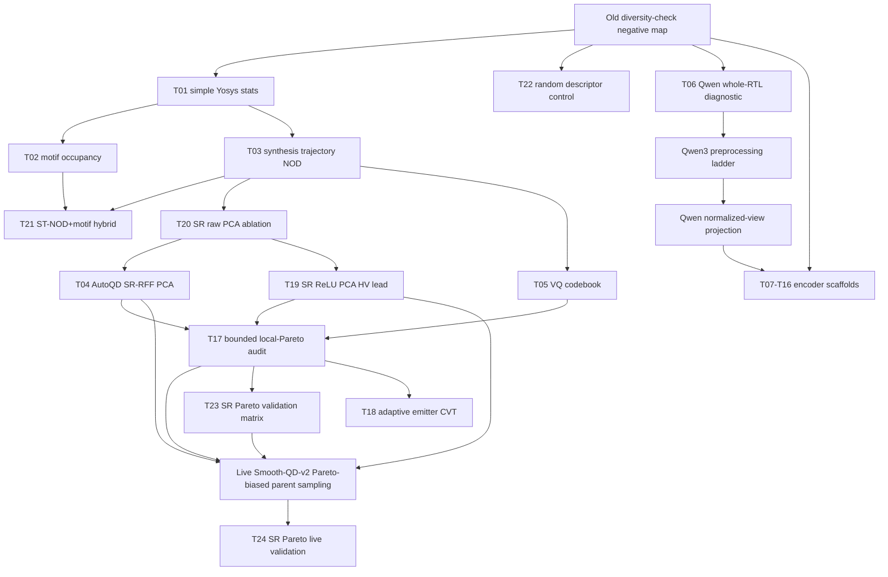

# Technique Lanes

This file tracks the search process by research lane rather than by
chronological technique ID. Use it with `techniques/technique_registry.csv`:
the registry says what exists, while this file explains why each method was
tried, what it taught us, and where the next iteration should go.

## Maintenance Rule

Update this file whenever a technique package changes the search direction.
Each update should identify the lane, the evidence source, the decision tag,
and the next artifact or branch. Use these tags consistently:

| Tag | Meaning |
| --- | --- |
| `advance` | Run a live validation, holdout validation, or stronger ablation. |
| `ablate` | Keep the idea, but isolate which component caused the signal. |
| `hybridize` | Reuse the useful part inside another lane. |
| `park` | Keep the package as evidence, but do not spend live budget yet. |
| `control` | Keep as a required comparator or sanity check. |
| `retire` | Stop this direct variant unless new evidence changes the premise. |

## Lane Summary

| Lane | Purpose | Current Evidence | Next Action |
| --- | --- | --- | --- |
| `L0` common evaluation | Keep every result on one passive archive and validity surface. | Central seed-1001 report and T22 random control package now exist. | Keep random BD in every validation table before any positive claim. |
| `L1` transparent CAD descriptors | Test cheap, reviewer-readable structure: Yosys stats, motifs, pathlets, ST-NOD. | T01/T02 are `T0`; T03 is a near-miss `T0`; T21 expands coverage but loses quality. | Stop pure concatenation; use feature selection, CVT, or local-Pareto retention. |
| `L2` synthesis-response automatic BDs | Use AutoQD-like transformations over non-PPA synthesis-response vectors. | T04 SR-RFF PCA is the first `T1 near_classic` lead; T19 SR ReLU has the strongest HV/AUC lead; T20 raw PCA is the ablation near-miss. | Promote T04/T19 into a bounded live local-Pareto run, with T20 as ablation evidence. |
| `L3` codebook/discrete archives | Test VQ/codebook cells over stable hardware vectors. | T05 direct VQ is `T0`, with one small per-problem HV win. | Reuse codebooks only as side archives or local-Pareto cells, not as direct parent pressure. |
| `L4` learned encoders | Try Qwen, DeepGate, DeepSeq, NetTAG, CircuitFusion, MGVGA, DE-HNN, DeepCell, AURORA. | T06 Qwen is `T0`; identifier-normalized Qwen has HV signal but nuisance clustering. | Run Qwen3 preprocessing ladder before heavier fine-tuning or external graph-encoder branches. |
| `L5` archive coupling | Preserve hill-climbing pressure without collapsing to scalar weighted-sum fitness. | T17 passive MOME audit is `T0`; T23 validates SR-RFF/SR-ReLU against T22 random control. | Run a bounded Smooth-QD-v2-style live variant on SR-RFF or SR-ReLU with local Pareto fronts. |
| `L6` lineage and emitters | Use parent-child repair, invalid-to-valid transitions, and fixed emitter mixtures. | T12/T18 are scaffolded. | Use T17/T04 evidence to define exploit/explore/repair parent scheduling before live sampling. |

## Current Lineage

## Decision Ledger

| Date | Lane | Evidence | Tag | Decision | Next Artifact |
| --- | --- | --- | --- | --- | --- |
| 2026-06-21 | `L0` common evaluation | T22 random descriptor control | `control` | Random archive partitioning is a nontrivial comparator, so positive claims must beat it on the claimed metric. | Keep T22 in every validation table and central report. |
| 2026-06-21 | `L1` transparent CAD descriptors | T01/T02/T03/T21 replay packages | `hybridize` | Transparent features are useful for interpretation and ablations, but direct cells lose too much quality or passive-QD score. | Feed selected ST-NOD/motif features into local-Pareto or feature-selection variants. |
| 2026-06-21 | `L2` synthesis-response automatic BDs | T04 SR-RFF PCA | `advance` | Strongest near-classic automatic-BD lead; improves common-audit QD and front material while staying close on HV/best. | Bounded live SR-RFF local-Pareto validation. |
| 2026-06-21 | `L2` synthesis-response automatic BDs | T19 SR ReLU PCA | `advance` | Strongest final-HV and HV-AUC source, but it needs quality-safe parent pressure. | Live or passive ablation paired with local-Pareto retention and T22 comparator. |
| 2026-06-21 | `L2` synthesis-response automatic BDs | T20 raw PCA | `ablate` | Raw synthesis-response PCA preserves validity and front material, but loses too much best quality. | Use as the no-RFF/no-ReLU ablation in SR-family reports. |
| 2026-06-21 | `L3` codebook/discrete archives | T05 VQ codebook | `park` | Direct codebook pressure loses quality and yield; the codebook may still help as a side archive. | Revisit only after local-Pareto retention is live. |
| 2026-06-21 | `L4` learned encoders | T06 Qwen diagnostic | `ablate` | Raw whole-RTL embeddings are not enough; preprocessing and projection remain open. | Qwen3 canonical-RTL/netlist preprocessing ladder on an isolated env branch if needed. |
| 2026-06-21 | `L5` archive coupling | T17 passive MOME audit | `advance` | Scalar-cell retention discards useful local front material. | Implement bounded local-Pareto retention as a live search variant. |
| 2026-06-21 | `L5` archive coupling | T23 validation matrix | `advance` | SR-RFF and SR-ReLU beat random on different metrics, so the next run should test the archive mechanism, not another passive table only. | Candidate branch: `feat/journal-useful-bd-exp-20260622-pareto-live`. |
| 2026-06-21 | `L5` archive coupling | T24 live command package and vLLM preflight | `advance` | Existing `pareto_front` cell mode and NSGA-II parent selection are sufficient for the next live validation; the open item is execution, not archive-code invention. | Run `T24_sr_pareto_live_validation/commands/live_screen_v0.md`. |
| 2026-06-21 | `L6` lineage and emitters | T12/T18 scaffolds plus T17 evidence | `hybridize` | Lineage/emitter methods should improve search dynamics around SR-RFF/SR-ReLU, not become generic descriptor resets. | Specify exploit/explore/repair scheduling after the first live local-Pareto run. |

## Lane Notes

### `L1` Transparent CAD Descriptors

T01 and T02 are useful controls, not promotion candidates. They make the lower
bound clear: simple structural descriptors can preserve some coverage but lose
too much PPA quality or common-audit QD score. T03 is more important because
ST-NOD remains close on HV while losing common-audit QD score. That makes T03 a
source for hybrids, not a retired family.

Current follow-up: combine ST-NOD with pathlet/reconvergence features or with
the T17 local-Pareto retention rule. T21 shows simple ST-NOD plus motif
concatenation should not be the next deterministic live method: it increases
PPA-front unique netlists by 66.67% and common-audit cells by 33.33%, but drops
best fitness by 10.90% and common-audit QD score by 25.98%.

### `L0` Common Evaluation

T22 makes the control bar explicit. Random hash improves HV AUC by 35.69% and
PPA-front unique netlists by 75.00% versus classic, despite losing final HV,
common-audit cells, and common-audit QD score. Future positive claims must
therefore beat classic, manual BD, and random descriptor on the specific metric
being claimed.

### `L2` Synthesis-Response Automatic BDs

This is the strongest lane. T04 SR-RFF PCA is `T1 near_classic`: it remains
within a small quality tolerance, improves HV AUC and common-audit QD score, and
increases PPA-front unique netlists. It still loses some final HV and audit
occupancy, so it is not a finished positive claim.

T19 SR ReLU PCA is a different kind of lead. It improves final mean HV by
16.82% and HV AUC by 65.24% versus classic on the seed-1001 replay, with two
per-problem HV wins and no validity collapse. It stays `T0 diagnostic` because
final best fitness falls by 5.04%, PPA-front unique netlists fall by 8.33%, and
common-audit occupied cells fall by 16.67%.

T20 SR raw PCA is the necessary ablation. It preserves valid-PPA count and
common-audit occupied cells, increases PPA-front unique netlists by 16.67%, and
increases motif signatures by 11.63%. It remains `T0 diagnostic` because final
best fitness falls by 9.97% and common-audit QD score falls by 15.11%.

Current follow-up: use T23 to specify a same-budget live local-Pareto validation
for SR-RFF PCA and SR ReLU PCA, with SR raw PCA retained as the SR-family
ablation. The T17 audit suggests the RFF/ReLU family may benefit from local
Pareto fronts because many useful tradeoff candidates are discarded by
scalar-cell retention.

### `L3` Codebook/Discrete Archives

T05 shows direct VQ parent pressure is too expensive in PPA quality and
valid-PPA yield. The codebook idea should not be abandoned entirely, but it
should move from "the descriptor" to "a side archive" or "a cell partition with
local Pareto fronts."

Current follow-up: test VQ only with MOME-style retention or as an auxiliary
archive paired with SR-RFF/SR-ReLU exploitation.

### `L4` Learned Encoders

T06 shows Qwen3 embeddings contain signal but are contaminated by problem,
identifier, and corpus axes. Raw whole-file embeddings should not be promoted.
The useful question is preprocessing and projection: canonical RTL,
Yosys-normalized netlist text, structural summaries, pooled chunks, and
non-PPA contrastive or structural-bucket heads.

Current follow-up: run the Qwen3 preprocessing ladder before training a head.
If collapse diagnostics improve, escalate to Qwen projection or multimodal
fusion with graph descriptors.

### `L5` Archive Coupling

T17 addresses the user's concern that classic wins partly because it keeps
sampling higher-quality parents and hill-climbs. The passive local-Pareto audit
keeps nondominated candidates inside each descriptor cell rather than one scalar
elite. It recovers more PPA-front netlists and Pareto points, especially for
SR-RFF PCA, but its own HV delta is too small for promotion.

T23 narrows the next live target. SR-RFF PCA beats classic and T22 random on
common-audit QD score and local front material while staying within the
near-classic quality tolerance. SR ReLU PCA beats classic and random on final
HV and HV AUC, but does not beat random on local front material.

Current follow-up: execute T24. The package uses non-PPA descriptor assignment,
bounded per-cell Pareto fronts, NSGA-II global parent sampling, and a
50 percent champion lane. The package must remain `pending_live_run` until the
full command matrix finishes and figures/tables are inspected.

### `L6` Lineage And Emitters

T12 and T18 should not be generic new descriptors. They should use evidence from
T03/T04/T17 to bias mutation sources: repair-prone ancestors, underfilled cells,
and local Pareto fronts. This lane is for improving search dynamics while
leaving descriptor construction PPA-free.

Current follow-up: define adaptive emitter CVT as a versioned live-run method
after the T17 live variant is specified.

## Branching Guidance

Continue on `feat/journal-useful-bd-exp-20260622` for lightweight replay
packages, docs, and scripts. Create a new branch only when a lane needs a
long-running live vLLM run, incompatible dependency stack, or source checkout
that would make the current branch hard to review. Suggested branch suffixes:

- `feat/journal-useful-bd-exp-20260622-pareto-live`
- `feat/journal-useful-bd-exp-20260622-qwen-ladder`
- `feat/journal-useful-bd-exp-20260622-encoder-env`

Any branch split must keep the same revamp root, append to this file, and point
back to the source technique packages.

## Branch Split Checklist

A branch split is justified when the next step needs a long live vLLM run, a
new dependency stack, an external source checkout, or a method-specific env that
would make this branch harder to review. Before creating that branch, record:

- lane and source technique IDs;
- intended technique package ID;
- run output root under `exp/useful_bd_push/`;
- required comparator set, including T22 when a positive claim is possible;
- return condition for merging the result back into this revamp directory.
