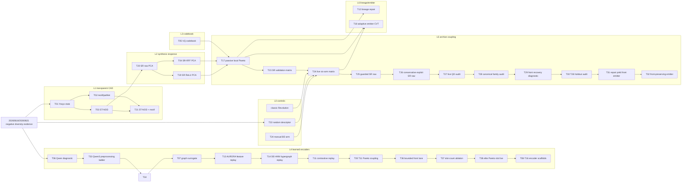

# Technique Lineage Ledger

This is the skim-first process map for the useful-BD push. It complements
`technique_lanes.md`: this file tracks category, lineage, current result, and
branch decision in one place; `technique_lanes.md` keeps the detailed rationale,
lane notes, decision ledger, and Mermaid graphs.

## Reading Order

1. Use the lane table below to understand which family a technique belongs to.
2. Use the lineage graph to see how ideas evolved.
3. Use the result ledger to decide whether a lane should advance, branch,
   hybridize, or park.
4. Open the numbered `techniques/T##_.../` package for methodology, raw tables,
   figures, and detailed conclusions.

## Lane Categories

| Lane | Category | Role In Search | Current Direction |
| --- | --- | --- | --- |
| `L0` | Common evaluation and controls | Prevent false positives by comparing against classic, manual BD, and random BD. | Keep random/manual controls in every claim table. |
| `L1` | Transparent CAD descriptors | Use reviewer-readable features such as Yosys stats, motifs, pathlets, and ST-NOD. | Reuse selected features in guarded hybrids; stop pure concatenation. |
| `L2` | Synthesis-response automatic BDs | Derive BDs from non-PPA synthesis response vectors and AutoQD-style projections. | Continue as the strongest automatic-BD source, but add quality/yield guards. |
| `L3` | Codebook and discrete archives | Stabilize descriptor cells with VQ/codebook structure. | Park direct pressure; reopen as side archive or local-Pareto partition. |
| `L4` | Learned encoders | Test Qwen3, DeepGate, graph, sequence, AURORA, and multimodal circuit embeddings. | T37 confirms the T11-family replay lead is exactly one bounded local-front slot; T38 now tests the live archive rule. |
| `L5` | Archive coupling and parent pressure | Preserve diversity while restoring hill-climbing pressure. | T38 is the current live archive-coupling follow-up for champion-plus-one-slot retention. |
| `L6` | Lineage and emitter schedules | Bias exploration with repair dynamics, parent history, and adaptive emitters. | T31/T32 show repair/front tweaks need stronger role separation. |

## Lineage Graph

## Result Ledger

| IDs | Lane | What It Tested | Current Result | Decision | Branch / Next Step |
| --- | --- | --- | --- | --- | --- |
| T01-T03 | `L1` | Simple structure, motif/pathlet occupancy, and ST-NOD synthesis trajectories. | Useful lower bounds; T03 is a near miss, but direct transparent descriptors are not enough. | `hybridize` | Reuse selected transparent features inside guarded archives. |
| T04/T19/T20 | `L2` | SR-RFF, SR ReLU, and raw synthesis-response PCA descriptors. | Strongest automatic-BD evidence, but quality/yield regressions remain. | `ablate` then `advance` guarded variants | Use T26/T27 as the current SR-family live lead and audit before holdout. |
| T05 | `L3` | Direct VQ/codebook archive pressure. | Too costly in best quality and valid-PPA yield. | `park` | Reopen only as side archive or local-Pareto partition. |
| T06 | `L4` | Qwen-style whole-RTL projections. | Contains signal but clusters around nuisance axes. | `ablate` | T33 completed the preprocessing-ladder follow-up. |
| T33 | `L4` | Qwen3 normalized RTL/netlist preprocessing ladder. | `T0 diagnostic`: RTL views modestly beat lexical HV, but netlist collapse fixes do not improve HV or direct PPA-front hits. | `ablate` | Only continue with a projection/head hybrid that penalizes problem/corpus collapse. |
| T34 | `L4` | Label-free PCA residuals over T33 Qwen views. | `T0 diagnostic`: preserves RTL HV signal but does not align collapse reduction with PPA-front/HV utility. | `retire` | Move to graph encoders or a genuinely different Qwen training objective. |
| T07 | `L4` | DeepGate-family route with a standard-cell graph WL/stat surrogate after full checkpoint blockers. | `T1 near_classic_replay_lead`: graph WL/combo barely beats lexical HV and improves unique PPA points, but front hits remain below lexical. | `advance` stronger graph encoder | Use the direct raw PPA-front figure as the gate before any live budget. |
| T13 | `L4` | AURORA-style implementation feature replay with PCA, RFF-PCA, and incremental PCA bottlenecks. | Mixed: raw implementation features beat lexical HV by +1.06%, while compressed bottlenecks lose HV and front hits remain below lexical. | `hybridize` | Reuse raw features in feature selection, local-Pareto coupling, or contrastive graph training. |
| T14 | `L4` | DE-HNN-style directed hypergraph replay, plus a T13 implementation-feature hybrid. | Mixed: hypergraph-only descriptors lose HV; the hybrid beats lexical HV by +1.01% and raises unique PPA to 187, but front hits remain below lexical. | `hybridize` | Keep the hybrid signal, but use feature selection or contrastive training to target front-hit retention. |
| T11 | `L4` | MGVGA-style structural contrastive feature selection over T13/T07/T14 views. | `T1 near_classic_replay_lead`: top-64/weighted descriptors beat lexical HV by +1.82%, but direct front hits remain below lexical. | `hybridize` | Use T11 as the feature-selection baseline for local-Pareto coupling or collapse-penalized contrastive training. |
| T35 | `L4/L5` | T11 structural contrastive descriptor with descriptor-cell local Pareto retention and a front-seeded upper bound. | Mixed diagnostic: cell-local Pareto retention improves direct front hits from lexical's 122 to 126 but loses 8.97% HV; front-seeded reaches +4.39% HV and 132 front hits but uses global PPA-front membership. | `ablate` | Keep T11's farthest/HV selector and add only a small bounded front lane before any live budget. |
| T36 | `L4/L5` | T11 structural contrastive descriptor with one bounded descriptor-cell local-front slot. | `T2 replay_candidate`: HV reaches 3.851344 (+4.04% versus lexical) and direct front hits reach 126, beating lexical, T11, and fitness-top on the claimed replay metrics. | `advance` | T37 completed the slot-count ablation; next is one-slot live validation before any final useful-BD claim. |
| T37 | `L4/L5` | Explicit zero/one/two/three slot ablation for the T36 bounded local-front lane. | `T2 replay_candidate`: one slot keeps the T36 win; two or more slots lose HV and should not advance. | `advance` one-slot live validation | Run same-budget live validation of exactly one bounded local-front slot with direct raw PPA-front plots as the primary visual gate. |
| T38 | `L5` | Live archive mode for the T37 one-slot boundary: scalar champion plus one local Pareto slot per cell. | `T0 diagnostic`: ALU and traffic-light retain front/archive material, but multi-pipe has 7 valid PPA and 3 front points with zero active archive members under warmup 8. | `ablate` warmup | Keep the one-slot rule and test a sparse-yield warmup/fallback variant before broad controls. |
| T08-T10/T12/T15-T16 | `L4` | DeepSeq, NetTAG, CircuitFusion, lineage repair, MasterRTL, DeepCell. | Scaffolded candidates, not yet validated. | `advance` selectively | Use isolated uv envs or source checkouts as needed for external encoders. |
| T17/T23 | `L5` | Passive local-Pareto retention and SR validation matrix. | Shows front-material value but not a decisive live win. | `advance` | Use as the archive mechanism lineage for T24/T25. |
| T24 | `L0/L2/L5` | Six-arm live matrix: classic, manual BD, random, SR-RFF, SR ReLU, SR raw. | All QD arms preserve covered designs, but every QD arm loses too much multi-pipe best quality. | `ablate` | Treat as failure evidence for guarded parent-pressure variants. |
| T25 | `L2/L5` | Guarded SR raw: lower fill target, lower improve backfill, lower two-parent fusion. | Completed `T0 diagnostic`; preserves covered designs but worsens multi-pipe best quality versus SR raw and fails traffic-light valid-PPA gate. | `ablate` | Use as negative evidence for T26 emitter/parent-source design. |
| T26 | `L2/L5/L6` | Conservative fill plus champion-exploit SR raw: restore T24 fill pressure, remove crossover, bias archive parents to the best candidate. | Completed live result; beats classic on ALU (+3.73%) and multi-pipe (+14.34%) best score, passes validity gates, but traffic-light quality and SR raw front-material gaps remain. | `advance` via audit | T27 and T28 completed live-QD and family audits; next is holdout or front recovery. |
| T27 | `L5/L6` | Live QD audit over T24, T25, and T26 results. | Supports T26 as `T1 near_classic` audit lead on live HV (+11.62%), HV-AUC (+17.62%), and best score (+3.02%) versus classic, but front-point blockers remain. | `advance` | T28 completed canonical family audit; next is holdout or front recovery. |
| T28 | `L5/L6` | Canonical RTL/netlist/family audit plus direct PPA-front figures and scoped HTML viewer. | Valid candidates are not duplicate collapse, but front-family coverage is still weak: T26 has 9 front families versus classic's 19 and SR raw's 16. | `advance` | Run T26 holdout or an SR raw front-recovery variant before promotion. |
| T29 | `L5/L6` | SR raw front-recovery parent-source variant. | Completed `T0 diagnostic`; mean HV, HV-AUC, valid PPA, front points, and multi-pipe final-PPA coverage regress versus T26. Direct PPA-front plots show only two multi-pipe front points. | `retire` direct variant | Do not continue blind schedule interpolation; run T26 holdout or specify T31 repair/yield/front-preserving emitter. |
| T30 | `L5/L6` | Classic versus exact T26 conservative-exploit SR raw on the frozen VerilogEval holdout screen. | Completed `T1 near_classic` holdout support with warning: T26 preserves all three holdout designs and improves mean best score by 9.91%, but drops valid PPA samples from 103 to 68, has a P098 yield warning, and does not broaden front/netlist evidence. | `advance` | Specify T31 repair/yield/front-preserving emitter using T26/T29/T30 direct PPA-front figures as controls. |
| T31 | `L5/L6` | Same-budget failure-feedback repair emitter over the T26 SR raw archive substrate. | Completed `T0 diagnostic`: preserves 3/3 final-best coverage, but valid PPA falls to 56, P098 remains weak at 14, P135 HV/quality disappear, and unique PPA points fall to 6. | `retire` direct variant | Do not retry direct fail-feedback repair; use T30/T31 as controls. |
| T32 | `L5/L6` | Same-budget front-preserving emitter over the T26/T30 SR raw archive substrate. | Completed `T0 diagnostic`: P098 valid PPA improves to 19 and unique PPA points improve to 9, but mean final-best remains 0.201770, HV/HV-AUC remain zero, and the raw PPA plot does not recover T26's P135 point. | `retire` direct variant | Stop simple champion/two-parent tuning; next same-family method needs explicit role-separated champion, local-rank-1, and bounded-repair lanes. |
| T12/T18 | `L6` | Lineage repair and adaptive emitter scheduling. | Scaffolded follow-ups now informed by T26/T27/T28's positive parent-source signal, T29's failed front-recovery result, T30's holdout warning, and T31/T32's failed direct repair/front tweaks. | `hybridize` | Convert the yield/front gap into separate champion, near-front, and bounded-repair emitters instead of one fail-feedback operator. |

## Branching Rule

Stay on `feat/journal-useful-bd-exp-20260622` for docs, lightweight replay,
packaging, and bounded live variants that share the current dependency stack.
Create a lane branch when the next step needs one of these:

- a long-running live vLLM run that should be reviewed independently;
- an isolated uv environment or source checkout for Qwen/DeepGate/AURORA-style
  encoders;
- a method-specific implementation that may be parked without blocking the
  main useful-BD branch.

Candidate branch names:

| Lane | Branch Name | Return Condition |
| --- | --- | --- |
| `L4` Qwen ladder | `feat/journal-useful-bd-exp-20260622-qwen-ladder` | A projection/head hybrid improves PPA-front or HV metrics without restoring problem/corpus collapse. |
| `L4` external encoders | `feat/journal-useful-bd-exp-20260622-encoder-env` | DeepGate/AURORA-style encoder produces reproducible features and passes the classic-covered-design gate. |
| `L6` emitter schedule | `feat/journal-useful-bd-exp-20260622-emitter-guard` | Role-separated emitter schedule improves P098 yield or front material versus T30/T31/T32 without losing T26 best-quality recovery. |

## Update Rule

Whenever a technique package gets new evidence, update this ledger in the same
commit as the method report:

- set the current result in the result ledger;
- add or revise one lineage edge if the method changes the search direction;
- record whether the next step stays on the current branch or moves to a lane
  branch;
- keep `techniques/technique_registry.csv` as the chronological source of
  truth for package IDs and paths.
