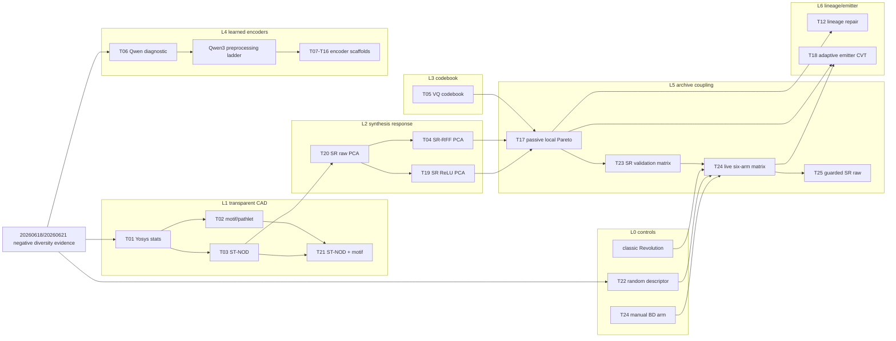

# Technique Lineage Ledger

This is the skim-first process map for the useful-BD push. It complements
`technique_lanes.md`: this file tracks category, lineage, current result, and
branch decision in one place; `technique_lanes.md` keeps the detailed rationale,
lane notes, decision ledger, and Mermaid graphs.

## Reading Order

1. Use the lane table below to understand which family a technique belongs to.
2. Use the lineage graph to see how ideas evolved.
3. Use the result ledger to decide whether a lane should advance, branch,
   hybridize, or park.
4. Open the numbered `techniques/T##_.../` package for methodology, raw tables,
   figures, and detailed conclusions.

## Lane Categories

| Lane | Category | Role In Search | Current Direction |
| --- | --- | --- | --- |
| `L0` | Common evaluation and controls | Prevent false positives by comparing against classic, manual BD, and random BD. | Keep random/manual controls in every claim table. |
| `L1` | Transparent CAD descriptors | Use reviewer-readable features such as Yosys stats, motifs, pathlets, and ST-NOD. | Reuse selected features in guarded hybrids; stop pure concatenation. |
| `L2` | Synthesis-response automatic BDs | Derive BDs from non-PPA synthesis response vectors and AutoQD-style projections. | Continue as the strongest automatic-BD source, but add quality/yield guards. |
| `L3` | Codebook and discrete archives | Stabilize descriptor cells with VQ/codebook structure. | Park direct pressure; reopen as side archive or local-Pareto partition. |
| `L4` | Learned encoders | Test Qwen3, DeepGate, graph, sequence, and multimodal circuit embeddings. | Run preprocessing ladders before fine-tuning or heavier external envs. |
| `L5` | Archive coupling and parent pressure | Preserve diversity while restoring hill-climbing pressure. | T25 is negative; move from simple guards to explicit emitter/parent-source variants. |
| `L6` | Lineage and emitter schedules | Bias exploration with repair dynamics, parent history, and adaptive emitters. | Convert T24/T25 failure modes into exploit/explore/repair schedules. |

## Lineage Graph

## Result Ledger

| IDs | Lane | What It Tested | Current Result | Decision | Branch / Next Step |
| --- | --- | --- | --- | --- | --- |
| T01-T03 | `L1` | Simple structure, motif/pathlet occupancy, and ST-NOD synthesis trajectories. | Useful lower bounds; T03 is a near miss, but direct transparent descriptors are not enough. | `hybridize` | Reuse selected transparent features inside guarded archives. |
| T04/T19/T20 | `L2` | SR-RFF, SR ReLU, and raw synthesis-response PCA descriptors. | Strongest automatic-BD evidence, but quality/yield regressions remain. | `ablate` then `advance` guarded variants | Continue on this branch through T25 before larger live runs. |
| T05 | `L3` | Direct VQ/codebook archive pressure. | Too costly in best quality and valid-PPA yield. | `park` | Reopen only as side archive or local-Pareto partition. |
| T06 | `L4` | Qwen-style whole-RTL projections. | Contains signal but clusters around nuisance axes. | `ablate` | Split to a Qwen ladder branch if preprocessing/env work grows. |
| T07-T16 | `L4` | DeepGate, DeepSeq, NetTAG, CircuitFusion, MGVGA, AURORA, DE-HNN, MasterRTL, DeepCell. | Scaffolded candidates, not yet validated. | `advance` selectively | Start with Qwen preprocessing; use isolated uv envs or source checkouts as needed. |
| T17/T23 | `L5` | Passive local-Pareto retention and SR validation matrix. | Shows front-material value but not a decisive live win. | `advance` | Use as the archive mechanism lineage for T24/T25. |
| T24 | `L0/L2/L5` | Six-arm live matrix: classic, manual BD, random, SR-RFF, SR ReLU, SR raw. | All QD arms preserve covered designs, but every QD arm loses too much multi-pipe best quality. | `ablate` | Treat as failure evidence for guarded parent-pressure variants. |
| T25 | `L2/L5` | Guarded SR raw: lower fill target, lower improve backfill, lower two-parent fusion. | Completed `T0 diagnostic`; preserves covered designs but worsens multi-pipe best quality versus SR raw and fails traffic-light valid-PPA gate. | `ablate` | Use as negative evidence for T26 emitter/parent-source design. |
| T12/T18 | `L6` | Lineage repair and adaptive emitter scheduling. | Scaffolded follow-ups informed by T24/T25 failure modes. | `hybridize` | Define exploit/explore/repair schedule with SR raw/manual/random controls. |

## Branching Rule

Stay on `feat/journal-useful-bd-exp-20260622` for docs, lightweight replay,
packaging, and bounded live variants that share the current dependency stack.
Create a lane branch when the next step needs one of these:

- a long-running live vLLM run that should be reviewed independently;
- an isolated uv environment or source checkout for Qwen/DeepGate/AURORA-style
  encoders;
- a method-specific implementation that may be parked without blocking the
  main useful-BD branch.

Candidate branch names:

| Lane | Branch Name | Return Condition |
| --- | --- | --- |
| `L4` Qwen ladder | `feat/journal-useful-bd-exp-20260622-qwen-ladder` | Normalized embeddings reduce nuisance clustering and beat random on at least one claimed QD metric. |
| `L4` external encoders | `feat/journal-useful-bd-exp-20260622-encoder-env` | DeepGate/AURORA-style encoder produces reproducible features and passes the classic-covered-design gate. |
| `L6` emitter schedule | `feat/journal-useful-bd-exp-20260622-emitter-guard` | Emitter schedule improves multi-pipe best quality or valid yield versus T24/T25 without losing front material. |

## Update Rule

Whenever a technique package gets new evidence, update this ledger in the same
commit as the method report:

- set the current result in the result ledger;
- add or revise one lineage edge if the method changes the search direction;
- record whether the next step stays on the current branch or moves to a lane
  branch;
- keep `techniques/technique_registry.csv` as the chronological source of
  truth for package IDs and paths.
