# Aggregate Design-Space Views

Raw pooled PPA plots mix different problems and units. Treat those figures as qualitative-only.

Pairwise feature plots use the QD backend's descriptor basis when that metadata is available.

## Contents

- [overall / combinational / normalized PPA](#overall-combinational-normalized-ppa)
- [overall / combinational / raw PPA](#overall-combinational-raw-ppa)
- [overall / combinational / feature space](#overall-combinational-feature-space)
- [overall / combinational / classic vs t11_runtime_top8_graph_qd](#overall-combinational-classic-vs-t11_runtime_top8_graph_qd)
- [overall / sequential / normalized PPA](#overall-sequential-normalized-ppa)
- [overall / sequential / raw PPA](#overall-sequential-raw-ppa)
- [overall / sequential / feature space](#overall-sequential-feature-space)
- [overall / sequential / classic vs t11_runtime_top8_graph_qd](#overall-sequential-classic-vs-t11_runtime_top8_graph_qd)
- [RTLLM / combinational / normalized PPA](#rtllm-combinational-normalized-ppa)
- [RTLLM / combinational / raw PPA](#rtllm-combinational-raw-ppa)
- [RTLLM / combinational / feature space](#rtllm-combinational-feature-space)
- [RTLLM / combinational / classic vs t11_runtime_top8_graph_qd](#rtllm-combinational-classic-vs-t11_runtime_top8_graph_qd)
- [RTLLM / sequential / normalized PPA](#rtllm-sequential-normalized-ppa)
- [RTLLM / sequential / raw PPA](#rtllm-sequential-raw-ppa)
- [RTLLM / sequential / feature space](#rtllm-sequential-feature-space)
- [RTLLM / sequential / classic vs t11_runtime_top8_graph_qd](#rtllm-sequential-classic-vs-t11_runtime_top8_graph_qd)

## overall / combinational / normalized PPA

- `normalized g_P vs g_A`: 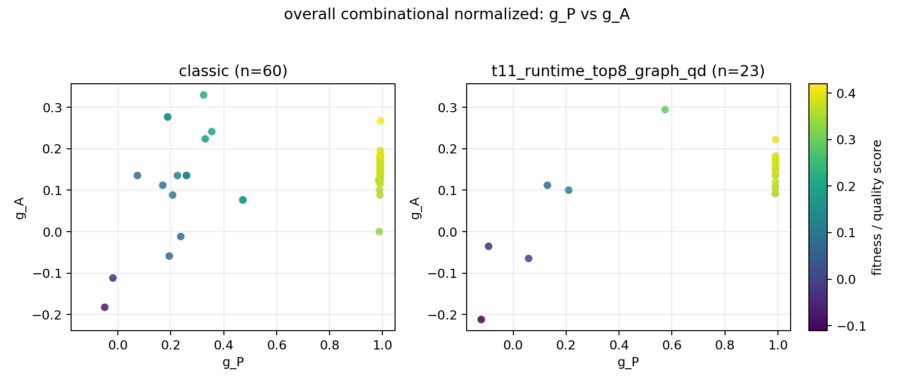

## overall / combinational / raw PPA

- `raw Power vs Area`: 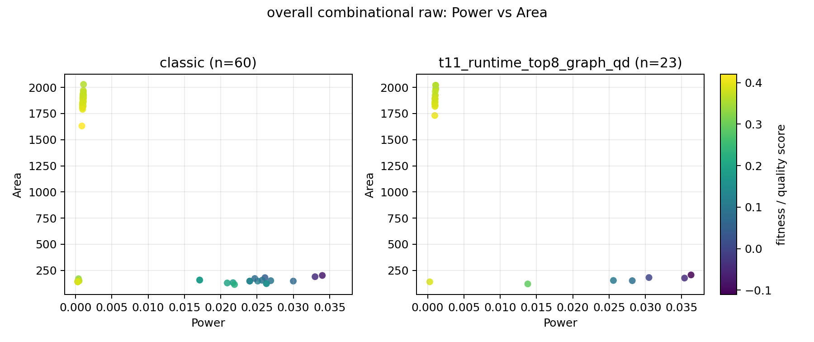

## overall / combinational / feature space

- feature basis: `recommended report feature subset`
- features: `none`

- `feature PCA`: `too_few_varying_features`

## overall / combinational / classic vs t11_runtime_top8_graph_qd

- feature basis: `t11_runtime_top8_graph descriptor profile`
- features: `hyper_mean_fanout, edge_per_node, log_edge_count, hyper_directed_edge_count, hyper_fanout_entropy, hyper_driven_net_count, hyper_sink_net_count, log_net_count`

- `PCA`: 

## overall / sequential / normalized PPA

- `normalized g_P vs g_A`: 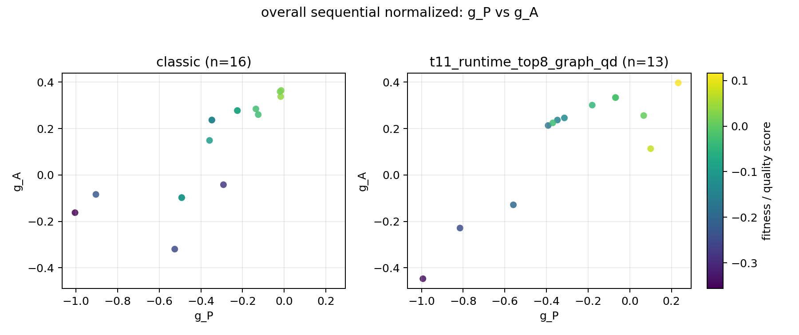
- `normalized g_P vs g_T`: 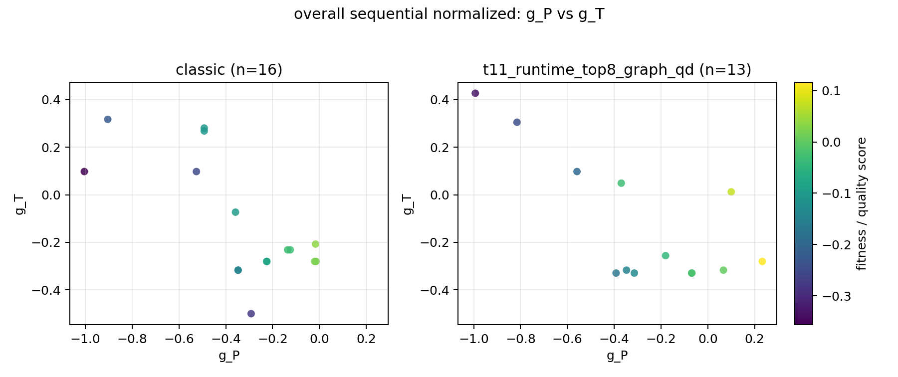
- `normalized g_A vs g_T`: 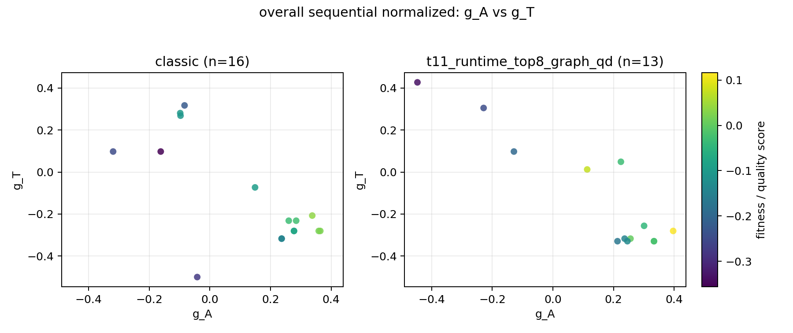

## overall / sequential / raw PPA

- `raw Power vs Area`: 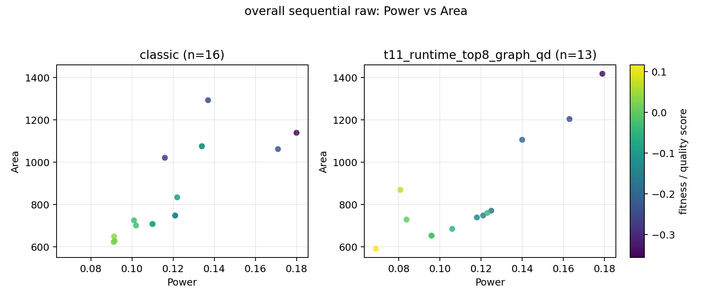
- `raw Power vs Performance`: 
- `raw Area vs Performance`: 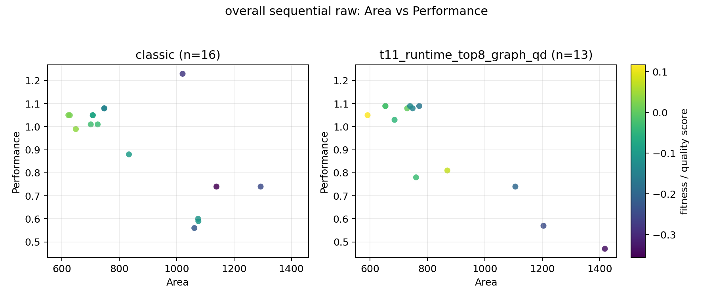

## overall / sequential / feature space

- feature basis: `recommended report feature subset`
- features: `none`

- `feature PCA`: `too_few_varying_features`

## overall / sequential / classic vs t11_runtime_top8_graph_qd

- feature basis: `t11_runtime_top8_graph descriptor profile`
- features: `hyper_mean_fanout, edge_per_node, log_edge_count, hyper_directed_edge_count, hyper_fanout_entropy, hyper_driven_net_count, hyper_sink_net_count, log_net_count`

- `PCA`: 

## RTLLM / combinational / normalized PPA

- `normalized g_P vs g_A`: 

## RTLLM / combinational / raw PPA

- `raw Power vs Area`: 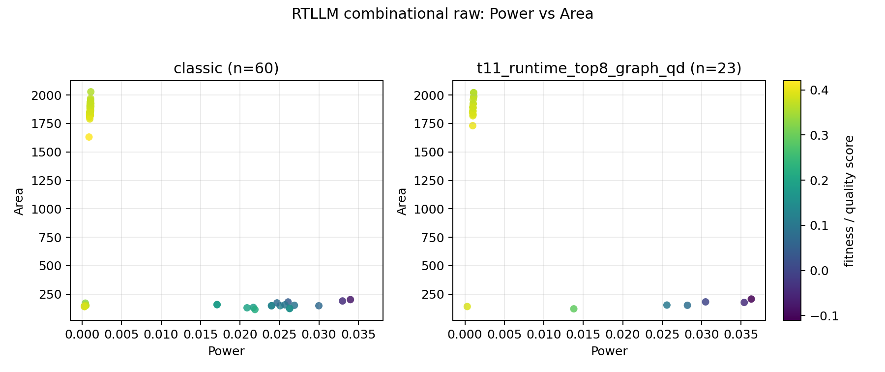

## RTLLM / combinational / feature space

- feature basis: `recommended report feature subset`
- features: `none`

- `feature PCA`: `too_few_varying_features`

## RTLLM / combinational / classic vs t11_runtime_top8_graph_qd

- feature basis: `t11_runtime_top8_graph descriptor profile`
- features: `hyper_mean_fanout, edge_per_node, log_edge_count, hyper_directed_edge_count, hyper_fanout_entropy, hyper_driven_net_count, hyper_sink_net_count, log_net_count`

- `PCA`: 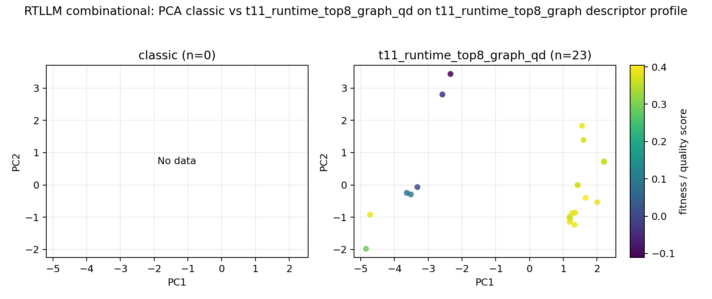

## RTLLM / sequential / normalized PPA

- `normalized g_P vs g_A`: 
- `normalized g_P vs g_T`: 
- `normalized g_A vs g_T`: 

## RTLLM / sequential / raw PPA

- `raw Power vs Area`: 
- `raw Power vs Performance`: 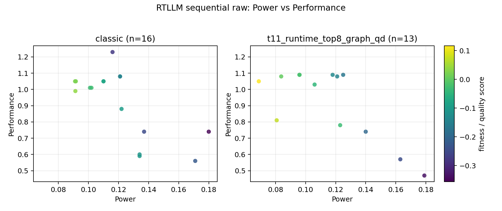
- `raw Area vs Performance`: 

## RTLLM / sequential / feature space

- feature basis: `recommended report feature subset`
- features: `none`

- `feature PCA`: `too_few_varying_features`

## RTLLM / sequential / classic vs t11_runtime_top8_graph_qd

- feature basis: `t11_runtime_top8_graph descriptor profile`
- features: `hyper_mean_fanout, edge_per_node, log_edge_count, hyper_directed_edge_count, hyper_fanout_entropy, hyper_driven_net_count, hyper_sink_net_count, log_net_count`

- `PCA`: 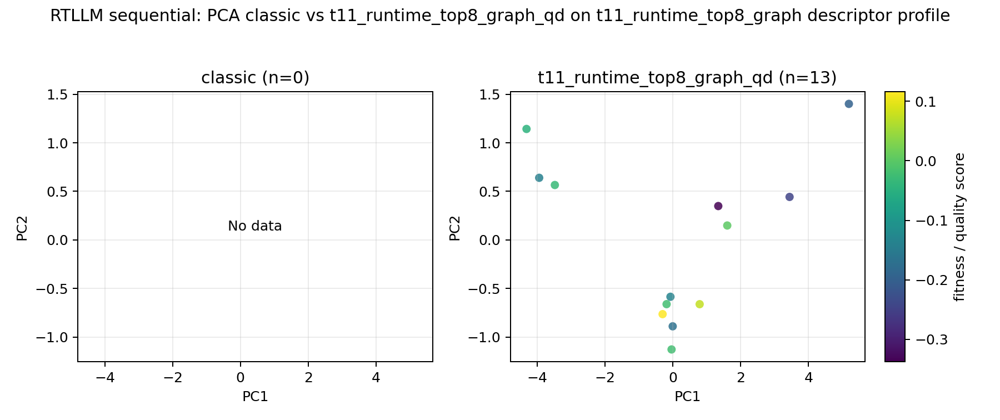
