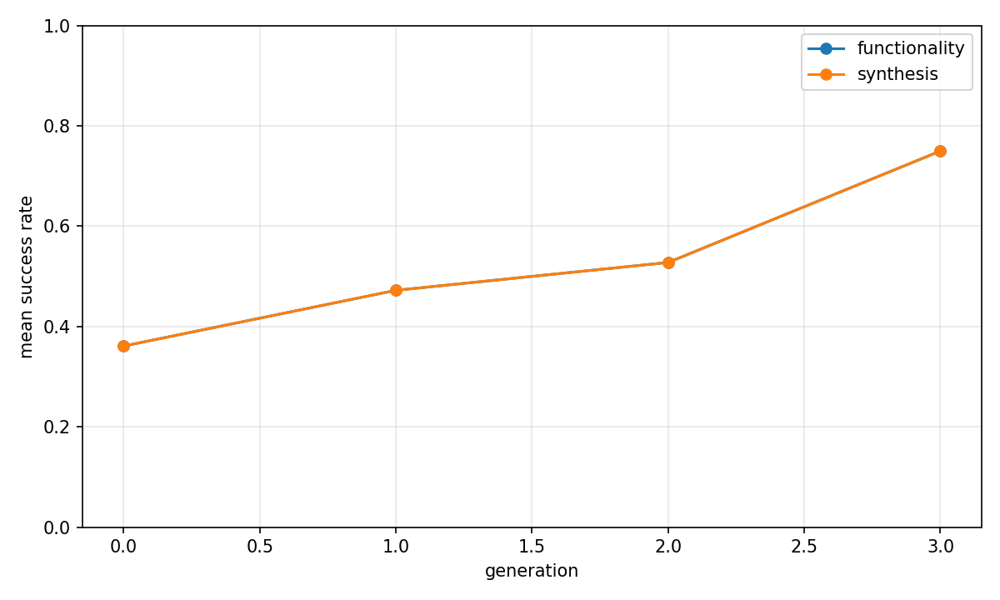
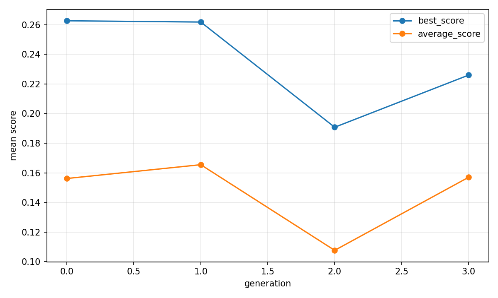

# Evolutionary report: classic

## Run summary

- backend: `classic`
- problem_count: `3`
- qd_archive_present: `False`
- mean_functionality_rate: `52.8%`
- mean_synthesis_rate: `52.8%`
- mean_best_score: `0.2823`
- mean_runtime_seconds: `614.7762`
- total_llm_api_calls: `288`

## Plot files

- generation rates: 
- generation scores: 
- QD archive trends: n/a

## Per-problem summary

| Benchmark | Problem | Func | Synth | Best score | Runtime (s) | Final coverage | Final QD score |
| --- | --- | ---: | ---: | ---: | ---: | ---: | ---: |
| RTLLM | Prob045_alu | 72.9% | 72.9% | 0.4198 | 608.8665 | n/a | n/a |
| RTLLM | Prob041_traffic_light | 52.1% | 52.1% | 0.3891 | 643.0828 | n/a | n/a |
| RTLLM | Prob015_multi_pipe_8bit | 33.3% | 33.3% | 0.0379 | 592.3793 | n/a | n/a |

## Generation aggregates

| Gen | Problems | Func | Synth | Best score | Avg score | Diff success | Coverage | QD score |
| ---: | ---: | ---: | ---: | ---: | ---: | ---: | ---: | ---: |
| 0 | 3 | 36.1% | 36.1% | 0.2626 | 0.1562 | n/a | n/a | n/a |
| 1 | 3 | 47.2% | 47.2% | 0.2618 | 0.1655 | n/a | n/a | n/a |
| 2 | 3 | 52.8% | 52.8% | 0.1908 | 0.1076 | n/a | n/a | n/a |
| 3 | 3 | 75.0% | 75.0% | 0.2259 | 0.1570 | n/a | n/a | n/a |

## Aggregated status counts by generation

| Gen | failed_syntax | failed_functionality | failed_diff | failed_synthesis_functionality | success |
| ---: | ---: | ---: | ---: | ---: | ---: |
| 0 | 0 | 23 | 0 | 0 | 13 |
| 1 | 0 | 19 | 0 | 0 | 17 |
| 2 | 0 | 17 | 0 | 0 | 19 |
| 3 | 1 | 8 | 0 | 0 | 27 |

## Aggregated strategy counts by generation

| Gen | Top strategies |
| ---: | --- |
| 0 | initial=36 |
| 1 | M-I=12, M-E=6, M-S=6, M-R=5, C-F=4 |
| 2 | M-E=14, M-S=11, M-R=6, M-I=5 |
| 3 | M-R=10, C-F=9, M-S=8, M-I=6, M-E=3 |
