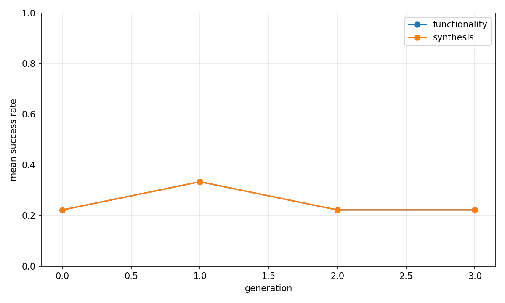
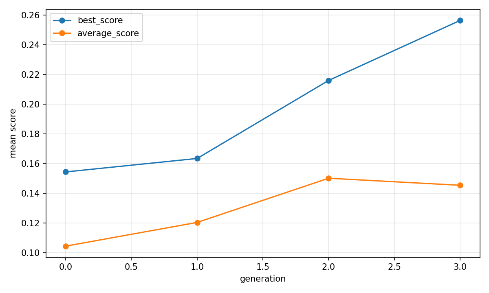
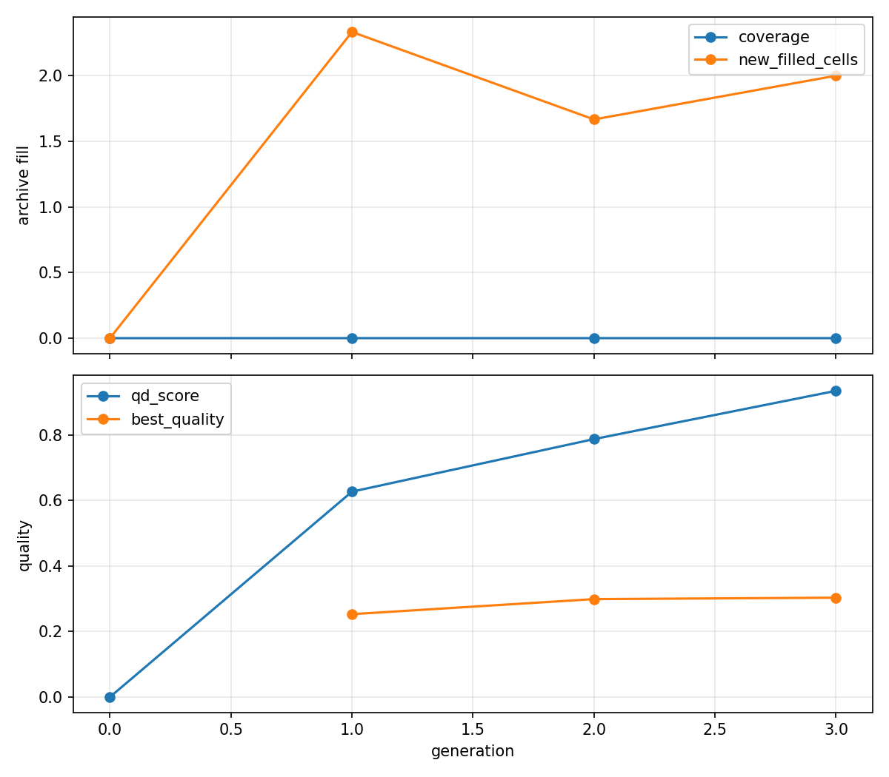

# Evolutionary report: t11_runtime_top8_graph_qd

## Run summary

- backend: `t11_runtime_top8_graph_qd`
- problem_count: `3`
- qd_archive_present: `True`
- mean_functionality_rate: `34.7%`
- mean_synthesis_rate: `25.0%`
- mean_best_score: `0.3033`
- mean_runtime_seconds: `685.7177`
- total_llm_api_calls: `288`

## Plot files

- generation rates: 
- generation scores: 
- QD archive trends: 

## Per-problem summary

| Benchmark | Problem | Func | Synth | Best score | Runtime (s) | Final coverage | Final QD score |
| --- | --- | ---: | ---: | ---: | ---: | ---: | ---: |
| RTLLM | Prob045_alu | 33.3% | 33.3% | 0.4044 | 701.5444 | 0.0% | 3.0623 |
| RTLLM | Prob015_multi_pipe_8bit | 35.4% | 27.1% | 0.1164 | 659.7730 | 0.0% | -0.9638 |
| RTLLM | Prob041_traffic_light | 35.4% | 14.6% | 0.3891 | 695.8358 | 0.0% | 0.7069 |

## Generation aggregates

| Gen | Problems | Func | Synth | Best score | Avg score | Diff success | Coverage | QD score |
| ---: | ---: | ---: | ---: | ---: | ---: | ---: | ---: | ---: |
| 0 | 3 | 22.2% | 22.2% | 0.1545 | 0.1045 | n/a | 0.0% | 0.0000 |
| 1 | 3 | 33.3% | 33.3% | 0.1635 | 0.1205 | 50.0% | 0.0% | 0.6271 |
| 2 | 3 | 22.2% | 22.2% | 0.2160 | 0.1502 | 16.7% | 0.0% | 0.7877 |
| 3 | 3 | 22.2% | 22.2% | 0.2564 | 0.1455 | n/a | 0.0% | 0.9351 |

## Aggregated status counts by generation

| Gen | failed_syntax | failed_functionality | failed_diff | failed_synthesis_functionality | success |
| ---: | ---: | ---: | ---: | ---: | ---: |
| 0 | 1 | 27 | 0 | 0 | 8 |
| 1 | 2 | 12 | 9 | 0 | 12 |
| 2 | 0 | 23 | 5 | 0 | 8 |
| 3 | 1 | 27 | 0 | 0 | 8 |

## Aggregated strategy counts by generation

| Gen | Top strategies |
| ---: | --- |
| 0 | initial=36 |
| 1 | M-F=10, M-E=8, M-S=7, M-R=6, M-I=5 |
| 2 | M-F=12, M-E=12, initial=3, M-T=3, M-S=3 |
| 3 | M-E=19, M-F=9, initial=5, M-T=3 |
