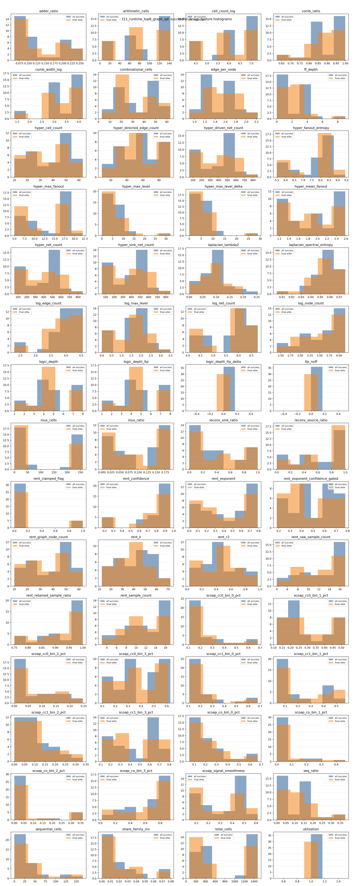
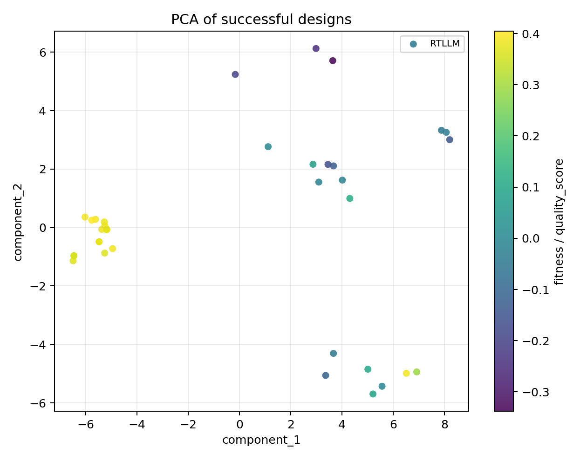

# QD Feature-Space Analysis

## Backend aggregate comparison

| Backend | Functionality | Synthesis | Solved | Best score | Runtime (s) | QD coverage | QD score |
| --- | ---: | ---: | ---: | ---: | ---: | ---: | ---: |
| classic | 52.8% | 52.8% | 3 | 0.2823 | 614.8 | N/A | N/A |
| t11_runtime_top8_graph_qd | 34.7% | 25.0% | 3 | 0.3033 | 685.7 | 0.0% | 0.9351 |

## QD backend feature-space summary

### t11_runtime_top8_graph_qd

- successful_candidates: `36`
- final_elites: `30`
- collapsed_features: `logic_depth_ltp_delta, ltp_noff, utilization`
- near_collapsed_features: `logic_depth_ltp_delta, ltp_noff, utilization`
- histogram: 
- PCA: 
- t-SNE: tsne_skipped

## Regression summary

### quality_score

- sample_count: `36`
- ridge_alpha: `10.0000`
- ridge_r2: `0.9767`
- top_coefficients:
  - `scoap_signal_smoothness`: `0.1528`
  - `ff_depth`: `-0.1494`
  - `scoap_co_bin_1_pct`: `0.1333`
  - `scoap_cc1_bin_2_pct`: `0.1090`
  - `rent_exponent_confidence_gated`: `0.0787`
  - `sequential_cells`: `-0.0764`
  - `scoap_cc1_bin_1_pct`: `-0.0707`
  - `scoap_cc1_bin_0_pct`: `-0.0651`
  - `scoap_cc0_bin_0_pct`: `-0.0616`
  - `seq_ratio`: `-0.0591`

### g_P

- sample_count: `36`
- ridge_alpha: `10.0000`
- ridge_r2: `0.9849`
- top_coefficients:
  - `ff_depth`: `-0.1405`
  - `scoap_signal_smoothness`: `0.1377`
  - `scoap_co_bin_1_pct`: `0.1144`
  - `scoap_cc1_bin_2_pct`: `0.0892`
  - `rent_exponent_confidence_gated`: `0.0816`
  - `sequential_cells`: `-0.0814`
  - `scoap_cc1_bin_0_pct`: `-0.0649`
  - `scoap_cc1_bin_1_pct`: `-0.0646`
  - `scoap_cc1_bin_3_pct`: `0.0610`
  - `seq_ratio`: `-0.0596`

### g_A

- sample_count: `36`
- ridge_alpha: `1.0000`
- ridge_r2: `0.9921`
- top_coefficients:
  - `adder_ratio`: `0.3023`
  - `hyper_max_fanout`: `-0.3013`
  - `sequential_cells`: `-0.2974`
  - `scoap_cc1_bin_3_pct`: `0.2237`
  - `scoap_co_bin_0_pct`: `-0.2075`
  - `laplacian_spectral_entropy`: `-0.2043`
  - `share_family_inv`: `-0.1646`
  - `scoap_cc1_bin_0_pct`: `-0.1615`
  - `scoap_co_bin_1_pct`: `0.1575`
  - `total_cells`: `-0.1508`

### g_T

- sample_count: `36`
- ridge_alpha: `10.0000`
- ridge_r2: `0.8789`
- top_coefficients:
  - `adder_ratio`: `-0.2576`
  - `hyper_max_fanout`: `0.1859`
  - `sequential_cells`: `0.1729`
  - `mux_ratio`: `-0.1568`
  - `scoap_co_bin_2_pct`: `0.1523`
  - `rent_r2`: `0.1377`
  - `scoap_co_bin_3_pct`: `-0.1240`
  - `scoap_cc1_bin_3_pct`: `-0.1226`
  - `scoap_cc1_bin_2_pct`: `0.0990`
  - `laplacian_spectral_entropy`: `0.0954`

## Recommended large profile

- selected_non_target_features: `seq_ratio, sequential_cells, ff_depth, scoap_co_bin_0_pct, scoap_cc1_bin_0_pct, scoap_cc0_bin_0_pct, scoap_signal_smoothness`
- sequential_axes: `seq_ratio, sequential_cells, ff_depth, scoap_co_bin_0_pct, scoap_cc1_bin_0_pct, scoap_cc0_bin_0_pct, scoap_signal_smoothness, g_P, g_A, g_T`
- combinational_axes: `seq_ratio, sequential_cells, ff_depth, scoap_co_bin_0_pct, scoap_cc1_bin_0_pct, scoap_cc0_bin_0_pct, scoap_signal_smoothness, g_P, g_A`
