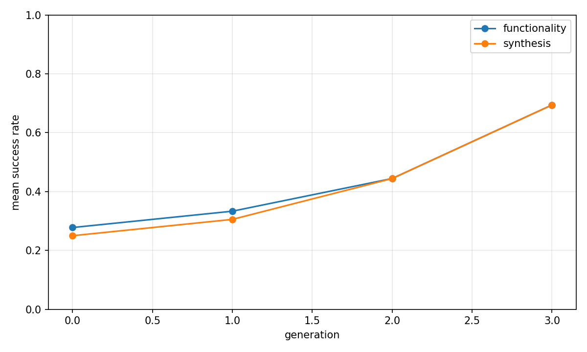
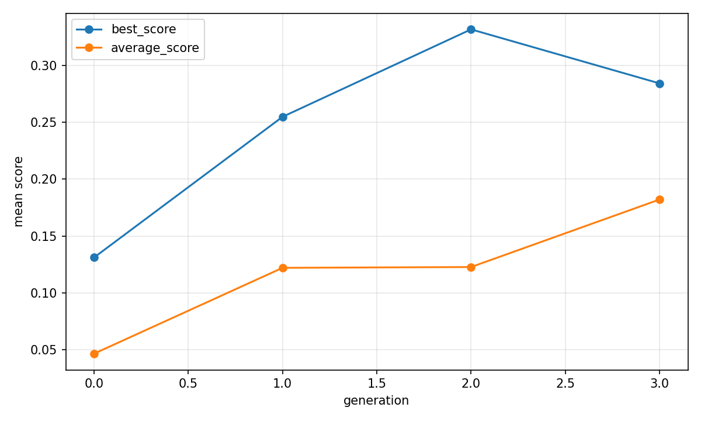

# Evolutionary report: classic

## Run summary

- backend: `classic`
- problem_count: `3`
- qd_archive_present: `False`
- mean_functionality_rate: `43.8%`
- mean_synthesis_rate: `42.4%`
- mean_best_score: `0.3346`
- mean_runtime_seconds: `579.9361`
- total_llm_api_calls: `288`

## Plot files

- generation rates: 
- generation scores: 
- QD archive trends: n/a

## Per-problem summary

| Benchmark | Problem | Func | Synth | Best score | Runtime (s) | Final coverage | Final QD score |
| --- | --- | ---: | ---: | ---: | ---: | ---: | ---: |
| RTLLM | Prob041_traffic_light | 54.2% | 50.0% | 0.4508 | 595.0527 | n/a | n/a |
| RTLLM | Prob015_multi_pipe_8bit | 39.6% | 39.6% | 0.1455 | 550.4278 | n/a | n/a |
| RTLLM | Prob045_alu | 37.5% | 37.5% | 0.4074 | 594.3276 | n/a | n/a |

## Generation aggregates

| Gen | Problems | Func | Synth | Best score | Avg score | Diff success | Coverage | QD score |
| ---: | ---: | ---: | ---: | ---: | ---: | ---: | ---: | ---: |
| 0 | 3 | 27.8% | 25.0% | 0.1310 | 0.0464 | n/a | n/a | n/a |
| 1 | 3 | 33.3% | 30.6% | 0.2548 | 0.1220 | n/a | n/a | n/a |
| 2 | 3 | 44.4% | 44.4% | 0.3318 | 0.1227 | n/a | n/a | n/a |
| 3 | 3 | 69.4% | 69.4% | 0.2843 | 0.1821 | n/a | n/a | n/a |

## Aggregated status counts by generation

| Gen | failed_syntax | failed_functionality | failed_diff | failed_synthesis_functionality | success |
| ---: | ---: | ---: | ---: | ---: | ---: |
| 0 | 0 | 26 | 0 | 1 | 9 |
| 1 | 0 | 24 | 0 | 1 | 11 |
| 2 | 2 | 18 | 0 | 0 | 16 |
| 3 | 0 | 11 | 0 | 0 | 25 |

## Aggregated strategy counts by generation

| Gen | Top strategies |
| ---: | --- |
| 0 | initial=36 |
| 1 | M-I=12, M-R=7, M-E=6, M-S=5, M-F=4 |
| 2 | M-S=15, M-R=8, M-E=7, M-F=3, M-I=2 |
| 3 | M-R=12, M-I=9, C-F=6, M-E=5, M-S=4 |
