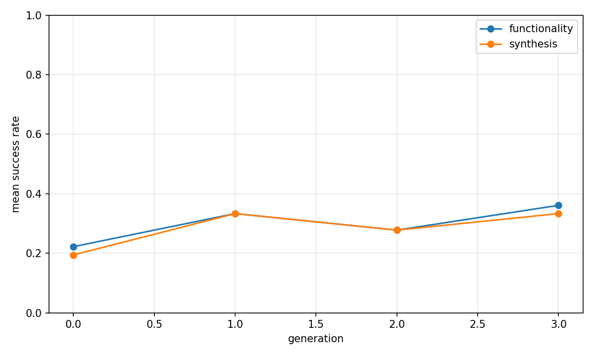
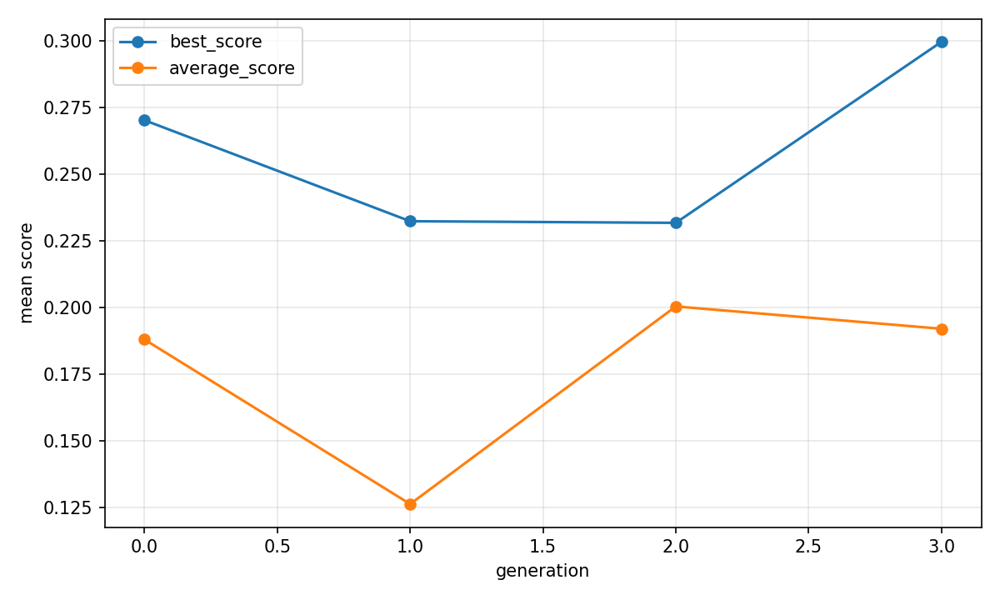
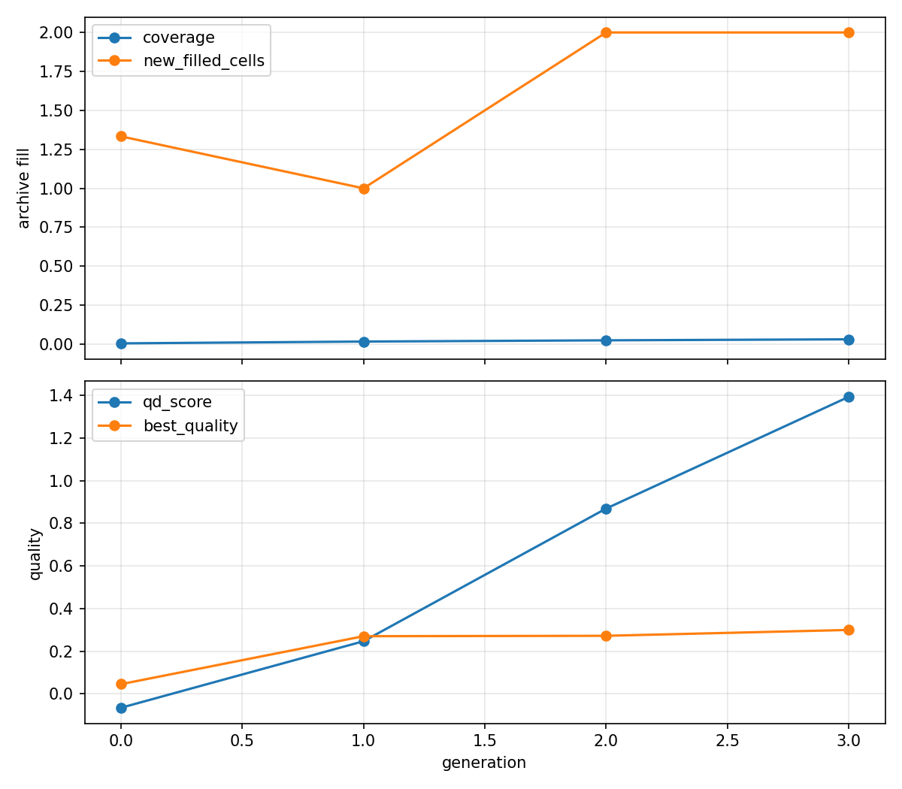

# Evolutionary report: t11_runtime_top4_graph_qd

## Run summary

- backend: `t11_runtime_top4_graph_qd`
- problem_count: `3`
- qd_archive_present: `True`
- mean_functionality_rate: `33.3%`
- mean_synthesis_rate: `28.5%`
- mean_best_score: `0.2995`
- mean_runtime_seconds: `689.2872`
- total_llm_api_calls: `288`

## Plot files

- generation rates: 
- generation scores: 
- QD archive trends: 

## Per-problem summary

| Benchmark | Problem | Func | Synth | Best score | Runtime (s) | Final coverage | Final QD score |
| --- | --- | ---: | ---: | ---: | ---: | ---: | ---: |
| RTLLM | Prob041_traffic_light | 45.8% | 35.4% | 0.4209 | 701.6815 | 3.1% | 2.1931 |
| RTLLM | Prob045_alu | 27.1% | 27.1% | 0.4066 | 717.9688 | 2.7% | 2.6927 |
| RTLLM | Prob015_multi_pipe_8bit | 27.1% | 22.9% | 0.0710 | 648.2112 | 3.5% | -0.7058 |

## Generation aggregates

| Gen | Problems | Func | Synth | Best score | Avg score | Diff success | Coverage | QD score |
| ---: | ---: | ---: | ---: | ---: | ---: | ---: | ---: | ---: |
| 0 | 3 | 22.2% | 19.4% | 0.2701 | 0.1879 | n/a | 0.5% | -0.0657 |
| 1 | 3 | 33.3% | 33.3% | 0.2323 | 0.1262 | 58.3% | 1.7% | 0.2465 |
| 2 | 3 | 27.8% | 27.8% | 0.2316 | 0.2003 | n/a | 2.5% | 0.8691 |
| 3 | 3 | 36.1% | 33.3% | 0.2995 | 0.1919 | n/a | 3.1% | 1.3933 |

## Aggregated status counts by generation

| Gen | failed_syntax | failed_functionality | failed_diff | failed_synthesis_functionality | success |
| ---: | ---: | ---: | ---: | ---: | ---: |
| 0 | 1 | 27 | 0 | 1 | 7 |
| 1 | 2 | 16 | 5 | 0 | 12 |
| 2 | 1 | 25 | 0 | 0 | 10 |
| 3 | 2 | 21 | 0 | 1 | 12 |

## Aggregated strategy counts by generation

| Gen | Top strategies |
| ---: | --- |
| 0 | initial=36 |
| 1 | M-E=12, M-F=9, M-S=5, M-I=4, M-R=3 |
| 2 | M-F=14, M-E=14, M-T=5, initial=3 |
| 3 | M-E=18, M-F=10, initial=4, M-T=4 |
