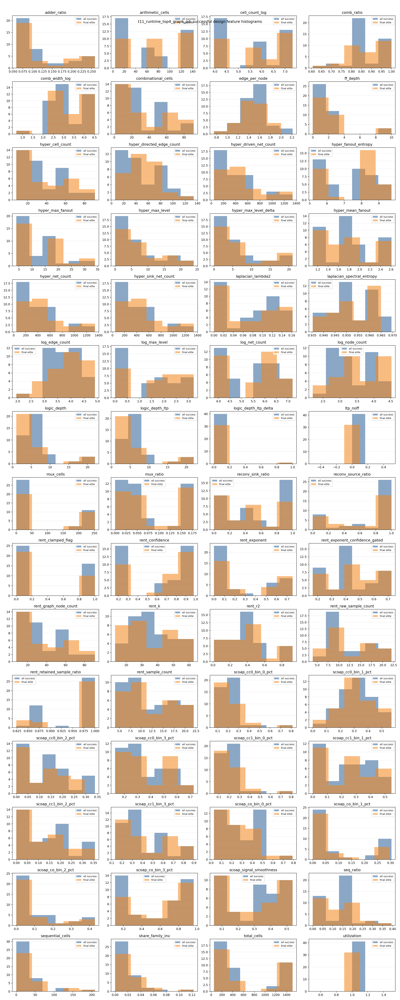
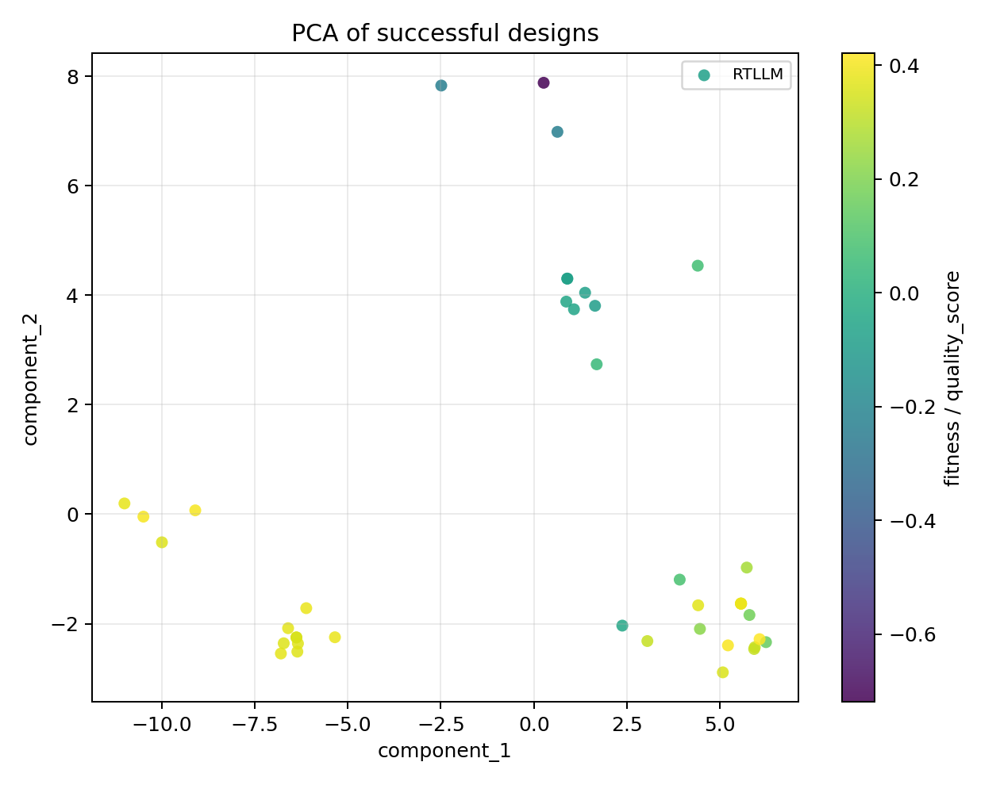

# t11_runtime_top4_graph_qd feature-space report

- successful_candidates: `41`
- final_elites: `32`
- feature_count: `60`
- collapsed_features: `ltp_noff, utilization`
- near_collapsed_features: `ltp_noff, utilization`

## Top fitness correlations

- `ff_depth`: `-0.7543`
- `sequential_cells`: `-0.7331`
- `rent_exponent_confidence_gated`: `0.6246`
- `hyper_mean_fanout`: `0.5685`
- `scoap_cc1_bin_1_pct`: `-0.5362`
- `share_family_inv`: `0.5172`
- `scoap_co_bin_2_pct`: `0.4963`
- `adder_ratio`: `-0.4952`
- `comb_ratio`: `0.4696`
- `seq_ratio`: `-0.4696`

## Highest-variation features

- `total_cells`: coverage=`1.0000`, stddev=`583.2140`, unique=`35`
- `hyper_driven_net_count`: coverage=`1.0000`, stddev=`351.8554`, unique=`31`
- `hyper_net_count`: coverage=`1.0000`, stddev=`351.8554`, unique=`31`
- `hyper_sink_net_count`: coverage=`1.0000`, stddev=`351.8100`, unique=`31`
- `mux_cells`: coverage=`1.0000`, stddev=`103.8356`, unique=`20`
- `arithmetic_cells`: coverage=`1.0000`, stddev=`53.5864`, unique=`11`
- `sequential_cells`: coverage=`1.0000`, stddev=`41.4324`, unique=`12`
- `hyper_directed_edge_count`: coverage=`1.0000`, stddev=`28.6390`, unique=`30`
- `combinational_cells`: coverage=`1.0000`, stddev=`24.1729`, unique=`23`
- `hyper_cell_count`: coverage=`1.0000`, stddev=`22.5451`, unique=`24`

## Plot files

- histogram: 
- PCA: 
- t-SNE: tsne_skipped
