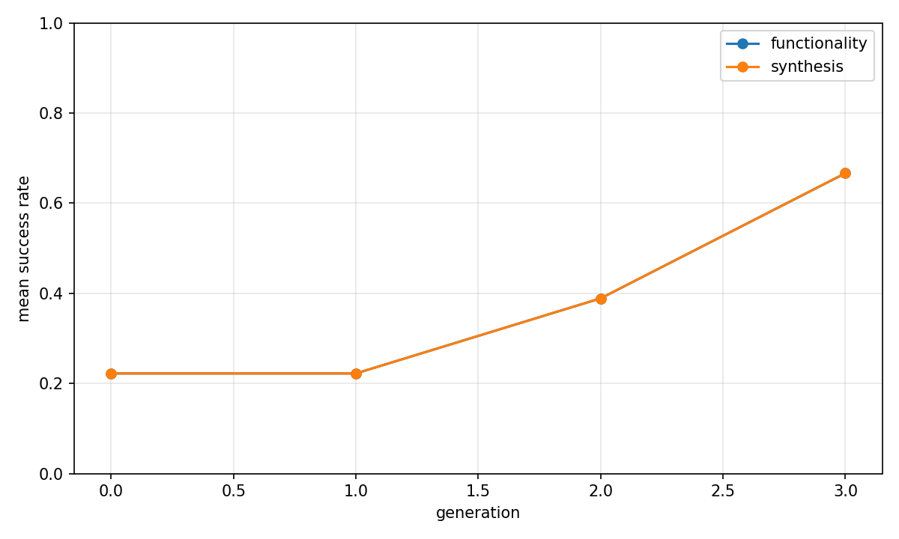
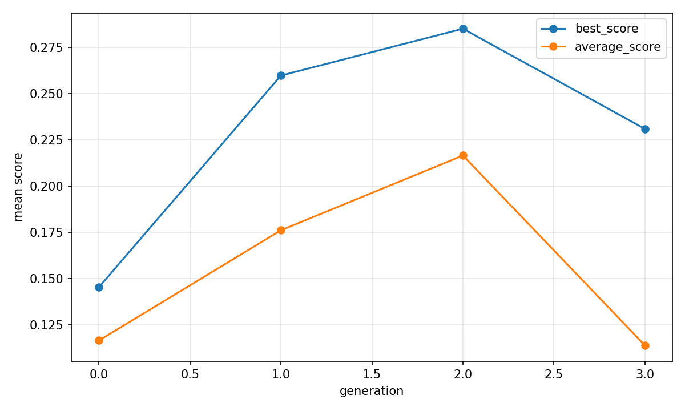

# Evolutionary report: classic

## Run summary

- backend: `classic`
- problem_count: `3`
- qd_archive_present: `False`
- mean_functionality_rate: `37.5%`
- mean_synthesis_rate: `37.5%`
- mean_best_score: `0.2914`
- mean_runtime_seconds: `602.8824`
- total_llm_api_calls: `288`

## Plot files

- generation rates: 
- generation scores: 
- QD archive trends: n/a

## Per-problem summary

| Benchmark | Problem | Func | Synth | Best score | Runtime (s) | Final coverage | Final QD score |
| --- | --- | ---: | ---: | ---: | ---: | ---: | ---: |
| RTLLM | Prob045_alu | 47.9% | 47.9% | 0.3966 | 532.7913 | n/a | n/a |
| RTLLM | Prob041_traffic_light | 33.3% | 33.3% | 0.4248 | 611.9758 | n/a | n/a |
| RTLLM | Prob015_multi_pipe_8bit | 31.2% | 31.2% | 0.0528 | 663.8802 | n/a | n/a |

## Generation aggregates

| Gen | Problems | Func | Synth | Best score | Avg score | Diff success | Coverage | QD score |
| ---: | ---: | ---: | ---: | ---: | ---: | ---: | ---: | ---: |
| 0 | 3 | 22.2% | 22.2% | 0.1454 | 0.1165 | n/a | n/a | n/a |
| 1 | 3 | 22.2% | 22.2% | 0.2597 | 0.1761 | n/a | n/a | n/a |
| 2 | 3 | 38.9% | 38.9% | 0.2850 | 0.2165 | n/a | n/a | n/a |
| 3 | 3 | 66.7% | 66.7% | 0.2309 | 0.1139 | n/a | n/a | n/a |

## Aggregated status counts by generation

| Gen | failed_syntax | failed_functionality | failed_diff | failed_synthesis_functionality | success |
| ---: | ---: | ---: | ---: | ---: | ---: |
| 0 | 0 | 28 | 0 | 0 | 8 |
| 1 | 0 | 28 | 0 | 0 | 8 |
| 2 | 0 | 22 | 0 | 0 | 14 |
| 3 | 0 | 12 | 0 | 0 | 24 |

## Aggregated strategy counts by generation

| Gen | Top strategies |
| ---: | --- |
| 0 | initial=36 |
| 1 | M-I=11, M-R=8, M-E=6, M-S=5, M-F=4 |
| 2 | M-S=17, M-R=7, M-F=5, M-E=4, M-I=2 |
| 3 | M-I=11, M-S=10, M-E=8, C-F=6, M-R=1 |
