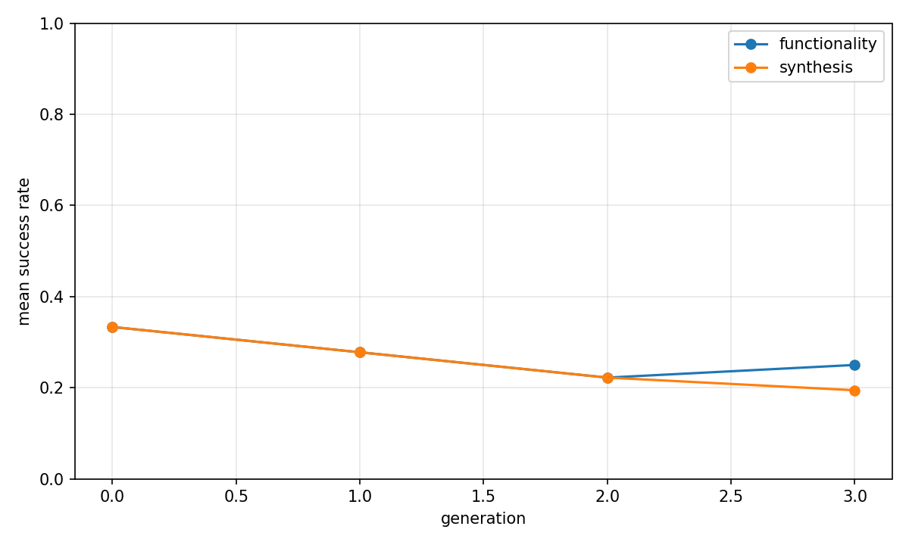
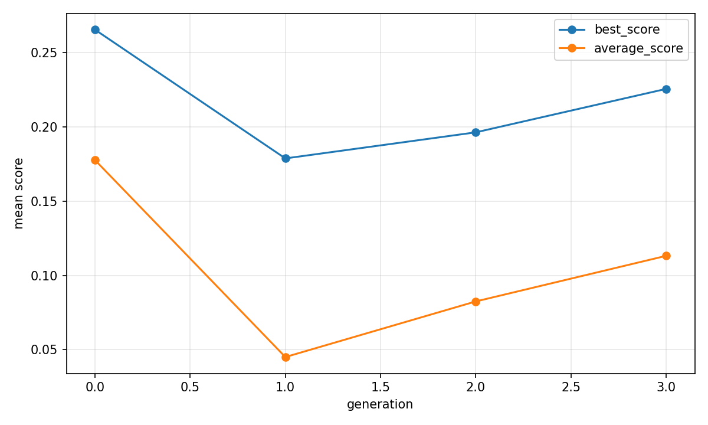
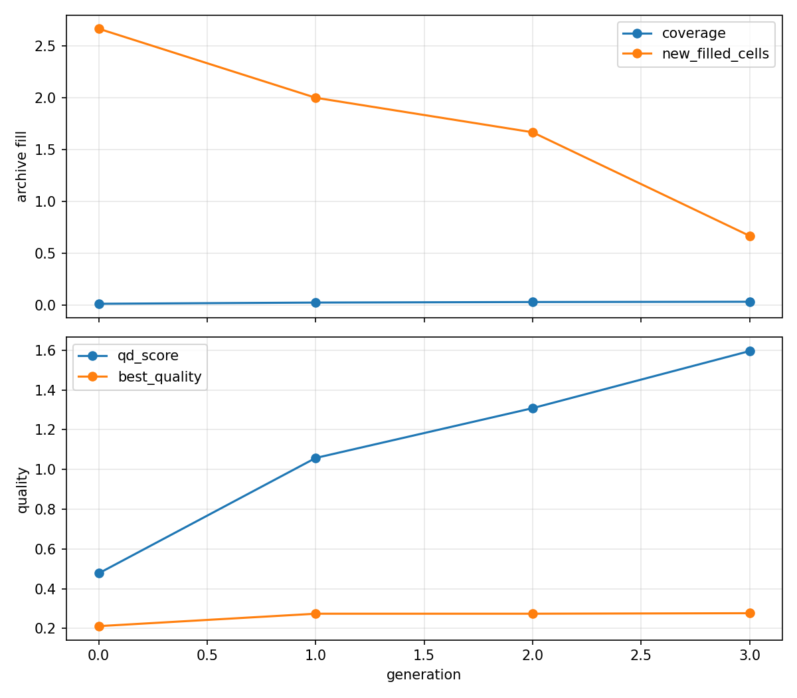

# Evolutionary report: t11_runtime_pca4_graph_qd

## Run summary

- backend: `t11_runtime_pca4_graph_qd`
- problem_count: `3`
- qd_archive_present: `True`
- mean_functionality_rate: `29.2%`
- mean_synthesis_rate: `25.7%`
- mean_best_score: `0.2768`
- mean_runtime_seconds: `719.4537`
- total_llm_api_calls: `288`

## Plot files

- generation rates: 
- generation scores: 
- QD archive trends: 

## Per-problem summary

| Benchmark | Problem | Func | Synth | Best score | Runtime (s) | Final coverage | Final QD score |
| --- | --- | ---: | ---: | ---: | ---: | ---: | ---: |
| RTLLM | Prob045_alu | 33.3% | 31.2% | 0.3994 | 743.8227 | 3.9% | 3.8638 |
| RTLLM | Prob015_multi_pipe_8bit | 29.2% | 27.1% | 0.0536 | 674.5073 | 2.7% | -0.0651 |
| RTLLM | Prob041_traffic_light | 25.0% | 18.8% | 0.3774 | 740.0311 | 2.3% | 0.9878 |

## Generation aggregates

| Gen | Problems | Func | Synth | Best score | Avg score | Diff success | Coverage | QD score |
| ---: | ---: | ---: | ---: | ---: | ---: | ---: | ---: | ---: |
| 0 | 3 | 33.3% | 33.3% | 0.2654 | 0.1776 | n/a | 1.0% | 0.4774 |
| 1 | 3 | 27.8% | 27.8% | 0.1787 | 0.0450 | 50.0% | 2.2% | 1.0576 |
| 2 | 3 | 22.2% | 22.2% | 0.1963 | 0.0825 | n/a | 2.7% | 1.3083 |
| 3 | 3 | 25.0% | 19.4% | 0.2255 | 0.1132 | n/a | 3.0% | 1.5955 |

## Aggregated status counts by generation

| Gen | failed_syntax | failed_functionality | failed_diff | failed_synthesis_functionality | success |
| ---: | ---: | ---: | ---: | ---: | ---: |
| 0 | 2 | 22 | 0 | 0 | 12 |
| 1 | 2 | 21 | 3 | 0 | 10 |
| 2 | 1 | 27 | 0 | 0 | 8 |
| 3 | 0 | 27 | 0 | 2 | 7 |

## Aggregated strategy counts by generation

| Gen | Top strategies |
| ---: | --- |
| 0 | initial=36 |
| 1 | M-E=13, M-F=10, M-T=4, initial=3, M-S=3 |
| 2 | M-E=15, M-F=12, M-T=5, initial=4 |
| 3 | M-E=18, M-F=8, initial=5, M-T=5 |
