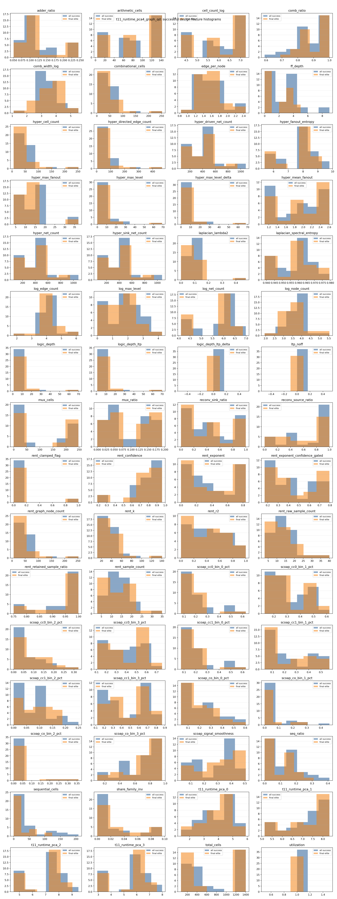
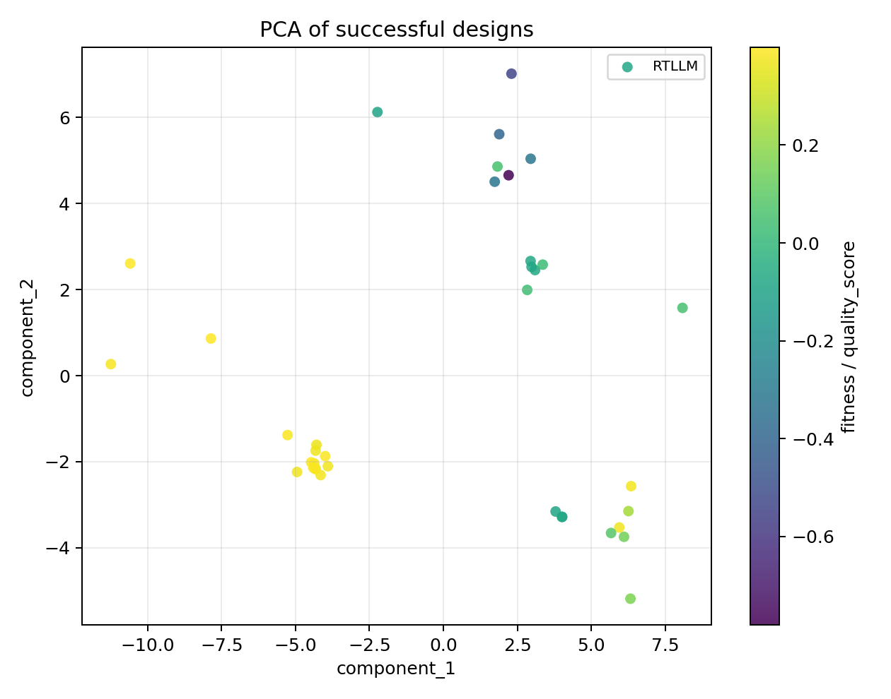

# QD Feature-Space Analysis

## Backend aggregate comparison

| Backend | Functionality | Synthesis | Solved | Best score | Runtime (s) | QD coverage | QD score |
| --- | ---: | ---: | ---: | ---: | ---: | ---: | ---: |
| classic | 37.5% | 37.5% | 3 | 0.2914 | 602.9 | N/A | N/A |
| t11_runtime_pca4_graph_qd | 29.2% | 25.7% | 3 | 0.2768 | 719.5 | 3.0% | 1.5955 |

## QD backend feature-space summary

### t11_runtime_pca4_graph_qd

- successful_candidates: `37`
- final_elites: `31`
- collapsed_features: `logic_depth_ltp_delta, ltp_noff, utilization`
- near_collapsed_features: `logic_depth_ltp_delta, ltp_noff, utilization`
- histogram: 
- PCA: 
- t-SNE: tsne_skipped

## Regression summary

### quality_score

- sample_count: `37`
- ridge_alpha: `10.0000`
- ridge_r2: `0.9552`
- top_coefficients:
  - `edge_per_node`: `-0.1729`
  - `sequential_cells`: `-0.1451`
  - `scoap_cc1_bin_3_pct`: `0.1117`
  - `ff_depth`: `-0.1049`
  - `scoap_cc0_bin_0_pct`: `-0.1005`
  - `scoap_cc1_bin_0_pct`: `-0.1002`
  - `reconv_source_ratio`: `-0.0995`
  - `rent_r2`: `-0.0933`
  - `mux_ratio`: `-0.0756`
  - `scoap_co_bin_0_pct`: `-0.0708`

### g_P

- sample_count: `37`
- ridge_alpha: `10.0000`
- ridge_r2: `0.9554`
- top_coefficients:
  - `edge_per_node`: `-0.1571`
  - `sequential_cells`: `-0.1366`
  - `scoap_cc1_bin_3_pct`: `0.1147`
  - `ff_depth`: `-0.1130`
  - `scoap_cc1_bin_0_pct`: `-0.1036`
  - `scoap_cc0_bin_0_pct`: `-0.0989`
  - `reconv_source_ratio`: `-0.0984`
  - `rent_r2`: `-0.0907`
  - `scoap_cc1_bin_1_pct`: `-0.0779`
  - `mux_ratio`: `-0.0754`

### g_A

- sample_count: `37`
- ridge_alpha: `0.1000`
- ridge_r2: `0.9987`
- top_coefficients:
  - `sequential_cells`: `-0.5438`
  - `reconv_sink_ratio`: `-0.4428`
  - `hyper_max_fanout`: `-0.4125`
  - `adder_ratio`: `0.3742`
  - `total_cells`: `-0.2796`
  - `edge_per_node`: `-0.2272`
  - `scoap_cc1_bin_1_pct`: `-0.1778`
  - `hyper_sink_net_count`: `-0.1774`
  - `logic_depth_ltp`: `0.1667`
  - `logic_depth`: `0.1667`

### g_T

- sample_count: `37`
- ridge_alpha: `0.1000`
- ridge_r2: `0.9975`
- top_coefficients:
  - `hyper_max_fanout`: `0.8031`
  - `scoap_co_bin_1_pct`: `0.4514`
  - `log_max_level`: `-0.4285`
  - `scoap_co_bin_3_pct`: `-0.4110`
  - `scoap_cc1_bin_2_pct`: `-0.3920`
  - `adder_ratio`: `-0.3428`
  - `log_edge_count`: `0.3412`
  - `log_node_count`: `0.3336`
  - `scoap_co_bin_0_pct`: `0.3094`
  - `hyper_max_level`: `-0.2920`

## Recommended large profile

- selected_non_target_features: `sequential_cells, seq_ratio, ff_depth, scoap_cc1_bin_3_pct, scoap_co_bin_0_pct, share_family_inv, combinational_cells`
- sequential_axes: `sequential_cells, seq_ratio, ff_depth, scoap_cc1_bin_3_pct, scoap_co_bin_0_pct, share_family_inv, combinational_cells, g_P, g_A, g_T`
- combinational_axes: `sequential_cells, seq_ratio, ff_depth, scoap_cc1_bin_3_pct, scoap_co_bin_0_pct, share_family_inv, combinational_cells, g_P, g_A`
