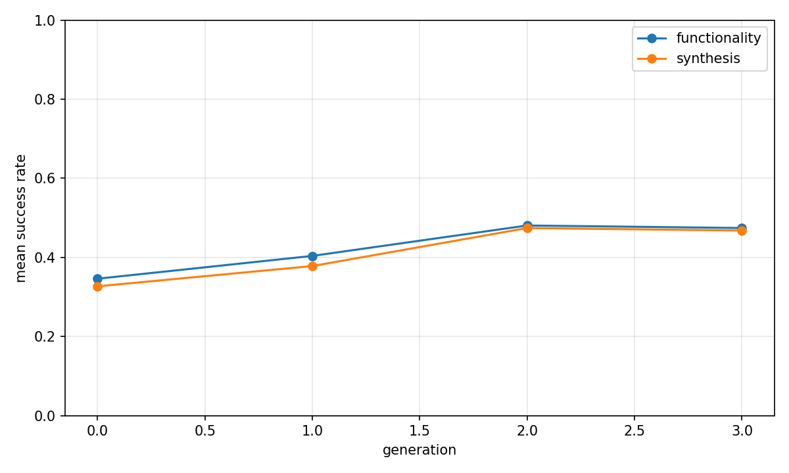
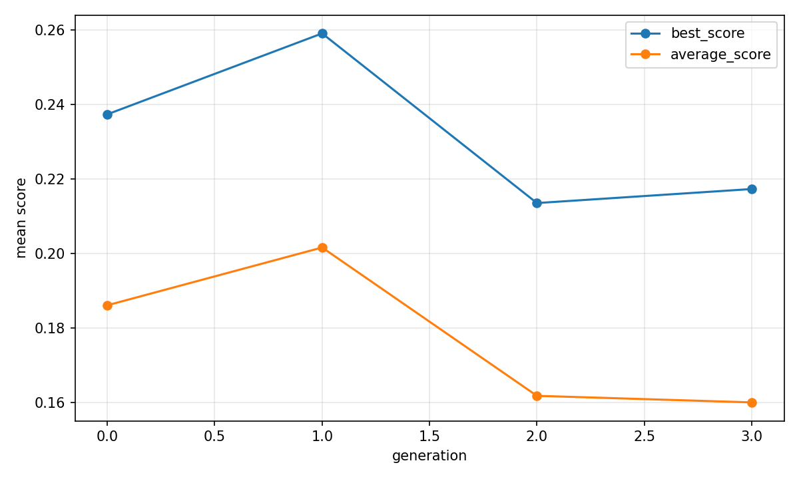

# Evolutionary report: classic

## Run summary

- backend: `classic`
- problem_count: `13`
- qd_archive_present: `False`
- mean_functionality_rate: `42.6%`
- mean_synthesis_rate: `41.2%`
- mean_best_score: `0.2279`
- mean_runtime_seconds: `991.5661`
- total_llm_api_calls: `1248`

## Plot files

- generation rates: 
- generation scores: 
- QD archive trends: n/a

## Per-problem summary

| Benchmark | Problem | Func | Synth | Best score | Runtime (s) | Final coverage | Final QD score |
| --- | --- | ---: | ---: | ---: | ---: | ---: | ---: |
| VerilogEval-Spec-to-RTL | Prob135_m2014_q6b | 77.1% | 77.1% | 0.2636 | 1119.4715 | n/a | n/a |
| VerilogEval-Spec-to-RTL | Prob098_circuit7 | 70.8% | 70.8% | 0.0120 | 1094.5863 | n/a | n/a |
| RTLLM | Prob004_adder_8bit | 60.4% | 58.3% | 0.3815 | 716.6967 | n/a | n/a |
| VerilogEval-Spec-to-RTL | Prob116_m2014_q3 | 58.3% | 58.3% | 0.4644 | 1336.2049 | n/a | n/a |
| VerilogEval-Spec-to-RTL | Prob150_review2015_fsmonehot | 43.8% | 43.8% | 0.3297 | 1038.7667 | n/a | n/a |
| RTLLM | Prob041_traffic_light | 43.8% | 41.7% | 0.4168 | 1073.8152 | n/a | n/a |
| RTLLM | Prob037_parallel2serial | 43.8% | 37.5% | 0.0846 | 973.4737 | n/a | n/a |
| RTLLM | Prob049_signal_generator | 35.4% | 35.4% | 0.2348 | 623.4530 | n/a | n/a |
| RTLLM | Prob024_fsm | 39.6% | 33.3% | 0.5002 | 793.0399 | n/a | n/a |
| RTLLM | Prob015_multi_pipe_8bit | 27.1% | 27.1% | 0.1352 | 1055.4246 | n/a | n/a |
| VerilogEval-Spec-to-RTL | Prob153_gshare | 27.1% | 27.1% | 0.1086 | 762.3643 | n/a | n/a |
| RTLLM | Prob045_alu | 22.9% | 20.8% | 0.3946 | 1086.1639 | n/a | n/a |
| VerilogEval-Spec-to-RTL | Prob151_review2015_fsm | 4.2% | 4.2% | -0.3630 | 1216.8984 | n/a | n/a |

## Generation aggregates

| Gen | Problems | Func | Synth | Best score | Avg score | Diff success | Coverage | QD score |
| ---: | ---: | ---: | ---: | ---: | ---: | ---: | ---: | ---: |
| 0 | 13 | 34.6% | 32.7% | 0.2374 | 0.1862 | n/a | n/a | n/a |
| 1 | 13 | 40.4% | 37.8% | 0.2591 | 0.2017 | n/a | n/a | n/a |
| 2 | 13 | 48.1% | 47.4% | 0.2136 | 0.1619 | n/a | n/a | n/a |
| 3 | 13 | 47.4% | 46.8% | 0.2173 | 0.1601 | n/a | n/a | n/a |

## Aggregated status counts by generation

| Gen | failed_syntax | failed_functionality | failed_diff | failed_synthesis_functionality | success |
| ---: | ---: | ---: | ---: | ---: | ---: |
| 0 | 15 | 86 | 0 | 3 | 51 |
| 1 | 8 | 84 | 0 | 3 | 59 |
| 2 | 14 | 67 | 0 | 1 | 74 |
| 3 | 13 | 69 | 0 | 1 | 73 |

## Aggregated strategy counts by generation

| Gen | Top strategies |
| ---: | --- |
| 0 | initial=156 |
| 1 | M-I=33, M-S=31, M-R=31, M-E=30, M-F=21 |
| 2 | M-S=35, M-I=34, M-R=28, M-E=26, C-F=17 |
| 3 | M-E=35, C-F=32, M-I=31, M-S=29, M-R=23 |
