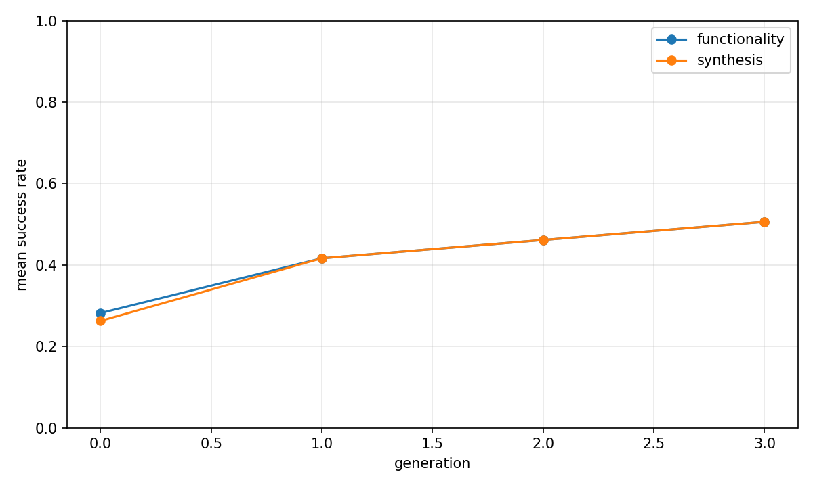
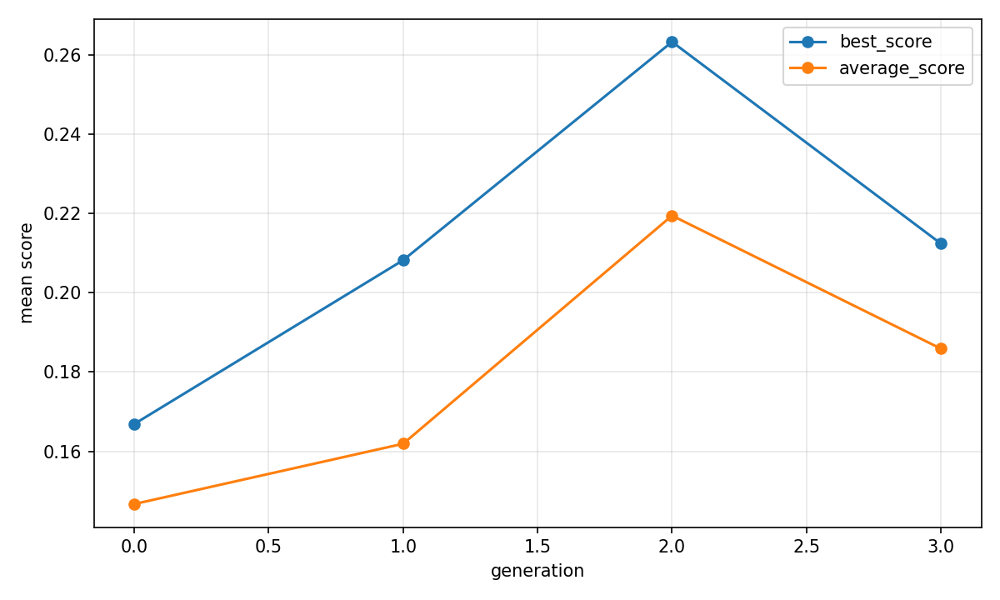
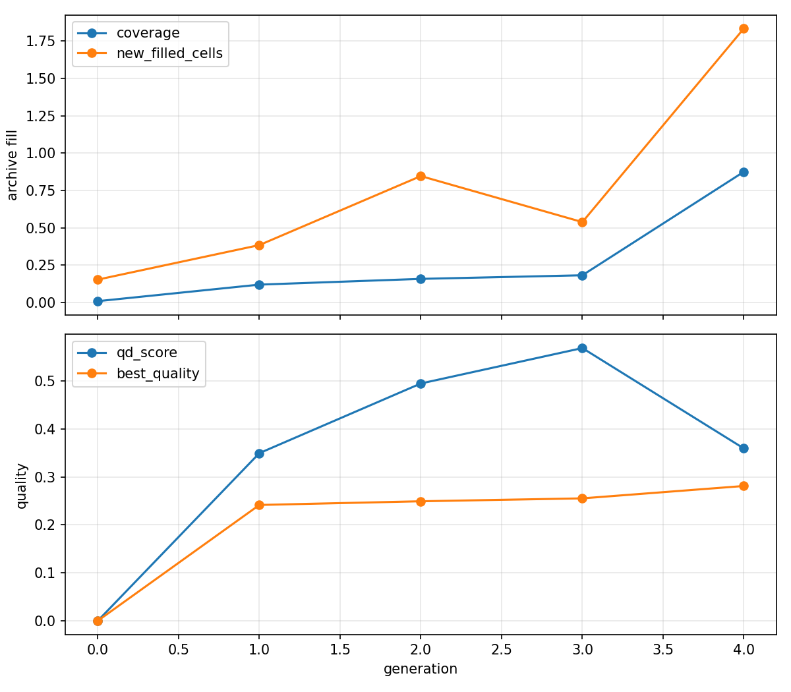

# Evolutionary report: fused_rtl_state_pipeline_qd

## Run summary

- backend: `fused_rtl_state_pipeline_qd`
- problem_count: `13`
- qd_archive_present: `True`
- mean_functionality_rate: `41.7%`
- mean_synthesis_rate: `41.2%`
- mean_best_score: `0.2683`
- mean_runtime_seconds: `1081.7903`
- total_llm_api_calls: `1248`

## Plot files

- generation rates: 
- generation scores: 
- QD archive trends: 

## Per-problem summary

| Benchmark | Problem | Func | Synth | Best score | Runtime (s) | Final coverage | Final QD score |
| --- | --- | ---: | ---: | ---: | ---: | ---: | ---: |
| RTLLM | Prob049_signal_generator | 79.2% | 79.2% | 0.2348 | 634.8928 | 75.0% | 0.7043 |
| RTLLM | Prob004_adder_8bit | 70.8% | 70.8% | 0.3815 | 541.8026 | 50.0% | 0.3815 |
| RTLLM | Prob024_fsm | 56.2% | 52.1% | 0.5002 | 897.7269 | 37.5% | 2.2880 |
| VerilogEval-Spec-to-RTL | Prob135_m2014_q6b | 52.1% | 52.1% | 0.2636 | 1124.0135 | 100.0% | 0.2636 |
| RTLLM | Prob041_traffic_light | 50.0% | 50.0% | 0.4077 | 1147.8015 | 50.0% | 1.9672 |
| VerilogEval-Spec-to-RTL | Prob153_gshare | 41.7% | 39.6% | 0.1356 | 1121.8074 | 50.0% | 0.3873 |
| RTLLM | Prob045_alu | 39.6% | 39.6% | 0.4031 | 1149.2007 | 43.8% | 2.6968 |
| VerilogEval-Spec-to-RTL | Prob116_m2014_q3 | 37.5% | 37.5% | 0.4654 | 1422.6414 | 100.0% | 0.4654 |
| RTLLM | Prob037_parallel2serial | 35.4% | 35.4% | 0.0326 | 1230.4777 | 25.0% | 0.0516 |
| VerilogEval-Spec-to-RTL | Prob098_circuit7 | 33.3% | 33.3% | 0.0120 | 1367.4108 | 100.0% | 0.0120 |
| RTLLM | Prob015_multi_pipe_8bit | 27.1% | 27.1% | 0.0528 | 1017.0008 | 31.2% | 0.0047 |
| VerilogEval-Spec-to-RTL | Prob150_review2015_fsmonehot | 12.5% | 12.5% | 0.3297 | 1182.2053 | 100.0% | 0.3297 |
| VerilogEval-Spec-to-RTL | Prob151_review2015_fsm | 6.2% | 6.2% | n/a | 1226.2922 | 0.0% | 0.0000 |

## Generation aggregates

| Gen | Problems | Func | Synth | Best score | Avg score | Diff success | Coverage | QD score |
| ---: | ---: | ---: | ---: | ---: | ---: | ---: | ---: | ---: |
| 0 | 13 | 28.2% | 26.3% | 0.1669 | 0.1467 | n/a | 1.0% | 0.0000 |
| 1 | 13 | 41.7% | 41.7% | 0.2082 | 0.1619 | n/a | 12.0% | 0.3496 |
| 2 | 13 | 46.2% | 46.2% | 0.2633 | 0.2194 | n/a | 15.9% | 0.4950 |
| 3 | 13 | 50.6% | 50.6% | 0.2124 | 0.1859 | n/a | 18.3% | 0.5689 |
| 4 | 0 | n/a | n/a | n/a | n/a | n/a | 87.5% | 0.3594 |

## Aggregated status counts by generation

| Gen | failed_syntax | failed_functionality | failed_diff | failed_synthesis_functionality | success |
| ---: | ---: | ---: | ---: | ---: | ---: |
| 0 | 17 | 95 | 0 | 3 | 41 |
| 1 | 2 | 88 | 0 | 0 | 65 |
| 2 | 3 | 81 | 0 | 0 | 72 |
| 3 | 4 | 73 | 0 | 0 | 79 |

## Aggregated strategy counts by generation

| Gen | Top strategies |
| ---: | --- |
| 0 | initial=156 |
| 1 | single_thought_operator=154, initial=2 |
| 2 | single_thought_operator=154, initial=2 |
| 3 | single_thought_operator=154, initial=2 |
