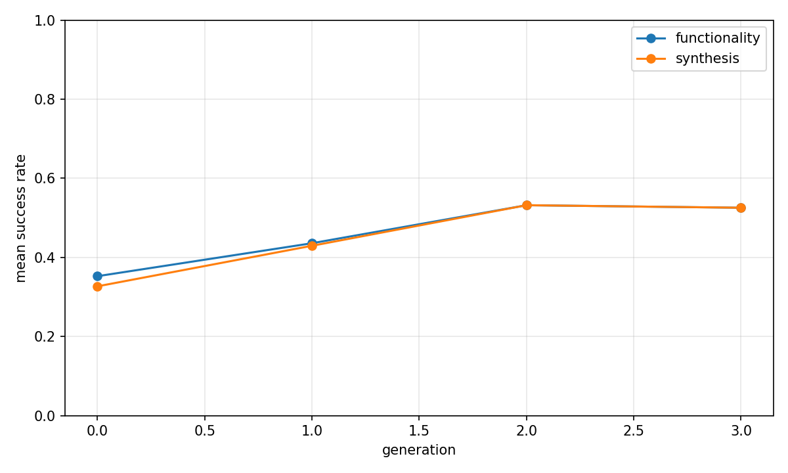
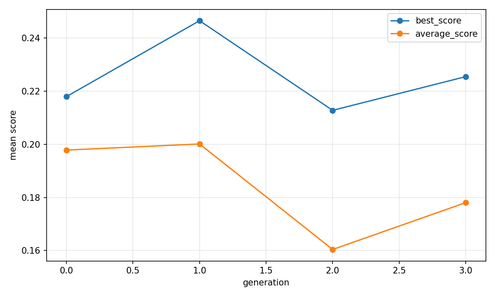
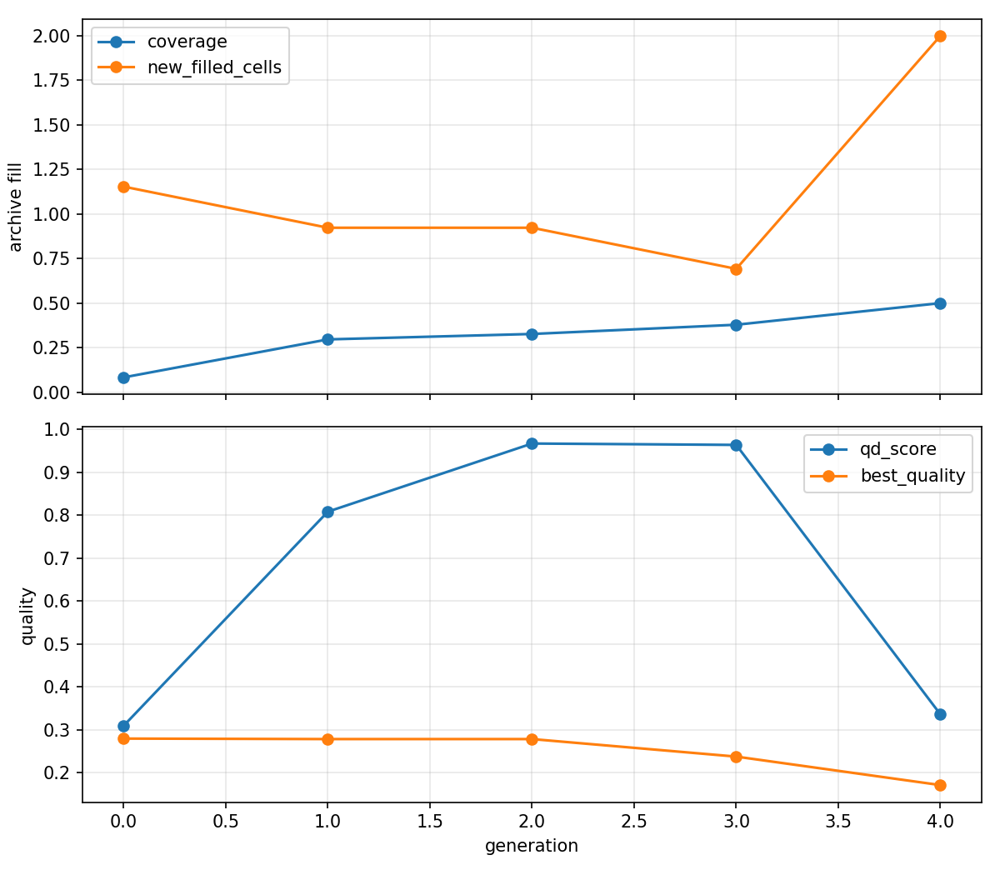

# Evolutionary report: fused_rtl_operator_timing_qd

## Run summary

- backend: `fused_rtl_operator_timing_qd`
- problem_count: `13`
- qd_archive_present: `True`
- mean_functionality_rate: `46.2%`
- mean_synthesis_rate: `45.4%`
- mean_best_score: `0.2270`
- mean_runtime_seconds: `1059.4037`
- total_llm_api_calls: `1248`

## Plot files

- generation rates: 
- generation scores: 
- QD archive trends: 

## Per-problem summary

| Benchmark | Problem | Func | Synth | Best score | Runtime (s) | Final coverage | Final QD score |
| --- | --- | ---: | ---: | ---: | ---: | ---: | ---: |
| RTLLM | Prob049_signal_generator | 91.7% | 91.7% | 0.2348 | 632.0571 | 83.3% | 1.1739 |
| VerilogEval-Spec-to-RTL | Prob135_m2014_q6b | 87.5% | 87.5% | 0.2636 | 1142.3847 | 43.8% | 1.5754 |
| RTLLM | Prob004_adder_8bit | 75.0% | 75.0% | 0.3815 | 620.4799 | 44.4% | 1.5262 |
| RTLLM | Prob024_fsm | 58.3% | 47.9% | 0.5002 | 837.1674 | 50.0% | 2.4052 |
| RTLLM | Prob041_traffic_light | 45.8% | 45.8% | 0.4038 | 1175.0435 | 68.8% | 2.5606 |
| RTLLM | Prob037_parallel2serial | 45.8% | 45.8% | -0.0000 | 1012.6640 | 33.3% | -0.0097 |
| VerilogEval-Spec-to-RTL | Prob116_m2014_q3 | 41.7% | 41.7% | 0.4654 | 1464.1103 | 25.0% | 1.7910 |
| VerilogEval-Spec-to-RTL | Prob153_gshare | 41.7% | 41.7% | 0.1356 | 1145.4455 | 50.0% | 0.5738 |
| VerilogEval-Spec-to-RTL | Prob098_circuit7 | 37.5% | 37.5% | 0.0120 | 1387.4478 | 50.0% | 0.0120 |
| VerilogEval-Spec-to-RTL | Prob150_review2015_fsmonehot | 25.0% | 25.0% | 0.3297 | 969.3325 | 50.0% | 0.6594 |
| RTLLM | Prob045_alu | 22.9% | 22.9% | 0.3879 | 1211.3198 | 43.8% | 2.6603 |
| RTLLM | Prob015_multi_pipe_8bit | 16.7% | 16.7% | 0.0528 | 921.2302 | 25.0% | -0.0764 |
| VerilogEval-Spec-to-RTL | Prob151_review2015_fsm | 10.4% | 10.4% | -0.2160 | 1253.5658 | 25.0% | -1.6487 |

## Generation aggregates

| Gen | Problems | Func | Synth | Best score | Avg score | Diff success | Coverage | QD score |
| ---: | ---: | ---: | ---: | ---: | ---: | ---: | ---: | ---: |
| 0 | 13 | 35.3% | 32.7% | 0.2180 | 0.1978 | n/a | 8.3% | 0.3092 |
| 1 | 13 | 43.6% | 42.9% | 0.2466 | 0.2001 | n/a | 29.6% | 0.8083 |
| 2 | 13 | 53.2% | 53.2% | 0.2128 | 0.1604 | n/a | 32.7% | 0.9672 |
| 3 | 13 | 52.6% | 52.6% | 0.2255 | 0.1780 | n/a | 37.9% | 0.9640 |
| 4 | 0 | n/a | n/a | n/a | n/a | n/a | 50.0% | 0.3357 |

## Aggregated status counts by generation

| Gen | failed_syntax | failed_functionality | failed_diff | failed_synthesis_functionality | success |
| ---: | ---: | ---: | ---: | ---: | ---: |
| 0 | 15 | 85 | 0 | 4 | 51 |
| 1 | 3 | 85 | 0 | 1 | 67 |
| 2 | 2 | 71 | 0 | 0 | 83 |
| 3 | 5 | 69 | 0 | 0 | 82 |

## Aggregated strategy counts by generation

| Gen | Top strategies |
| ---: | --- |
| 0 | initial=156 |
| 1 | single_thought_operator=153, initial=3 |
| 2 | single_thought_operator=156 |
| 3 | single_thought_operator=156 |
