# VerilogEval-Spec-to-RTL / Prob151_review2015_fsm

- circuit_type: `sequential`
- successful_candidates: `3`
- backends: `classic, rtl_native_front_guarded_parent_qd`

## Backend counts

- `classic`: `2` successes, `generation plots enabled`
- `rtl_native_front_guarded_parent_qd`: `1` successes, `generation plots enabled`

## Contents

- [Quick Reference](#quick-reference)
- [PPA Chronology](#ppa-chronology)
- [All-backend feature space](#all-backend-feature-space)
- [classic vs rtl_native_front_guarded_parent_qd](#classic-vs-rtl_native_front_guarded_parent_qd)

## Quick Reference

### Gen 3 accumulated PPA

- `Power vs Area`: 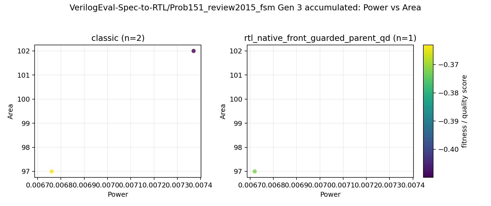
- `Power vs Performance`: 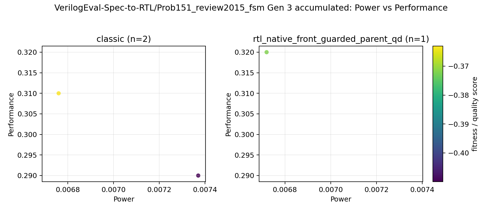
- `Area vs Performance`: 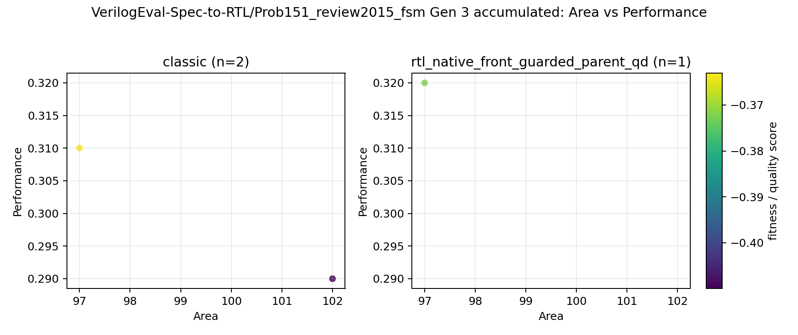

### Gen 3 accumulated features

- feature basis: `recommended report feature subset`
- features: `none`

- `PCA`: `too_few_varying_features`

### Gen 3 accumulated features

- feature basis: `fused_rtl_state_pipeline_2d descriptor profile`
- features: `state_control_ratio, control_pipeline_ratio`

- `PCA`: `too_few_varying_features`

## PPA Chronology

### Gen 2 local PPA

- `Power vs Area`: 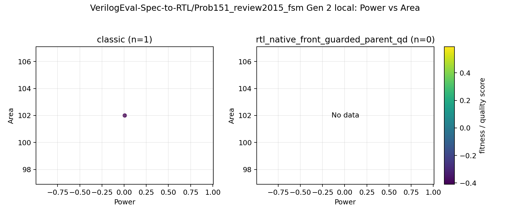
- `Power vs Performance`: 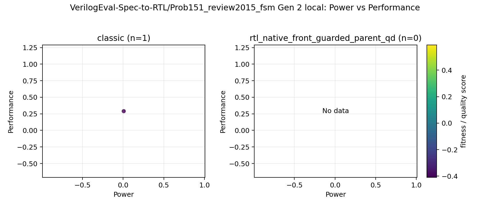
- `Area vs Performance`: 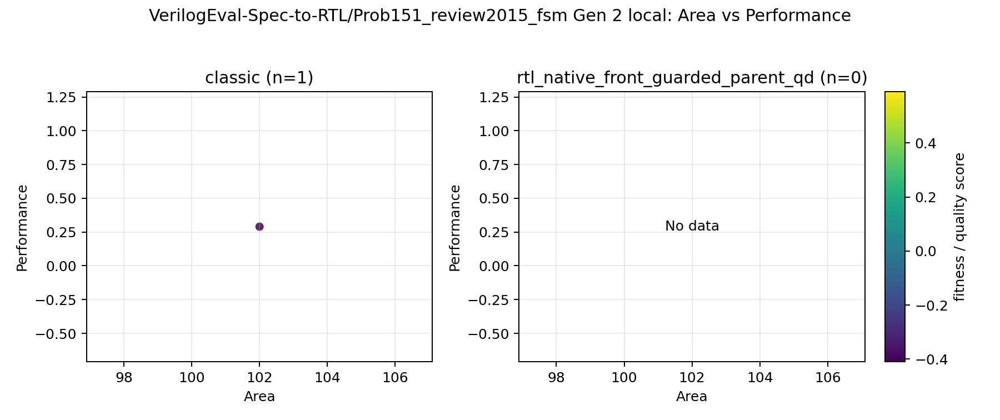

### Gen 2 accumulated PPA

- `Power vs Area`: 
- `Power vs Performance`: 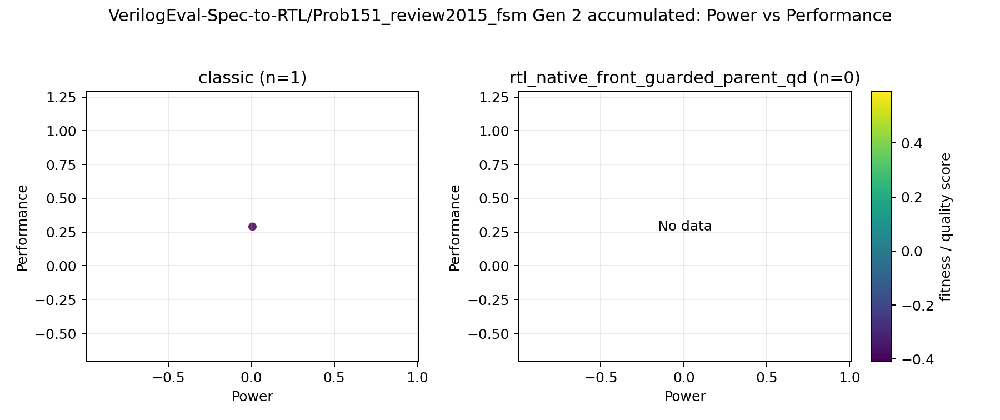
- `Area vs Performance`: 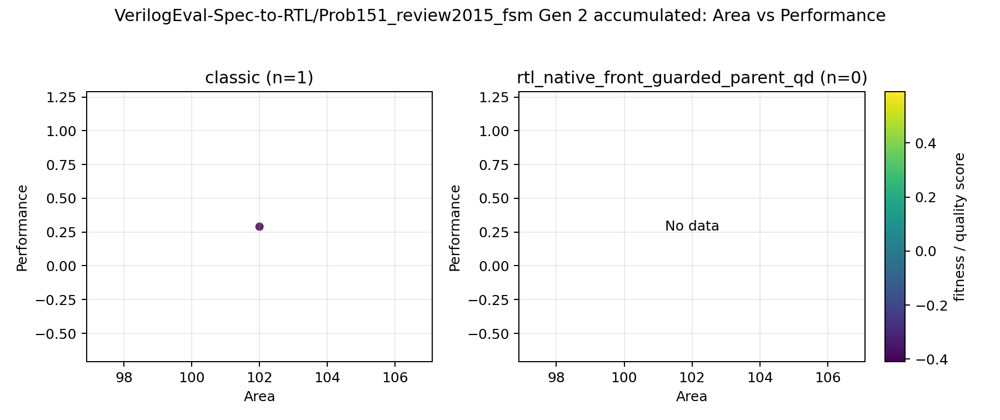

### Gen 3 local PPA

- `Power vs Area`: 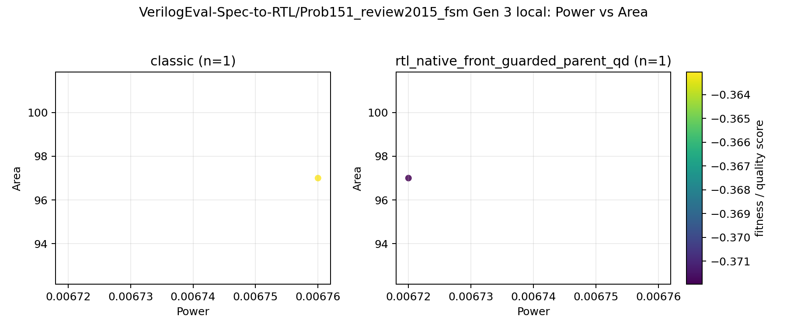
- `Power vs Performance`: 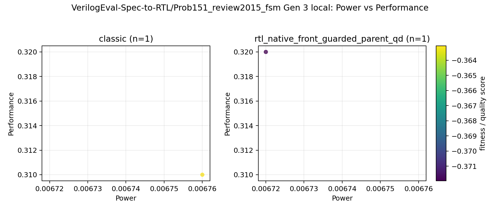
- `Area vs Performance`: 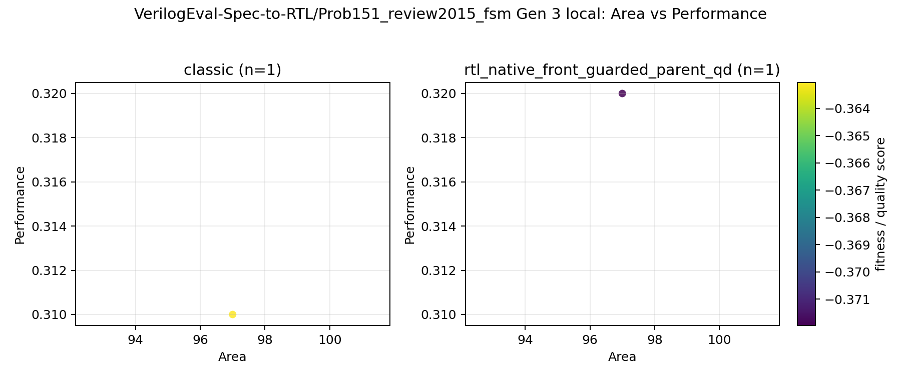

### Gen 3 accumulated PPA

- `Power vs Area`: 
- `Power vs Performance`: 
- `Area vs Performance`: 

## All-backend feature space

### Gen 2 local features

- feature basis: `recommended report feature subset`
- features: `none`

- `PCA`: `too_few_varying_features`

### Gen 2 accumulated features

- feature basis: `recommended report feature subset`
- features: `none`

- `PCA`: `too_few_varying_features`

### Gen 3 local features

- feature basis: `recommended report feature subset`
- features: `none`

- `PCA`: `too_few_varying_features`

### Gen 3 accumulated features

- feature basis: `recommended report feature subset`
- features: `none`

- `PCA`: `too_few_varying_features`

## classic vs rtl_native_front_guarded_parent_qd

- feature basis: `fused_rtl_state_pipeline_2d descriptor profile`
- features: `state_control_ratio, control_pipeline_ratio`

### Gen 2 local features

- feature basis: `fused_rtl_state_pipeline_2d descriptor profile`
- features: `state_control_ratio, control_pipeline_ratio`

- `PCA`: `too_few_varying_features`

### Gen 2 accumulated features

- feature basis: `fused_rtl_state_pipeline_2d descriptor profile`
- features: `state_control_ratio, control_pipeline_ratio`

- `PCA`: `too_few_varying_features`

### Gen 3 local features

- feature basis: `fused_rtl_state_pipeline_2d descriptor profile`
- features: `state_control_ratio, control_pipeline_ratio`

- `PCA`: `too_few_varying_features`

### Gen 3 accumulated features

- feature basis: `fused_rtl_state_pipeline_2d descriptor profile`
- features: `state_control_ratio, control_pipeline_ratio`

- `PCA`: `too_few_varying_features`
