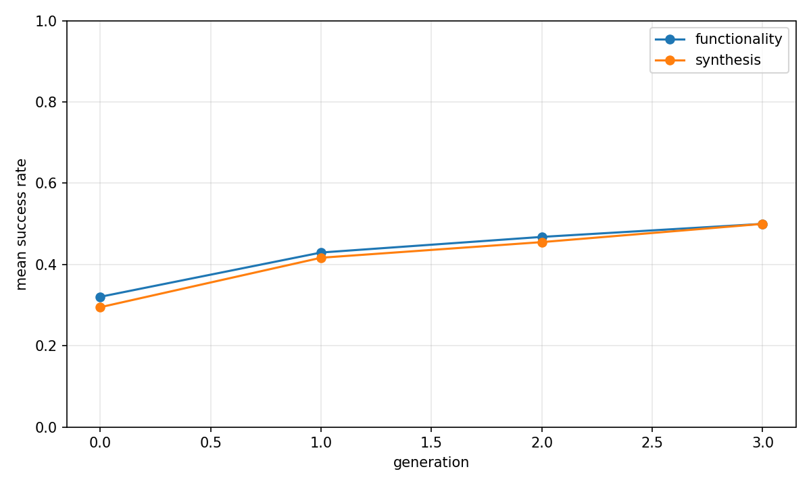
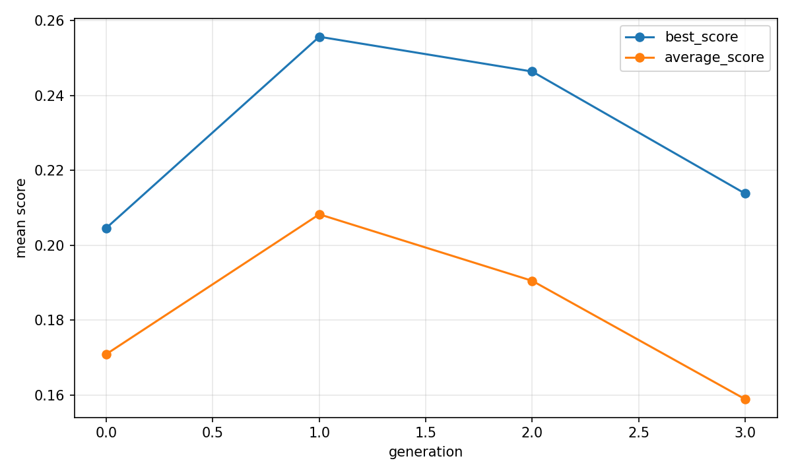
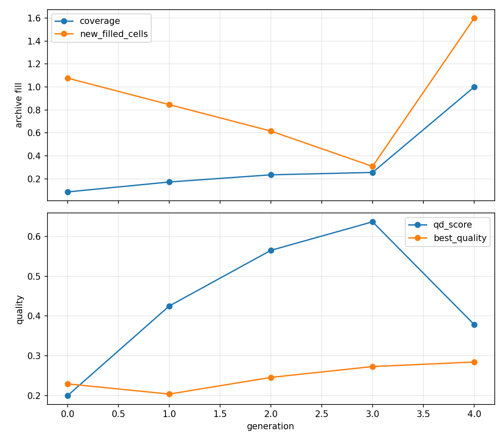

# Evolutionary report: rtl_native_front_guarded_parent_qd

## Run summary

- backend: `rtl_native_front_guarded_parent_qd`
- problem_count: `13`
- qd_archive_present: `True`
- mean_functionality_rate: `42.9%`
- mean_synthesis_rate: `41.7%`
- mean_best_score: `0.2780`
- mean_runtime_seconds: `1080.9848`
- total_llm_api_calls: `1248`

## Plot files

- generation rates: 
- generation scores: 
- QD archive trends: 

## Per-problem summary

| Benchmark | Problem | Func | Synth | Best score | Runtime (s) | Final coverage | Final QD score |
| --- | --- | ---: | ---: | ---: | ---: | ---: | ---: |
| RTLLM | Prob004_adder_8bit | 72.9% | 72.9% | 0.3815 | 535.2080 | 100.0% | 0.3815 |
| RTLLM | Prob049_signal_generator | 70.8% | 70.8% | 0.2348 | 672.9410 | 100.0% | 0.7043 |
| VerilogEval-Spec-to-RTL | Prob135_m2014_q6b | 66.7% | 66.7% | 0.2636 | 1186.7817 | 25.0% | 1.0540 |
| RTLLM | Prob041_traffic_light | 52.1% | 50.0% | 0.3993 | 1270.2970 | 68.8% | 2.3404 |
| RTLLM | Prob037_parallel2serial | 45.8% | 43.8% | -0.0000 | 1010.8741 | 33.3% | -0.0106 |
| RTLLM | Prob015_multi_pipe_8bit | 43.8% | 41.7% | 0.2434 | 937.8409 | 50.0% | 0.1335 |
| RTLLM | Prob045_alu | 41.7% | 41.7% | 0.3933 | 1152.7045 | 66.7% | 3.0760 |
| RTLLM | Prob024_fsm | 47.9% | 39.6% | 0.4701 | 887.5158 | 50.0% | 1.2052 |
| VerilogEval-Spec-to-RTL | Prob153_gshare | 39.6% | 39.6% | 0.1431 | 1152.4010 | 37.5% | 0.4752 |
| VerilogEval-Spec-to-RTL | Prob150_review2015_fsmonehot | 29.2% | 29.2% | 0.3297 | 1106.0426 | 100.0% | 0.3297 |
| VerilogEval-Spec-to-RTL | Prob116_m2014_q3 | 25.0% | 25.0% | 0.4654 | 1398.5772 | 100.0% | 0.4654 |
| VerilogEval-Spec-to-RTL | Prob098_circuit7 | 18.8% | 18.8% | 0.0120 | 1460.9463 | 100.0% | 0.0120 |
| VerilogEval-Spec-to-RTL | Prob151_review2015_fsm | 4.2% | 2.1% | n/a | 1280.6718 | 0.0% | 0.0000 |

## Generation aggregates

| Gen | Problems | Func | Synth | Best score | Avg score | Diff success | Coverage | QD score |
| ---: | ---: | ---: | ---: | ---: | ---: | ---: | ---: | ---: |
| 0 | 13 | 32.1% | 29.5% | 0.2046 | 0.1710 | n/a | 8.5% | 0.2004 |
| 1 | 13 | 42.9% | 41.7% | 0.2556 | 0.2083 | n/a | 17.1% | 0.4253 |
| 2 | 13 | 46.8% | 45.5% | 0.2464 | 0.1905 | n/a | 23.4% | 0.5649 |
| 3 | 13 | 50.0% | 50.0% | 0.2138 | 0.1589 | n/a | 25.5% | 0.6364 |
| 4 | 0 | n/a | n/a | n/a | n/a | n/a | 100.0% | 0.3786 |

## Aggregated status counts by generation

| Gen | failed_syntax | failed_functionality | failed_diff | failed_synthesis_functionality | success |
| ---: | ---: | ---: | ---: | ---: | ---: |
| 0 | 16 | 88 | 0 | 4 | 46 |
| 1 | 0 | 89 | 0 | 2 | 65 |
| 2 | 5 | 78 | 0 | 2 | 71 |
| 3 | 3 | 75 | 0 | 0 | 78 |

## Aggregated strategy counts by generation

| Gen | Top strategies |
| ---: | --- |
| 0 | initial=156 |
| 1 | single_thought_operator=153, initial=3 |
| 2 | single_thought_operator=156 |
| 3 | single_thought_operator=156 |
