# VerilogEval-Spec-to-RTL / Prob153_gshare

- circuit_type: `sequential`
- successful_candidates: `13`
- backends: `classic, rtl_native_seeded_thought_qd`

## Backend counts

- `classic`: `13` successes, `generation plots enabled`
- `rtl_native_seeded_thought_qd`: `0` successes, `generation plots enabled`

## Contents

- [Quick Reference](#quick-reference)
- [PPA Chronology](#ppa-chronology)
- [All-backend feature space](#all-backend-feature-space)
- [Notes](#notes)

## Quick Reference

### Gen 3 accumulated PPA

- `Power vs Area`: 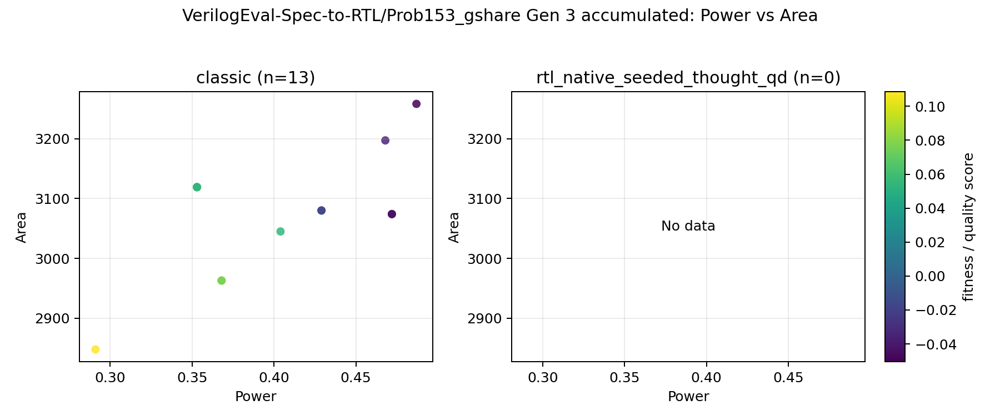
- `Power vs Performance`: 
- `Area vs Performance`: 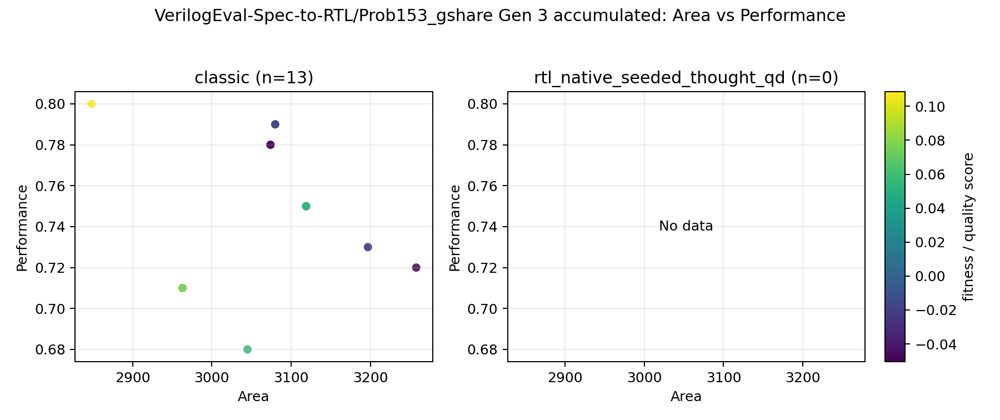

### Gen 3 accumulated features

- feature basis: `recommended report feature subset`
- features: `none`

- `PCA`: `too_few_varying_features`

## PPA Chronology

### Gen 0 local PPA

- `Power vs Area`: 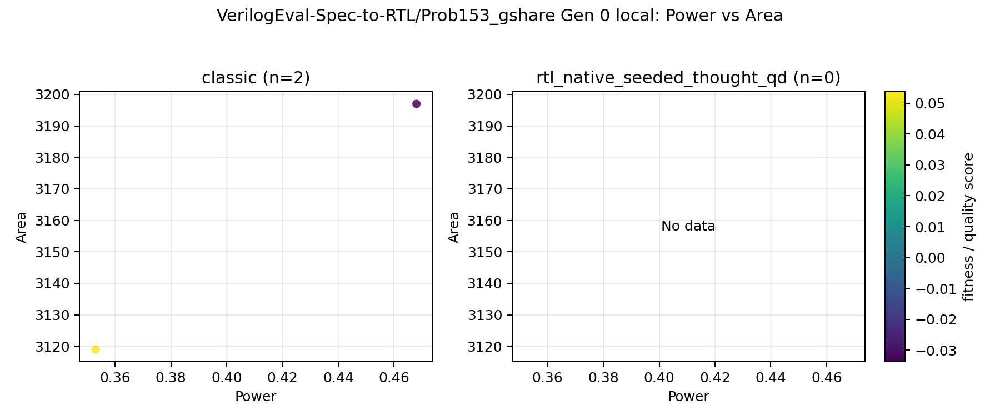
- `Power vs Performance`: 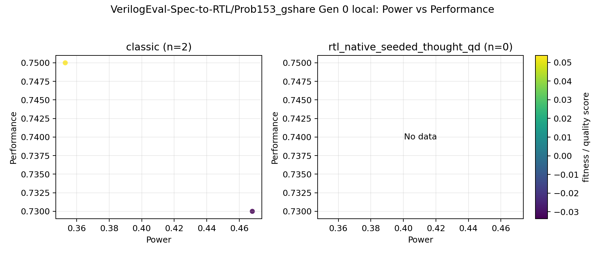
- `Area vs Performance`: 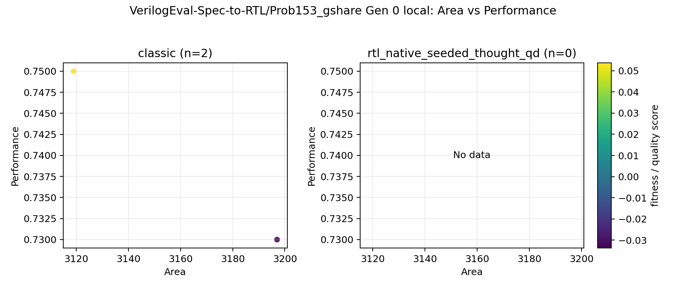

### Gen 0 accumulated PPA

- `Power vs Area`: 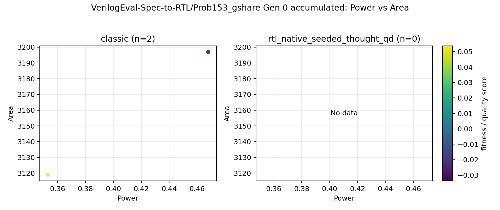
- `Power vs Performance`: 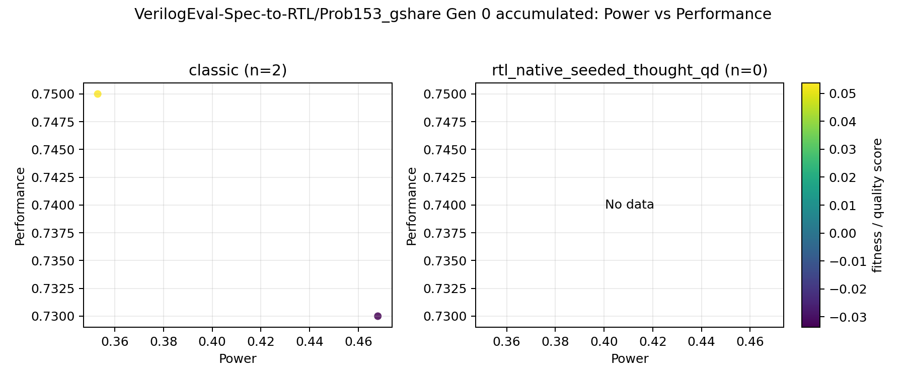
- `Area vs Performance`: 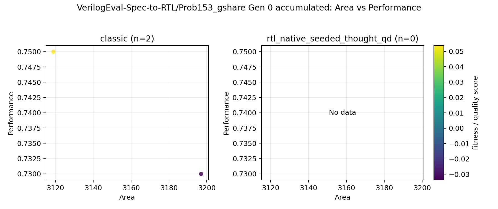

### Gen 1 local PPA

- `Power vs Area`: 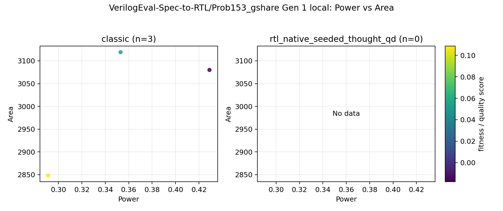
- `Power vs Performance`: 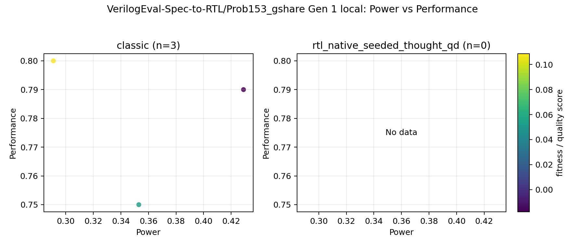
- `Area vs Performance`: 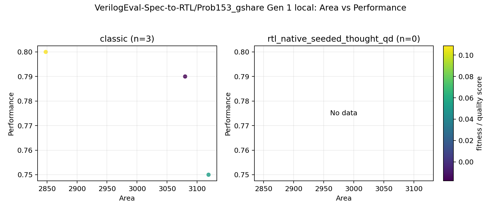

### Gen 1 accumulated PPA

- `Power vs Area`: 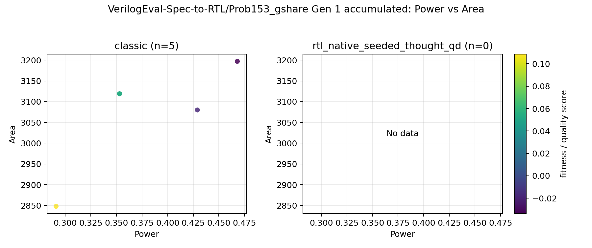
- `Power vs Performance`: 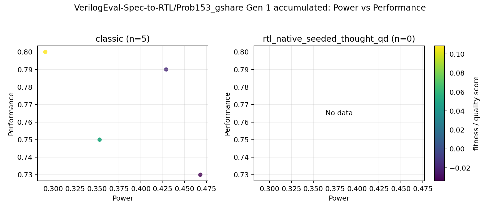
- `Area vs Performance`: 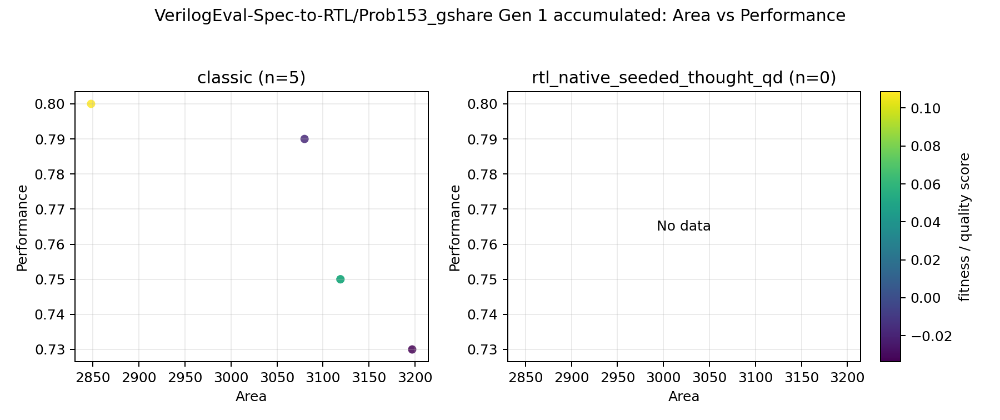

### Gen 2 local PPA

- `Power vs Area`: 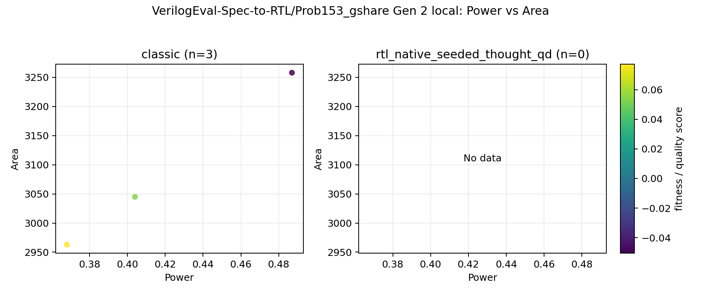
- `Power vs Performance`: 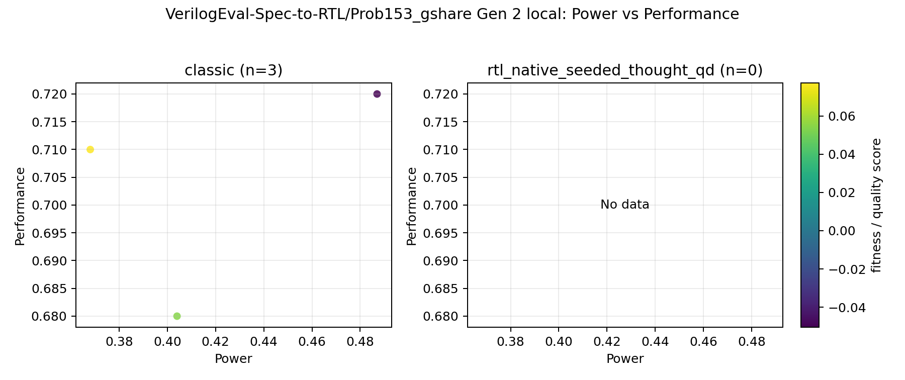
- `Area vs Performance`: 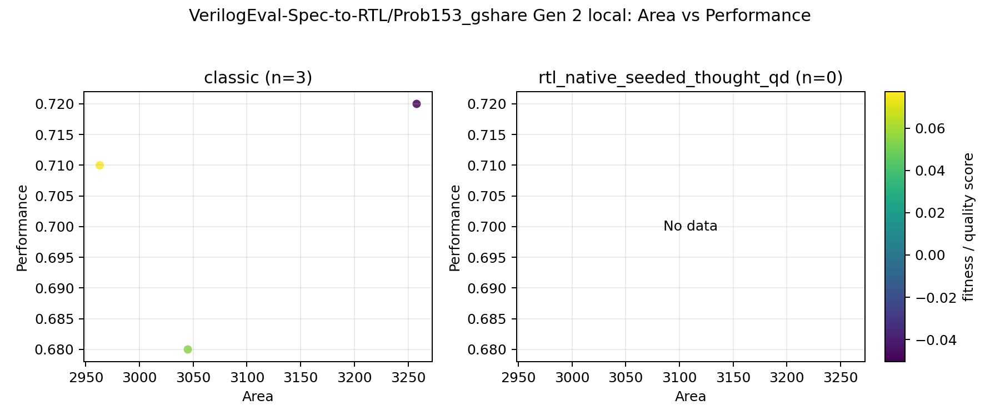

### Gen 2 accumulated PPA

- `Power vs Area`: 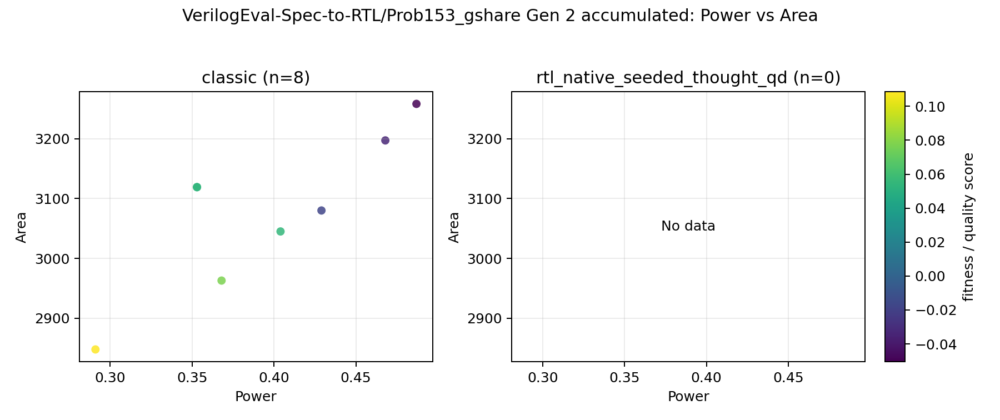
- `Power vs Performance`: 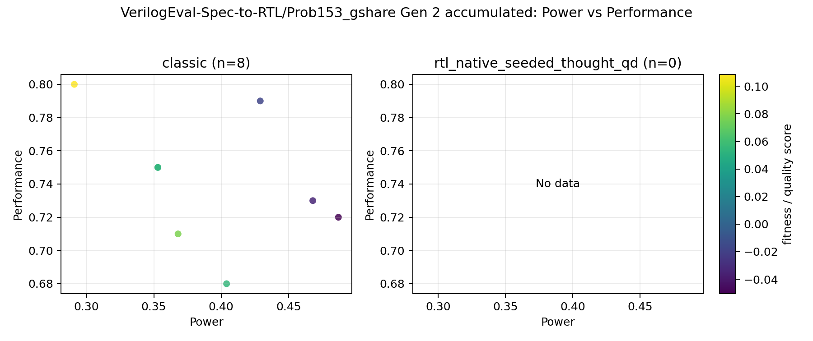
- `Area vs Performance`: 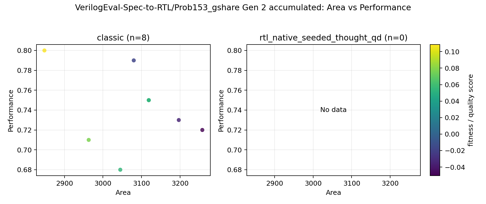

### Gen 3 local PPA

- `Power vs Area`: 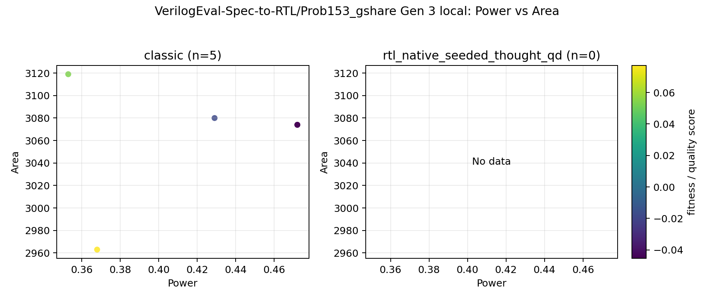
- `Power vs Performance`: 
- `Area vs Performance`: 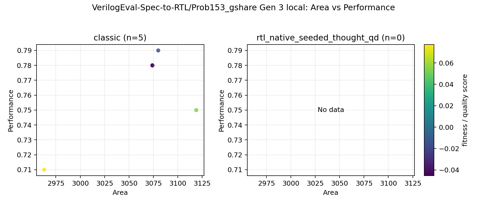

### Gen 3 accumulated PPA

- `Power vs Area`: 
- `Power vs Performance`: 
- `Area vs Performance`: 

## All-backend feature space

### Gen 0 local features

- feature basis: `recommended report feature subset`
- features: `none`

- `PCA`: `too_few_varying_features`

### Gen 0 accumulated features

- feature basis: `recommended report feature subset`
- features: `none`

- `PCA`: `too_few_varying_features`

### Gen 1 local features

- feature basis: `recommended report feature subset`
- features: `none`

- `PCA`: `too_few_varying_features`

### Gen 1 accumulated features

- feature basis: `recommended report feature subset`
- features: `none`

- `PCA`: `too_few_varying_features`

### Gen 2 local features

- feature basis: `recommended report feature subset`
- features: `none`

- `PCA`: `too_few_varying_features`

### Gen 2 accumulated features

- feature basis: `recommended report feature subset`
- features: `none`

- `PCA`: `too_few_varying_features`

### Gen 3 local features

- feature basis: `recommended report feature subset`
- features: `none`

- `PCA`: `too_few_varying_features`

### Gen 3 accumulated features

- feature basis: `recommended report feature subset`
- features: `none`

- `PCA`: `too_few_varying_features`

## Notes

- Skipped pairwise feature plots for classic vs rtl_native_seeded_thought_qd because one side had no successful candidates.
- No QD backends were eligible for pairwise feature plots in this problem.
