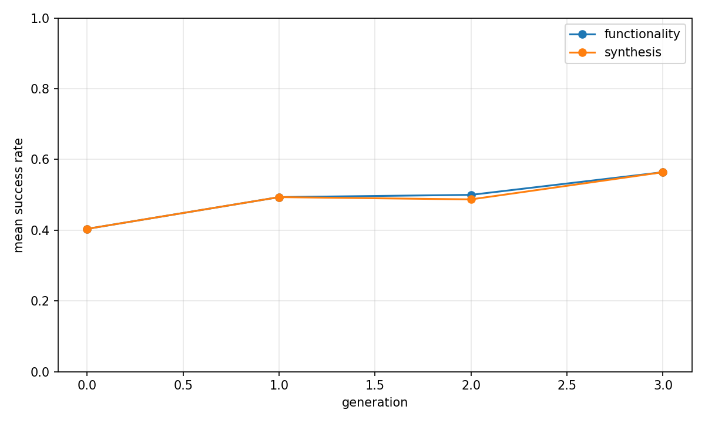
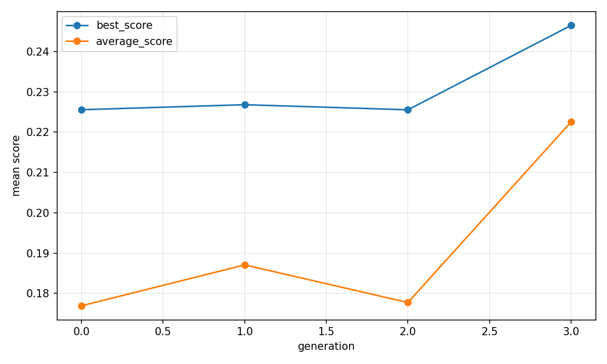
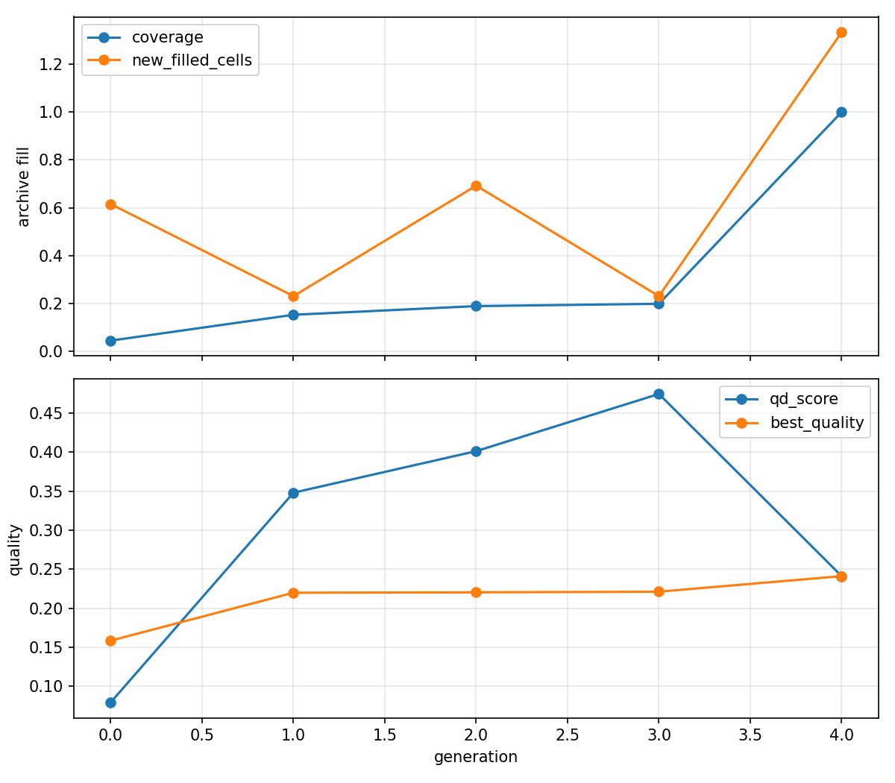

# Evolutionary report: rtl_native_seeded_thought_qd

## Run summary

- backend: `rtl_native_seeded_thought_qd`
- problem_count: `13`
- qd_archive_present: `True`
- mean_functionality_rate: `53.1%`
- mean_synthesis_rate: `52.8%`
- mean_best_score: `0.2266`
- mean_runtime_seconds: `2411.7543`
- total_llm_api_calls: `1458`

## Plot files

- generation rates: 
- generation scores: 
- QD archive trends: 

## Per-problem summary

| Benchmark | Problem | Func | Synth | Best score | Runtime (s) | Final coverage | Final QD score |
| --- | --- | ---: | ---: | ---: | ---: | ---: | ---: |
| RTLLM | Prob041_traffic_light | 75.0% | 75.0% | 0.4077 | 2688.9562 | 37.5% | 2.0298 |
| RTLLM | Prob004_adder_8bit | 75.0% | 75.0% | 0.3815 | 1788.7516 | 100.0% | 0.3815 |
| RTLLM | Prob049_signal_generator | 70.8% | 70.8% | 0.2638 | 1959.3751 | 33.3% | 0.9681 |
| RTLLM | Prob015_multi_pipe_8bit | 68.8% | 68.8% | 0.0528 | 2740.6509 | 37.5% | -0.0022 |
| VerilogEval-Spec-to-RTL | Prob098_circuit7 | 68.8% | 68.8% | 0.0120 | 2199.2843 | 100.0% | 0.0120 |
| VerilogEval-Spec-to-RTL | Prob150_review2015_fsmonehot | 60.4% | 60.4% | 0.3297 | 2517.8731 | 100.0% | 0.3297 |
| VerilogEval-Spec-to-RTL | Prob135_m2014_q6b | 58.3% | 58.3% | 0.2636 | 2777.0995 | 33.3% | 0.7229 |
| RTLLM | Prob024_fsm | 47.9% | 45.8% | 0.4917 | 2100.0971 | 31.2% | 2.4281 |
| RTLLM | Prob045_alu | 39.6% | 39.6% | 0.4153 | 2927.6704 | 33.3% | 1.2023 |
| RTLLM | Prob037_parallel2serial | 37.5% | 37.5% | -0.0000 | 2249.2621 | 18.8% | -0.3285 |
| VerilogEval-Spec-to-RTL | Prob151_review2015_fsm | 31.2% | 29.2% | -0.1259 | 2709.4995 | 33.3% | -0.8482 |
| VerilogEval-Spec-to-RTL | Prob116_m2014_q3 | 4.2% | 4.2% | n/a | 3148.3056 | 0.0% | 0.0000 |
| VerilogEval-Spec-to-RTL | Prob153_gshare | n/a | n/a | n/a | 1545.9804 | 0.0% | 0.0000 |

## Generation aggregates

| Gen | Problems | Func | Synth | Best score | Avg score | Diff success | Coverage | QD score |
| ---: | ---: | ---: | ---: | ---: | ---: | ---: | ---: | ---: |
| 0 | 13 | 40.4% | 40.4% | 0.2256 | 0.1769 | n/a | 4.5% | 0.0791 |
| 1 | 13 | 49.4% | 49.4% | 0.2268 | 0.1871 | n/a | 15.3% | 0.3481 |
| 2 | 13 | 50.0% | 48.7% | 0.2255 | 0.1778 | n/a | 18.9% | 0.4014 |
| 3 | 13 | 56.4% | 56.4% | 0.2465 | 0.2225 | n/a | 19.9% | 0.4748 |
| 4 | 0 | n/a | n/a | n/a | n/a | n/a | 100.0% | 0.2411 |

## Aggregated status counts by generation

| Gen | failed_syntax | failed_functionality | failed_diff | failed_synthesis_functionality | success |
| ---: | ---: | ---: | ---: | ---: | ---: |
| 0 | 9 | 84 | 0 | 0 | 63 |
| 1 | 4 | 75 | 0 | 0 | 77 |
| 2 | 6 | 72 | 0 | 2 | 76 |
| 3 | 6 | 62 | 0 | 0 | 88 |

## Aggregated strategy counts by generation

| Gen | Top strategies |
| ---: | --- |
| 0 | initial=156 |
| 1 | single_thought_operator=156 |
| 2 | single_thought_operator=144, initial=12 |
| 3 | single_thought_operator=153, initial=3 |
