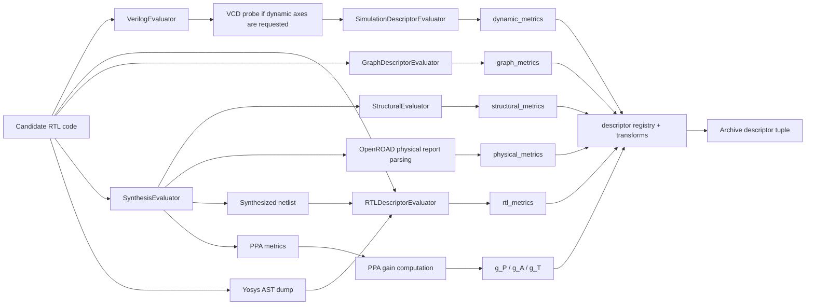
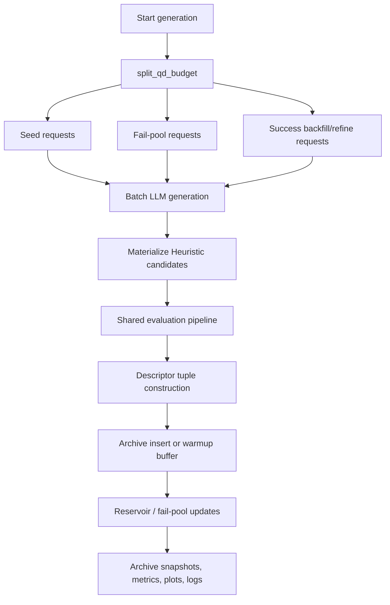
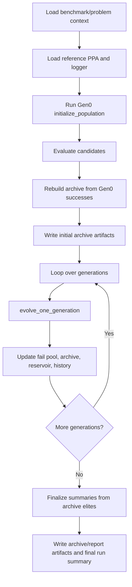

# QD/MAP-Elites Guide

## Overview

This branch adds `search_mode=revolution_qd` to the existing REvolution
backend. The QD path keeps the same prompt, evaluation, and logging substrate
as classic REvolution, but replaces the success-side flat pool with an
archive-backed success state.

Current QD state:

- `fail_pool`: failed or otherwise non-archiveable candidates
- `success_archive`: the source of truth for successful elites
- `success_view`: archive elites plus a bounded per-cell reservoir used for
  parent sampling

Supported archive geometries:

- `grid`: uniform-binned MAP-Elites archive
- `cvt`: frozen-scaler CVT archive with warm-up buffering

The main runtime lives in [engine.py](../src/revolution/qd/engine.py).

The journal-extension roadmap for the next QD runtime revision lives in
[journal_features/overall_plan.md](journal_features/overall_plan.md). That hub
is based on the `feat/qd-theory-grounded-descriptors` branch and tracks the
thought-only representation, k-code evaluation, quantile/adaptive binning,
Pareto-front cells, two-tier fail handling, and single-operator plans.

### Mode quick reference

| Mode | CLI surface | Success-side state | Recommended starting point | Best used for | Current caveat |
| --- | --- | --- | --- | --- | --- |
| Classic REvolution | `--search_mode revolution` | flat success pool | default REvolution settings | safest baseline, throughput, single-best candidate chasing | no archive or repertoire view |
| Grid QD | `--search_mode revolution_qd --qd_archive_type grid` | archive elites + bounded reservoir view | `--qd_descriptor_profile implemented_structural_compact_3d` | control runs, reduced-axis debugging, discovery-oriented follow-up | weaker repertoire fill than CVT on the fixed redo |
| CVT QD | `--search_mode revolution_qd --qd_archive_type cvt` | archive elites + bounded reservoir view | `--qd_descriptor_profile implemented_structural_fixed_5d` or `size_control_3d` | richer descriptor spaces, repertoire search, balanced archive experiments | warm-up and centroid geometry matter on the hardest tasks |
| Grid-quantile QD | `--search_mode revolution_qd --qd_archive_type grid_quantile` | warmup buffer, then archive elites + bounded reservoir view | `--qd_descriptor_profile journal_logic_ff_width_3d --qd_grid_quantile_warmup_successes 8` | journal behavior-descriptor hard-subset validation | static 4-bin quantiles only; adaptive re-binning is deferred |

### Descriptor family to mode map

| Descriptor family | Runtime source | Most natural mode use | Representative profiles |
| --- | --- | --- | --- |
| PPA gains | reference-vs-generated PPA metrics | grid defaults, hybrid CVT studies | sequential/combinational grid defaults, `hybrid_seq_default` |
| Structural | synthesized cell counts / Yosys stats | grid controls, structural CVT baselines | `implemented_structural_compact_3d`, `implemented_structural_fixed_5d` |
| RTL / source-text | regex over candidate RTL | richer CVT descriptor studies | `size_control_3d`, `wire_assign_if_3d` |
| RTL / Yosys AST | lightweight Yosys AST dump | control-shape CVT studies | `timing_control_3d`, `wire_ctrl_assign_3d` |
| Graph / testability | flattened Yosys JSON graph | theory-grounded CVT studies | `theory_grounded_full_20d` |
| Journal BD trio | flattened Yosys JSON graph | static grid-quantile journal studies | `journal_logic_ff_width_3d` |
| Physical | OpenROAD report parsing | richer CVT follow-up studies | `hybrid_phys_seq` |
| Dynamic / VCD | Icarus waveform parsing | experimental activity-driven studies | `activity_size_3d`, `activity_control_3d` |

## Top-Module Resolution

Simulation and synthesis do not use the same top-module source:

- simulation uses the benchmark harness top from
  [problem_context.py](../src/revolution/runtime/problem_context.py)
  and [problem_spec.py](../src/revolution/runtime/problem_spec.py)
  (`testbench_top_module`)
- synthesis uses DUT top-module mappings from
  `synthesis_top_module_names.json` or RealBench manifest metadata

For RTLLM and VerilogEval this means simulation must compile `tb`, while
synthesis still targets module names like `RAM`, `alu`, or `TopModule`.
If a run suddenly shows empty simulation stdout and every candidate fails
functionality across classic, grid, and CVT, inspect the `iverilog -s ...`
target before debugging descriptor logic or archive behavior.

## File Map

Core QD files:

- [archive.py](../src/revolution/qd/archive.py):
  grid/CVT archive insertion, replacement, and assignment introspection
- [artifacts.py](../src/revolution/qd/artifacts.py):
  archive summaries, archive-space reports, and per-candidate archive-event logs
- [descriptors.py](../src/revolution/qd/descriptors.py):
  descriptor registry, profile loading, default-axis resolution, and grid-axis specs
- [engine.py](../src/revolution/qd/engine.py):
  QD runtime loop, prompt routing, archive insertion, and artifact emission
- [scheduler.py](../src/revolution/qd/scheduler.py):
  linear fill/improve budget split
- [scoring.py](../src/revolution/qd/scoring.py):
  `quality_score`, gain components, repair score, and code hashing
- [visualization.py](../src/revolution/qd/visualization.py):
  history plots plus grid, CVT, and grid-quantile archive visualizations
- `scripts/report_qd_feature_space.py`:
  post-run feature-space analysis, regression summaries, collapse diagnostics,
  and PCA/t-SNE projections over successful QD candidates
- `scripts/report_qd_problem_histograms.py`:
  per-problem CVT histogram reports over successful candidates, with projected
  centroid/division overlays and cumulative generation-history panels emitted
  into `qd_feature_histograms/` under each problem directory
- `data/configs/qd_descriptor_profiles_hard_iteration_large.yaml`:
  frozen hard-subset follow-up profile with coarse grid bins for the 10D large
  structural/PPA descriptor mix

Related evaluation files:

- [algorithm.py](../src/revolution/algorithm.py):
  shared REvolution engine, candidate materialization, prompt creation helpers,
  and the current candidate evaluation path used by `QDEngine`
- [evaluation.py](../src/revolution/evaluation.py):
  Icarus, Yosys, and OpenROAD execution plus structural/physical metric parsing
- [structural_evaluator.py](../src/revolution/runtime/structural_evaluator.py):
  structural metric extraction helpers
- [rtl_descriptor_evaluator.py](../src/revolution/rtl_descriptor_evaluator.py):
  lightweight RTL-text, AST, and netlist-estimate descriptor extraction used by
  the new retrospective runtime profiles
- [simulation_descriptor_evaluator.py](../src/revolution/simulation_descriptor_evaluator.py):
  VCD/activity parsing used by the dynamic simulation-derived descriptor family
- [problem_spec.py](../src/revolution/runtime/problem_spec.py):
  benchmark capability defaults and per-phase generation-mode defaults

Prompt files:

- [M-T whole](../data/prompts/default/evolve/M-T/whole.txt)
- [M-T diff](../data/prompts/default/evolve/M-T/diff.txt)
- [C-D whole](../data/prompts/default/evolve/C-D/whole.txt)
- [C-D diff](../data/prompts/default/evolve/C-D/diff.txt)

## Descriptor Extraction

Descriptor values are assembled from several metric families before
[descriptors.py](../src/revolution/qd/descriptors.py)
applies any final archive-side transform such as `log1p`.

### Structural descriptors

Structural descriptors come from the synthesis side of the pipeline and are
attached as `structural_metrics`. The current extractor lives in
[structural_evaluator.py](../src/revolution/runtime/structural_evaluator.py).
It reads Yosys-style cell counts or, when needed, reconstructs them from a
synthesized netlist text dump.

- `seq_ratio`
  Fraction of mapped cells that look sequential, such as DFF- or latch-like
  cell types. It is computed by matching Yosys/OpenROAD cell names against a
  small sequential prefix list and dividing by total mapped cells.
- `comb_ratio`
  Fraction of mapped cells that are not classified as sequential. It is
  derived from the same cell-count table as `seq_ratio`, so it is effectively
  the combinational complement of the sequential share.
- `mux_ratio`
  Fraction of mapped cells whose type matches mux-like primitives. This is a
  coarse proxy for control-heavy datapaths and is extracted by prefix-matching
  synthesized cell names such as `$_MUX` or `$mux`.
- `adder_ratio`
  Fraction of mapped cells whose type matches arithmetic primitives such as
  adders or full adders. This is another coarse structural mix feature, again
  derived from synthesized cell-type counts rather than source syntax alone.
- `ltp_noff`
  Longest topological path with flip-flop boundaries excluded. In practice
  this is carried through the Yosys payload as a depth-like structural
  estimate and is used as a cheap proxy for pipeline-free logic depth.
- `cell_count_log`
  Size proxy based on mapped cell count. The structural extractor records raw
  total mapped cells first, then the descriptor registry applies a `log1p`
  transform when the archive tuple is built.

### Journal behavior-descriptor trio

The first journal descriptor profile is selectable as
`--qd_descriptor_profile journal_logic_ff_width_3d`.

This Phase 01 profile is archive-only. It affects descriptor extraction,
archive placement, descriptor-health artifacts, and reports, but it keeps the
classic success-side generation policy so pass counts remain comparable with
`search_mode=revolution`. Descriptor-targeted success operators such as `M-T`
and `C-D` are still used by the older descriptor-guided QD profiles, not by
`journal_logic_ff_width_3d`.

It uses post-Yosys graph extraction for three behavior axes:

- `logic_depth`
  Longest non-buffer combinational-cell path from a primary input or FF-Q
  boundary to a primary output or FF-D boundary.
- `ff_depth`
  Maximum number of FF boundaries on a primary-input to primary-output
  dependency path. Combinational-only problems normally collapse this axis to
  `0`.
- `comb_width_log`
  `log1p(combinational_cells)`. The raw combinational-cell count is retained
  in graph/archive metric payloads when this graph profile is active.

### RTL, AST, and netlist-estimate descriptors

These descriptors are attached as `rtl_metrics` and are extracted by
[rtl_descriptor_evaluator.py](../src/revolution/rtl_descriptor_evaluator.py).
They are intentionally lighter-weight than full physical metrics and exist to
capture source-level shape, control structure, and cheap size estimates.

Source-text descriptors come directly from the candidate RTL text using regex
counts:

- `assign_count`
  Number of continuous `assign` statements. It is a simple count over the RTL
  source and acts as a lightweight proxy for explicit combinational wiring.
- `if_count`
  Number of `if` keywords in the RTL source. This is a coarse control-shape
  signal rather than a semantic CFG reconstruction.
- `always_count`
  Number of `always`, `always_ff`, `always_comb`, or `always_latch` blocks.
  It is extracted by regex over the source and acts as a rough measure of
  procedural structure.
- `case_count`
  Number of `case`, `casex`, or `casez` constructs in the RTL. This is mainly
  useful as another control-logic proxy.
- `ternary_count`
  Number of `?` operators in the source. It approximates conditional-expression
  usage without needing deeper parsing.
- `rtl_instance_count_est`
  Estimated count of instantiated modules/cells in the RTL source. The
  evaluator uses a regex over instance-like statements while filtering out
  reserved language keywords.
- `fsm_state_count_est`
  Estimated number of state-like parameters in the source. The evaluator scans
  `parameter` and `localparam` declarations and keeps names that look like FSM
  state labels such as `IDLE`, `RUN`, `DONE`, or `S0`.

Netlist/source-size estimate descriptors prefer synthesized artifacts when
available:

- `wire_count_log_est`
  Estimate of wiring richness. The evaluator first counts `wire` declarations
  in the synthesized `.syn.v` netlist; if no netlist exists yet, it falls back
  to source-level `wire`, `logic`, or `reg` declarations, then applies `log1p`
  at descriptor time.
- `wire_cell_ratio_est`
  Ratio of estimated wire declarations to mapped cell count. It is intended as
  a cheap structural-density proxy rather than a true routed-fanout metric.

AST-shape descriptors come from a lightweight Yosys AST dump:

- `ast_depth_est`
  Maximum nesting depth observed in the dumped Yosys AST after simplification.
  It is a general structural-complexity proxy for the parsed RTL.
- `ctrl_depth_est`
  Maximum number of control-like AST nodes on one stack path, using nodes such
  as `AST_CASE`, `AST_COND`, `AST_FOR`, and related constructs. This is meant
  to approximate control-logic nesting depth.
- `math_op_ast_count`
  Count of arithmetic operator nodes currently tracked in the AST walk, mainly
  `AST_ADD` and `AST_MUL`. It is a cheap arithmetic-intensity proxy.
- `resource_sharing_ratio_est`
  Ratio of `math_op_ast_count` to mapped cell count. This is meant to capture
  how much arithmetic intent exists relative to the eventual mapped size.
- `rtl_cyclomatic_total_log`
  Raw cyclomatic complexity total accumulated over procedural Yosys AST blocks.
  The descriptor registry applies `log1p` when the archive tuple is built.
- `rtl_cyclomatic_max_log`
  Maximum per-procedural-block cyclomatic complexity observed in the Yosys AST
  walk. This is also log-transformed at descriptor time.

### Graph and testability descriptors

Graph/testability descriptors are attached as `graph_metrics` and are extracted
by [graph_descriptor_evaluator.py](../src/revolution/graph_descriptor_evaluator.py).
The extractor runs Yosys on the candidate RTL, builds a normalized cell/signal
graph from the flattened JSON netlist, and computes theory-grounded descriptors
without adding a new required external runtime dependency beyond Yosys.

- `rent_exponent`
  Rent slope estimated from recursive spectral bipartitioning plus a trimmed
  log-log fit over boundary-pin versus block-size samples.
- `rent_exponent_confidence_gated`
  Profile-facing Rent axis. It uses the same raw slope but shrinks low-sample,
  low-node, weak-fit, or clamped cases toward a neutral `0.5` value before the
  archive tuple is built.
- `rent_confidence`
  Confidence score used by `rent_exponent_confidence_gated`. It combines
  retained sample count, graph size, retained/raw sample ratio, fit quality,
  and a clamp penalty.
- `rent_clamped_flag`
  Diagnostic flag showing whether the raw fitted slope had to be clamped into
  the valid `[0.0, 1.0]` Rent range.
- `rent_k`
  Intercept-derived Rent coefficient from the same fit. It is kept as a raw
  diagnostic metric rather than part of the default theory profile.
- `rent_r2`
  Goodness-of-fit diagnostic for the retained Rent regression samples.
- `rent_sample_count`
  Number of partition samples retained after trimming.
- `rent_raw_sample_count`
  Number of size buckets before trimming.
- `rent_retained_sample_ratio`
  Fraction of raw samples kept after trimming.
- `rent_graph_node_count`
  Graph size seen by the Rent extractor.
- `reconv_source_ratio`
  Fraction of branching sources whose fan-out reconverges downstream.
- `reconv_sink_ratio`
  Fraction of graph nodes that serve as reconvergence sinks for at least one
  branching source.
- `scoap_cc0_bin_*`, `scoap_cc1_bin_*`, `scoap_co_bin_*`
  Histogram percentages over SCOAP controllability and observability scores
  using fixed bins `1`, `2-3`, `4-7`, and `8+`.
- `laplacian_lambda2`
  Second-smallest eigenvalue of the normalized Laplacian. This is a compact
  connectivity / bottleneck descriptor.
- `laplacian_spectral_entropy`
  Entropy-like summary of the normalized Laplacian spectrum.
- `scoap_signal_smoothness`
  Graph-signal smoothness over `log1p(CC0 + CC1 + CO)` on the normalized graph.

Important implementation note:

- This path is repo-native and Yosys-based. RentCon remains optional for
  offline comparison only through
  `scripts/qd_theory_descriptor_probe.py` and
  `scripts/report_qd_rent_calibration.py`; it is not a live runtime
  dependency.

Follow-on workflow:

- use `scripts/run_qd_theory_followup_vllm.sh` for the bounded multi-problem
  comparison matrix between `theory_grounded_full_20d` and the current CVT
  controls
- use `scripts/run_qd_theory_followup_manifest.py` when the broader RTLLM /
  VerilogEval matrix should be driven from a checked-in manifest rather than
  shell environment overrides
- use `scripts/report_qd_theory_followup.py` on the resulting run root to
  summarize archive behavior, emit a compact theory-profile candidate, and
  record whether the current evidence is strong enough to recommend that
  compact follow-on profile
- example dry run:
  `VLLM_HOST=host.docker.internal VLLM_PORT=8000 bash scripts/run_qd_theory_followup_vllm.sh --suite rtllm --dry-run`
- example manifest dry run:
  `python scripts/run_qd_theory_followup_manifest.py --manifest data/configs/qd_theory_followup_broad_matrix.json --dry-run`
- example report:
  `python scripts/report_qd_theory_followup.py --run_root /tmp/qd_theory_followup/<run_tag> --output_dir /tmp/qd_theory_followup/<run_tag>/theory_followup_report`

### Physical descriptors

Physical descriptors come from the OpenROAD reporting path and are attached as
`physical_metrics`. They are parsed from the synthesis report by
[evaluation.py](../src/revolution/evaluation.py),
not from DEF/ODB analysis.

- `wirelength`
  Total wire-length-like number parsed from the OpenROAD report text. The raw
  report value is extracted by regex and the descriptor registry applies
  `log1p` before archive insertion.
- `utilization`
  Placement utilization percentage parsed from the `Design area ... utilization`
  line in the OpenROAD report. It is used as a normalized congestion/packing
  proxy.
- `cts_buffer_count`
  Number of buffers inserted by clock-tree synthesis when OpenROAD reports it.
  This is a cheap clock-tree effort signal and is log-transformed in the
  descriptor registry.
- `repair_buffer_count`
  Number of buffers inserted by `repair_design` or equivalent repair passes.
  This acts as a rough proxy for timing-fix effort and is also log-transformed
  before archive insertion.
- `hold_buffer_count`
  Number of hold-fix buffers reported by OpenROAD. This is another physical
  closure-effort signal and is likewise log-transformed by the registry.

Dynamic simulation descriptors now come from the Icarus/VCD path and are
attached as `dynamic_metrics`:

- `toggle_count_log_est`
  `log1p` of the estimated bit-toggle activity across tracked DUT-scoped
  signals. It compresses very large toggle totals so a few extremely active
  signals do not dominate the descriptor tuple.
- `toggle_density_est`
  Total signal-change events divided by tracked-signal count. This is the most
  compact “how busy was the design” metric and is less size-sensitive than raw
  toggle count.
- `active_signal_ratio_est`
  Fraction of tracked signals that toggled at least once during the captured
  run. It distinguishes broad design exercise from highly localized activity.
- `avg_toggle_rate_est`
  Average change-event rate over the observed VCD time span. This separates
  short bursts of activity from designs that remain active throughout the run.

Extraction path:

- [evaluation.py](../src/revolution/evaluation.py)
  injects a temporary `$dumpfile/$dumpvars` probe only when the selected
  archive axes require dynamic metrics
- [simulation_descriptor_evaluator.py](../src/revolution/simulation_descriptor_evaluator.py)
  parses the emitted waveform and estimates signal-change behavior from
  DUT-scoped activity
- clocks, resets, and obvious scoreboard/reference-style signals are filtered
  before metric computation so the descriptors reflect DUT behavior rather than
  harness bookkeeping
- the current path is intentionally descriptor-gated so classic REvolution and
  non-dynamic QD runs do not pay waveform cost

## Post-run QD feature-space analysis

The run tree now supports a deeper post-run analysis pass without rerunning
evaluation. The intended entry point is `scripts/report_qd_feature_space.py`.

Inputs:

- one or more finished backend run roots such as `classic`, `grid_struct`, or
  `cvt_struct`
- the frozen hard-subset config so missing problems still show up in backend
  aggregate tables

Primary outputs:

- backend aggregate report with classic-vs-QD context
- per-backend successful-candidate histograms
- per-backend PCA and t-SNE plots over successful QD candidates, colored by
  `quality_score`
- regression coefficient tables for `quality_score`, `g_P`, `g_A`, and `g_T`
- `recommended_profile.json` for selecting a larger follow-up descriptor
  profile from observed variability, collapse behavior, and predictive signal

The analysis intentionally uses only the existing run tree:

- problem summaries for backend-level score and success rates
- `qd_archive_event.json` for per-candidate descriptor and metric payloads
- `archive_cells.csv` for final-elite membership

That keeps the reporting pass decoupled from the live search runtime and makes
it safe to re-run on older experiment roots.

PPA gain axes are derived from reference-vs-generated PPA metrics:

- `g_P = (P_ref - P_gen) / P_ref`
- `g_A = (A_ref - A_gen) / A_ref`
- `g_T = (T_ref - T_gen) / T_ref`

Important current-runtime detail:

- the checked-in `QDEngine` computes archive descriptor tuples on demand in
  [engine.py](../src/revolution/qd/engine.py)
  via `_descriptor_tuple(...)`
- the QD loop currently uses the shared evaluation path in
  [algorithm.py](../src/revolution/algorithm.py),
  not the separate typed `CandidateEvaluator` loop as its primary runtime

## Retrospective Profile Ladder

The finished retrospective analysis under `/tmp/qd_rich20x5` showed that the
branch should distinguish between:

- current-runtime-compatible profiles that can be used immediately
- retrospective-only profiles that still need new runtime descriptor extraction

Adopted immediate profiles on this branch:

- `implemented_structural_compact_3d`
  - `comb_ratio`, `adder_ratio`, `cell_count_log`
  - use as the immediate compact structural grid profile
- `implemented_structural_fixed_5d`
  - `seq_ratio`, `comb_ratio`, `mux_ratio`, `adder_ratio`, `cell_count_log`
  - use as the immediate current-runtime-compatible structural CVT/control
    profile

Runtime-supported retrospective profiles:

- `size_control_3d`
  - `wire_count_log_est`, `assign_count`, `ctrl_depth_est`
- `timing_control_3d`
  - `wire_count_log_est`, `if_count`, `ast_depth_est`
- `wire_assign_if_3d`
  - `wire_count_log_est`, `assign_count`, `if_count`
- `size_sharing_3d`
  - `wire_count_log_est`, `wire_cell_ratio_est`,
    `resource_sharing_ratio_est`
- `wire_ctrl_assign_3d`
  - `wire_count_log_est`, `ctrl_depth_est`, `assign_count`
- `wire_if_math_3d`
  - `wire_count_log_est`, `if_count`, `math_op_ast_count`
- `wire_always_ternary_3d`
  - `wire_count_log_est`, `always_count`, `ternary_count`
- `assign_always_math_3d`
  - `assign_count`, `always_count`, `math_op_ast_count`

Exploratory dynamic profiles:

- `activity_size_3d`
  - `toggle_count_log_est`, `active_signal_ratio_est`, `wire_count_log_est`
- `activity_control_3d`
  - `toggle_density_est`, `active_signal_ratio_est`, `ctrl_depth_est`

Experimental theory-grounded profile:

- `theory_grounded_full_20d`
  - `rtl_cyclomatic_total_log`
  - `rtl_cyclomatic_max_log`
  - `rent_exponent_confidence_gated`
  - `reconv_source_ratio`
  - `reconv_sink_ratio`
  - SCOAP CC0 histogram bins
  - SCOAP CC1 histogram bins
  - SCOAP CO histogram bins
  - `laplacian_lambda2`
  - `laplacian_spectral_entropy`
  - `scoap_signal_smoothness`
- `theory_grounded_compact_8d`
  - `scoap_signal_smoothness`
  - `laplacian_spectral_entropy`
  - `scoap_cc0_bin_1_pct`
  - `scoap_co_bin_3_pct`
  - `scoap_cc1_bin_1_pct`
  - `scoap_co_bin_0_pct`
  - `scoap_cc0_bin_0_pct`
  - `scoap_cc1_bin_0_pct`

### Profile quick reference

| Profile | Axes | Archive type it fits best | Use when | Current confidence |
| --- | --- | --- | --- | --- |
| `implemented_structural_compact_3d` | `comb_ratio`, `adder_ratio`, `cell_count_log` | grid | you want the main grid control and an interpretable compact structural view | high |
| `implemented_structural_fixed_5d` | `seq_ratio`, `comb_ratio`, `mux_ratio`, `adder_ratio`, `cell_count_log` | cvt | you want the strongest score/frontier-oriented structural CVT run | high |
| `size_control_3d` | `wire_count_log_est`, `assign_count`, `ctrl_depth_est` | cvt | you want the healthiest archive and best coverage/QD-score balance | high |
| `timing_control_3d` | `wire_count_log_est`, `if_count`, `ast_depth_est` | cvt | you want a control-shape-heavy follow-up to `size_control_3d` | medium |
| `theory_grounded_full_20d` | AST cyclomatic + confidence-gated Rent + reconvergence + SCOAP histograms + Laplacian metrics | cvt | you want the richest current theory-grounded runtime profile and are willing to trade score/stability for descriptor richness and coverage experiments | experimental |
| `theory_grounded_compact_8d` | reduced SCOAP + spectral theory profile from the Stage 6 hard-subset collapse pass | cvt | you want the best current theory-only hard-subset follow-on, with better stability/hypervolume than the 20D profile but without claiming to beat the structural controls on QD score | experimental |
| `hybrid_phys_seq` | structural + physical + gain axes | cvt | you want to test whether physical variation meaningfully enriches the archive | medium |
| `activity_size_3d` / `activity_control_3d` | dynamic + size/control axes | grid or cvt follow-up | you want an experimental activity-sensitive archive study | low to medium |
| `journal_logic_ff_width_3d` | `logic_depth`, `ff_depth`, `comb_width_log` | grid_quantile | you want the Phase 02 journal behavior-descriptor archive with static quantile bins | high for journal validation |

Stage 10 runtime note:

- grid mode now honors `qd_descriptor_profile` when `qd_grid_axes` is omitted,
  so `implemented_structural_compact_3d` is no longer just a config file entry;
  it is active in real grid runs and visible in `archive_space_report.md`
- grid-quantile mode is available as `--qd_archive_type grid_quantile`; it
  always uses four intended bins per axis and freezes quantile boundaries from
  successful archiveable warmup candidates
- the later fixed redo under
  `/tmp/qd_rich20x5_redo_full_fixed/20260314_115920` supersedes the early
  refresh-only read and shows that the structural retrospective profiles are
  useful controls, but still not a blanket default replacement for every
  previous gain-heavy setup

Stage 11 runtime note:

- the tuned hard-subset `20 x 5` compact-theory rerun removed the per-problem
  descriptor-collapse and centroid-init failures seen in the earlier 20D
  theory run, and it improved mean synthesis rate and mean hypervolume versus
  that full theory baseline
- the same rerun still trailed the main structural CVT controls on archive QD
  score, elite quality, and pareto breadth, so `theory_grounded_compact_8d`
  is currently the better theory-only follow-on rather than a general QD
  default replacement
- the current comparison still mixes profile and archive-policy changes:
  compact theory was rerun under the tuned `16 / 4 / 0.25 / 2` CVT policy,
  while the older structural/full-theory baselines used warmup-16 settings.
  A same-policy rerun matrix is still required for a cleaner A/B conclusion

- the branch now supports the primary retrospective source/AST/netlist
  descriptor family during real QD runs, not just retrospective replay
- these profiles should still be treated as early-stage experimental surfaces
  until bounded smokes and longer reruns confirm their live behavior
- CVT archives now perform a run-end fallback initialization from the current
  warmup buffer when a problem never reaches the configured warmup threshold,
  so final archive artifacts are no longer forced to stay empty in that case

## Preliminary Experiment Takeaways

The current practical guidance is based on the fixed long-budget `20 x 5`
retrospective redo and the follow-on classic-vs-QD analysis over:

- `RTLLM/Prob043_RAM`
- `RTLLM/Prob045_alu`
- `VerilogEval-Spec-to-RTL/Prob153_gshare`
- `VerilogEval-Spec-to-RTL/Prob156_review2015_fancytimer`

This evidence is still preliminary:

- one model family
- one seed
- four problems
- directional guidance rather than a final paper-grade default claim

Current recommendation ladder:

- If you want one general-purpose QD backend today, prefer `CVT Struct`.
  It is the strongest current score/frontier-oriented QD option in the fixed
  retrospective redo.
- If you care most about archive health, coverage, and QD score, prefer
  `CVT Size/Control`.
  It is the healthiest repertoire-building configuration in the current runs.
- If you need a grid-mode control, prefer `Grid Struct`.
  It is the best current grid option and clearly better than the older rich
  grid baseline on this corpus.
- Keep classic `revolution` in every serious comparison.
  It is still the safest non-QD baseline and remains stronger on some
  single-best-design outcomes, especially on harder VerilogEval tasks.

Operationally, that maps to:

- score/frontier-focused CVT:
  `--qd_archive_type cvt --qd_descriptor_profile implemented_structural_fixed_5d`
- archive-health-focused CVT:
  `--qd_archive_type cvt --qd_descriptor_profile size_control_3d`
- recommended grid control:
  `--qd_archive_type grid --qd_descriptor_profile implemented_structural_compact_3d`

Immediate takeaway:

- CVT is generally the recommended archive geometry for practical use.
- Grid is still useful, but mainly as a control, discovery-oriented run, or
  problem-specific follow-up rather than as the first default choice.

### Practical recommendation table

| Goal | Recommended config | Why | Caveat |
| --- | --- | --- | --- |
| Score/frontier-focused QD | `cvt_struct` = `--qd_archive_type cvt --qd_descriptor_profile implemented_structural_fixed_5d` | strongest macro final score and frontier width in the fixed redo/classic-vs-QD analysis | not the healthiest archive by coverage |
| Archive-health-focused QD | `cvt_size_control` = `--qd_archive_type cvt --qd_descriptor_profile size_control_3d` | strongest mean coverage and QD score in the fixed redo | not the strongest score-oriented QD setting |
| Grid control / discovery run | `grid_struct` = `--qd_archive_type grid --qd_descriptor_profile implemented_structural_compact_3d` | best grid on the fixed redo and a clear improvement over the older rich-grid baseline | still less consistent than CVT across the full suite |
| Conservative baseline | `classic` = `--search_mode revolution` | highest synthesis stability and still strongest on some single-best outcomes | no archive illumination or repertoire view |

## Archive Geometry

| Archive type | Cell definition | Initialization | Best current use | Typical descriptor shape |
| --- | --- | --- | --- | --- |
| Grid | uniform bins over explicit axes | immediate | reduced-axis controls, interpretable debugging | gains or compact structural axes |
| CVT | nearest centroid in frozen normalized space | warm-up buffer, scaler fit, centroid freeze | richer repertoire search and archive-health studies | structural, RTL/AST, hybrid, or activity-driven profiles |

### Grid

Grid cells are defined by uniform bins over each descriptor axis. The archive
stores one elite per cell.

Current default axis behavior:

- combinational grid default: `g_A`, `g_P`
- sequential grid default: `g_A`, `g_P`, `g_T`

Grid assignment is implemented in
[archive.py](../src/revolution/qd/archive.py)
through `cell_id_for(...)` and `describe_assignment(...)`.

### CVT

CVT buffering and assignment work like this:

1. Successful candidates are buffered until `warmup_successes` is reached.
2. A frozen scaler is fit from the warm-up descriptors.
3. Centroids are generated in normalized descriptor space.
4. Warm-up candidates are reinserted into the now-initialized archive.
5. Later candidates are assigned to the nearest centroid in frozen scaled space.

The current implementation is in
[archive.py](../src/revolution/qd/archive.py).

## Output Artifacts

Run-level / problem-level QD artifacts:

- `archive_history.jsonl`
- `archive_cells.csv`
- `archive_summary.json`
- `qd_metrics.json`
- `grid_layout.json`, `grid_quantile_layout.json`, or `centroids.json`
- `archive_space.json`
- `archive_space_report.md`
- `descriptor_health.json`
- `descriptor_health_report.md`
- `coverage_vs_generation.png`
- `best_quality_vs_generation.png`
- `qd_score_vs_generation.png`
- grid heatmaps for 2-axis grid runs
- grid-quantile HTML, frame PNGs, slide PNGs, and manifest files for supported
  2D/3D journal archives
- per-axis occupancy/quality marginals for multi-axis grid runs
- pairwise occupancy/quality projection heatmaps for multi-axis grid runs
- CVT projection plots for initialized CVT runs

Per-successful-candidate artifact:

- `qd_archive_event.json`

This file records:

- descriptor tuple and descriptor values
- quality score and gain components
- insertion decision
- cell id and assignment details
- archive occupancy / QD score before and after insertion
- previous elite and current cell elite summaries
- structural, RTL, dynamic, and physical metric payloads when available

Descriptor-health artifacts:

- `descriptor_health.json`
- `descriptor_health_report.md`

These summarize per-axis unique count, nonzero fraction, and collapse signals
over archive-handled successful candidates and current archive elites so the
run output itself shows whether a chosen descriptor set is actually separating
solutions.

Report/archive consumers:

- `scripts/backend_comparison_report.py`
  - renders a `QD Descriptor Health` section when descriptor-health sidecars
    are present beside problem summaries
- `scripts/archive_baseline.py`
  - preserves descriptor-health sidecars in archived QD runs so later summary
    review does not silently lose axis-collapse diagnostics

## What Happens In One Generation

Assume Gen0 has already run and the archive has been rebuilt from the initial
successful pool.

1. `QDEngine.evolve_one_generation()` increments `current_generation`.
2. The engine computes a QD budget with `split_qd_budget(...)` from
   [scheduler.py](../src/revolution/qd/scheduler.py).
3. That budget decides how many offspring come from:
   - seed
   - fail repair/explore
   - success-side backfill
   - success-side refine
4. If `seed_budget > 0`, the engine asks the LLM for fresh designs directly
   from the problem description.
5. If `fail_budget > 0`, descriptor-guided profiles sample fail-pool parents
   from `M-F` and `M-E`; archive-only profiles such as
   `journal_logic_ff_width_3d` use the classic fail-side operator set.
6. For descriptor-guided success-side fill/backfill, it chooses from `M-T`,
   `M-E`, and `C-D` when enough successful parents exist. Archive-only
   profiles use the classic success-side operator set.
7. For descriptor-guided refine, it chooses from `M-S`, `M-R`, `M-I`, and
   `C-F`. Archive-only profiles use the global generation mode rather than
   per-phase QD generation-mode defaults.
8. Parent sampling uses `success_view`, which is archive elites plus the
   bounded per-cell reservoir, not elites alone.
9. `M-T` computes a desired descriptor shift from the parent’s current archive
   coordinates.
10. `C-D` chooses two success parents with large descriptor distance.
11. All requests are batched to the LLM and materialized into `Heuristic`
    candidates using the shared offspring-materialization path.
12. Offspring are evaluated by the shared REvolution candidate pipeline:
    syntax, simulation, synthesis, post-synthesis functionality, and PPA.
13. For successful candidates, QD descriptor tuples are constructed from:
    - structural metrics
    - RTL/AST/netlist-estimate metrics
    - dynamic simulation metrics
    - physical metrics
    - computed `g_P`, `g_A`, `g_T`
14. Each success is inserted into the archive:
    - `filled_empty`
    - `replaced_elite`
    - `not_inserted`
    - `warmup_buffered` for pre-init CVT
15. Replaced elites and non-inserted same-cell successes can enter the
    per-cell reservoir.
16. Failed offspring are reranked into the fail pool.
17. The generation snapshot is written:
    coverage, occupied cells, QD score, best/mean quality, budgets, and plots.

## What Happens Through The Entire Process

1. `QDEngine.run()` starts, loads reference PPA, and initializes the logger.
2. `initialize_population()` runs Gen0 through the shared REvolution path.
3. The archive is rebuilt from Gen0 successes.
4. Every archive-handled successful candidate gets `qd_archive_event.json`.
5. Initial archive summaries, archive-space reports, and visualizations are
   written.
6. The engine runs `num_generations` generations of QD evolution.
7. Each generation updates:
   - archive state
   - fail pool
   - success reservoir
   - generation history
   - per-problem QD artifacts
8. At the end of the run, the engine finalizes the run summary using archive
   elites instead of a flat success pool.

## Reading Results

When debugging a QD run, inspect artifacts in this order:

1. `archive_summary.json`
2. `qd_metrics.json`
3. `archive_space_report.md`
4. `archive_cells.csv`
5. `archive_history.jsonl`
6. one or more `qd_archive_event.json` files from successful candidates
7. `problem_run.log`, `code_simulation.log`, and synthesis reports for any
   suspicious candidate

For richer multi-axis grid runs:

- current history plots still exist
- use the per-axis marginal plots and pairwise projection heatmaps first
- use `archive_space_report.md`, `archive_space.json`, `archive_cells.csv`, and
  per-candidate `qd_archive_event.json` to understand full cell organization

For grid-quantile journal runs:

- inspect `archive_space.json` first to see pending warmup buffer samples,
  initialization samples, replay results, quantile boundaries, effective bins,
  collapsed axes, and the boundary hash
- use `grid_quantile_occupancy_evolution.html` or the PNG frames to inspect
  how the archive fills across recorded history snapshots
- run `scripts/validate_grid_quantile_run.py` before treating hard-subset
  artifacts as Phase 02 acceptance evidence

When choosing which mode/profile to run next:

1. Start with the practical recommendation table above.
2. If you need a richer descriptor space, prefer CVT before widening grid.
3. If a run shows weak archive fill, inspect `descriptor_health_report.md`
   before changing operators or prompt strategy.
4. If simulation output is empty across many candidates, inspect the
   `iverilog -s ...` top-module target before blaming the descriptor setup.
